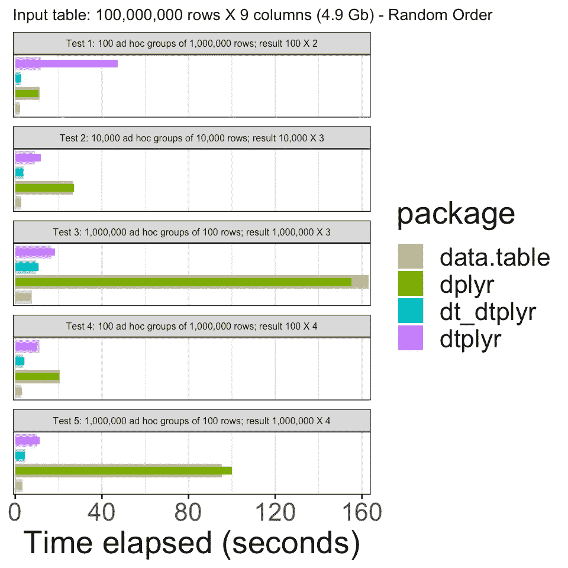

# 使用 dplyr 语法的 data.table speed with！

> 原文：<https://towardsdatascience.com/data-table-speed-with-dplyr-syntax-yes-we-can-51ef9aaed585?source=collection_archive---------37----------------------->

## 当你可以同时拥有速度和可读性时，为什么要在两者之间选择呢？


萨姆·皮尔斯-瓦里洛在 [Unsplash](https://unsplash.com?utm_source=medium&utm_medium=referral) 拍摄的照片

r 有很多很棒的数据辩论工具。其中两个是 *dplyr* 和*数据表*包。虽然 dplyr 具有非常灵活和直观的语法，但 data.table 在某些情况下可以快几个数量级。

其中一个场景是在大量组上执行操作时。例如，在处理 CRM 数据时会发生这种情况，其中每一行都描述了一个接触点或交易，并且人们对计算每个客户的行数、每个客户的所有交易的货币价值等感兴趣。

最近 Rstudio [发布了](https://www.tidyverse.org/blog/2019/11/dtplyr-1-0-0/) *dtplyr* 包版本 1.0.0，为 *dplyr* 提供了*数据表*后端。

使用 *dtplyr* 几乎不需要学习额外的代码。使用`lazy_dt`函数启动*数据表*序列，之后写入常规 *dplyr* 代码。只有在调用`as_tibble`(或`as.data.frame`等)时，代码才会执行。

因此，举例来说，一个利用 *dtplyr* 进行多组操作的简单管道应该是这样的:

```
mtcars %>%
  lazy_dt() %>%
  filter(wt < 5) %>%
  mutate(l100k = 235.21 / mpg) %>% *# liters / 100 km*
  group_by(cyl) %>%
  summarise(l100k = mean(l100k))## Source: local data table [?? x 2]
## Call:   `_DT1`[wt < 5][, `:=`(l100k = 235.21/mpg)][, .(l100k = mean(l100k)), 
##     keyby = .(cyl)]
## 
##     cyl l100k
##   <dbl> <dbl>
## 1     4  9.05
## 2     6 12.0 
## 3     8 14.9 
## 
## # Use as.data.table()/as.data.frame()/as_tibble() to access results
```

唯一的警告是，和所有其他类似接口一样，一些更复杂的操作可能不被支持。

有趣的是，虽然 data.table 有很多基准测试，但我找不到任何关于 *dtplyr* 的基准测试。所以我决定自己进行一个快速的基准测试。

在这篇文章中，我将检查 *dtplyr* 相对于 *dplyr* 改进了多少，以及它的性能是否足够接近*数据表*以被视为有效的替代方案。

为此，我将重现 data.table 作者 Matt Dowle 在 2018 年 12 月完成的一些[基准测试](https://github.com/Rdatatable/data.table/wiki/Benchmarks-%3A-Grouping)。

基准点包括:

*   5 简单的查询:不同类型的不同列上的大组和小组。类似于数据分析师在实践中可能做的事情；即当数据被探索和调查时的各种特别聚集。
*   每个包都在其自己的新会话中单独测试。为此，我在为每个包运行基准代码之前重启了我的机器。
*   每个查询立即重复一次。这是为了隔离缓存效应并确认第一次计时。绘制了第一和第二总经过时间。

我的分析在以下几个方面与原文不同:

1.  我来对比一下*数据表*、 *dtyplr* 和 *dplyr* 。我还将检查用`data.table`而不是`data.frame`启动 *dtplyr* 管道如何影响性能(下面称为 *dt_dtplyr* )
2.  我将使用我的个人笔记本电脑，而不是运行虚拟机
3.  我正在生成一个更小的数据集(~4.9 Gb)。我认为这代表了我在内存中处理过的一些较大的数据集(对于较大的数据集，我通常会切换到 Spark)。

除此之外，代码基本相同。你可以在这篇文章的底部找到它。

现在，事不宜迟，让我们来看看结果:



我们可以看到，使用 *dtplyr* 大大提高了性能，尽管仍然没有 *data.table* 快。然而，看起来最大的区别是需要将`data.frame`对象转换成`data.table`对象。例如，在读取文件时，可以这样做一次。因此，最终牺牲性能来获得整洁语法的额外好处(对于那些喜欢整洁的人来说)似乎并不太糟糕。

就我个人而言，我迷上了 tidyverse，而 *dtplyr* 包只是继续使用它的另一个原因，即使是对大量组的操作。

dtplyr 基准代码

# 会话信息

```
sessionInfo()## R version 3.6.2 (2019-12-12)
## Platform: x86_64-apple-darwin15.6.0 (64-bit)
## Running under: macOS Mojave 10.14.6
## 
## Matrix products: default
## BLAS:   /Library/Frameworks/R.framework/Versions/3.6/Resources/lib/libRblas.0.dylib
## LAPACK: /Library/Frameworks/R.framework/Versions/3.6/Resources/lib/libRlapack.dylib
## 
## locale:
## [1] en_US.UTF-8/en_US.UTF-8/en_US.UTF-8/C/en_US.UTF-8/en_US.UTF-8
## 
## attached base packages:
## [1] stats     graphics  grDevices utils     datasets  methods   base     
## 
## other attached packages:
##  [1] data.table_1.12.8 pander_0.6.3      dtplyr_1.0.0      forcats_0.4.0    
##  [5] stringr_1.4.0     dplyr_0.8.5       purrr_0.3.4       readr_1.3.1      
##  [9] tidyr_1.0.3       tibble_3.0.1      ggplot2_3.3.0     tidyverse_1.3.0  
## [13] pacman_0.5.1     
## 
## loaded via a namespace (and not attached):
##  [1] tidyselect_1.1.0 xfun_0.12        haven_2.2.0      lattice_0.20-38 
##  [5] colorspace_1.4-1 vctrs_0.3.0      generics_0.0.2   htmltools_0.4.0 
##  [9] yaml_2.2.1       utf8_1.1.4       rlang_0.4.6      pillar_1.4.4    
## [13] glue_1.4.1       withr_2.1.2      DBI_1.1.0        dbplyr_1.4.2    
## [17] modelr_0.1.5     readxl_1.3.1     lifecycle_0.2.0  munsell_0.5.0   
## [21] blogdown_0.17    gtable_0.3.0     cellranger_1.1.0 rvest_0.3.5     
## [25] evaluate_0.14    labeling_0.3     knitr_1.27       fansi_0.4.1     
## [29] broom_0.5.3      Rcpp_1.0.4.6     scales_1.1.0     backports_1.1.5 
## [33] jsonlite_1.6.1   farver_2.0.3     fs_1.4.1         hms_0.5.3       
## [37] digest_0.6.25    stringi_1.4.6    bookdown_0.17    grid_3.6.2      
## [41] cli_2.0.2        tools_3.6.2      magrittr_1.5     crayon_1.3.4    
## [45] pkgconfig_2.0.3  ellipsis_0.3.1   xml2_1.2.2       reprex_0.3.0    
## [49] lubridate_1.7.8  assertthat_0.2.1 rmarkdown_2.0    httr_1.4.1      
## [53] rstudioapi_0.11  R6_2.4.1         nlme_3.1-143     compile
```

*原载于*[*https://iyarlin . github . io*](https://iyarlin.github.io/2019/10/17/automatic_dag_learning_part_1/)*2020 年 5 月 26 日*