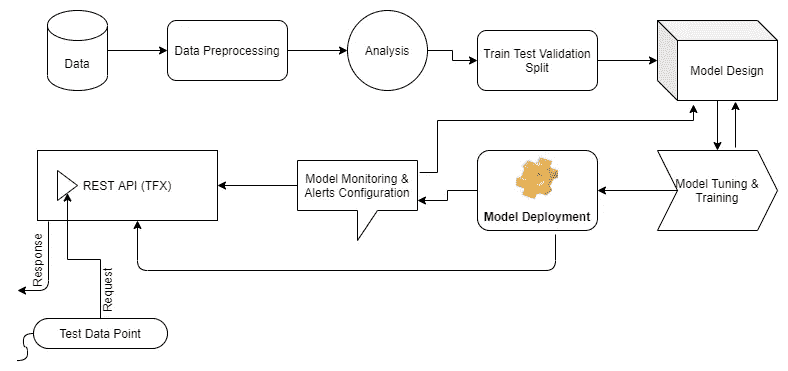

# 数据到模型到 API:一种端到端的方法

> 原文：<https://towardsdatascience.com/data-to-model-to-api-an-end-to-end-approach-9343f2dde848?source=collection_archive---------35----------------------->

## 了解如何将 ML/DL 生命周期阶段的整个结构缝合在一起。



ML/DL API/模型服务架构(图片由作者提供)

在这篇博客中，我们不打算讨论强大的擎天柱，而是要经历一个基于机器学习的用例的整个旅程。我们将从数据处理开始，继续构建数据管道，使用 Tensorflow 为训练模型提供数据，使用高级 **tf.keras** API 构建模型架构，最后使用 FastAPI 为模型提供服务。此外，我们将使用另一种更易维护的方式来服务 ML 模型，TFX 服务于 Tensorflow APIs 的扩展特性。本文不讨论优化 ML 模型，因为这里的目的是从头到尾学习 ML 模型的可操作性方面。

文章的流程如下:

1.  **问题陈述**
2.  **数据预处理**
3.  **构建数据管道**
4.  **模型设计、培训和评估**
5.  **使用 TFX 服务的模型部署(REST API)**

# 问题陈述

我们需要找到一种方法来评估给定推文的情绪，即推文是正面情绪还是负面情绪。

现在，在不使用任何 ML 技术的情况下解决这个问题的最基本的方法是，在使用可用的注释数据分别去除两个类别(正面和负面)的无关紧要的停用词之后，制作单词的频率字典。然后，对于每条推文，在删除停用词后，就像我们在构建频率字典时所做的那样，将推文中的词与它们在两个类中各自的频率进行映射，最后，我们可以对所有词的总频率进行求和，包括正面和负面，无论哪个类的值更高，我们都会将该类分配给该推文。尽管这种方法在可伸缩性方面确实是廉价且高效的，但是这种方法的性能不会很好，原因如下:

*   我们正在定义非常严格的界限，根据单词的频率总和给推文分配标签。大多数情况下，两个类别中单词的频率和之间的差异可以忽略不计，这种方法是多余的。
*   如果对于一条推文，两个类别中单词的频率总和相等或为零，会发生什么？这是否意味着该推文具有中性情绪，如果是的话，与该情绪相关联的概率是多少？我们不能用这种方法来估计与任何推论相关的概率。

即使我们试图通过手工创建自己的特性来使用 ML 解决这个问题，我们也不知道哪些潜在的特性可能会真正破解这个问题。在为我们的模型创建特性时，我们只是基于我们自己的假设进行操作。而且，这种方法仍然没有考虑 tweet 中单词和句子之间的相对上下文。这种方法不能解决各种各样的问题，例如意义、上下文、词义消歧以及同音异义词等等。

输入单词嵌入。最大似然算法只能理解数字，而对于这个问题，我们只有文本。因此，我们需要想出一种方法来将我们的文本转换成数字，同时保留文本的含义和上下文。现在，这就是单词嵌入的实际作用，单词嵌入是密集的向量，实际上有助于将我们文本的上下文表示到 n 维多维空间中，维数是在创建向量时选择的。足够的理论，让我们直接进入如何创建我们自己的模型，可以给我们的文本数据点向量。

# 数据预处理和分析

## **预处理**

在开始这个数据预处理的旅程之前，这里有几个我们将用来预处理我们的文本的特殊库的快速回顾，现在，我们可以编写我们自己的逻辑来做这个库做的事情，但是这里有一个黄金法则，永远不要浪费你的时间去编写一段别人已经通过投入时间和精力编写的代码。但是我建议您在实现任何随机库或 StackOverflow 的一段代码之前，应该完全理解它的作用。所以，我们开始吧:

```
!pip install wordninja contractions emoji
!wget [http://cs.stanford.edu/people/alecmgo/trainingandtestdata.zip](http://cs.stanford.edu/people/alecmgo/trainingandtestdata.zip)
!unzip trainingandtestdata.zipimport numpy as np
import pandas as pd
import re
import os
import string
import tensorflow as tf
from sklearn.model_selection import train_test_split
import wordninja, contractions, emoji
```

在数据中，我们只对包含 tweet 文本和情感值的两列感兴趣。“0”代表消极情绪，“1”显然代表积极情绪，因为这是一个二元分类问题。让我们看看数据是什么样的:

```
# Data IO and Check
train = pd.read_csv("training.1600000.processed.noemoticon.csv", encoding='latin-1', usecols=[0,5], names=['sentiment','tweet'])
test = pd.read_csv("testdata.manual.2009.06.14.csv", encoding='latin-1', usecols=[0,5], names=['sentiment','tweet'])
print(train.sentiment.value_counts()/train.shape[0])
print(test.sentiment.value_counts()/test.shape[0])OUTPUT:4    0.5
0    0.5
Name: sentiment, dtype: float644    0.365462
0    0.355422
2    0.279116
Name: sentiment, dtype: float64
```


数据概述

由于我们在测试数据中有额外的离散极性，我们将去除它们以保持数据集之间的非冗余性，并将我们的标签转换为“0”和“1”。一条推文可能包含表情符号、标签和个人资料标签，需要正确处理才能捕捉推文的含义。因此，下面是我们要做的几个预处理步骤:

*   移除所有人物标签、表情符号、网址，并将标签拆分成有意义的单词。比如# programmingismeditation 会变成“编程即冥想”
*   将所有的简写形式，如“I'd”和“we 're ”,分别转换成它们的词根形式，如“I would”或“I had”和“we are”。基本上，我们要扩大所有的收缩。

和一些基本的文本清理步骤，这些步骤将在代码中变得显而易见:

```
''' Since we are working on a binary classification problem, we would remove all intermediate polarities from test data 
and only work on highly polarized sentiment data points. '''test = test[test.sentiment!=2]
test.sentiment.value_counts()/test.shape[0]def **strip_emoji**(tweet):
  new_tweet = re.sub(emoji.get_emoji_regexp(), r"", tweet)
  return new_tweet.strip()def **strip_urls**(tweet):
  new_tweet = re.sub(r'(https|http)?:\/\/(\w|\.|\/|\?|\=|\&|\%)*\b', '', tweet, flags=re.MULTILINE)
  return new_tweet.strip()def **remove_tags**(tweet):
  return " ".join([token for token in tweet.split() if not token.startswith("@")])def **preprocess_tweet**(tweet):
  tweet = remove_tags(strip_emoji(strip_urls(tweet)))
  tweet = contractions.fix(" ".join(wordninja.split(tweet)))
  tweet = [token.lower() for token in tweet.split() if (len(set(token))>1)]
  return " ".join(tweet)# Preprocessing tweets data
train.tweet = train.tweet.apply(preprocess_tweet)
test.tweet = test.tweet.apply(preprocess_tweet)# Preprocessing Labels
train.sentiment = train.sentiment.apply(lambda value: 1 if value==4 else value)
test.sentiment = test.sentiment.apply(lambda value: 1 if value==4 else value)
```

## **分析**

现在我们已经完成了数据预处理，让我们进入下一个重要的事情，即对于一个好的模型来说非常重要，这比超参数调整更重要。这是估计每个实例中输入模型的词汇大小和向量序列长度。现在，我们通过分析手头的训练数据分布来做到这一点。我们将绘制训练数据中推文长度的分布图。Tweet length 就是 tweet post 预处理中的字数。下面是这样做的代码:

```
# Estimating vocab size and max sequence length to allow in vectorization layer.
def **tweet_length**(tweet):
  return len([token for token in tweet.split()])import seaborn as sns
tweet_lengths = [tweet_length(tweet) for tweet in train_tweets.tolist()]
sns.distplot(tweet_lengths)
```


推文长度分布

上面的 viz 将帮助我们决定实例的最大序列长度。接下来，我们需要编写代码来估计词汇量:

```
# Unique words
unique_words = set([token for tweet in train_tweets for token in tweet.split()])
print("Total Unique Words:", len(unique_words))# Counting Total Words and Stop Words
import nltk
nltk.download("stopwords")
from nltk.corpus import stopwords
stop_words = stopwords.words("english")
total_words = [token for tweet in train_tweets for token in tweet.split()]
total_stop_words = [token for tweet in train_tweets for token in tweet.split() if token in stop_words]
print('Total Stop Words', len(total_words))
print('Total Stop Words', len(total_stop_words))
print('Ratio of Total Words to Total Stop Words:', len(total_words)/len(total_stop_words))OUTPUT:Total Unique Words: 75553
[nltk_data] Downloading package stopwords to /root/nltk_data...
[nltk_data]   Unzipping corpora/stopwords.zip.
Total Stop Words 17861874
Total Stop Words 7690978
Ratio of Total Words to Total Stop Words: 2.322445077856158
```

使用上面这段代码，我们将估计词汇量。看起来在平均 10 个单词的 tweet 中，我们几乎有 4 个停用词。而且，由于我们正在执行情感分析，删除一些停用词(如“not ”)会完全颠倒文本的意思，并且有许多这样的词(您可能想自己检查“nltk”包中的“停用词”)。因此，我们避免删除它们(除了单字单词，以避免词汇中有无用的单词)。

根据上面的分析，我们将把最大序列长度固定为 50，词汇大小固定为 75000。

# 构建数据管道

我们已经预处理了数据，估计了最大序列长度和词汇大小。现在，我们需要开发一个管道，将数据批量输入到模型中。当您的 GPU 数量有限，并且不想一次性将整个数据集加载到 GPU 中并训练模型时，这非常有用。利用这一点，我们将数据一批一批地加载到固定大小的 GPU(模型也将在这里被训练)上来训练模型。我们使用 TF 数据集 API 来做到这一点:

```
# Data Pipeline Function using TF Dataset API
def **data_input_fn**(texts, labels, batch_size=32, is_training=True):
  # Convert the inputs to a Dataset.
  dataset = tf.data.Dataset.from_tensor_slices((texts,labels))
  # Shuffle, repeat, and batch the examples.
  dataset = dataset.cache()
  if is_training:
    dataset = dataset.shuffle(1000, reshuffle_each_iteration=True)
    dataset = dataset.repeat()
  dataset = dataset.batch(batch_size, drop_remainder=True)
  # Return the dataset.
  return dataset# Data pipelines for 3 different datasets
training_dataset = data_input_fn(train_tweets, train_labels, batch_size=1024)
validation_dataset = data_input_fn(val_tweets, val_labels, batch_size=128, is_training=False)
test_dataset = data_input_fn(test.tweet, test.sentiment, batch_size=8, is_training=False)
```

# 模型设计、培训和评估

## **文本矢量化层**

通常，我们首先对文本进行矢量化，然后将其提供给模型进行训练或推理。但是，如果我告诉你，我们不必再单独完成这一步，会怎么样呢？因此， **tf.keras** 已经添加了文本矢量化 API 来帮你做这件事。我们是这样做的:

```
# Creating Vectorization Layer
max_features = 75000
max_len = 50vectorization_layer = tf.keras.layers.experimental.preprocessing.TextVectorization(
    max_tokens=max_features, output_sequence_length=max_len)
vectorization_layer.adapt(train_tweets.values)
```

我们简单地创建一个 TextVectorization 层的对象，然后调用一个方法将该层调整到我们的训练数据(“adapt”方法)。接下来，我们在模型设计步骤中使用这一层。

## **设计**

下面代码设计了一个使用“TF . keras”API 的深度学习模型。代码完全是不言自明的。

```
# Create Model Func
def **create_model**():
  words = tf.keras.Input(shape=(1,), dtype=tf.string)
  vectors = vectorization_layer(words)
  embeddings = tf.keras.layers.Embedding(input_dim=max_features+1, output_dim=128)(vectors)
  output = tf.keras.layers.LSTM(256, return_sequences=True, name='LSTM_1')(embeddings)
  output = tf.keras.layers.LSTM(256, name='LSTM_2')(output)
  output = tf.keras.layers.Dropout(0.3)(output)
  output = tf.keras.layers.Dense(64, activation='relu', name='Dense_3')(output)
  output = tf.keras.layers.Dense(1,activation='sigmoid', name='Output')(output) model = tf.keras.models.Model(words,output)
  return model
```

这段代码中唯一的新东西是前两行函数。输入形状是一个秩为 1 的数组，因为我们将传递给模型的是一个句子/tweet，而不是一个向量(因此，形状是(1，)。接下来，我们之前开发的矢量化层在这里用于将单词映射到 vocab，然后进一步用于训练嵌入层等等。

## **训练**

现在我们训练模型。这里，模型只训练了 3 个时期，因为这篇文章不是关于模型性能的，我是在 Colab 上做的(顺便说一下，它总是崩溃！).但是，请随意根据您的选择进一步调整，并在评论中告诉我您的实验。

```
batch_size = 1024
epochs = 3
steps_per_epoch = train_tweets.shape[0] // batch_size
model = create_model()
model.compile(loss='binary_crossentropy', optimizer='adam', metrics=['accuracy'])# Fitting the model
model.fit(training_dataset, epochs=epochs, batch_size=batch_size, 
          steps_per_epoch=steps_per_epoch, validation_data=validation_dataset)OUTPUT:
Epoch 1/3
1402/1402 [==============================] - 288s 199ms/step - loss: 0.4545 - accuracy: 0.7738 - val_loss: 0.3984 - val_accuracy: 0.8193
Epoch 2/3
1402/1402 [==============================] - 283s 202ms/step - loss: 0.3814 - accuracy: 0.8293 - val_loss: 0.3966 - val_accuracy: 0.8224
Epoch 3/3
1402/1402 [==============================] - 283s 202ms/step - loss: 0.3509 - accuracy: 0.8455 - val_loss: 0.4079 - val_accuracy: 0.8202
<tensorflow.python.keras.callbacks.History at 0x7fde2aae2c10>
```

您还可以添加模型检查点，并使用 Tensorboard 来监控模型性能。接下来，我们需要在磁盘上持久化模型:

```
# Saving Model
import os
MODEL_DIR = "/content/drive/MyDrive/TextSummarizerModel/SentimentAnalysis/Model"
version = 1
export_path = os.path.join(MODEL_DIR, str(version))
print('export_path = {}\n'.format(export_path))tf.keras.models.save_model(
    model,
    export_path,
    overwrite=True,
    include_optimizer=True,
    save_format=None,
    signatures=None,
    options=None
)# Check the path
print('\nSaved model:')
!ls -l {export_path}# Using SavedModelCLI to check if model is persisted properly
!saved_model_cli show --dir {export_path} --all
```

## **评估**

我们使用测试数据集，我们必须在看不见的数据上测试模型性能:

```
# Loading and Evaluation of Model
model = tf.keras.models.load_model(export_path)
model.evaluate(test_dataset)OUTPUT:
44/44 [==============================] - 7s 5ms/step - loss: 0.4386 - accuracy: 0.8153
[0.43862035870552063, 0.8153409361839294]
```

输出列表中的第一个值是测试数据的最终损失，第二个值是准确度。假设输出数据集是平衡，0.81 是很高的精度，几乎不需要模型调整。由于就情绪分析而言，手头的数据完全是奶油，因此可能仍有巨大的改进潜力，但这是改天再喝的一杯茶。如果你想了解用于评估各种分类模型的各种度量标准(如本文)，这里的[](/building-and-evaluating-classification-ml-models-9c3f45038ef4)**是我的另一篇文章可以提供帮助。**

# **使用 TFX 服务的模型部署(REST API)**

## ****TFX 发球设置****

**以下命令将帮助您在您的计算机上设置 TFX 服务。确定是 Linux，因为会让你的生活更轻松。**

```
# Updating apt repo for tensorflow-model-server
!echo "deb [http://storage.googleapis.com/tensorflow-serving-apt](http://storage.googleapis.com/tensorflow-serving-apt) stable tensorflow-model-server tensorflow-model-server-universal" | tee /etc/apt/sources.list.d/tensorflow-serving.list && \
curl [https://storage.googleapis.com/tensorflow-serving-apt/tensorflow-serving.release.pub.gpg](https://storage.googleapis.com/tensorflow-serving-apt/tensorflow-serving.release.pub.gpg) | apt-key add -
!apt-get update# Installing Tensorflow Model Server
!apt-get update && apt-get install tensorflow-model-server
```

**据我所知，在运行上面的命令时，您应该不会遇到任何错误，但是如果您遇到这种情况(可能性极小),请随意“StackOverflow”它，因为每个人都是这样做的。**

## ****TFX 服务休息 API****

**既然已经建立了 TFX 服务，那么是时候将我们的模型作为 REST API 来提供服务了。为此，我们需要使用以下命令:**

```
# Setting Env Variable Model Path
os.environ["MODEL_DIR"] = MODEL_DIR# Model to Server RUN
%%bash --bg
nohup tensorflow_model_server \
  --rest_api_port=8501 \
  --model_name=sample_model \
  --model_base_path="${MODEL_DIR}" >server.log 2>&1OUTPUT:
Starting job # 0 in a separate thread.!tail server.log # Check if server is up & runningOUTPUT:
2021-07-25 07:24:07.498478: I external/org_tensorflow/tensorflow/cc/saved_model/loader.cc:190] Running initialization op on SavedModel bundle at path: /content/drive/MyDrive/TextSummarizerModel/SentimentAnalysis/Model/1
2021-07-25 07:24:07.566753: I external/org_tensorflow/tensorflow/cc/saved_model/loader.cc:277] SavedModel load for tags { serve }; Status: success: OK. Took 479864 microseconds.
2021-07-25 07:24:07.579310: I tensorflow_serving/servables/tensorflow/saved_model_warmup_util.cc:59] No warmup data file found at /content/drive/MyDrive/TextSummarizerModel/SentimentAnalysis/Model/1/assets.extra/tf_serving_warmup_requests
2021-07-25 07:24:07.583893: I tensorflow_serving/core/loader_harness.cc:87] Successfully loaded servable version {name: sample_model version: 1}
2021-07-25 07:24:07.585131: I tensorflow_serving/model_servers/server_core.cc:486] Finished adding/updating models
2021-07-25 07:24:07.585235: I tensorflow_serving/model_servers/server.cc:367] Profiler service is enabled
2021-07-25 07:24:07.585748: I tensorflow_serving/model_servers/server.cc:393] Running gRPC ModelServer at 0.0.0.0:8500 ...
[warn] getaddrinfo: address family for nodename not supported
2021-07-25 07:24:07.586243: I tensorflow_serving/model_servers/server.cc:414] Exporting HTTP/REST API at:localhost:8501 ...
[evhttp_server.cc : 245] NET_LOG: Entering the event loop ...
```

**如果一切顺利，你应该得到上面的输出，如果没有，在评论中写给我，或者更好；跳上 StackOverflow。回到上面我们所做的，在运行 TensorFlow 模型服务器时，我们使用了一些参数，如模型名称、路径等。“model_base_path”是您将在其中部署模型的增量版本的目录的路径。现在我们在那个目录中只有我们模型的一个版本，但是在将来，可能会有更多的版本。其次，我们有“model_name ”,它是您想要在 API 中显示的模型的名称。其余的不言自明。默认情况下，它将在本地主机上运行(这是显而易见的！).您可以通过传递参数“rest_api_host”的值来类似地指定主机。**

## ****服务 API****

**现在，这是我们期待已久的时刻。我们提供了 API，现在我们用它来做一些预测。**

```
# Testing the API
import json
instances = [
            ['The dinner was ok.'],
             ['I really hated the dinner.'],
             ['That was a really great movie, we should definitely consider watching it again.'],
             ["We've been using this for a long time and it's a really good one but the handle is not that great. Only use if you don't want to move it around much."],
]
data = json.dumps({"signature_name": "serving_default", "instances": instances})# Testing the API
import requests
headers = {"content-type": "application/json"}
json_response = requests.post('[http://localhost:8501/v1/models/sample_model:predict'](http://localhost:8501/v1/models/sample_model:predict'), data=data, headers=headers)
predictions = json.loads(json_response.text)
print(predictions)OUTPUT:
{'predictions': [[0.762461543], [0.0516885221], [0.976486802], [0.567632318]]}
```

**预测与实例的顺序相同。我们可以看到，根据实例的上下文，情绪预测几乎是正确的。当我们得到中性情绪时，它更接近于 0.5，否则高度极性情绪对于消极和积极情绪分别接近于 0 或 1。**

# **结论**

**我们经历了 ML/DL 实验的整个生命周期。尽管这种循环会持续下去，因为我们并不是针对一个问题只训练一次模型。当数据分布变化、词汇变化等时，我们会不断地重新审视它。在生产中监控模型是我们在这里没有讨论的，它是整个 MLOps 生命周期的关键部分。请关注我未来的文章，因为它们肯定会在这里出现。整个实验都是在谷歌实验室完成的。你可以在这里访问这篇文章的 jupyter 笔记本[。](https://github.com/nishitjain/BloggingNotebooks/blob/main/E2E_Sentiment_Analysis_API.ipynb)**