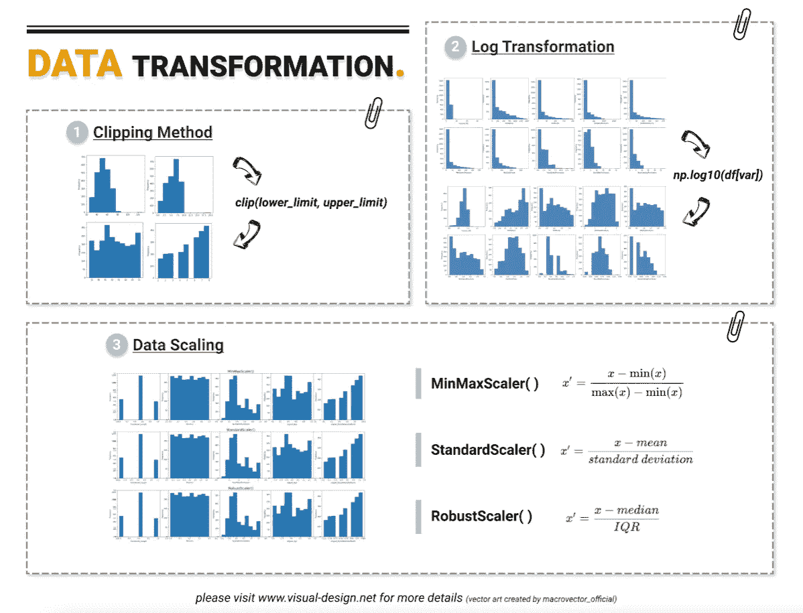
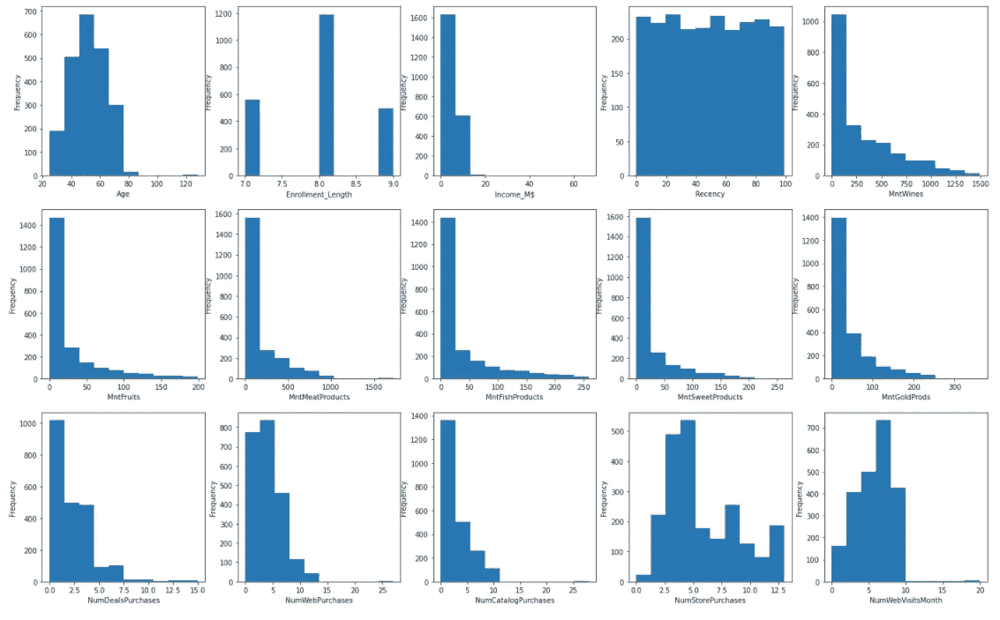
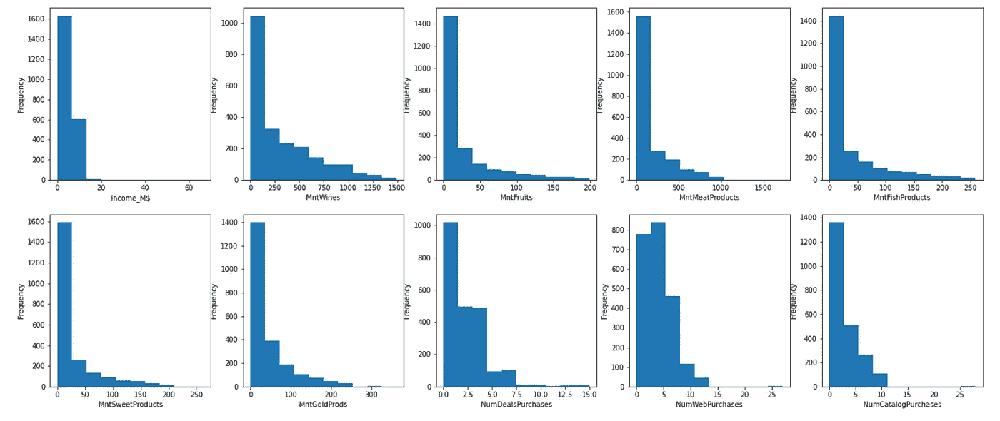
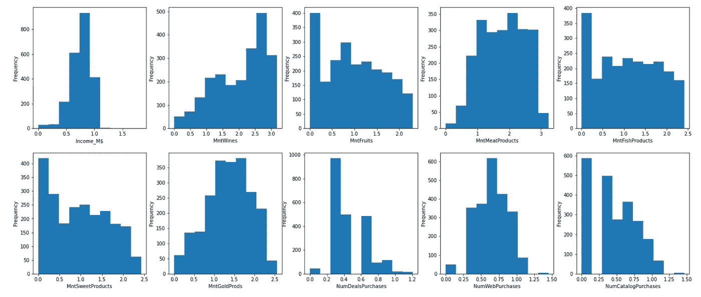
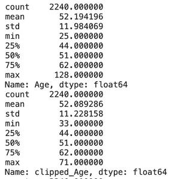
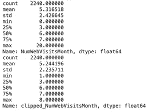
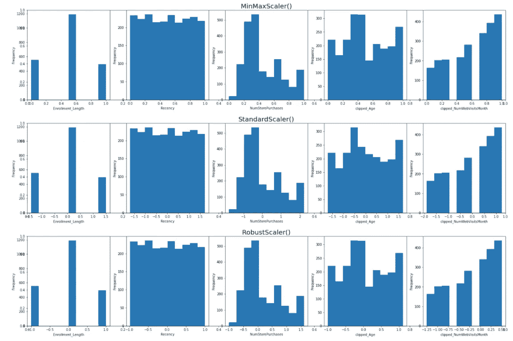
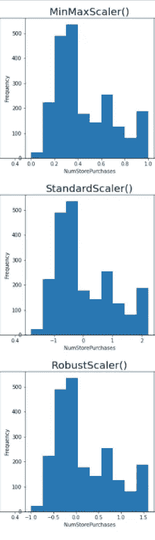
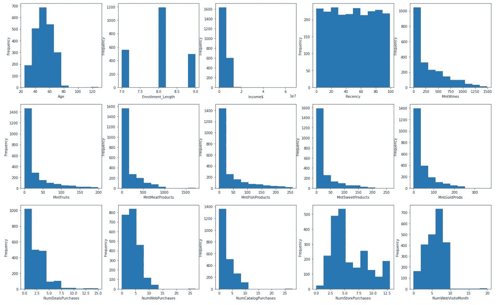
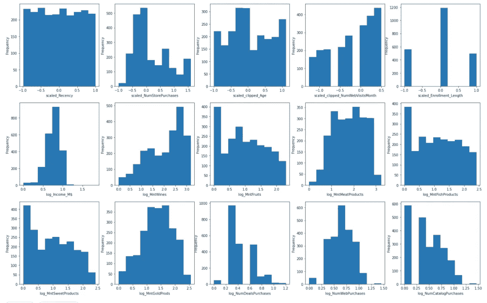

# 3 种常见的数据转换技术

> 原文：<https://towardsdatascience.com/data-transformation-and-feature-engineering-e3c7dfbb4899?source=collection_archive---------9----------------------->

## 如何为您的数据选择合适的



数据转换概述(图片作者来自[www.visual-design.net](http://www.visual-design.net/)

数据转换是将原始数据转换为更适合建模和数据发现的格式或结构的过程。这是特征工程中必不可少的一步，有助于发现洞见。本文将介绍数字数据转换的技术:对数转换、裁剪方法和数据缩放。

**为什么需要数据转换？**

*   当数据分布有偏差时，算法更有可能出现偏差
*   将数据转换为相同的比例允许算法更好地比较数据点之间的相对关系

**何时应用数据转换**

在实现监督算法时，训练数据和测试数据需要以相同的方式进行转换。这通常是通过提供训练数据集来构建数据转换算法，然后将该算法应用于测试集来实现的。

# 基础特征工程和 EDA

在这个练习中，我使用来自 Kaggle 的[营销分析](https://www.kaggle.com/jackdaoud/marketing-data)数据集。

如果您想访问完整的代码，请访问[我的网站](https://www.visual-design.net/projects)。

首先，我执行了一些基本的特征工程，使数据更整洁、更有洞察力。

```
# 1\. Transform Year_Birth into Age
from datetime import date
df['Age'] = date.today().year - df['Year_Birth']# 2\. Transform Dt_Customer into Enrollment_Length
df['Year'] = pd.DatetimeIndex(df['Dt_Customer']). year
df['Enrollment_Length'] = date.today().year - df['Year']# 3\. Transform Currency format into numbers
df['Income$'] = df[' Income '].str.replace(',', '').str.replace('$', '').str.replace('.', '').fillna(0).astype(int)
df['Income_M$'] = df['Income$'].apply(lambda x: round(x/1000000, 2))
print(df[['Income_M$', 'Income$']])
```

**1。将出生年份转换为“年龄”**

从 Year_Birth 中减去当前年份。

**2。将客户注册的日期(“Dt_Customer”)转换为“Enrollment _ Length”**

它与上面的类似，只是从日期特性中额外提取了年份部分。

**3。将货币(“收入”)转换为数字(“收入 _ M $”)**

这包括四个步骤:1)通过删除字符“，$”来清除数据 2)将空值替换为 0；3)将字符串转换成整数；4)将数字缩小到百万美元，这有助于可视化数据分布

现在，让我们用一种简单的单变量 EDA 技术——直方图来直观显示当前的数据分布。不难看出，大多数变量都严重倾斜。

```
# select numeric variables
numeric_vars =  ['Age', 'Enrollment_Length', 'Income_M$', 'Recency', 'MntWines', 'MntFruits', 'MntMeatProducts', 'MntFishProducts', 'MntSweetProducts', 'MntGoldProds', 'NumDealsPurchases', 'NumWebPurchases', 'NumCatalogPurchases', 'NumStorePurchases', 'NumWebVisitsMonth']# create histograms for each numeric variable
fig = plt.figure(figsize=(24, 15))
for i in range(len(numeric_vars)):
    var = numeric_vars[i]
    sub = fig.add_subplot(3, 5, i + 1)
    sub.set_xlabel(var)
    df[var].plot(kind = 'hist')
```



EDA(图片由作者提供)

如果你想了解更多关于数据清理、特征工程和探索性数据分析(EDA)的知识，我整理了一个可能有用的列表:

1.  [**特征选择**](/feature-selection-and-eda-in-python-c6c4eb1058a3)

[](/feature-selection-and-eda-in-python-c6c4eb1058a3) [## 机器学习中的特征选择和 EDA

### 如何使用数据可视化来指导特征选择

towardsdatascience.com](/feature-selection-and-eda-in-python-c6c4eb1058a3) 

**2。** [**探索性数据分析**](https://medium.com/r?url=https%3A%2F%2Ftowardsdatascience.com%2Fsemi-automated-exploratory-data-analysis-eda-in-python-7f96042c9809)

[](/semi-automated-exploratory-data-analysis-eda-in-python-7f96042c9809) [## Python 中的半自动探索性数据分析(EDA)

### 一键式全面数据探索流程

towardsdatascience.com](/semi-automated-exploratory-data-analysis-eda-in-python-7f96042c9809) 

**3。** [**数据可视化**](/which-chart-to-choose-4b21929539eb)

[](/which-chart-to-choose-4b21929539eb) [## 如何选择最合适的图表？

### 折线图、条形图、饼图……它们讲述了不同的故事

towardsdatascience.com](/which-chart-to-choose-4b21929539eb) 

**4。** [**地址缺失数据**](https://medium.com/analytics-vidhya/how-to-address-missing-data-531ed964e68)

[](https://medium.com/analytics-vidhya/how-to-address-missing-data-531ed964e68) [## 如何处理丢失的数据

### 三种缺失数据的解决方法

medium.com](https://medium.com/analytics-vidhya/how-to-address-missing-data-531ed964e68) 

# 1.对数变换-右偏数据

当数据样本遵循**幂律分布**时，我们可以使用对数标度将右偏分布转化为正态分布。要实现这一点，只需使用 *np.log()* 函数。在这个数据集中，大多数变量都属于这个类别。



转换前(图片由作者提供)

```
## log transformation - power law distribution ##log_var = ['Income_M$', 'MntWines', 'MntFruits', 'MntMeatProducts', 'MntFishProducts', 'MntSweetProducts', 'MntGoldProds', 'NumDealsPurchases', 'NumWebPurchases', 'NumCatalogPurchases']fig = plt.figure(figsize = (24,10))for j in range(len(log_var)):
    var = log_var[j]
    transformed = "log_" + var
    df[transformed] = np.log10(df[var]+1)sub = fig.add_subplot(2, 5, j + 1)
    sub.set_xlabel(var)
    df[transformed].plot(kind = 'hist')
```

经过对数变换后，这些特征变得更加正态分布。

经过对数变换后，这些特征变得更加正态分布。



转换后(图片由作者提供)

# 2.裁剪-处理异常值

当数据集中有**异常值**时，这种方法更合适。Clipping 方法设置了上下限，所有数据点都将包含在该范围内。

我们可以使用 *quantile()* 来找出大部分数据量的范围(0.05 百分点到 0.95 百分点之间)。任何低于下限(由 0.05 个百分点定义)的数字都将向上舍入到下限。类似地，高于上限(由 0.95%定义)的数字将向下舍入到上限。

```
## clipping methods - handle outliers ##clip_var = ['Age', 'NumWebVisitsMonth']for i in clip_var:
    transformed = 'clipped_'+ i# upper limit - .95 quantile
    upper_limit = df[i].quantile(0.95)# lower limit - .05 quantile
    lower_limit = df[i].quantile(0.05)df[transformed] = df[i].clip(lower_limit, upper_limit, axis = 0)

    print(df[i].describe())
    print(df[transformed].describe())

    plt.figure(figsize = (5,5))
    df[i].plot(kind = 'hist')

    plt.figure(figsize = (5,5))
    df[transformed].plot(kind = 'hist')
```

从 EDA 过程中的直方图可以看出，变量“ *Age”和“numwebvisitsmooth”*存在异常大的异常值。所以我将只对这两列应用剪辑。

因此，两个字段的最大值都显著下降:

*   年龄从 128 岁到 71 岁
*   *NumWebVisitMonth* :从 20 日到 8 日



对年龄应用剪辑方法



对 NumWebVisitsMonth 应用剪辑方法

# 3.缩放变换

在日志转换和处理异常值之后，我们可以通过 scikit-learn 预处理库将数据转换成相同的标度。这个库包含了一些有用的函数:**最小-最大缩放器，标准缩放器和健壮缩放器**。每个定标器都有不同的用途。

## 最小最大缩放器—归一化

*MinMaxScaler()* 通常在数据集没有失真时应用**。它根据以下公式将数据标准化为 0 到 1 之间的范围:**

*x ' =(x—min(x))/(max(x)—min(x))*

## 标准定标器—标准化

当数据集符合**正态分布**时，我们使用标准化。 *StandardScaler()* 根据 z-score 公式将数字转换为标准形式**均值= 0，方差= 1** :

*x' = (x —均值)/标准差。*

## 鲁棒定标器

*RobustScaler()* 更适用于具有**偏斜分布和离群值**的数据集，因为它根据中位数和分位数转换数据:

*x = (x —中位数)/四分位间距。*

为了比较这三个缩放器是如何工作的，我使用一个迭代来缩放剩余的变量和裁剪变换后的那两个变量，分别基于 *StandardScaler()、RobustScaler()、MinMaxScaler()* 。

```
## data scaling methods ##from sklearn.preprocessing import StandardScaler
from sklearn.preprocessing import MinMaxScaler
from sklearn.preprocessing import RobustScalerscale_var = ['Enrollment_Length', 'Recency', 'NumStorePurchases', 'clipped_Age', 'clipped_NumWebVisitsMonth']
scalers_list = [StandardScaler(), RobustScaler(), MinMaxScaler()]for i in range(len(scalers_list)):
    scaler = scalers_list[i]
    fig = plt.figure(figsize = (26, 5))
    plt.title(scaler, fontsize = 20)
    for j in range(len(scale_var)):
        var = scale_var[j]
        scaled_var = "scaled_" + var
        model = scaler.fit(df[var].values.reshape(-1,1))
        df[scaled_var] = model.transform(df[var].values.reshape(-1, 1))sub = fig.add_subplot(1, 5, j + 1)
        sub.set_xlabel(var)
        df[scaled_var].plot(kind = 'hist')
```

如图所示，定标器不改变数据分布的形状，而是改变数据点的分布。



缩放器比较(图片由作者提供)

以“NumStorePurchases”为例，MinMaxScaler()将值严格转换为 0 到 1 之间的值，StandardScaler()将数据集转换为 mean = 0，而 RobustScaler()将数据集转换为 median = 0。



NumStorePurchases

在这个数据集中，这五个变量既不是扭曲的，也不是正态分布的，因此在这三个标量中选择一个 MinMaxScaler()就足够了。

既然所有的特性都已经按照它们的属性转化成了。让我们再次想象它们。我们可以看到，数据看起来更有组织，失真更少，因此更适合输入模型和生成见解。

**改造前**



**改造后**



希望你喜欢我的文章:)。如果你想阅读更多我关于媒体的文章，请使用这个附属链接([https://destingong.medium.com/membership](https://destingong.medium.com/membership))注册媒体会员。

# 带回家的信息

本文将带您踏上转换数据的旅程，并演示如何根据数据属性选择合适的技术。

1.  数据清理:转换数据类型并删除不必要的字符
2.  右偏斜数据的对数变换
3.  处理异常值的裁剪方法
4.  数据缩放:最小最大缩放器、标准缩放器、鲁棒缩放器

*原载于 2021 年 7 月 27 日 https://www.visual-design.net**[*。*](https://www.visual-design.net/post/semi-automated-exploratory-data-analysis-process-in-python)*

## *更多这样的文章*

*[](/clustering-algorithm-for-customer-segmentation-e2d79e28cbc3) [## 客户细分的聚类算法

### K-均值聚类的逐步指南

towardsdatascience.com](/clustering-algorithm-for-customer-segmentation-e2d79e28cbc3) [](/feature-selection-and-eda-in-python-c6c4eb1058a3) [## 机器学习中的特征选择和 EDA

### 如何使用数据可视化来指导特征选择

towardsdatascience.com](/feature-selection-and-eda-in-python-c6c4eb1058a3) [](/semi-automated-exploratory-data-analysis-eda-in-python-7f96042c9809) [## Python 中的半自动探索性数据分析(EDA)

### 一键式全面数据探索流程

towardsdatascience.com](/semi-automated-exploratory-data-analysis-eda-in-python-7f96042c9809)*