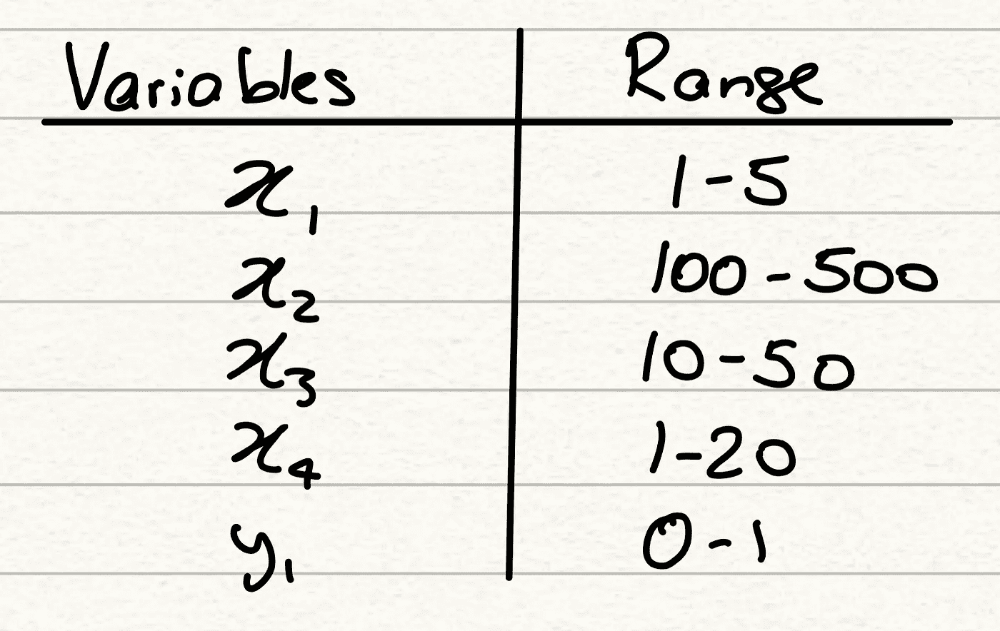
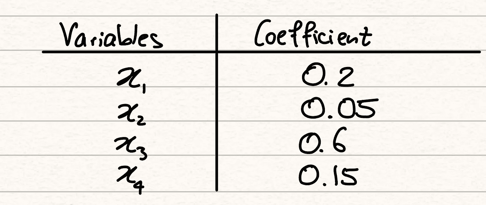
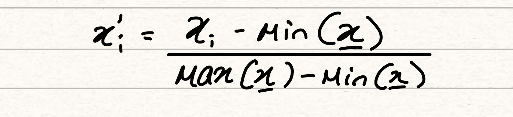
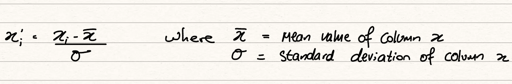
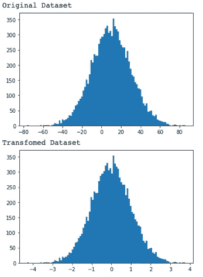

# 数据转换方法

> 原文：<https://towardsdatascience.com/data-transformation-methodologies-bb0acec7e25f?source=collection_archive---------42----------------------->

## 标准化和数据简化方法，以充分利用您的 ML 模型

本文是我正在撰写的关于机器学习关键理论概念的系列文章的延续。本系列其他文章在我的 [*页面*](https://dhruva-krishna.medium.com/) *均有。*

马库斯·斯皮斯克在 [Unsplash](https://unsplash.com/s/photos/reduce?utm_source=unsplash&utm_medium=referral&utm_content=creditCopyText) 上拍摄的照片

机器学习是从信息中学习的算法的开发。他们研究呈现给他们的数据之间的关系，并以此来预测未知结果的性质。就像我们人类一样，计算机通过经验学习。因此，计算机需要高质量的信息来做出正确的假设。因为传统的机器学习模型没有能力根据不同的数据质量调整它们的预测，所以作为程序员，我们的工作是确保数据得到良好的呈现，以便模型有最好的机会做出准确的预测。我们以多种方式做到这一点。

## 预处理

考虑以下数据集:

作者图片

我们有 4 个解释变量，分别用 xi 和 1 个目标变量 y1 表示。在一个典型的最大似然问题中，我们希望找到一种方法，通过解释变量来解释目标变量。对此我们可以使用的最简单的模型是线性回归。假设我们运行一个简单的线性回归，并在下表中显示每个解释变量的系数。

作者图片

仅从初步观点来看，我们可能会从这些系数中得出以下结论:

> 变量 x3 是最能解释目标值的变量。此后，变量的影响顺序是 x1，然后是 x4，然后是 x2。

然而，这个结论是错误的。当我们查看范围时，就可以理解为什么会出现这种情况。x3 的系数是 x1 的 3 倍，而 x3 的范围是 x1 的 10 倍。正因为如此，任何 x3 值都将主导我们对 x1 的回归，仅仅因为这些值更大。范围的不同意味着系数是不可比的，所以我们不能像以前那样发表声明，除非我们所有的变量都在一个公平的竞争环境中。

这就只需要在将数据集传递到模型之前对其进行一次预处理。为了获得准确的见解，我们刚刚确立了我们确实需要变量具有**可比性**。除此之外，较大的范围可能会分散模型对较小变量的注意力，而较小变量可能会给我们提供对目标的更好解释。

那么我们如何解决这个问题呢？一种方法是****常态化**。此方法使用以下公式将所有属性转换到范围[0，1]内:**

****

**作者图片**

**最小-最大归一化有一个异常值的问题，因为它在变换的每一步中都包含了异常值。如果我们的数据集中存在显著的异常值，最小-最大归一化方法会将我们数据的重要中间部分压缩到一个非常小的范围内，从而导致大量信息的丢失。如果我们遇到异常值，我们需要一种不使用数据集的最小值或最大值的方法，为此，我们求助于 **z 值** **归一化**。z 得分归一化使用以下公式将所有值转换为平均值为 0、标准差为 1 的典型正态分布:**

****

**作者图片**

****

**作者图片**

**选择正确的数据归一化方法很重要，这样我们可以保持变量的可比性，但不会减少到关键关系丢失的程度。**

## **数据整理**

**数据缩减包括减少传递给 ML 算法的数据量。虽然直觉上，这可能没有太多意义；我们希望模型从尽可能多的信息中学习，以便它们可以适应任何情况，减少输入数据的一些元素有助于我们整理信息，为我们的模型提供更清晰的视图，以了解我们希望预测的内容，并确保它不会受到不必要的变量的干扰。**

**我们可以使用**离散化**方法将连续变量转化为离散变量。离散化将获取一系列数据点和预定数量的组，并将数据集分成相等的部分，然后将每个点分类到各自的组中。最简单的方法可能是以类似于我们在直方图中生成条块的方式来考虑这个过程。我们将数据集分成 x 个箱，然后根据每个数据点属于哪个箱，给每个数据点一个介于 0 和 x-1 之间的值。**

**一般来说，这是我们在运行一次模型并评估其性能后可能会考虑的一个过程。如果我们认为我们的一些特性给我们的模型增加了太多的复杂性，我们可能希望通过将它们分组来稍微简化它们。除此之外，如果我们看到我们的组和我们的目标变量之间有很强的相关性，这将进一步表明离散化的好处。然而，我们必须意识到，通过离散化值，我们确实删除了它们呈现的许多信息，我们必须管理这种权衡。**

****特征** **选择**是数据简化的另一种方法，也是 ML 工作流中最重要的概念之一。特征选择是我们在 ML 过程的评估阶段进行的另一个过程，就像我们在离散化过程中进行的一样，一旦我们已经运行了一个模型，并且希望提高它的准确性。进行特征选择时，我们在数据集中寻找以下条件:**

*   **低方差特征
    *低方差特征为我们的模型提供了非常小的预测能力
    *如果一个值变化不大，它可以被认为是一个固定值，显然我们不能用它与目标变量建立任何关系
    *我们希望变量波动一个合理的量，因为正是方差为我们提供了预测能力
    *然而，这在一定程度上是正确的。 因为一个特定类别内的高方差将导致问题，因为我们将无法在自变量和因变量之间建立强有力的推论**
*   **相关特征
    *多个高度相关的特征不应出现在同一个数据集中
    *这里的问题是，由于我们的特征是相关的，我们的模型可能会错误地将系数分配给变量，从而削弱我们的模型在不可见数据上的成功程度
    *我们也可能会对数据集的某个部分赋予比实际更大的重要性**

**理解您的数据的重要性是无与伦比的。如果它们不存在，ML 算法就无法找到关系，也不能指望它们筛选大量不必要的信息，以找到做出良好预测所需的关键位。这是典型的“大海捞针”场景。GIGO——垃圾输入，垃圾输出，总是一个值得记住的缩写。如果你不给你的模型明确的数据，它就不会给你明确的结果。**

**直到下一个，✌️**