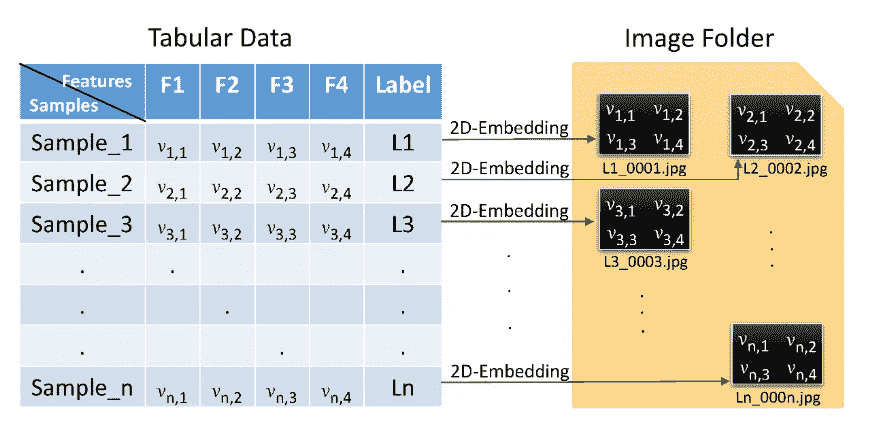

# 数据转换方法:表格数据的深度神经网络

> 原文：<https://towardsdatascience.com/data-transformation-methods-deep-neural-networks-for-tabular-data-8d9ebdeacc16?source=collection_archive---------20----------------------->

## 深度学习模型的未征服城堡

阿瑟尼·托古列夫在 [Unsplash](https://unsplash.com?utm_source=medium&utm_medium=referral) 上的照片

深度学习最近取得了大量成功，特别是在同质数据集上。他们在图像/音频的分类和数据生成方面表现突出。然而，对于深度神经网络模型来说，表格数据集仍然是一个未征服的城堡。

表格数据是异构的，可能导致密集的数字和稀疏的分类特征。此外，特征之间的相关性弱于图像或语音数据中的空间或语义关系。

然而，我们看到异构数据在许多关键应用中的普遍使用，包括[医疗诊断](https://arxiv.org/abs/2011.03274)、[金融应用预测分析](https://arxiv.org/abs/2012.15330)和[点击率预测](https://arxiv.org/abs/1703.04247)。

# 用表格数据学习的挑战

表格数据或异构数据不同于同构数据，因为它们包含各种属性，包括连续属性和分类属性。由于深度学习模型无法实现相同水平的预测质量，因此存在不同的研究挑战或原因。

## 不适当的训练数据

数据质量是表格数据集中的主要问题之一，正因为如此，我们在表格数据中发现了许多缺失值。它们通常包含异常值，并且相对于从数据中生成的高维特征向量而言具有较小的大小。

## 复杂的不规则空间依赖

在表格数据集中，我们无法找到变量之间的空间相关性。大多数情况下，依赖关系是复杂和不规则的。所以像卷积神经网络这样的方法无法对表格数据建模。

## 广泛的预处理

另一个重要的挑战是表格数据中分类属性的转换。大多数情况下，一次性编码方案用于转换分类数据。然而，它产生一个稀疏矩阵，并可能引发维数灾难。此外，数据扩充对于表格数据的应用也非常具有挑战性。在这篇博客中，我们将针对这一挑战。

## 模型灵敏度

与基于树的方法相比，深度神经网络对输入数据的微小变化极其敏感。因此，深度神经网络具有高曲率决策边界。与基于树的方法相比，深度学习模型中的超参数数量也很高，这使得调整的计算成本很高。

# 数据转换模型

大多数深度学习方法用于转换表格数据的任务。表格数据的挑战在于分类属性的存在，因为神经网络只接受实数作为输入。因此，需要一种方法将这些类别转换成数字格式。为此使用了两种不同的形式，包括*确定性*和*自动*技术。

## 确定性技术

标签或顺序编码是最常用的确定性技术，其中每个类别都映射到特定的数字。例如:{ '芒果'，'菠萝' }编码为{0，1}。然而，这产生了对神经网络无用的人工排序。

另一种方法是通过一热编码进行编码。在我们的例子中，“芒果”到(1，0)，而“菠萝”到(0，1)。这种方法导致稀疏的特征向量，并可能引发维数灾难。

二进制编码是用于对类别进行编码的另一种机制。扩大我们的例子，如果我们添加另一种水果:“香蕉”到我们的类别。二进制编码会是这样的:(01)，(10)，(11)。在这种情况下，只有*日志(类别)*新增栏目。

最常用的方法是留一编码。该技术由 Micci-Barreca (2001 年)提出[1]。在这种方法中，每个类别都被该类别的目标变量的平均值所代替，并且当前行被排除在计算之外，以避免过拟合。这种方法也用在 CatBoost 算法中。

还使用了另一种称为基于散列的编码的策略，它通过散列函数来转换固定大小的值。哈希函数也是确定性的。

## 自动编码

有不同的自动编码方法用于编码分类属性。Yoon 等人[2]提出的 VIME 方法就是其中之一。VIME 最初确定哪些值是损坏的样本。使用生成二进制掩码向量和输入样本的掩码发生器来创建损坏的样本。注意，输入样本是从未标记的数据集生成的。

作者确保损坏的样本是表格形式的，并且类似于输入分布。然后，被破坏的特征被传递到编码器，该编码器生成特征表示。然后，特征向量估计器和掩码向量估计器分别生成恢复的特征和掩码。

Sun 等人[3]的 SuperTML 是使用卷积神经网络对表格数据进行自动编码的另一种方法。SuperTML 将数据转换成可视数据格式，即 2D 矩阵或黑白图像。这些图像随后被输入微调后的 2D CNN 模型进行分类。该过程自动处理表格数据中的分类数据和缺失值。Zhu 等人[4]采用了另一种类似的方法，利用卷积神经网络将表格数据转换成图像。

图来自孙等人的论文[3]

数据转换是对表格数据建模的主要挑战之一。在这个领域有重大进展，包括确定性和动态方法。然而，这一领域的新想法也很受欢迎。

感谢阅读我的文章。直到下一次…

快乐阅读！

## 学分:

内容灵感来自瓦迪姆等人的论文:[深度神经网络和表格数据:调查](https://arxiv.org/pdf/2110.01889.pdf)，(2021)。

## 参考资料:

[1] Micci-Barreca 和 Daniele，[分类和预测问题中高基数分类属性的预处理方案](https://dl.acm.org/doi/pdf/10.1145/507533.507538) (2018)，ACM SIGKDD 探索通讯 3

[2]尹金松、张尧、詹姆斯·乔登和米哈埃拉·范德沙尔、维梅:[将自我和半监督学习的成功扩展到表格域](https://vanderschaar-lab.com/papers/NeurIPS2020_VIME.pdf) (2020)，神经信息处理系统进展

[3]孙，，，，，张，，董，杨，董， [Supertml:预知结构化表格数据的二维单词嵌入](https://openaccess.thecvf.com/content_CVPRW_2019/papers/Precognition/Sun_SuperTML_Two-Dimensional_Word_Embedding_for_the_Precognition_on_Structured_Tabular_CVPRW_2019_paper.pdf) (2019)，IEEE/CVF 计算机视觉与模式识别研讨会论文集

[4]朱、、Thomas Brettin、夏芳芳、Alexander Partin、Maulik Shukla、Hyunseung Yoo、Yvonne A. Evrard、James H. Doroshow 和 Rick L. Stevens，[用卷积神经网络将表格数据转换成用于深度学习的图像](https://www.nature.com/articles/s41598-021-90923-y) (2021)《自然科学报告》