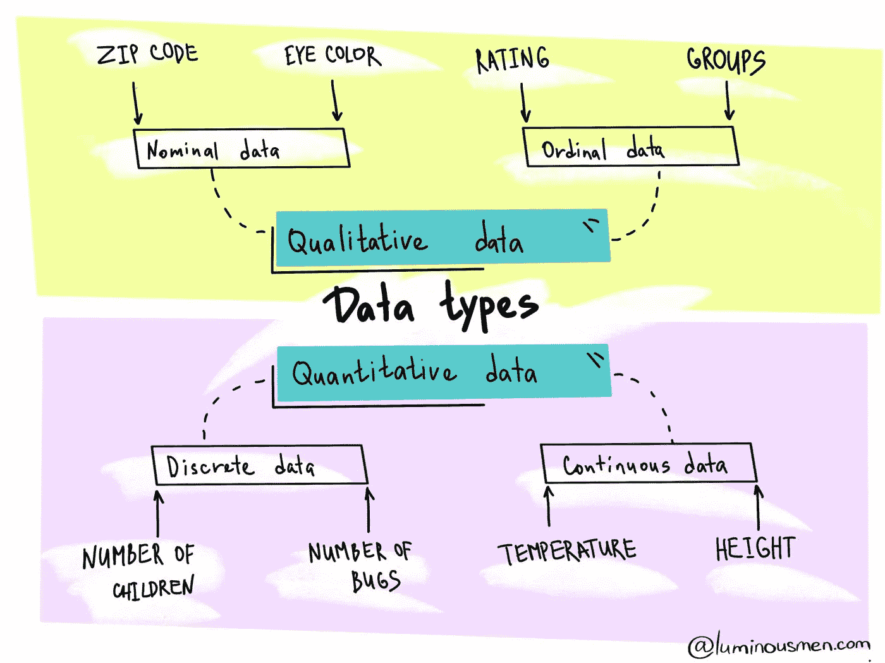
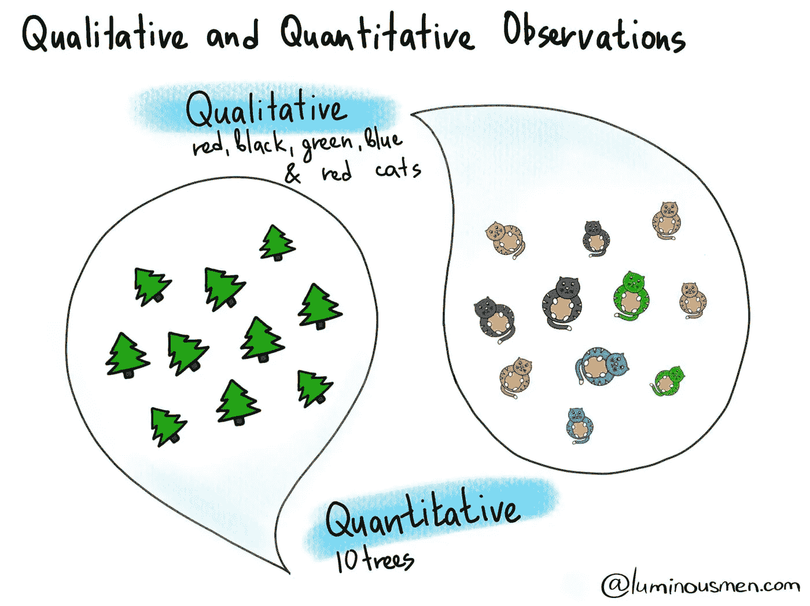

# 数据科学中的数据类型

> 原文：<https://towardsdatascience.com/data-types-in-data-science-ddb1171bf900?source=collection_archive---------13----------------------->

## 定量和定性数据差异快速指南

有很多工程师从未涉足统计学或数据科学领域。但是，为了构建数据科学管道或者将数据科学家产生的代码重写为适当的、易于维护的代码，工程方面会出现许多细微差别和误解。对于那些数据/ML 工程师和数据科学家新手，我做这个系列的帖子。我将尝试用简单的英语解释一些基本方法，并在此基础上解释一些数据科学的基本概念。

整个系列:

定义您正在处理的变量类型始终是数据分析过程的第一步。稍后，这使得确定哪种类型的分析是最合适的变得容易。

在最一般的形式下，数据可以分为定量和定性。

**量化**顾名思义，是一种数据类型，其中数字具有数学值，它们表示数量、金额或某个特性的度量。

当我们进行定量测量时，数字本身就有意义。也就是不需要额外的信息:1.5 就是 1.5，5 就是 5，100 就是 100。

**离散**秤是一种定量秤，但它不会占据所有空间。我们以家庭的孩子数量为例——我们可能有 1 个孩子、3 个孩子、5 个孩子甚至 10 个，但我们不可能有 1.5 个或 3.75 个。也就是这些是一些点状的离散值。

一个**连续的**音阶是一个占据所有空间的音阶，它可以是从-∞到+∞，可以是分数。例如，我们可以用天、小时、秒、毫秒等等来度量时间。连续标度由所有可能的值决定。

**定性**变量是反映对象属性或质量的变量。这里的数字不是指它们本身，如在定量的情况下，而是指物体的一些质量或性质。换句话说，*它们充当某些类别的标记*。

例如，假设我们将生活在一个州的人与生活在另一个州的人进行比较。我们可以用 1 来编码加利福尼亚人，用 2 来编码纽约人，1 和 2 除了表示这些类别之外没有任何意义，这是我们分析的中心。

定性变量分为名义变量和序数变量。

让我们仔细看看每种类型的含义。让我们从**名义**变量开始，这是最基本、最简单的尺度。它包含的唯一信息是关于属于某个类或组的对象的信息。这意味着这些变量只能根据属于一些显著不同的类别来衡量，而你将无法确定这些类别的顺序。

例如，我们可以研究来自不同州的人，或者不同眼睛颜色的人——蓝眼睛、绿眼睛、棕色眼睛。这些都是名义变量——不管你的眼睛是什么颜色——这些值没有顺序。

**序数**变量与名义变量略有不同，因为出现了顺序。因此，值不仅将对象分为类或组，而且还以某种方式对它们进行排序。

例如，我们在学校有分数——A、B、C、D、f。在这种情况下，我们可以肯定地说，得 A 的人比得 f 的人更有可能为考试做好准备。在这种情况下，我们不能说在多大程度上，但我们可以肯定地说 A 比 D 好。

# 材料

*   [揭开假设检验的神秘面纱](https://luminousmen.com/post/demystifying-hypothesis-testing)
*   [数据科学从零开始【附属】](https://amzn.to/2M0Jy4r)
*   [数据科学【附属】](https://amzn.to/3sCQbdW)

**感谢您的阅读！**

有什么问题吗？请在下面留下您的评论，开始精彩的讨论！

查看我的博客或者来打个招呼👋在 [Twitter](https://twitter.com/luminousmen) 或订阅[我的电报频道](https://t.me/iamluminousmen)。规划好自己！