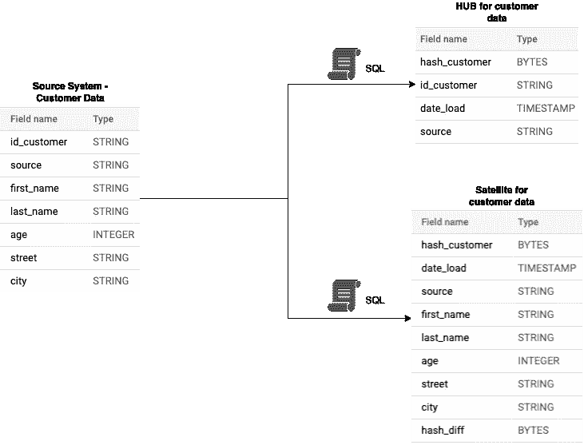
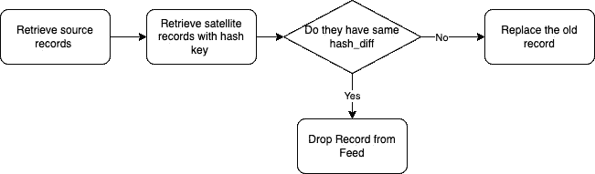
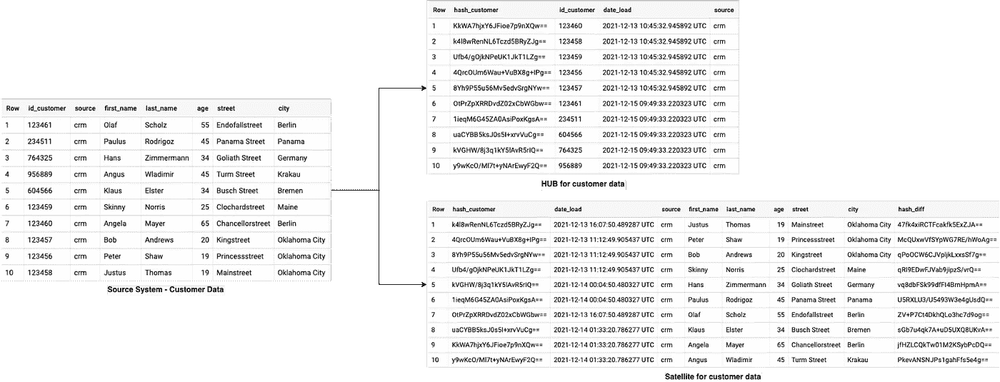

# BigQuery 中的数据仓库:如何创建和管理主数据的表

> 原文：<https://towardsdatascience.com/data-vault-in-bigquery-how-to-create-and-manage-tables-for-master-data-cd043cc9c55e?source=collection_archive---------18----------------------->

## 为主数据创建中心和卫星表

劳拉·奥克尔在 [Unsplash](https://unsplash.com?utm_source=medium&utm_medium=referral) 上的照片

在我之前的帖子中，我写了关于[建立一个数据湖](/what-is-a-data-lake-it-is-not-a-data-swamp-376430d6c15e)和[企业中过时的数据思维](/antipatterns-and-obsolete-mindset-in-corporations-74540f128bc0)。嗯……最近，我们决定为我的雇主评估 Google BigQuery 中的数据仓库模型。在这样做的过程中，我想与大家分享我们小小的成功故事。在本文中，我想与您分享一个例子，说明我们如何将主数据从源系统加载到 Data Vault 模型中。

# 基础

## 什么是集线器表？

集线器包含唯一标识一个实体的键(业务键)。例如，这些可以是账号或客户号。对于每个键，您创建一个代理键，比如一个*散列业务键*。除了密钥之外，*加载时间戳*和*源*也被存储。

## 什么是卫星桌？

描述性信息存储在卫星中。像地址、年龄、出生日期或其他任何信息。卫星中没有商业密钥。使用代理键。所有描述性列被散列在一起，并存储在每个记录的表中，以检测新输入记录中的变化。

# 开发数据仓库模型

## 设置强制表

在我们的实验中，我们考虑将客户数据从源系统加载到一个数据仓库模型中。那么我们需要哪些桌子呢？

*   ***作为我们源系统的客户表***
*   ***枢纽表*** 管理业务和代理键
*   ***卫星表*** 持久化客户的所有描述性数据

由作者创建

请注意卫星表中的 hash_diff。hash_diff 包含由描述性列组成的散列。

## 加载客户数据的 SQL 脚本

下面您可以看到两个 BigQuery SQL 脚本，分别用于将客户数据加载到 Hub 和 Satellite。

我们将按照下面的工作流程加载卫星表。

由作者创作[灵感来自 blog.scalefree.com]

由作者创建

以下代码显示了 Hub 表的加载脚本。工作流程类似于第一个。

由作者创建

## 结果

在下图中，您可以看到带有一些示例数据的工作流。

由作者创建

# 结论

我希望你喜欢这个小帖子，我也希望它能让一些人开心。尤其是在 BigQuery 环境中，你不会发现太多关于 Data Vault 的内容。请不吝赐教。