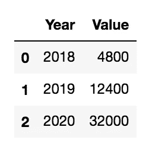
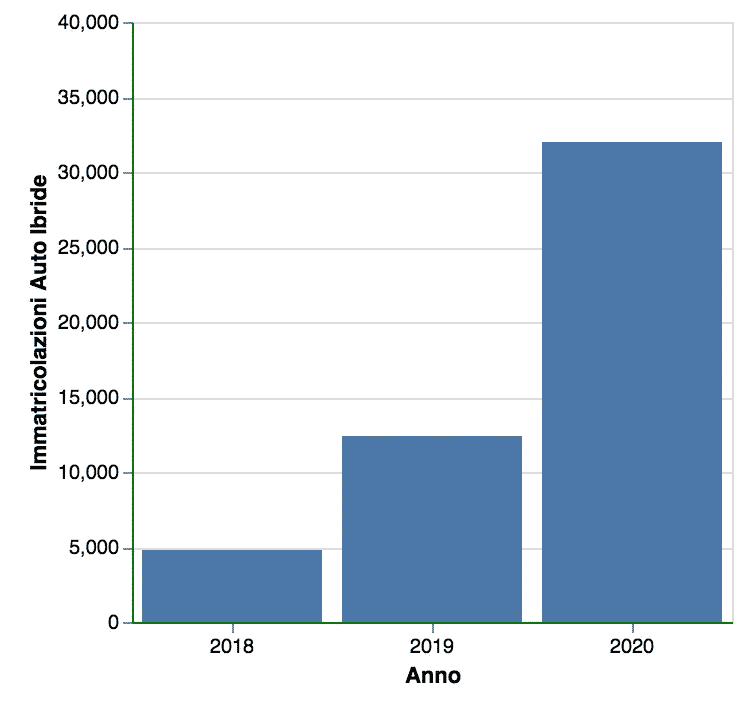
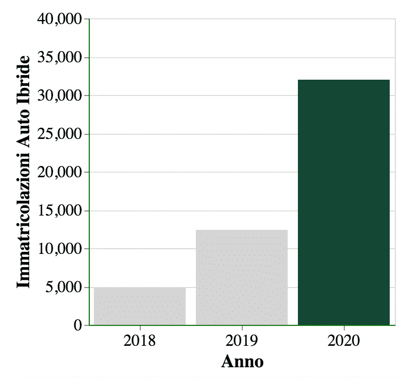
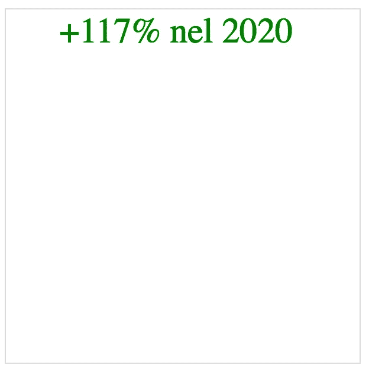
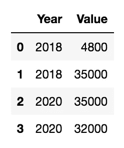
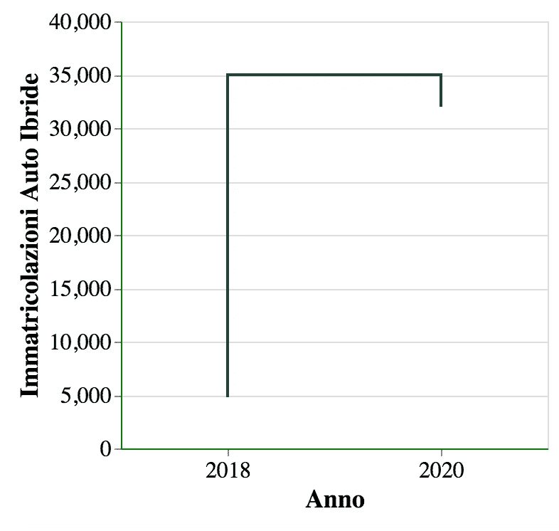
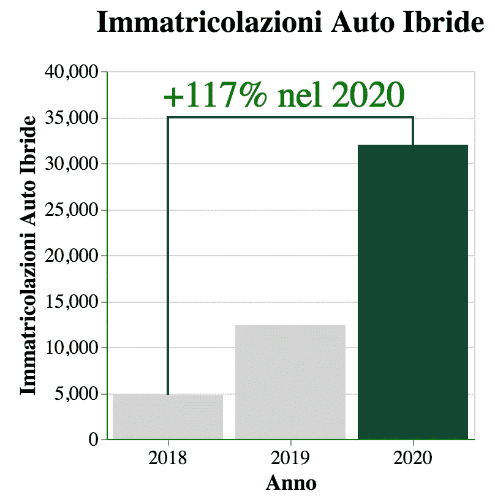

# 数据可视化原理第 1 部分 Altair 中的一个实际例子

> 原文：<https://towardsdatascience.com/data-visualisation-principles-part-1-a-practical-example-in-altair-b6e16f665fc6?source=collection_archive---------34----------------------->

## 数据可视化

## 关于如何在 Python Altair 中构建、定制和添加注释到简单条形图的实用教程


图片来自 [Leni_und_Tom](https://pixabay.com/users/leni_und_tom-4330980/?utm_source=link-attribution&utm_medium=referral&utm_campaign=image&utm_content=4996834) 来自 [Pixabay](https://pixabay.com/?utm_source=link-attribution&utm_medium=referral&utm_campaign=image&utm_content=4996834)

**数据可视化**，这是数据科学项目的最后一步，非常重要，因为它**传达分析或探索的结果**。因此，一个优秀的数据科学家至少应该知道数据可视化的基本原理。

在我之前的文章中，我讨论了数据可视化的基本原则，包括空白、字体、文本和颜色。

在本教程中，我**实现了一个如何应用已经分析过的基本原则**的基本示例。详细地说，我描述了如何使用 [Altair](https://altair-viz.github.io/#) Python 库构建和定制一个简单的条形图。本教程分为四个步骤:

*   构建基本图表
*   字体
*   颜色
*   文本

作为示例图，我加载了 2018 年至 2020 年意大利的混合动力汽车注册量，手动构建。

所有代码都可以作为 Jupyter 笔记本从我的 Github 库下载。

# 加载数据

首先，我导入将在教程中使用的库:`altair`和`pandas`。

```
import altair as alt
import pandas as pd
```

现在，我将数据集构建为一个字典列表，包含成对的字典(Year，Value)。然后我从这个基本列表中构建一个数据框架。

```
data = [ { 'Year' : 2018, 'Value' : 4800},
         { 'Year' : 2019, 'Value' : 12400},
         { 'Year' : 2020, 'Value' : 32000}]df = pd.DataFrame(data)
df.head()
```



作者图片

# 构建基本图表

在构建条形图之前，我将一些基本参数定义为变量:

*   `width`:图表的宽度，以像素为单位
*   `height`:图表的高度，单位为像素。

```
width = 300
height = 300
```

现在我可以通过调用`Chart()`类的`mark_bar()`函数来构建基本的条形图。`Chart()`类接收要显示的数据帧`df`作为输入。为了指定数据和图形视觉方面之间的映射，`altair`库提供了`encode()`函数。通过这个函数，我指定了轴和数据之间的映射。我还指定哪些信息必须显示在工具提示中。

```
bar = alt.Chart(df).mark_bar().encode(
    alt.Y('Value'),
    alt.X('Year:N', title='Anno'),
    tooltip=[alt.Tooltip('Year:N', title='Anno'), alt.Tooltip('Value', format=',', title='Immatricolazioni')]     
)
bar
```



作者图片

# 字体

基本图形可以定制，以便立即向读者传达某种信息。例如，我可以让读者注意到这样一个事实，即从 2018 年到 2020 年，混合动力汽车的注册量有了令人难以置信的提高。

我可以通过以下参数自定义轴和图形标题:

*   `font`:要使用的字体系列。
*   `axis_config`:关于两个轴的一些`altair`属性，包括字体系列、字体大小和标签旋转。关于轴，`altair`库提供了两种类型的文本:**标签**和**标题**。标签是指与数据相关联的每一个标签，例如国家的名称。标题是指轴的标题，比如国家。对于每种类型的文本，`altair`库允许配置许多属性，比如字体大小和字体系列。
*   `scale`:关于要使用的 y 轴刻度的一些`altair`属性。我将最大域值设置为 40，000，即大于最大数据值的值。
*   `title`:条形图的标题。

```
font = 'utopia-std, serif'
axis_config = alt.Axis(labelAngle=0,labelFont=font,titleFont=font, labelFontSize=16, titleFontSize=18)
scale_config=alt.Scale(domain=[0, 40000])
title='Immatricolazioni Auto Ibride'
```

# 颜色

然后，我可以将读者的注意力集中到最后一年(2020 年)，用比其他条形更强烈的颜色突出显示相应的条形。作为颜色，我可以用一种绿色，来标志生态汽车正在增加的事实。我通过一个`condition()`设置了`color`属性。

```
bar = alt.Chart(df).mark_bar(tooltip=True).encode(
    alt.Y('Value', axis=axis_config,title=title,scale=scale_config),
    alt.X('Year:N', axis=axis_config, title='Anno'),
    color=alt.condition(
        alt.datum.Year == 2020,  # If the Year is 2020,
        alt.value('#154734'),     # highlight a bar with green.
        alt.value('lightgrey')   # And grey for the rest of the bars
     ),
    tooltip=[alt.Tooltip('Year:N', title='Anno'), alt.Tooltip('Value', format=',', title='Immatricolazioni')]     
)
bar
```



作者图片

# 文本

现在，我可以通过计算百分比增长并将其作为注释添加到图表中，明确显示从 2018 年到 2020 年的改善情况。

```
df['Value'][2]/(df['Value'][2] - df['Value'][0])*100
```

它给出了以下输出:

```
117.64705882352942
```

百分比增长约为 117%，因此我可以在图表中添加一个包含此信息的文本。我利用了`Chart()`类的`mark_text()`函数。我还指定了字体和其他样式参数。

```
text = alt.Chart(df
).mark_text(x=width/2, y=20, dx=-5,fontSize=30, color='green',text='+117% nel 2020',font=font
).encode()text
```



作者图片

现在我建立了一条连接 2018 年和 2020 年的虚线。我构建了一个数据框架，其中包含四条线的点。

```
df_line = pd.DataFrame([
    {'Year': 2018, 'Value' : df['Value'].min()}, 
    {'Year': 2018, 'Value' : 35000},
    {'Year': 2020, 'Value' : 35000},
    {'Year': 2020, 'Value' : df['Value'].max()}
])
df_line.head()
```



作者形象

然后，我通过`Chart()`类的`mark_line()`函数构建线。注意，在这种情况下，`Chart()`类接收`df_line`数据帧作为输入。

```
line = alt.Chart(df_line).mark_line(color='#154734').encode(
    alt.Y('Value', axis=axis_config,title=title,scale=scale_config),
    alt.X('Year:N',axis=axis_config, title='Anno', ),
)
line
```



作者形象

最后，我可以简单地通过对它们求和来组合前面的三个图形。我还可以指定最终图表的一些属性，如标题、宽度和高度。

```
final_chart = bar + line + text
final_chart = final_chart.configure_title(
    fontSize=25,
    dy = -15,
    font=font,
).properties(title=title,width=width,height=height)final_chart
```



作者形象

最后，我将图形保存为一个 HTML 页面，它可以包含在网站的任何地方。

```
final_chart.save('html/auto_ibride.html', embed_options={'actions': False})
```

# 摘要

在本教程中，我举例说明了如何在 Python `altair`中实现的简单条形图中设置颜色、字体和文本。

如果你想了解我的研究和其他活动的最新情况，你可以在[推特](https://twitter.com/alod83)、 [Youtube](https://www.youtube.com/channel/UC4O8-FtQqGIsgDW_ytXIWOg?view_as=subscriber) 和 [Github](https://github.com/alod83) 上关注我。

# 相关文章

[](/data-visualisation-principles-part-1-white-space-text-and-colour-13f520f90ce9) [## 数据可视化原则第 1 部分:空白、文本和颜色

### 从基本的平面设计原则开始。

towardsdatascience.com](/data-visualisation-principles-part-1-white-space-text-and-colour-13f520f90ce9) [](/how-to-improve-d3-js-graphs-with-annotations-252fbb9c5bb5) [## 如何改进带有注释的 D3.js 图

towardsdatascience.com](/how-to-improve-d3-js-graphs-with-annotations-252fbb9c5bb5) [](/plotly-vs-matplotlib-what-is-the-best-library-for-data-visualization-in-python-89a8b64a9471) [## plotly VS matplotlib:Python 中数据可视化的最佳库是什么？

### 在这个简短的教程中，我将向您展示如何使用 plotly 和 matplotlib 库快速构建一个基本的折线图…

towardsdatascience.com](/plotly-vs-matplotlib-what-is-the-best-library-for-data-visualization-in-python-89a8b64a9471)