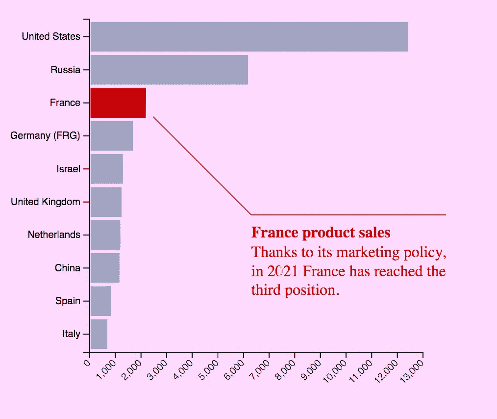
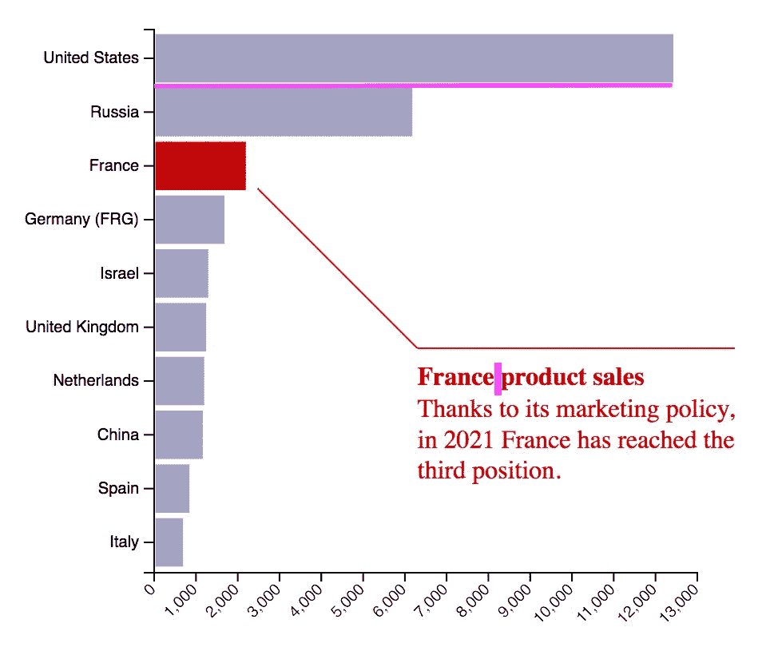
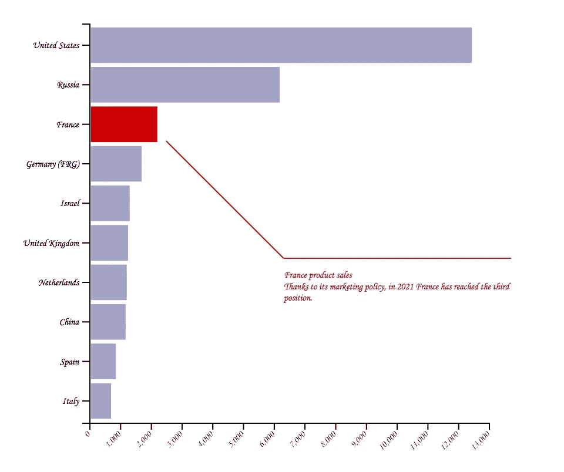

# 数据可视化原理第 1 部分:空白、文本和颜色

> 原文：<https://towardsdatascience.com/data-visualisation-principles-part-1-white-space-text-and-colour-13f520f90ce9?source=collection_archive---------22----------------------->

## 数据可视化

## 基本图形设计原则入门。

图片来自[Pixabay](https://pixabay.com/?utm_source=link-attribution&utm_medium=referral&utm_campaign=image&utm_content=3186081)Krzysztof-m

数据可视化是数据科学的最后一步。这非常重要，因为它允许向最终用户展示分析结果。因此，关注图形的每个方面是非常重要的，比如形状、文本和动画。

有了这篇文章，我将开始一系列文章，解释一些视觉化的**基本图形设计原则**，使其对用户非常有吸引力和可读性。

在本教程中，我涉及以下几个方面:

*   空格
*   文本
*   颜色

# 1.空格

空白是图形组成元素之间的空白。对空白的良好使用会增加可读性，并集中读者的注意力。例如，在一个文本中，空格将大块的文本分割成小段落，这使得它们更容易理解。此外，留白可以增强和突出视觉效果的某些元素，从而强调主要内容。

在观想中，存在两种类型的空白:

**宏空格—** 主要内容周围的所有空格，如图形后面的空白。在下面的示例中，宏空格用粉红色标记。

作者图片

在绘制信息图时，通常有一个想法，即所有的宏空白都必须满足。然而，这种策略可能会导致信息过载，这可能会在目标用户中产生混淆。因此，平衡宏观空白非常重要。

**微小空格—** 文本中数字之间、轴与文本之间或条形图中条与条之间的所有空格。下图显示了一些粉红色的微小空白:

作者图片

# 2.文本

在视觉化中使用文本有助于读者理解上下文。图表中的文本示例有轴标签、标题和一些注释。与文本相关的主要图形设计原则有**样式**(如粗体、斜体、下划线文本)**字号**、**字体族**、**行距**和**段落分割**。这最后一个方面在一个图中并不常见，除非该图给出了一些长注释。

选择前面几个方面的正确组合，会使图表或多或少地具有可读性和趣味性。例如，下图中的字体大小和字体系列(Monotype Corsiva)非常小且复杂，因此无法立即阅读。

作者图片

# 3.颜色

颜色是传达情感和感觉的最有力的工具。在选择颜色的时候，尊重标准是非常重要的，比如红色代表危险的情况，绿色代表一切正常等等。

每种颜色都有三个特征:

*   **色调**是一种“纯”色，也就是说，在光的光谱中只有一种波长。

作者图片

*   **亮度**指颜色的强度，通过混合色调的阴影量来区分。

作者图片

*   **饱和度**指的是颜色的强度，通过混合一种色调的白光量来区分

作者图片

在一个可视化中，颜色可以组合起来生成一个和谐的图形。有许多工具可以生成调色板，例如以下工具:

*   [颜色搜索](https://colorhunt.co/)，允许生成多种颜色的调色板
*   [Pine Tools](https://pinetools.com/monochromatic-colors-generator) ，允许生成单色调色板
*   [谷歌艺术调色板](https://artsexperiments.withgoogle.com/artpalette/images)，允许从图像生成调色板。

# 摘要

在这篇简短的教程中，我阐述了数据可视化的一些基本原则。这些原则包括:空白、文本和颜色。

请注意，所有数据可视化的设计都应考虑目标受众及其潜在情绪。此外，数据可视化最重要的原则之一是**图形一致性**，也就是说，图形组合的每个元素都必须以最自然的方式遵循和增强组合的对象，不得混淆。

在本系列的下一篇文章中，我将讨论其他数据可视化原则，比如动画。敬请关注，了解更多详情:)

如果你想了解我的研究和其他活动的最新情况，你可以在 [Twitter](https://twitter.com/alod83) 、 [Youtube](https://www.youtube.com/channel/UC4O8-FtQqGIsgDW_ytXIWOg?view_as=subscriber) 和 [Github](https://github.com/alod83) 上关注我。

# 相关文章

<https://medium.com/@angelica.loduca/getting-started-with-d3-js-maps-593d4e68338c>  </how-to-build-a-narrative-from-data-85e327940c13> 