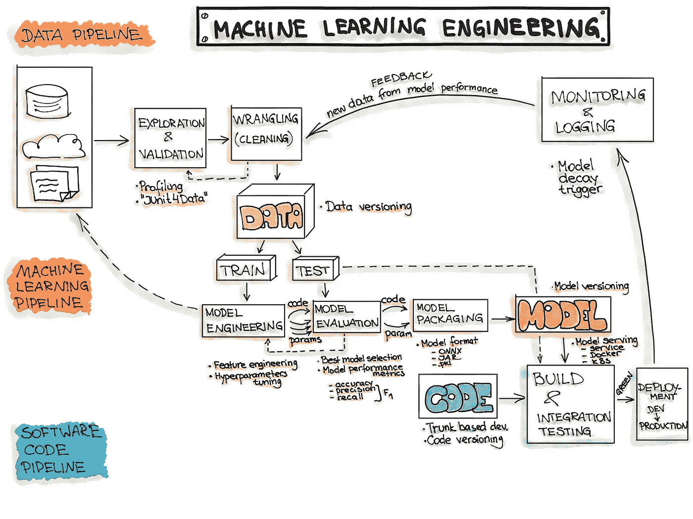
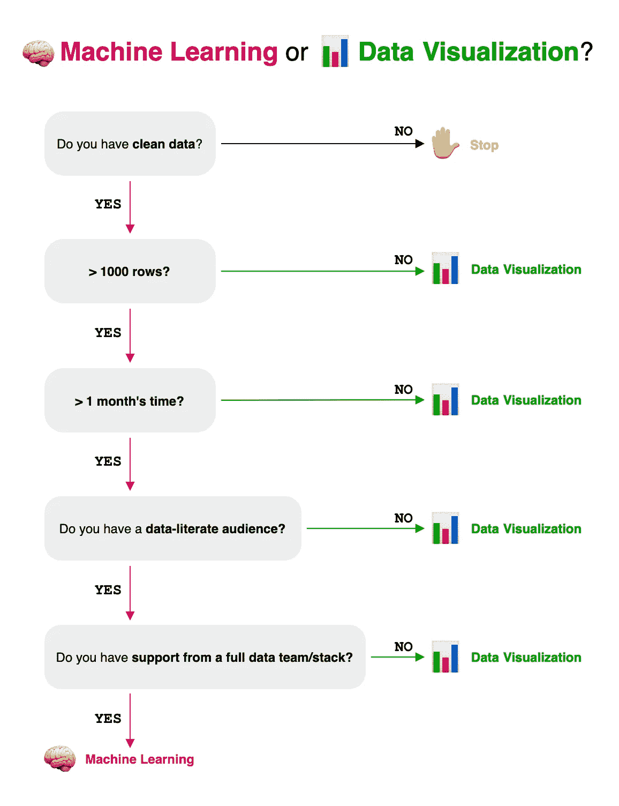

# 机器学习之前的数据可视化

> 原文：<https://towardsdatascience.com/data-visualization-before-machine-learning-dd75941685f1?source=collection_archive---------7----------------------->

学分 [Unsplash](https://unsplash.com/photos/z4H9MYmWIMA)

你有没有问过自己为什么你的机器学习模型没有被使用？为什么很少有人真正相信机器学习的力量，而不是这些旧的仪表盘？

当我在[的一家足球俱乐部](https://ben8t.github.io/)工作时，我制作了一个显示球员赛季表现的数据可视化。这是一个真正的[简单的瓷砖情节](https://medium.com/@benoit.pimpaud/after-raw-stats-exploring-possession-styles-with-data-embeddings-d3ebef718abf)。但当足球界人士在我的屏幕上看到它时，他们很快就投入了。他们问了一些具体的问题；如果有可能定期得到这张图表，等等…

这个情节比我从那以后制作的任何机器学习模型都更吸引人。对于非技术人员来说，在图表上提问比在机器学习模型上提问容易得多。

让我们看看如何通过数据可视化来绕过机器学习项目。

# 机器学习的问题是

机器学习非常强大。它能比任何人更好地解决复杂的问题。

尽管如此，它仍有许多问题。

首先，这很难实现。今天，它们是许多开发、编排、部署和监控机器学习模型的工具。但是使项目成功所需的协调仍然是重要的。

真正的机器学习项目不是单个数据科学家在笔记本上做一些晦涩难懂的数据操作。您必须与业务人员一起确定项目范围，理解用例，预测边缘情况，对模型的部署和监控有一个愿景。

所有这些都意味着来自不同领域的人们之间的协调。**硬东西**。

这不是唯一的问题。

为您的问题获取干净和良好的数据总是最困难的部分。

在笔记本上做概念验证似乎很容易。但是当你不得不设计你的系统使其在生产状态下工作时，你将会面临许多令人头痛的问题。

长期收集标准化数据是困难的。你必须监控你的特征，以防止分布中的任何漂移。你必须知道数据的来源以及数据收集背后可能存在的偏见。大多数时候，这些资产都没有实时反馈回路。

即使您的数据编排设置良好，您也将不得不处理更专注的机器学习任务:

*   为相应的问题找到一个好的模型。
*   在模型性能和预测可解释性之间找到一个平衡点。
*   对数据建模以提取有用的特征。
*   根据卷和环境资源调整数据。

典型机器学习工作流程中涉及的核心步骤([ml-ops.org](http://ml-ops.org))。

将所有这些东西投入生产需要 IT 方面的许多资源。根据你公司的规模，你将不得不与软件、系统工程师、安全政策、商业评论等打交道

技术栈很复杂，几乎没有人是端到端管道的专家。

最终，你会明白为什么利益相关者必须真正相信数据驱动的问题解决方案。任何机器学习项目——从开始到结束——都需要数周或数月的开发，才能达到对公司实际有用的状态。

任何机器学习项目的第一条规则:不要做机器学习。

# 另一个选择:数据可视化

我们经常忽略机器学习。

大多数机器学习项目都是为了预测趋势或 KPI 并做出决策。其他被忽略的决策工具是仪表板。所谓的“数据驱动”决策。

仪表板对决策不是很有用，但对探索数据是[。](https://benn.substack.com/p/the-future-of-operational-analytics)

当谈到数据可视化时，我指的是嵌入在更大的讲述故事的项目中的静态图形或交互。

这些真的能推动决策。

首先，它们“容易”创建。

在开始任何图表之前，你通常对它的终结有一个很好的想法。最终用户想通过这个图表了解什么？你想突出什么？

数据可视化产品有更清晰的界限。

与机器学习项目相反，数据可视化不依赖于大型技术堆栈。

没有性能基准。没有那么多复杂的数据建模。没有监控。没有系统工程师，数据安全政策等…

寻找一个好的数据可视化的过程更加线性:你有一个想法，测试，和/或与终端用户讨论，你迭代，然后发布。

比机器学习过程静态多了。

从设计上来说，一个图形的制作是为了提高观众的参与度，并以最简单的方式展示数据:这样就更容易做出决定。

**我可以使用什么工具？**

你喜欢的那个！

在现实中，创建数据可视化有很多可能性:GUI 软件( [Microsoft Excel](/microsoft-excel-in-the-era-of-big-data-401e67ca28a5) )、编程语言( [R with ggplot](https://ggplot2.tidyverse.org/index.html) 、Python、 [D3.js](https://d3js.org/) )、设计工具([Adobe Illustrator/Photoshop](https://www.adobe.com/fr/)、 [Figma](https://www.figma.com/) )等等……

**如何使创建的数据可视化？**

好问题。从设计上来说，一个好的图表是你的读者会参与的。相应地选择颜色、设计和复杂程度。先做简单的事情，如果需要的话再重复。

**寻找灵感？下面是大师和有思想的出版物:**

*   [塞德里克·舍雷尔——数据可视化专家](https://www.cedricscherer.com/)
*   [邓肯·吉尔——信息设计师](https://www.duncangeere.com/)
*   [阿尔贝托·开罗——记者兼设计师](http://albertocairo.com/)
*   [南丁格尔——数据可视化学会杂志](https://nightingaledvs.com/)
*   [提升会员资格—提升您的数据可视化技能](https://elevatedataviz.ghost.io/)
*   [我们信任的信息——如何用数据激励世界](https://infowetrust.com/project/272)

# 机器学习还是数据可视化？

因此，你在一个数据团队中，你的角色是推动决策。数据方式。

停止你的仪表盘、[你的笔记本](/beyond-jupyter-notebook-9ff6be598313)或者你的模特训练。

下次有人要求数据驱动的决策时:问问自己为什么数据可视化行不通？可能是吧。

作者图解。

*我是一名全栈数据科学家，曾在新闻、零售、职业体育和音乐等多个行业工作过。我明白了，分享我们自己的经历是帮助他人和发展自己的一种强有力的方式。如果你也有这种想法，并且你正在寻找伟大的数据资源，请* [*订阅我的简讯*](https://fromanengineersight.substack.com/welcome)*——来自一个工程师的视线。*