# 数据可视化黑客——来自 538 个图表的教训

> 原文：<https://towardsdatascience.com/data-visualization-hack-lessons-from-fivethirtyeight-graphs-e121080725a6?source=collection_archive---------11----------------------->

## PYTHON。数据可视化。图表

## 仅使用 Matplotlib 包创建专业外观的图形

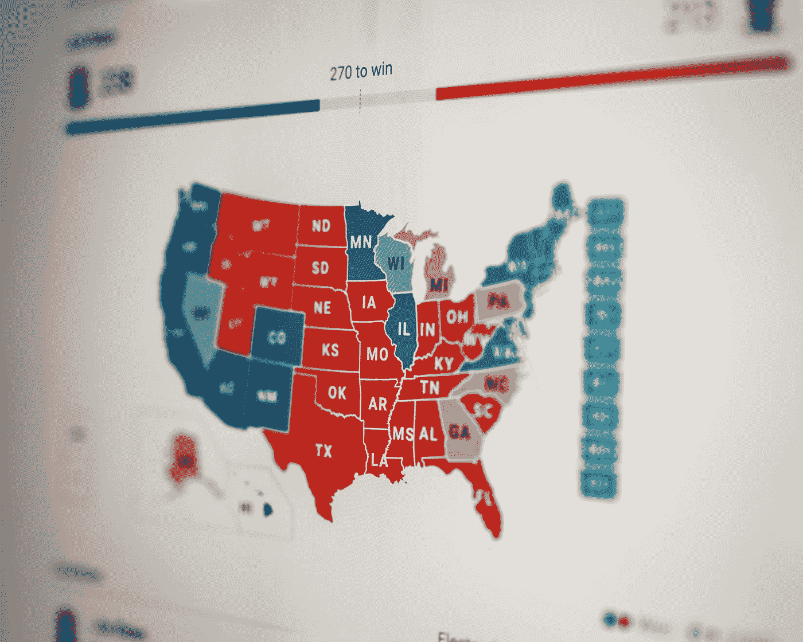

[粘土银行](https://unsplash.com/@claybanks?utm_source=medium&utm_medium=referral)在 [Unsplash](https://unsplash.com?utm_source=medium&utm_medium=referral) 拍摄的照片

# 介绍

[FiveThirtyEight](https://fivethirtyeight.com/) (有时写为 538)，是一个分析政治、经济和体育等民意调查主题数据的网站。它的名字来自美国选举团的选举人数。

但是有助于它们受欢迎的一个因素是它们在转播民意测验结果时的可视化效果。

我们可以学习一两件事来改善我们的视觉化，让它看起来更专业，更迷人。

在本文的其余部分，我们将把 FiveThirtyEight 创建的图称为 FTE 图。

在本文中，我们将转换这个看起来简单的图表:

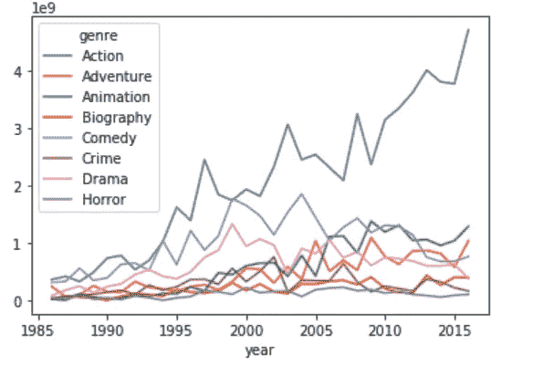

图片由作者提供:由一行代码生成的原始 Matplotlib 图

变成了一张看起来像 FTE 的图表:

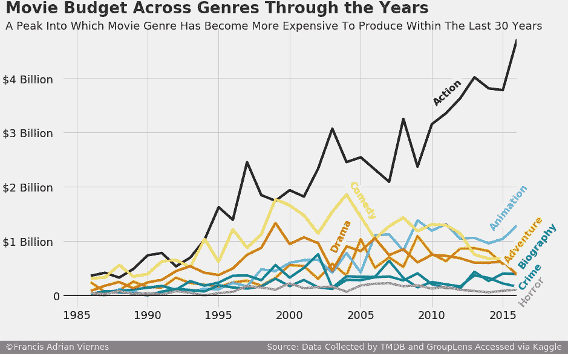

作者图片:最终/目标图

所以，事不宜迟，让我们进入我们的图形改造。

# **数据集—电影预算**

我是一个超级电影迷，所以毫不奇怪，我发现关于电影预算的数据集很有趣。

例如，假设我们想要检查不同类型电影的预算是如何随时间变化的。为此，让我们使用从 Kaggle 获得的[数据集。](https://www.kaggle.com/rounakbanik/the-movies-dataset)

检查这些年的预算可能会揭示制作一部特定类型电影的偏好和复杂性的变化。

# 一步一步的图形改造

## 预赛

首先，让我们导入必要的包来完成这个任务。

```
import pandas as pdimport matplotlib.pyplot as plt
import matplotlib.style as style%matplotlib inline
```

## 导入数据集

```
df = pd.read_csv('data\movies.csv', encoding='latin-1')
df.head()
```

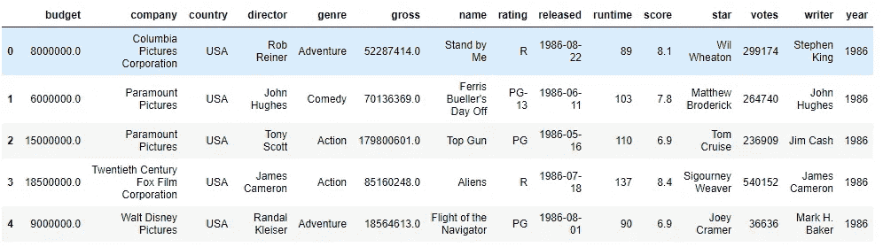

## 数据预处理

```
# Data preprocessing
trial = df.groupby(['year', 'genre'])['budget'].sum().reset_index()
trial.head()trial = trial.pivot(index="year", columns="genre").dropna(axis = 1, how="any").reset_index() 
```

## 默认图表

由 *matplotlib* 生成的默认图形可以使用以下代码轻松生成:

```
initial_graph = trial.plot(x ='year', y = 'budget')
```


作者图片

以此为基础图，让我们一个接一个地改进元素，产生上面的 FTE 图。

**注意:当我们进行增量调整时，理想情况下，整个代码都在一个单元格中，因此调整可以应用于绘图对象。**

## 第一步——改变风格

Matplotlib 带有内置样式，这些样式为它生成的图形布局提供了一些默认设置。

要查看可用的样式:

```
style.available
```

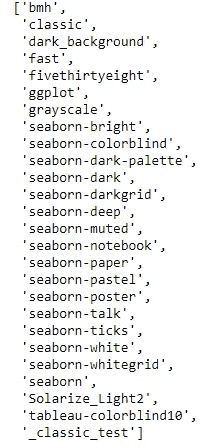

```
#To start, using the set style allows us to easily elevate the level of our visualization
style.use('fivethirtyeight')
```

在使用' *fivethirtyeight* '样式后(顺便说一下，您只需要调用一次)，我们可以使用我们的原始代码在同一个图上调用，添加 *figsize* 参数:

```
fte_graph = trial.plot(x ='year', 
           y = 'budget', 
           figsize=(12,8))
```

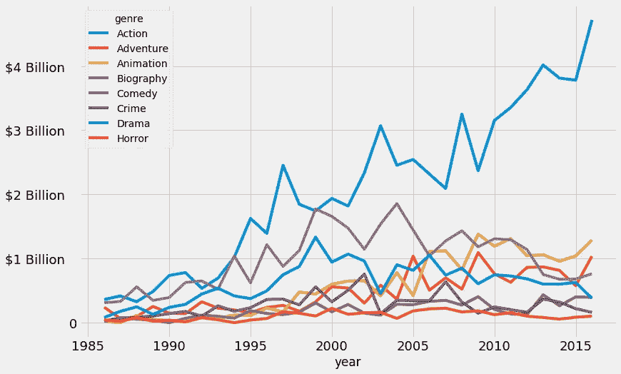

作者图片

使用内置样式可以立即对 *matplotlib* 的基础图进行改进。其中一些如下:

*   背景颜色
*   网格线
*   字体
*   线条粗细
*   移除顶部和右侧的刺

我们可以通过一个[的例子](https://fivethirtyeight.com/features/our-47-weirdest-charts-from-2015/)来考察一个理想的 FTE 图:

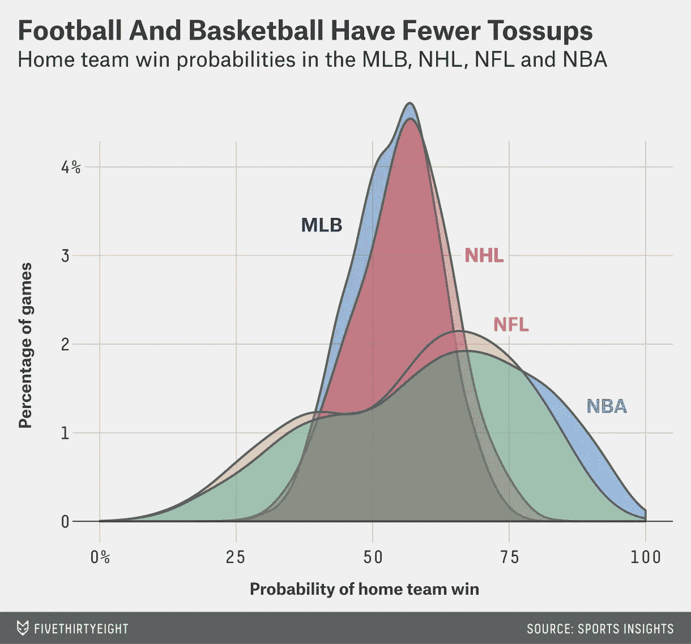

[摄五三八](https://fivethirtyeight.com/features/our-47-weirdest-charts-from-2015/)——典型的 FTE 曲线图

为了让我们更接近 FTE 图的风格，我们仍然需要以下组件:

*   标题
*   小标题
*   签名栏
*   用内嵌标签替换图例

对图表的其他微小调整可能包括以下内容:

*   刻度标签的字体大小
*   Y 轴的主要刻度标签
*   移除 X 轴标签
*   在 y=0 处放置一条粗线
*   选择合适的配色方案

## 步骤 2-将图表存储在变量中

将图形存储在变量中使我们更容易访问它们的属性，并对对象应用一些函数。

```
fte_graph = trial.plot(x ='year', 
           y = 'budget', 
           figsize=(12,8))
```

## 注意:先进行小的调整

在标题、副标题、签名栏和图例之前先做一些小的调整是很重要的。正如后面将要详细介绍的，这些元素需要一些手动调整，最好是小调整到位，以尽量减少我们的工作。

## 步骤 3-X 刻度和 Y 刻度格式

在我们开始手动调整之前，回顾一下关于 *matplotlib* 的术语可能会有所帮助，因为我们将使用它们来调用调整。

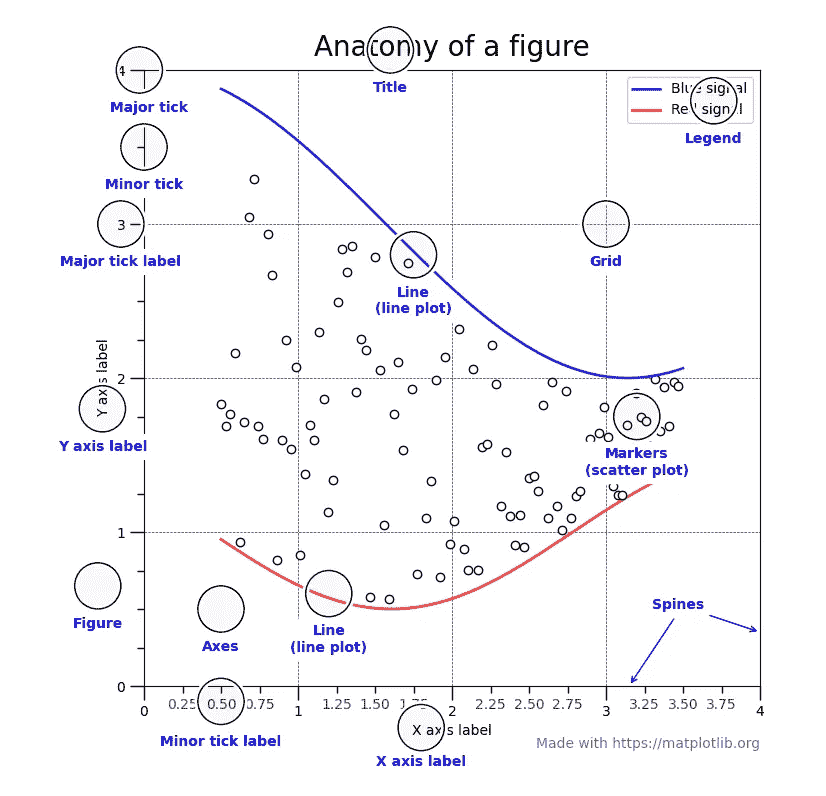

照片摄于[matplotlib.org](https://matplotlib.org/stable/gallery/showcase/anatomy.html?highlight=anatomy)

通过以下代码修改主要刻度大小和标签大小:

```
#Accessing the tick parameters and modifying the size
fte_graph.tick_params(axis = 'both', which = 'major', labelsize = 18)# Customizing the tick labels of the y-axis
fte_graph.set_yticklabels(labels = [-1000000000, 0,  '$1 Billion  ', '$2 Billion  ', '$3 Billion  ', '$4 Billion  ']);
```

我们希望我们的标签与刻度线之间有一些空间，因此，在我们的标签中，我们放置一些空白。在我上面的代码中，我使用了两个空格键来获得我想要的空间。

## 步骤 4 —在 Y=0 处加粗线条

```
# Generate a bolded horizontal line at y = 0
fte_graph.axhline(y = 0, color = 'black', linewidth = 2, alpha = .7)
```

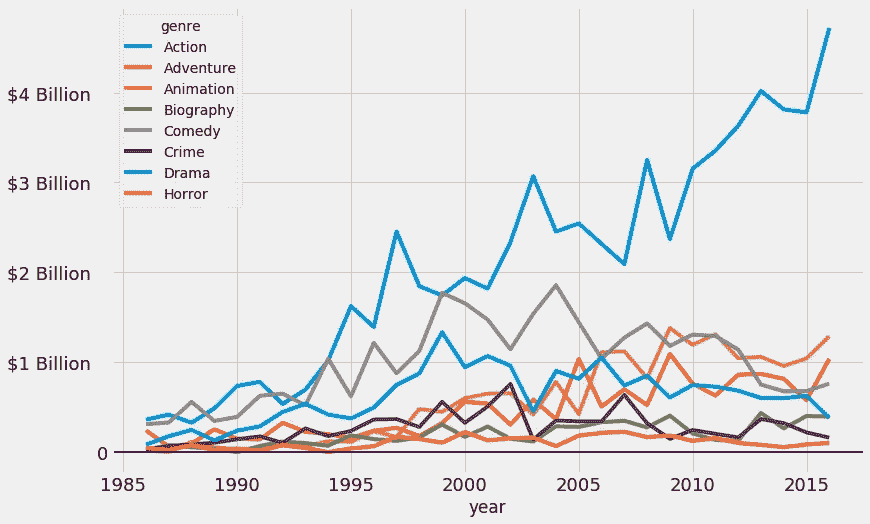

作者图片

## 步骤 5-添加额外的垂直线

通过调整 x 轴的范围添加一条额外的垂直线，因为 x 轴的主要刻度是 5，将 *xlimits* 设置为 1984 和 2016，在我们的图表中提供了一些急需的空间，特别是这样我们的刻度标签看起来不会太压缩。

```
fte_graph.set_xlim(left = 1984, right = 2016)
```

## 步骤 6-移除 X 轴标签

这一步可以通过将 x.axis.label 对象的 *set_visible* 方法设置为 false 来完成。

```
#Remove the label of the x-axis
fte_graph.xaxis.label.set_visible(False)
```

## 第 7 步—签名栏

签名栏具有以下特征:

*   位于底部栏
*   签名栏的背景是深灰色的
*   作者的名字写在栏里
*   数据来源如下
*   文本颜色与'*五个三十八个*'样式的颜色一致

添加签名栏需要我们做一些努力。然而，一旦我们完成了，它会把我们的视觉效果和其他的区别开来，当然会让它看起来更专业。

图表的 text 方法的 background 参数将突出显示整个文本。这就是我们制作签名“酒吧”所需要的。但是，这种背景只会突出文字的长度。因此，为了产生我们想要的对齐，这必须意味着我们将在文本中使用空白。

因此，要总结签名栏的重要步骤，我们需要以下内容:

*   通过反复试验，使用带有空格的 text 方法将签名与我们之前创建的 tick 标签对齐；
*   签名栏的位置(理想情况下低于最低 y 值)也是通过反复试验完成的。
*   需要注意的是**标题、刻度标签和签名栏的垂直对齐是 FTE 图表的关键**。因此，选择 x 值来将签名栏与刻度标签对齐。

```
# The signature bar
fte_graph.text(x = 1979.8, y = -1000000000,
    s = ' ©Francis Adrian Viernes                                                          Source: Data Collected by TMDB and GroupLens Accessed via Kaggle ',
               fontsize = 14, color = '#f0f0f0', backgroundcolor = 'grey');
```

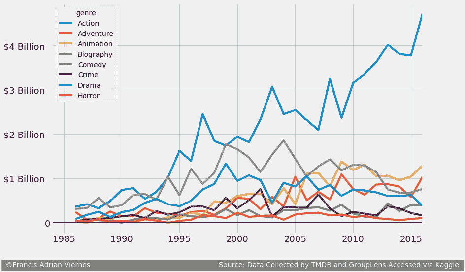

作者图片

## 第 8 步—标题和副标题

正如我们对签名栏的放置所做的一样，标题和副标题组件是“文本”元素。位置必须通过图表的 x 和 y 坐标的反复试验来完成。标题和副标题位于图表的顶部，因此理想情况下，这些文本的 y 坐标超过数据集中最高 y 值的 y 坐标。

因为我们关心我们的标题和副标题与我们的签名栏的垂直对齐，我们使用一个靠近我们的签名栏的 x 值(*，但不是精确的值来说明文本对象的边距/填充*)。

```
#Code to find the maximum y-value
trial.to_numpy().max()
```

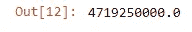

由于 y 的最大值约为 47.9 亿美元，我们可以尝试检查一下将标题设置为 52 亿美元是否合适。如果是，那么我们在它下面找到一个值来放置副标题。

```
#Title and Subtitle Placement
fte_graph.text(x = 1980, y = 5200000000, s = "Movie Budget Across Genres Through the Years",
               fontsize = 26, weight = 'bold', alpha = .75);
fte_graph.text(x = 1980, y = 4900000000,
               s = 'A Peak Into Which Movie Genre Has Become More Expensive To Produce Within The Last 30 Years',
              fontsize = 18, alpha = .85);
```

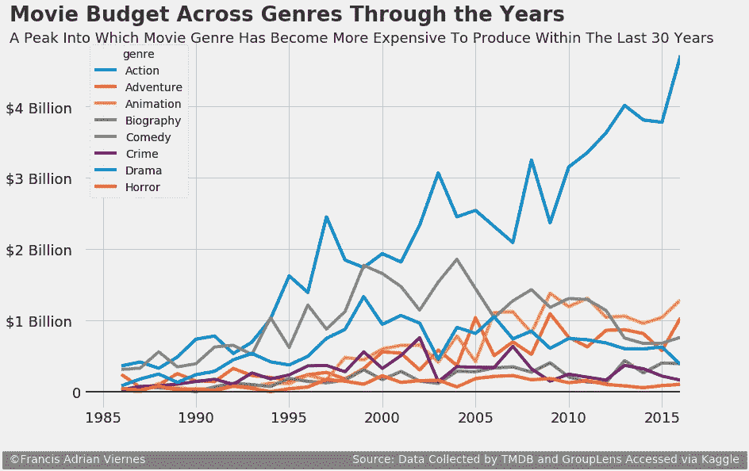

作者图片

看起来没问题。所以还是留着吧。

## 第九步——选择合适的配色方案

从技术上来说，这可以在更早的步骤中完成，并且不会改变我们已经完成的任何调整。

借用我们正在关注的[基础文章](https://www.dataquest.io/blog/making-538-plots/)的观点，并从这个[来源](https://www.nature.com/articles/nmeth.1618#ref1)中，选择适合色盲读者的颜色不仅提高了可访问性，而且也是一个良好的图形设计实践。RGB 的代码已经由我们的原始文章源准备好了，幸运的是，它与我们上面的类型有相同的编号。

```
# Colorblind-friendly colors
colors = [[0,0,0], [230/255,159/255,0], [86/255,180/255,233/255], [0,158/255,115/255],
          [240/255,228/255,66/255], [0,114/255,178/255], [213/255,94/255,0], [204/255,121/255,167/255]]fte_graph = trial.plot(x ='year', 
           y = 'budget', 
           figsize=(12,8), 
           color= colors,
           legend= False) #instead of choosing a colormap, we handpick our colorsfte_graph.tick_params(axis = 'both', which = 'major', labelsize = 18)
fte_graph.set_yticklabels(labels = [-1000000000, 0,  '$1 Billion  ', '$2 Billion  ', '$3 Billion  ', '$4 Billion  ']);
fte_graph.axhline(y = 0, color = 'black', linewidth = 2, alpha = .7)
fte_graph.set_xlim(left = 1984, right = 2016)
fte_graph.xaxis.label.set_visible(False)#Signature Bar
fte_graph.text(x = 1979.8, y = -1000000000,
    s = ' ©Francis Adrian Viernes                                                          Source: Data Collected by TMDB and GroupLens Accessed via Kaggle ',
               fontsize = 14, color = '#f0f0f0', backgroundcolor = 'grey');#Title and Subtitle Placement
fte_graph.text(x = 1980, y = 5200000000, s = "Movie Budget Across Genres Through the Years",
               fontsize = 26, weight = 'bold', alpha = .75);
fte_graph.text(x = 1980, y = 4900000000,
               s = 'A Peak Into Which Movie Genre Has Become More Expensive To Produce Within The Last 30 Years',
              fontsize = 18, alpha = .85);
```

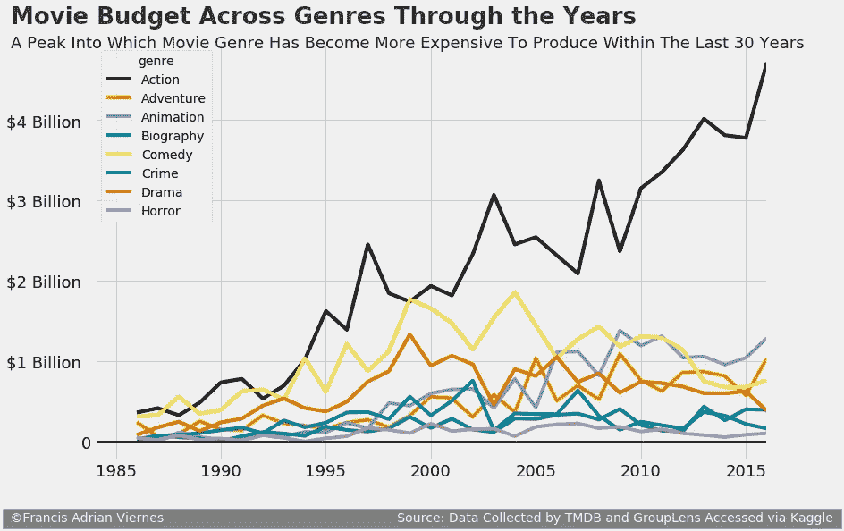

作者图片

## 步骤 10-用内嵌标签替换图例

与签名栏、标题和副标题一样，这一部分包括文本位置的反复试验。

现在，在图表中放置简单标识线条或条形的文本，而不是图例，是一种常见且被接受的节省空间的方式。

首先，让我们通过将图例合并到主代码中来删除它。

```
fte_graph = trial.plot(x ='year', 
           y = 'budget', 
           figsize=(12,8), 
           color= colors,
           legend= False) #instead of choosing a colormap, we handpick our colorsfte_graph = trial.plot(x ='year', 
           y = 'budget', 
           figsize=(12,8), 
           color= colors,
           legend= False) #instead of choosing a colormap, we handpick our colorsfte_graph.tick_params(axis = 'both', which = 'major', labelsize = 18)
fte_graph.set_yticklabels(labels = [-1000000000, 0,  '$1 Billion  ', '$2 Billion  ', '$3 Billion  ', '$4 Billion  ']);
fte_graph.axhline(y = 0, color = 'black', linewidth = 2, alpha = .7)
fte_graph.set_xlim(left = 1984, right = 2016)
fte_graph.xaxis.label.set_visible(False)#Signature Bar
fte_graph.text(x = 1979.8, y = -1000000000,
    s = ' ©Francis Adrian Viernes                                                          Source: Data Collected by TMDB and GroupLens Accessed via Kaggle ',
               fontsize = 14, color = '#f0f0f0', backgroundcolor = 'grey');#Title and Subtitle Placement
fte_graph.text(x = 1980, y = 5200000000, s = "Movie Budget Across Genres Through the Years",
               fontsize = 26, weight = 'bold', alpha = .75);
fte_graph.text(x = 1980, y = 4900000000,
               s = 'A Peak Into Which Movie Genre Has Become More Expensive To Produce Within The Last 30 Years',
              fontsize = 18, alpha = .85);
```

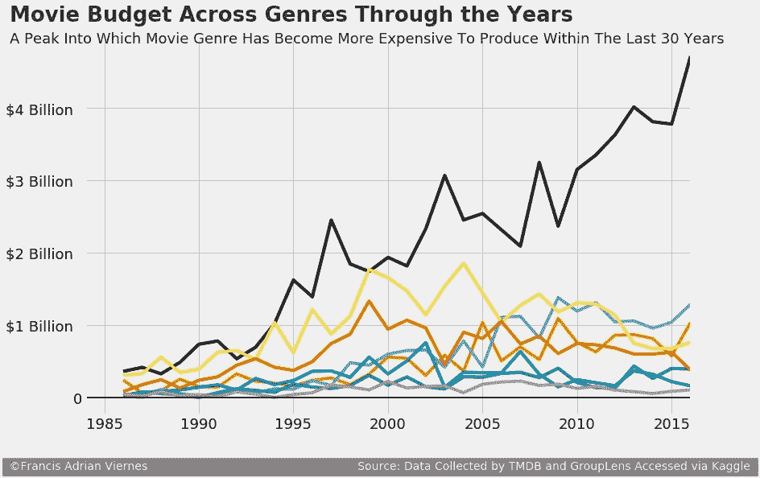

作者图片

最后，我们手动放置文本，这些文本用它们的特定类型来标识这些行。

```
#Colored Labels Indentifying the Line
fte_graph.text(x = 2010, y = 3500000000, s = 'Action', color = colors[0], weight = 'bold',fontsize=16, rotation = 42,
              backgroundcolor = '#f0f0f0');fte_graph.text(x = 2015, y = 600000000, s = 'Adventure', color = colors[1], weight = 'bold',fontsize=16, rotation = 52,
              backgroundcolor = '#f0f0f0');fte_graph.text(x = 2014, y = 1200000000, s = 'Animation', color = colors[2], weight = 'bold',fontsize=16, rotation = 52,
              backgroundcolor = '#f0f0f0');fte_graph.text(x = 2016, y = 500000000, s = 'Biography', color = colors[3], weight = 'bold',fontsize=16, rotation = 52,
              backgroundcolor = '#f0f0f0');fte_graph.text(x = 2004, y = 1400000000, s = 'Comedy', color = colors[4], weight = 'bold',fontsize=16, rotation = -58,
              backgroundcolor = '#f0f0f0');fte_graph.text(x = 2016, y = 100000000, s = 'Crime', color = colors[5], weight = 'bold',fontsize=16, rotation = 52,
              backgroundcolor = '#f0f0f0');fte_graph.text(x = 2002.8, y = 800000000, s = 'Drama', color = colors[6], weight = 'bold',fontsize=16, rotation = 65,
              backgroundcolor = '#f0f0f0');fte_graph.text(x = 2016, y = -200000000, s = 'Horror', color = colors[7], weight = 'bold',fontsize=16, rotation = 52,
              backgroundcolor = '#f0f0f0');
```

可以看出，我们为此使用的另一个参数是用于正确放置标签的“旋转”参数。

在所有这些步骤之后，我们最终得到了下图:


作者图片

以下是完整代码，供您参考:

```
# Colorblind-friendly colors
colors = [[0,0,0], [230/255,159/255,0], [86/255,180/255,233/255], [0,158/255,115/255],
          [240/255,228/255,66/255], [0,114/255,178/255], [213/255,94/255,0], [204/255,121/255,167/255]]fte_graph = trial.plot(x ='year', 
           y = 'budget', 
           figsize=(12,8), 
           color= colors,
           legend= False) #instead of choosing a colormap, we handpick our colorsfte_graph.tick_params(axis = 'both', which = 'major', labelsize = 18)
fte_graph.set_yticklabels(labels = [-1000000000, 0,  '$1 Billion  ', '$2 Billion  ', '$3 Billion  ', '$4 Billion  ']);
fte_graph.axhline(y = 0, color = 'black', linewidth = 2, alpha = .7)
fte_graph.set_xlim(left = 1984, right = 2016)
fte_graph.xaxis.label.set_visible(False)#Signature Bar
fte_graph.text(x = 1979.8, y = -1000000000,
    s = ' ©Francis Adrian Viernes                                                          Source: Data Collected by TMDB and GroupLens Accessed via Kaggle ',
               fontsize = 14, color = '#f0f0f0', backgroundcolor = 'grey');#Title and Subtitle Placement
fte_graph.text(x = 1980, y = 5200000000, s = "Movie Budget Across Genres Through the Years",
               fontsize = 26, weight = 'bold', alpha = .75);
fte_graph.text(x = 1980, y = 4900000000,
               s = 'A Peak Into Which Movie Genre Has Become More Expensive To Produce Within The Last 30 Years',
              fontsize = 18, alpha = .85);#Colored Labels Indentifying the Line
fte_graph.text(x = 2010, y = 3500000000, s = 'Action', color = colors[0], weight = 'bold',fontsize=16, rotation = 42,
              backgroundcolor = '#f0f0f0');fte_graph.text(x = 2015, y = 600000000, s = 'Adventure', color = colors[1], weight = 'bold',fontsize=16, rotation = 52,
              backgroundcolor = '#f0f0f0');fte_graph.text(x = 2014, y = 1200000000, s = 'Animation', color = colors[2], weight = 'bold',fontsize=16, rotation = 52,
              backgroundcolor = '#f0f0f0');fte_graph.text(x = 2016, y = 500000000, s = 'Biography', color = colors[3], weight = 'bold',fontsize=16, rotation = 52,
              backgroundcolor = '#f0f0f0');fte_graph.text(x = 2004, y = 1400000000, s = 'Comedy', color = colors[4], weight = 'bold',fontsize=16, rotation = -58,
              backgroundcolor = '#f0f0f0');fte_graph.text(x = 2016, y = 100000000, s = 'Crime', color = colors[5], weight = 'bold',fontsize=16, rotation = 52,
              backgroundcolor = '#f0f0f0');fte_graph.text(x = 2002.8, y = 800000000, s = 'Drama', color = colors[6], weight = 'bold',fontsize=16, rotation = 65,
              backgroundcolor = '#f0f0f0');fte_graph.text(x = 2016, y = -200000000, s = 'Horror', color = colors[7], weight = 'bold',fontsize=16, rotation = 52,
              backgroundcolor = '#f0f0f0');
```

# 结束语

制作一个专业外观的图表，虽然需要在代码方面做一些努力，但最终会吸引我们的观众。

按照上面的步骤，以最小化我们的工作为最终目标，我们应该处理微小的调整和元素，这些调整和元素不太可能随着进一步的修改而改变。这指的是我们的什么:

*   背景或风格
*   刻度线
*   配色方案和
*   其他微小的调整，如在某些数据点上加一条粗水平线。

文本元素需要一点精确性和与对齐的协调性，理想情况下应该在最后完成。

最后，不要害怕混淆一些元素，尝试使用其他图表和数据集。你甚至可以发挥创意，在这里插入图片。

让我知道你的想法。我的 [Github 页面](https://github.com/francisadrianviernes/Visualization/blob/master/Data%20Visualization%20Hack%20-%20Learning%20from%20FiveThirty%20Eight%20Graphs.ipynb)上的全部代码。

# 参考

[制作 538 剧情](https://www.dataquest.io/blog/making-538-plots/)

[色盲友好的配色方案](https://www.nature.com/articles/nmeth.1618#ref1)