# 数据可视化:如何选择正确的图表[第 2 部分]

> 原文：<https://towardsdatascience.com/data-visualization-how-to-choose-the-right-chart-part-2-fb32ed14c7be?source=collection_archive---------11----------------------->

## 为您希望受众完成的任务选择正确的图形或图表样式。


摩根·豪斯尔在 [Unsplash](https://unsplash.com?utm_source=medium&utm_medium=referral) 上的照片

*这是关于数据可视化的两部分系列文章的第二部分。如果你还没有读过这个系列的第一部分 *，我推荐你去看看！**

在本系列的第 1 部分中，我们介绍了前三个数据可视化功能:关系、随时间变化的数据和排名图。如果你需要快速复习:

*   **关系**:我们使用关系方法来显示两个或多个变量之间的联系或相关性。我们经常使用散点图或热图来显示关系方法。
*   **一段时间内的数据**:这种可视化方法显示一段时间内的数据，以发现一段时间内的趋势或变化。折线图或面积图通常用于表示连续时间跨度内的数据。
*   **排名**:可视化方式显示数据值的相对顺序。条形图通常用于呈现数据点或比较不同数据子组的指标值。

对于第二部分，我们将讨论最后两个数据可视化功能:分布和比较。

## 分布图

15.直方图
16。带直方图的密度曲线
17。密度图
18。箱线图
19。带状图
20。小提琴情节
21。人口金字塔

## 比较图

22.气泡图
23。项目符号图
24。饼状图
25。网饼状图
26。圆环图
27。树形图。叉杆
29。Choropleth 地图
30。气泡图

免责声明:我根据数据可视化的目的对图表进行了分组，但它并不完美。例如，散点图和气泡图对于快速识别数值变量之间的关系非常有用。然而，与散点图不同，气泡图上的每个点都被分配了一个标签或类别。气泡图对于数据点之间的比较也很有用。此外，时间可以通过将它作为一个轴上的变量来显示，也可以通过动画显示数据变量随时间的变化来显示。因此，气泡图对于关系、一段时间内的数据和比较非常有用。出于这些原因，我认为这是根据分析目的或交流需要选择图表的指南。

# 分配

分布图用于显示变量如何随时间分布，有助于识别异常值和趋势。

当评估一个分布时，我们希望找出模式的存在(或不存在)及其随时间的演变。

# 15.柱状图

直方图是描述一组数据分布的垂直条形图。直方图中的每个条代表每个间隔/区间的列表频率。

N 注:

*   直方图绘制定量数据，将数据范围分组为箱或区间，而条形图绘制分类数据。
*   条形图在列之间有间距，而直方图没有。

直方图显示了变量的分布，绘制了定量数据，并确定了在一个值的范围内发生的频率。换句话说，直方图有助于估计值集中在哪里，极值是什么，以及是否有任何差距或异常值。它们对于给出概率分布的粗略视图也是有用的。

如果我们只考虑一个变量，最好的可视化方法是直方图。因为直方图允许我们将连续数据分组到箱中，所以它提供了观察集中位置的良好表示。如果考虑两个变量，我们使用之前描述的散点图。

**Python 实现**

在这里，我们要呈现幸福分数的分布。

```
plt.hist(happy['Score'], edgecolor = 'black')
```

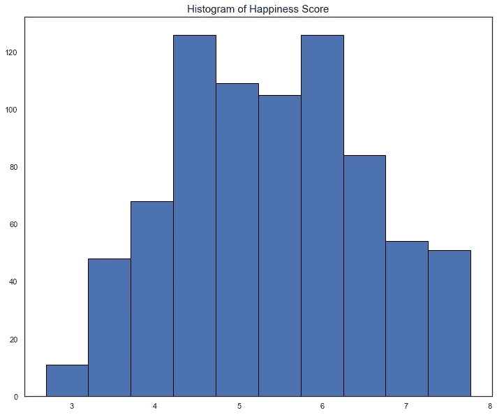

作者图片

# 16.带直方图的密度曲线

直方图也可用于将数据分布与理论模型(如正态分布)进行比较。这需要使用垂直轴的密度标度。

```
sns.distplot(happy['Score'], hist=True, kde=True, 
             hist_kws={'edgecolor':'black'},
             kde_kws={'linewidth': 4})
```

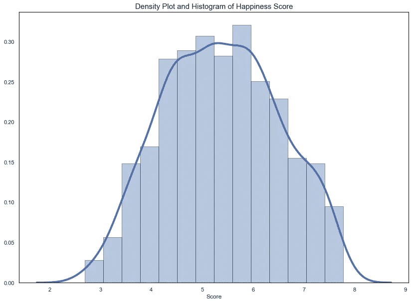

作者图片

# 17.密度图

密度图(也称为核密度图或密度轨迹图)用于观察变量在数据集中的分布。

此图表是直方图的平滑版本，用于相同的概念。它使用核密度估计来显示变量的概率密度函数，通过消除噪声来实现更平滑的分布。因此，这些图在各个条块之间是平滑的，并且不受所创建的条块数量的影响，从而创建了更明确的分布形状。密度图的峰值有助于显示值在间隔内的集中位置。([详见](https://chemicalstatistician.wordpress.com/2013/06/09/exploratory-data-analysis-kernel-density-estimation-in-r-on-ozone-pollution-data-in-new-york-and-ozonopolis/))

密度图优于直方图的一个优点是，它们更善于确定分布形状，因为它们不受所用条柱数量的影响(典型直方图中使用的每个条柱)。

密度图用于研究一个或几个变量的分布。一旦得到一个新的数据集，逐个检查变量的分布可能是我们应该做的第一件事。它传递了大量的信息。存在几种分布形状；下面是六个最常见的例子。

## Python 实现

这里，我们希望以升(`displ`)为单位可视化发动机排量的概率密度

我们使用`kdeplot`函数来可视化连续变量的概率密度。它描述了连续变量中不同值的概率密度。我们可以为多个样本绘制一个图表，这有助于更有效的数据可视化。

```
# simple density plot
sns.kdeplot(car['displ'], shade=True)
```

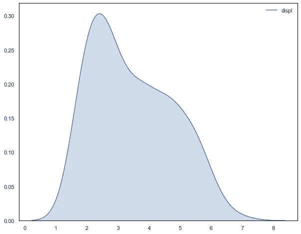

作者图片

密度图还允许我们比较一些变量的分布。然而，我们不应该比较超过三个或四个，因为这将使数字混乱和不可读。

`cty`城市驾驶每加仑英里数创纪录。这里，我们想对两个类进行比较:`compact`和`suv`

```
for class_ in ['compact', 'suv', 'midsize']:
    # extract the data
    x = car[car['class'] == class_]['cty']
    # plot the data using seaborn
    sns.kdeplot(x, shade=True, label = '{} '.format(class_))
```

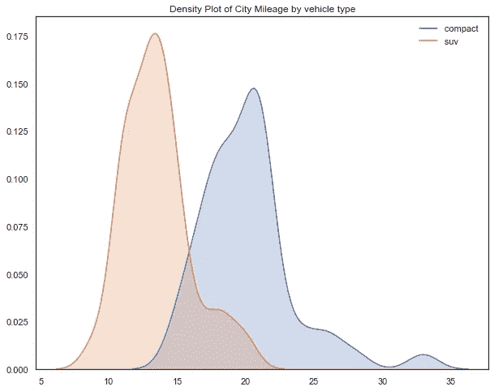

作者图片

# 18.箱形图

箱形图或须状图总结了一组在区间尺度上测量的数据。这种类型的图形显示了分布的形状、中心值及其可变性。

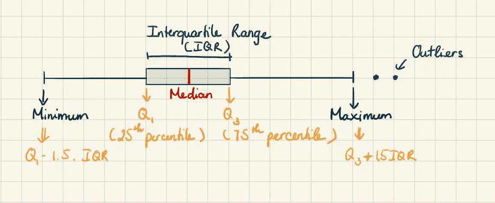

作者图片

箱线图显示数据是基于五个数字的统计摘要分布的。小“方框”表示大部分信息都在一个一致的范围内，而大方框则显示数据分布更广。

*   将方框分成两部分的线代表数据的[中值](https://en.wikipedia.org/wiki/Median)。例如，中值等于 5，意味着低于和高于 5 的数据点数量相同。
*   方框的两端显示了上(Q3)和下(Q1) [四分位数](https://en.wikipedia.org/wiki/Quartile)。如果第三个四分位数等于 10，75%的观察值低于 10。
*   Q1 和 Q3 之间的差异被称为[四分位数间距](https://en.wikipedia.org/wiki/Interquartile_range) (IQR)
*   极端线显示 Q3+1.5 iqr 到 Q1–1.5 iqr(排除异常值的最高和最低值)。
*   超出极限线的点(或其他标记)表示潜在的异常值。

我们在描述性数据分析中使用箱线图，表明分布是否偏斜以及数据集中潜在的异常观察值(异常值)。

当涉及到大量的观察数据和比较两个或多个数据集时，箱线图也非常有用。

箱线图的一个缺点是它们强调分布的尾部，这是最不具体的数据集点。他们还隐藏了发行的许多细节。

## Python 实现

这里，我们要呈现车辆类别的分布。

```
plot1 = ax.boxplot(vects,
    notch=False, vert=True,
    meanline=True,showmeans=True,
    patch_artist=True)
```

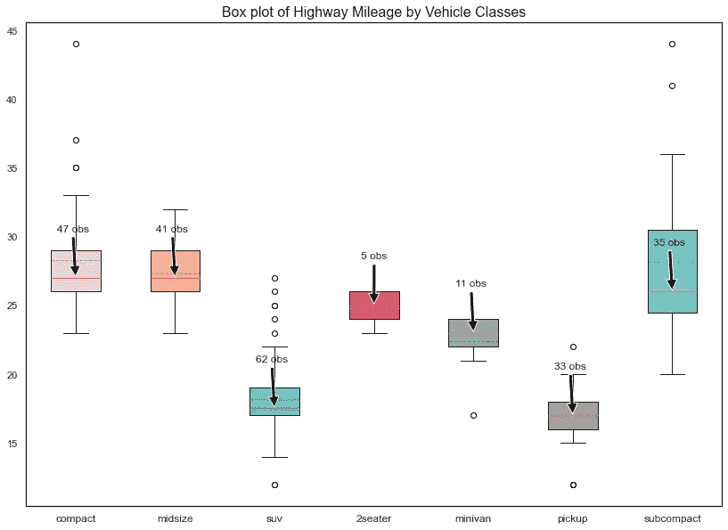

作者图片

# 19.带状图

带状图是散点图，其中一个变量是分类的。带状图是直方图或密度图的替代物。它通常用于小型数据集(直方图和密度图通常适用于大型数据集)。

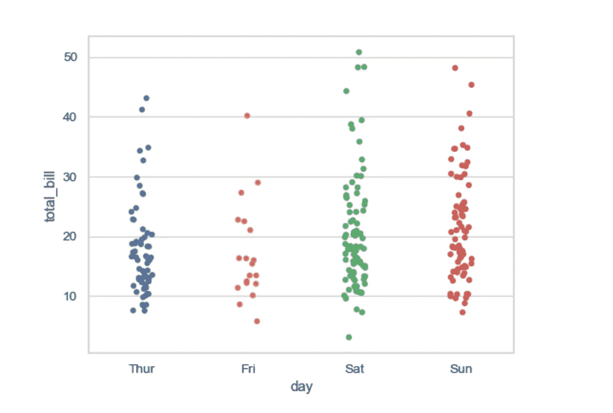

来源: [Seaborn](https://seaborn.pydata.org/generated/seaborn.stripplot.html)

带状图可以单独绘制。不过，在我们希望显示所有观察结果以及一些基本分布的情况下，它也是对盒图或小提琴图的一个很好的补充。

## Python 实现

箱线图是研究分布的一个极好的方法。然而，某些类型的分布可以隐藏在同一个盒子下。因此，并排绘制带状图和箱线图有助于显示箱线图上的每个观察结果，确保不会错过任何有趣的模式。

`jitter=True`有助于展开重叠的点，这样所有点就不会落在物种上方的单一垂直线中

```
ax = sns.boxplot(car['class'], car['hwy'],boxprops=dict(alpha=0.75))
ax = sns.stripplot(car['class'], car['hwy'], jitter=True, edgecolor="gray")
```

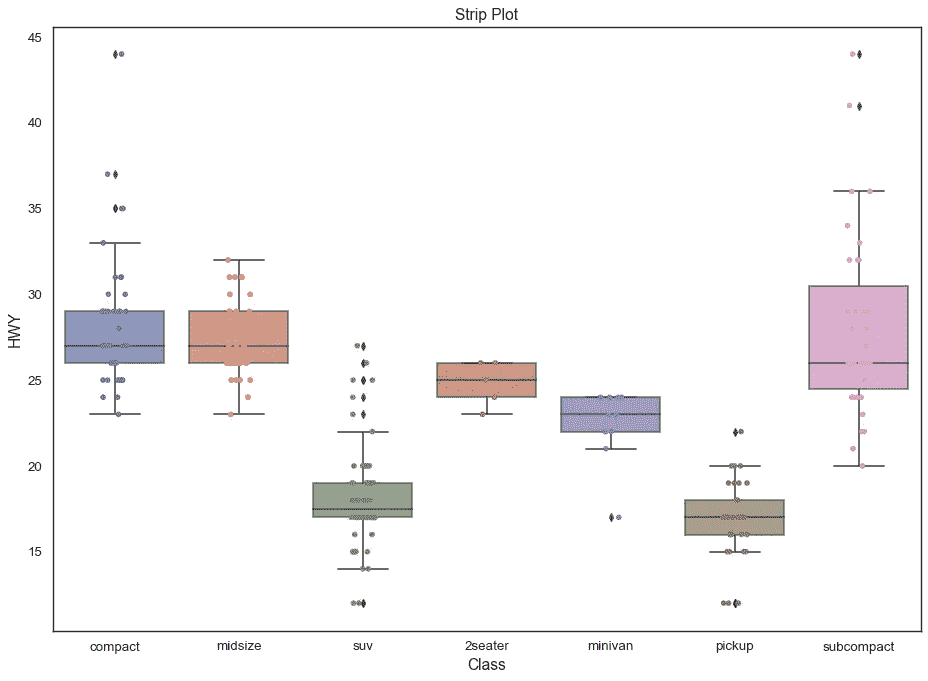

作者图片

# 20.小提琴情节

有时中值和平均值不足以理解数据集。这就是小提琴情节的由来。小提琴图是一个混合的方块图和密度图旋转，并放置在每一边。它用于可视化数据的分布及其[概率密度](https://en.wikipedia.org/wiki/Probability_density_function)。

小提琴图的“小提琴”形状来自数据的密度图。我们将密度图转向一边，放在箱型图的两边，相互镜像。小提琴的每一面都是一个密度估计，以显示数据的分布形状。阅读小提琴形状正是我们阅读密度图的方式:小提琴图的截面越宽，代表人口成员接受给定值的概率越高；越细的部分表示概率越低。

箱形图在很多统计学课程中都有很好的解释，而小提琴图很少被提及。小提琴情节的一个缺点是它不为许多读者所熟悉，我们在使用小提琴情节时应该考虑谁是我们的目标读者。

## Python 实现

这里，我们想要比较不同车辆类别的公路行驶每加仑英里数的分布。

```
sns.violinplot(car['class'], car['hwy'],
               scale='width', inner='quartile')
```

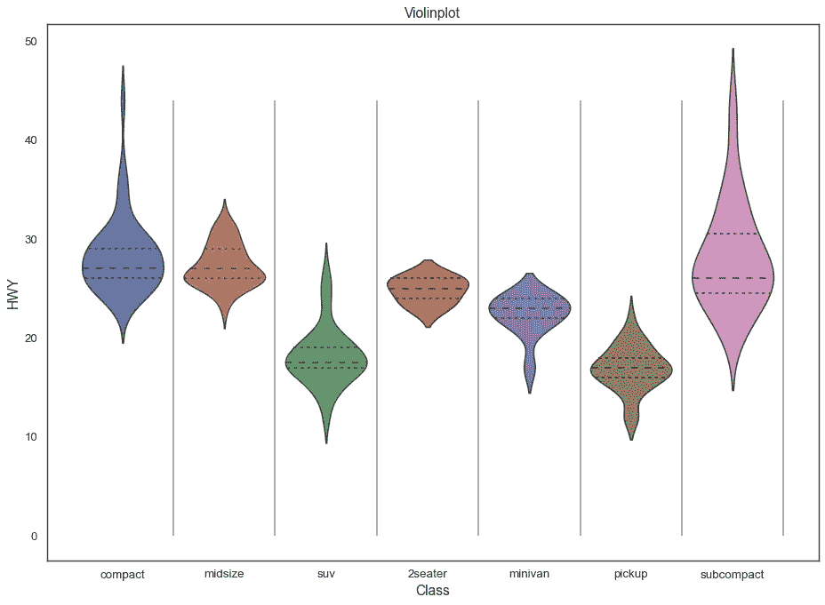

作者图片

# 21.人口金字塔

人口金字塔是检测人口模式变化或差异的理想工具。当观察按年龄和性别划分的群体时，人口金字塔是可视化人口构成的重要图表。

这是一对背靠背的直方图(针对每种性别)，显示了所有年龄组和两性的人口分布。x 轴用于绘制人口数量，y 轴列出所有年龄组。人口金字塔的形状可以用来解释人口。例如，一个底部宽阔顶部狭窄的金字塔暗示着一个高生育率和高死亡率的社区。顶部较宽、底部较窄的金字塔表明人口老龄化，生育率较低。

人口金字塔也可以用来推测人口的未来发展。这使得人口金字塔可用于生态学、社会学和经济学等领域。

## Python 实现

假设我们想要显示给定人口的年龄-性别分布。这是人口中居民的形象描述。左侧/右侧显示性别，y 轴显示年龄，x 轴显示人数。

```
ax[0].barh(range(0, len(df)), df['Male'], align='center', color='#4c85ff')
ax[0].set(title='Males')
ax[1].barh(range(0, len(df)), df['Female'], align='center', color='#ff68b3')
ax[1].set(title='Females')
```

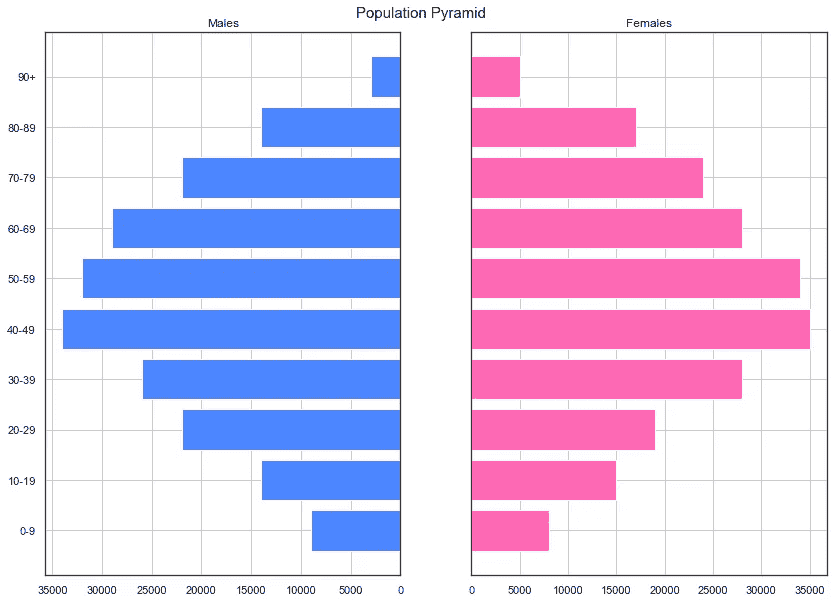

作者图片

# 比较

在分析我们的数据时，我们可能会对比较数据集感兴趣，以了解数据点或时间段之间的差异或相似之处。我将最常用于比较一个或多个数据集的图表进行了分组。

比较问题询问数据中不同的值或属性如何相互比较。

N 注:

*   条形图可以列在比较组下，因为我们可以使用水平条形图来比较同一时间段内的不同组。
*   表格有助于您相互比较精确的值。柱形图和条形图展示不同类别之间的比较，而折线图擅长显示一段时间内的趋势。

# 22.泡泡图

气泡图在二维图中显示多个气泡(圆圈)。它是散点图的推广，用气泡代替了点。

像散点图一样，气泡图使用笛卡尔坐标系沿网格绘制点，其中 x 轴和 y 轴是独立的变量。但是，与散点图不同，每个点都被分配了一个标签或类别(显示在图例旁边或图例上)。然后，每个标绘点通过其气泡面积代表第三个变量。我们可以用颜色来区分类别或用来描述一个附加的数据变量。时间可以通过将它作为一个轴上的变量来显示，也可以通过动画显示随时间变化的数据变量来显示。

我们可以使用气泡图来描述和显示数字变量之间的关系。然而，标记大小作为一个维度允许在三个变量之间进行比较，而不仅仅是两个变量。在单个气泡图中，我们可以进行三种不同的成对比较(X 与 Y、Y 与 Z、X 与 Z)和整体三向比较。需要多个双变量散点图才能获得相同数量的洞察；即便如此，推断数据点之间的三向关系也不会像在气泡图中那样直接。

过多的气泡会使图表难以阅读，因此气泡图的数据容量有限。这在某种程度上可以通过交互性来弥补:点击或悬停在气泡上以显示隐藏的信息，可以选择重新组织或过滤分组的类别。

```
px.scatter(happy, x="GDP", y="Score", animation_frame="Year",
           animation_group="Country",
           size="Rank", color="Country", hover_name="Country",
           trendline= "ols")
```

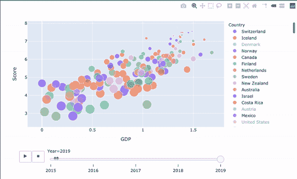

作者图片

# 23.项目符号图

项目符号图通常用于显示性能数据；它们类似于条形图，但伴随着额外的视觉元素，以包装在更多的背景下。最初，子弹图是由 Stephen first 开发的，作为仪表盘仪表的替代品。这是因为它们通常显示的信息不足，空间利用率低，并且堆满了“图表垃圾”

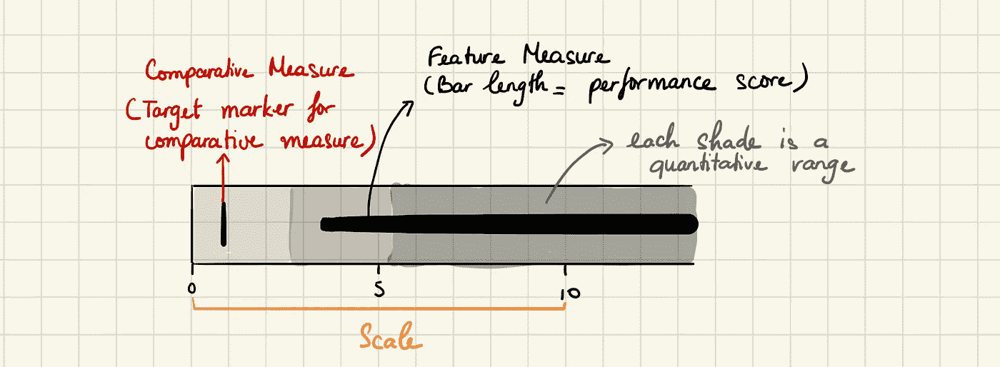

作者图片

主条的长度编码了图表中间的主要数据值，称为*特征度量。*垂直于图形方向的线条标记被称为 c *比较度量*，并被用作与特征度量值进行比较的目标标记。因此，如果主棒已经通过了相对小节位置，我们知道我们达到了目标。

特征测量后面的分段彩色条显示定性范围分数。每种色调(上例中的三种灰色)指定一个绩效范围等级，例如低、中、优秀。使用项目符号图时，我们通常将最大范围数保持在五个。

```
fig = ff.create_bullet(
    data, titles='label', subtitles='sublabel', markers='point',
    measures='performance', ranges='range', orientation='h',
    measure_colors=['#1e747c', '#7ac7bf'],
    range_colors=['#F5E1DA', '#F1F1F1']
   )
```

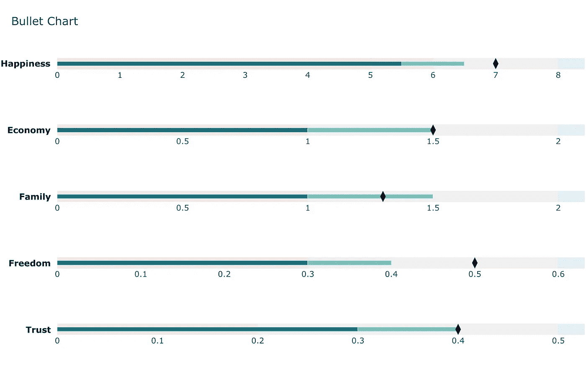

作者图片

# 24.圆形分格统计图表

饼图是显示群体构成的经典方式。饼图是一个分成若干部分的圆形图。切片越大，它所代表的总量就越重要。

但是，通常不建议使用，因为饼图部分的面积有时会产生误导。因此，在使用饼图时，强烈建议明确写下每个饼图部分的百分比或数字。

饼图最适合描绘整体的各个部分:数据的比例分布。然而，饼图的显著缺点是:

*   不适合大量数据:随着显示的值的数量增加，每个段/切片的大小变得更小，更难读取。
*   不太适合在饼图组之间进行精确的比较。
*   无法显示一段时间内的比例分布。

## Python 实现

假设我们想展示一个特定客户的消费习惯。

```
labels = 'Food', 'Housing', 'Saving', 'Gas', 'Insurance', 'Car'
spend = [800, 2000, 500, 200, 300, 250]
p = plt.pie(spend, # Value
            labels=labels, # Labels for each sections
            explode=(0.07, 0, 0, 0, 0, 0), # To slice the perticuler section
            colors=colors, # Color of each section
            autopct='%1.1f%%', # Show data in persentage for with 1 decimal point
            startangle=130, # Start angle of first section
            shadow=True # Showing shadow of pie chart
           )
```

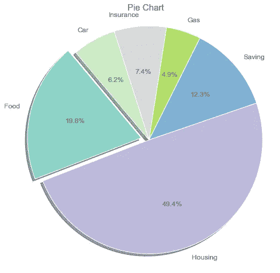

作者图片

# 25.网状饼图

嵌套饼图更进一步，将每个饼图的外层分成更小的组。在内圈中，我们将每个数字视为属于它的组。在外面的圆圈中，我们将他们标为其原始群体的成员。

## Python 实现

我们首先生成一个要处理的数据帧。在内圈中，我们将每个数字视为属于它的组。在外面的圆圈中，我们将他们标为其原始群体的成员。

甜甜圈形状的效果是通过`wedgeprops`参数设置饼图的楔形宽度来实现的。例如，我们可以传入`wedgeprops = dict(linewidth=5)`来设置楔形边框线的宽度等于 0.5

```
# get the data
size = 0.3
labels = 'Food', 'Housing', 'Saving', 'Gas', 'Insurance', 'Car'
spend = [800, 2000, 500, 200, 300, 250]
vals = np.array([[300., 500.], [1800., 200.], [500., 0.],[200., 0.], [150., 150.],[150., 50]])
in_labels = 'At Home','Out', 'Rent','Utilities','Saving','', 'Gas','','Car','Health','Tires','Mai# outer level
ax.pie(vals.sum(axis=1), # plot the total [60., 32.] = 92
       radius=1, # Radius to increase or decrease the size of pie chart 
       labels=labels, # Labels for each sections
       colors=outer_colors, # Color of each section
       wedgeprops=dict(linewidth=5,width=size, edgecolor='w') # Add edges to each portion/slice of the pie
      )# inner level
patches, texts = ax.pie(vals.flatten(), # using flatten we plot 60, 32 separetly
       radius=1-size,
       labels=in_labels,
       labeldistance=0.8,
       colors=inner_colors,
       wedgeprops=dict(linewidth=3,width=size, edgecolor='w'))
```

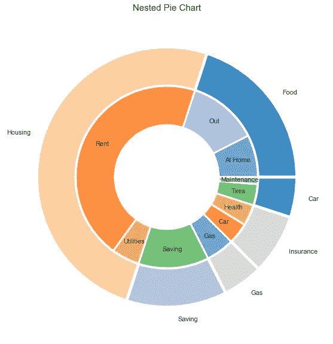

作者图片

# 26.圆环图

圆环图本质上是一个中心区域被切掉的饼图，看起来像一个圆环。由于环形图被掏空，没有中心点来吸引你的注意力。你的眼睛转到哪里去了？

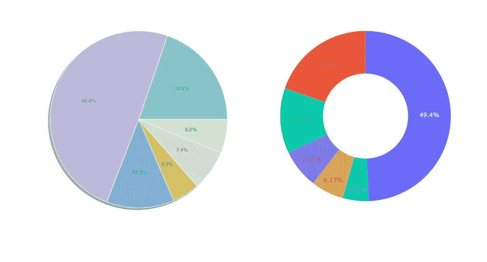

作者图片

如果我们像大多数人一样，我们的眼睛在圆周上游走，根据长度来判断每一块。因此，我们也可以把环形图想象成一个自身卷曲的堆叠条形图。

饼图和圆环图通常用于可视化选举和人口普查结果、按产品或部门划分的收入、回收数据、调查回复、预算细目、教育统计、支出计划或人口细分。

正如我们上面所讨论的，饼状图的一个缺点是它对于在饼状图组之间进行精确的比较是没有用的。由于读者关注的是切片之间的比例面积以及整个图表，因此很难看出切片之间的差异，尤其是在一起比较多个饼图时。

圆环图解决了这个问题，因为读者往往更关注于阅读弧线的长度，而不是比较切片之间的比例。

## Python 实现

```
trace = go.Pie(labels=labels,
               values=spend,
               marker=dict(colors=colors),
               hole=0.3)
```

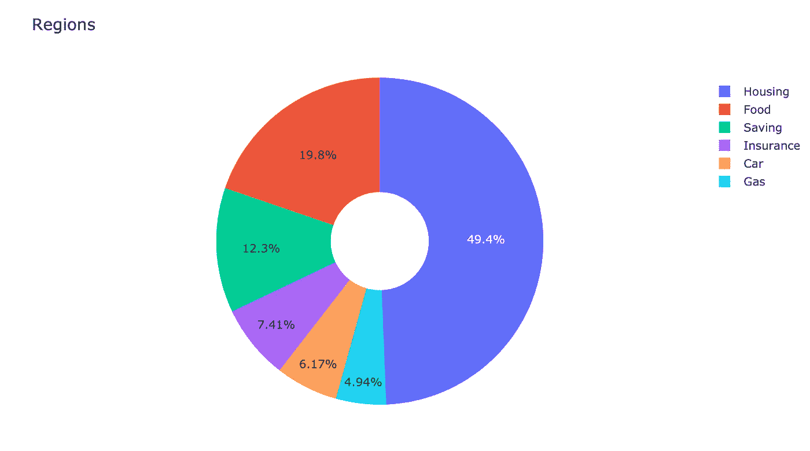

作者图片

# 27.树形图

树状图类似于饼状图，它在不误导每个小组的贡献的情况下工作得更好。树形图允许我们将整体分成层次，然后显示每个层次的内部分解。在最简单的情况下，它们以适合其值的大小显示形状，因此较大的矩形代表较高的值。

我们经常使用销售数据的树形图。它们捕获数据类别的相对大小，允许对一个类别内和多个类别之间的相似性和异常性进行快速、高层次的总结。

当我们的数据不能分成类别和子类别时，树形图就不适合了。

此外，当我们用颜色的面积和强度对数据进行编码时，我们的眼睛并不能很好地察觉这些维度中相对较小的差异。如果我们的数据是这样的，我们的受众需要在类别之间进行精确的比较，当类别没有与公共基线对齐时，就更加麻烦了。我们不应该让我们的观众做不必要的工作来理解一个图表！

## Python 实现

Python 允许我们快速创建这些图表，因为它会计算每个矩形的大小，并以合适的方式绘制。我们还可以将我们的 treemap 与 Matplotlib 库针对变量缩放颜色的能力结合起来，用 Python 制作出好看且易于理解的图。

这里，我们想显示每种类型汽车的价值。

确保你安装了`squarify`！

```
import squarify# plot the data using squarify
squarify.plot(sizes=label_value.values(), label=labels, color=colors, alpha=0.6)
```

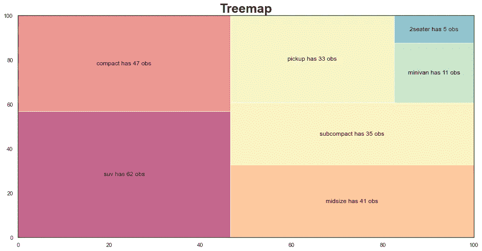

作者图片

# 28.发散图

发散条形图是一种条形图，其中某些维成员的标记指向上或右，而其他维成员的标记指向相反的方向(分别为下或左)。

注意:

*   向下或向左流动的标记不一定代表负值。
*   发散线可以表示零，但也可以分隔二维成员的标记。

我们使用分叉棒线来查看项目如何基于单个指标变化，并直观显示这种变化的顺序和数量。如果我们的主要目标是比较每个维度成员的趋势，发散条形图是一个不错的选择。

使用发散条形图的缺点是不容易使用分组条形图比较维成员的值。

## Python 实现

```
# plot using horizontal lines and make it look like a column by changing the linewidth
ax.hlines(y=health.index, xmin=0 , xmax=health['x_plot'],  color=colors, linewidth=5)
```

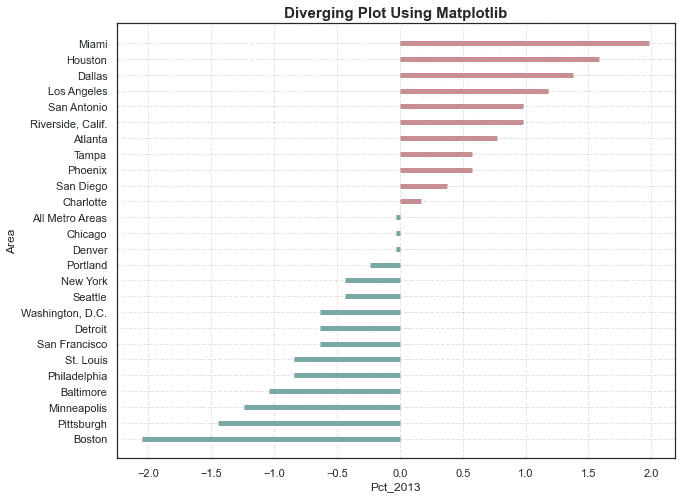

作者图片

# 29.等值区域图

[地图](https://en.wikipedia.org/wiki/Choropleth_map#:~:text=A%20choropleth%20map%20(from%20Greek,each%20area%2C%20such%20as%20population) 是[专题地图](https://en.wikipedia.org/wiki/Thematic_map)的一种。一组预定义的区域与表示每个区域内地理特征的汇总的统计变量成比例地被着色或形成图案。通常情况下，色标值越大越暗，值越小越亮。

我们使用一个 choropleth 图来可视化一个测量值在一个地理区域内是如何变化的，或者它显示了一个区域内的可变性水平。例如，我们可以使用 choropleth 图来显示各地区失业人口的百分比，颜色越深表示失业人口越多。

注意:

大区域并不意味着有色统计比小区域更重要。较大区域的统计数据可能与该区域的人有关，而不是与该区域本身有关，因此我们应该小心大小会扭曲我们的解释。

## Python 实现

```
world_map_1 = go.Figure(data=[happiness_rank], layout=layout)
```

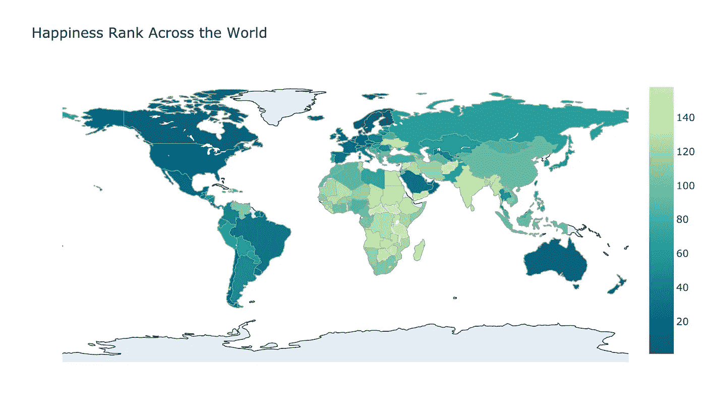

作者图片

# 30.气泡图

气泡图使用不同大小的圆圈来表示区域中的数值。它为每个地理坐标显示一个气泡，或为每个区域显示一个气泡。

我们通常将气泡图用于具有以下特征的数据集:

*   一列地理坐标(经度和纬度)和一个数字变量控制着气泡的大小。
*   具有属性值和已知边界的区域列表。在这种情况下，气泡图将取代通常的 choropleth 图。

注:气泡图可以避免在 choropleth 图中由不同的区域面积引起的偏差。(在观察过程中，大区域往往具有更大的权重)。

## Python 实现

```
fig = px.scatter_geo(
    df_today, # provide the Pandas data frame
    locations='countryCode', # indicate locations
    color='continent',
    hover_name='country', # what to display when the mouse hovering on the bubble
    size='cases', # how large the bubble is
    projection='equirectangular',
    title=f'World COVID-19 Cases for {today}'
)
```

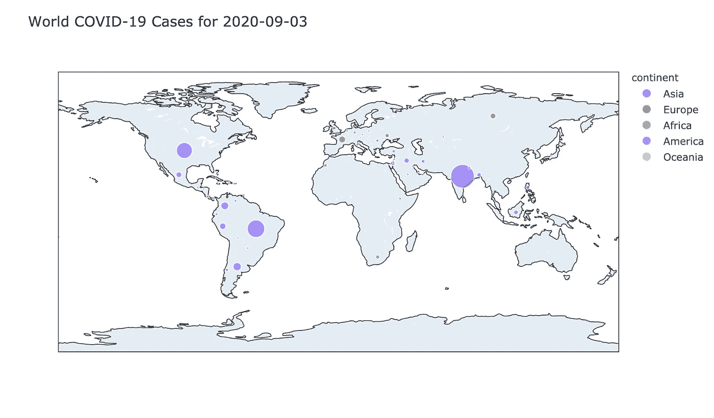

作者图片

我的笔记涵盖了我认为数据可视化所必需的所有内容。数据可视化不会很快消失，所以无论您最终使用什么工具或软件，都必须建立一个可以随身携带的分析、讲故事和探索的基础。掌握一项技能需要几个月，有时几年，所以不要停止学习！如果你想更深入地研究这个特定的主题，这里有一些很好的起点。

1.  [Python 中的直方图和密度图](/histograms-and-density-plots-in-python-f6bda88f5ac0)

2.[Python 中数据可视化的下一个层次](/the-next-level-of-data-visualization-in-python-dd6e99039d5e)

3.[使用 Seaborn / Matplotlib 创建高级 Python 数据可视化的分步指南](/a-step-by-step-guide-for-creating-advanced-python-data-visualizations-with-seaborn-matplotlib-1579d6a1a7d0)

4. [Matplotlib 备忘单](/matplotlib-cheat-sheet-f441c43971c4)