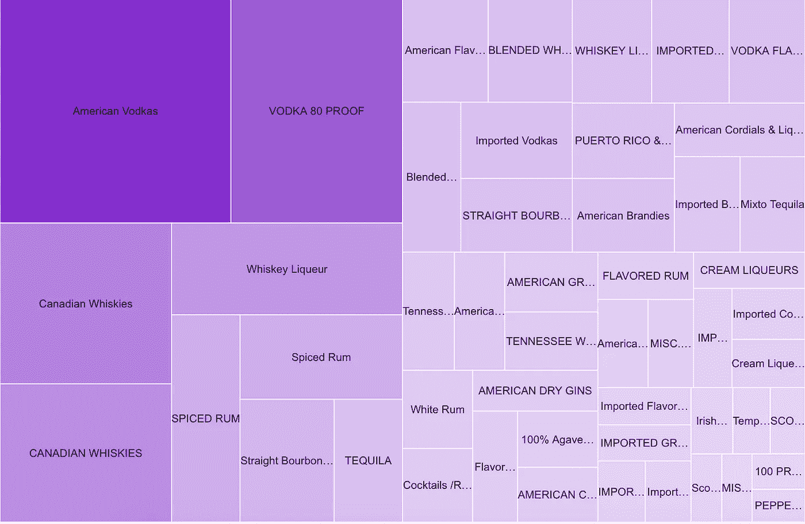
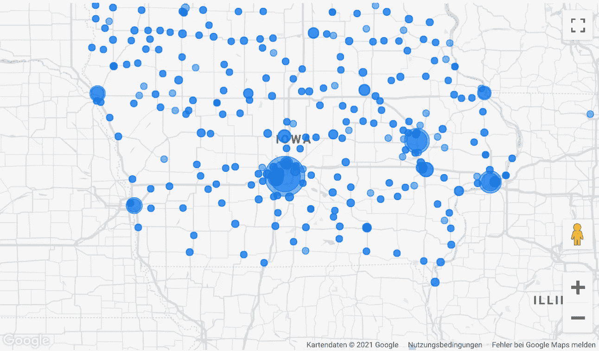
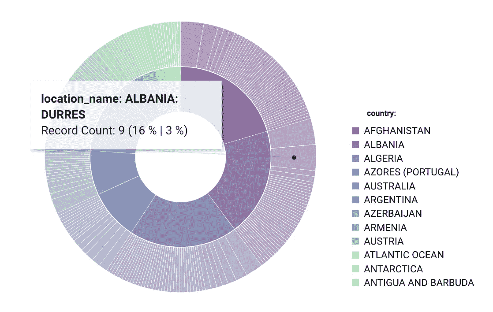

# 大数据中的数据可视化

> 原文：<https://towardsdatascience.com/data-visualization-in-big-data-623357ac4d1a?source=collection_archive---------30----------------------->

## 如何洞察新的可视化技术

尼古拉·马斯洛夫在 [Unsplash](https://unsplash.com/s/photos/redwood?utm_source=unsplash&utm_medium=referral&utm_content=creditCopyText) 上的照片

在大数据世界中，随着数据越来越多地用于重要的管理决策，数据可视化工具和技术对于分析大量信息和做出数据驱动的决策至关重要。因此，有一种趋势是从直觉和情感决定转向基于数字的理性选择。因此，报告和可视化必须易于理解和有意义。

## 大数据的影响

越来越多的专业人士能够利用数据来做出决策，并通过视觉来讲述故事，传达数据如何告知人、主题、时间、地点和方法的问题[1]。在大数据领域，由于数据量巨大，可视化带来了新的方法和挑战。因此，必须创建新的可视化技术，以使数据量对用户来说更加有形。

## 入门工具集

在接下来的大数据领域新的可视化可能性的例子中，我使用了 Google 的 BigQuery 和 Data Studio。对于 BigQuery 的免费层，您可以在这里简单地注册和使用公共数据集[2]，这无疑属于大数据标签。Data Studio 是免费的，是 MS Power BI、Qlik 和其他 BI 工具的一个很好的替代品。由于你可以免费获得整个可扩展的数据仓库技术和 BI 层，我发现 Google 作为你在大数据可视化领域迈出第一步的沙箱非常合适。

## 可视化示例

这里有几个我在表示大数据领域使用和看到最多的可视化示例。

**树形图** 树形图或平铺图用于可视化层次结构，由嵌套的矩形表示。这样，通过选择与要显示的数据单元的尺寸成比例的矩形面积，可以生动地显示尺寸比。

树状图示例—按作者分类的图像

在这里，我可视化了自 2012 年 1 月 1 日起，零售商在爱荷华州批发购买酒类并出售给个人的情况。这个例子再次显示了这种图表是如何完美地显示大小关系的。

说到州，地图是另一种表示大量数据的好方法。在这里，相同的数据以不同的方式可视化，就像地图一样。气泡的大小可以代表售出的瓶子数量，当然也可以是任何其他度量。

作为仪表板的地图-按作者分类的图像

地图的优势在于它们是通用的。人们知道如何阅读地图，因此观众相对容易理解。

规格图可以很好地表示状态，状态有不同的评价，需要用颜色来表示。这个图表是基于一个简单的饼图。仪表图特别适合于测量关键数字、客户满意度或质量测量的目标/实际比较。

仪表图—图片由作者提供

这里，举例来说，一家公司的销售额与整体平均水平的关系如图所示。

旭日图是显示分层数据的理想选择。层次结构的每个级别都由一个环或圆来表示，最里面的圆表示层次结构的顶级。具有多个类别级别的旭日图显示了外环与内环的关系。旭日图特别有助于显示一个环是如何被分成不同的组成部分的，而另一种类型的图，树形图，特别有助于比较相对大小[3]。

旭日东升——作者图片

**其他有用的即**

当然，在大数据领域还可以使用其他常见的图表，例如:

*   热图
*   单词云
*   符号地图
*   系统树图
*   网络模型

## 摘要

大量数据带来了可视化数据的新挑战。因此，需要不同的技术和图表，而不是通常使用的可视化，如表格、条形图等。在最好的情况下，有可能创建一个简单明了的可视化，并且仍然不会让任何信息落到桌面下。在本文中，我展示了一些例子和一个很好的工具集，从 BigQuery 和 Data Studio 开始。无论如何，这些新的基于云的技术是处理如此大量数据的先决条件。

## 资料来源和进一步阅读

[1]Tableau，[手册 zur Datenvisualisierung:定义，beispile und Lernressourcen](https://www.tableau.com/de-de/learn/articles/data-visualization)(2021)

[2]谷歌，[在谷歌云上解决真正的业务挑战](https://cloud.google.com/free?hl=en) (2021)

[3]微软，[Erstellen eines sun burst-diagrams in Office](https://support.microsoft.com/de-de/office/erstellen-eines-sunburst-diagramms-in-office-4a127977-62cd-4c11-b8c7-65b84a358e0c)(2021)