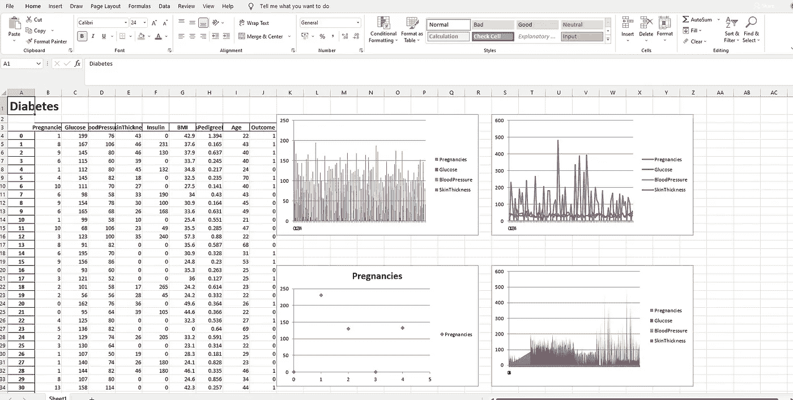

# 使用 Python 在 Excel 中实现数据可视化

> 原文：<https://towardsdatascience.com/data-visualization-in-excel-using-python-94feeacda2fc?source=collection_archive---------3----------------------->

## 使用 ExcelWriter 通过 Python 代码在 Excel 中创建可视化效果



来源:作者

Excel 被广泛用于数据分析，并且具有许多用于分析、操作、可视化等的功能。使用 excel 应该是数据分析师、产品分析师和业务分析师的主要技能之一。它有助于理解数据以及我们如何使用它来生成有用的见解。

Python 也广泛用于数据分析目的，并且克服了 Excel 的缺点。了解一点 Python 知识，我们可以增强我们的数据分析技能，也可以产生更多有用的见解。

将 Excel 和 Python 结合起来会很有成效，并使数据分析变得更有趣。ExcelWriter 用于使用 Python 执行不同的 Excel 操作。它提供了各种各样的功能，如创建 Excel，将数据写入 Excel 表，在 Excel 中创建可视化效果等。

在本文中，我们将探索 ExcelWriter 并使用它创建一些可视化。

让我们开始吧…

# 安装所需的库

Excelwriter 是在 Pandas 中定义的，所以我们不需要单独安装它。

# 导入所需的库

在这一步中，我们将导入使用 Python 读取 Excel 和在 Excel 中创建可视化所需的所有库。

```
import pandas as pd
import numpy as np
```

# 正在加载数据集

在这篇文章中，我们将从网上下载著名的糖尿病数据集。此外，我们将使用 excel writer 创建一个 excel 文件，我们将在其中创建可视化效果。

```
df = pd.DataFrame(pd.read_csv("/content/test.csv"))
writer = pd.ExcelWriter('diabetes.xlsx', engine='xlsxwriter')
df.to_excel(writer, sheet_name='Sheet1', startrow=2)
```

# 在 Excel 中创建可视化

在这一步中，我们将创建不同类型的可视化，将它们写入我们创建的 excel 文件，然后保存可视化。在创建可视化之前，我们还将为作者创建用于进一步操作的对象。

下面给出的代码将创建对象和不同的图形，即条形图、散点图、折线图和面积图。

```
book = writer.book
sheet = writer.sheets['Sheet1']# Title
bold = book.add_format({'bold': True, 'size': 24})
sheet.write('A1', 'Diabetes', bold) format1 = book.add_format({'font_color': '#E93423'})
sheet.conditional_format('B4:E8', {'type': 'cell', 'criteria': '<=', 'value': 0, 'format': format1})# Bar Chart
chart = book.add_chart({'type': 'column'})
chart.add_series({'values': '=Sheet1!B4:B90', 'name': '=Sheet1!B3', 'categories': '=Sheet1!$A$4:$A$8'})
chart.add_series({'values': '=Sheet1!C4:C90', 'name': '=Sheet1!C3'})
chart.add_series({'values': '=Sheet1!D4:D90', 'name': '=Sheet1!D3'})
chart.add_series({'values': '=Sheet1!E4:E90', 'name': '=Sheet1!E3'})
sheet.insert_chart('K2', chart)# Scatter Chart
chart = book.add_chart({'type': 'scatter'})
chart.add_series({'values': '=Sheet1!F4:F90', 'name': '=Sheet1!B3', 'categories': '=Sheet1!$A$4:$A$8'})
sheet.insert_chart('K20', chart)# Line Chart
chart = book.add_chart({'type': 'line'})
chart.add_series({'values': '=Sheet1!F4:F90', 'name': '=Sheet1!B3', 'categories': '=Sheet1!$A$4:$A$8'})
chart.add_series({'values': '=Sheet1!G4:G90', 'name': '=Sheet1!C3'})
chart.add_series({'values': '=Sheet1!H4:H90', 'name': '=Sheet1!D3'})
chart.add_series({'values': '=Sheet1!I4:I90', 'name': '=Sheet1!E3'})
sheet.insert_chart('S2', chart)# Area Chart
chart = book.add_chart({'type': 'area'})
chart.add_series({'values': '=Sheet1!A4:F90', 'name': '=Sheet1!B3', 'categories': '=Sheet1!$A$4:$A$8'})
chart.add_series({'values': '=Sheet1!B4:G90', 'name': '=Sheet1!C3'})
chart.add_series({'values': '=Sheet1!H4:H90', 'name': '=Sheet1!D3'})
chart.add_series({'values': '=Sheet1!I4:I90', 'name': '=Sheet1!E3'})
sheet.insert_chart('S20', chart)writer.save()
```


可视化(来源:作者)

在这里，您可以清楚地看到我们使用 excel writer 创建的不同类型的图表。我们直接在 excel 表格中创建了这些可视化效果，因此您需要打开 Excel 来可视化这些图形。尝试使用不同的数据集，创建不同的可视化效果，并在回复部分告诉我您的意见。

本文是与 [Piyush Ingale](https://medium.com/u/40808d551f5a?source=post_page-----94feeacda2fc--------------------------------) 合作完成的。

# 在你走之前

***感谢*** *的阅读！如果你想与我取得联系，请随时通过 hmix13@gmail.com 联系我或我的* [***LinkedIn 个人资料***](http://www.linkedin.com/in/himanshusharmads) *。可以查看我的*[***Github***](https://github.com/hmix13)**简介针对不同的数据科学项目和包教程。还有，随意探索* [***我的简介***](https://medium.com/@hmix13) *，阅读我写过的与数据科学相关的不同文章。**