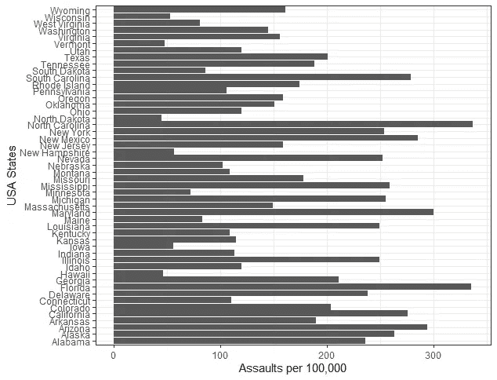
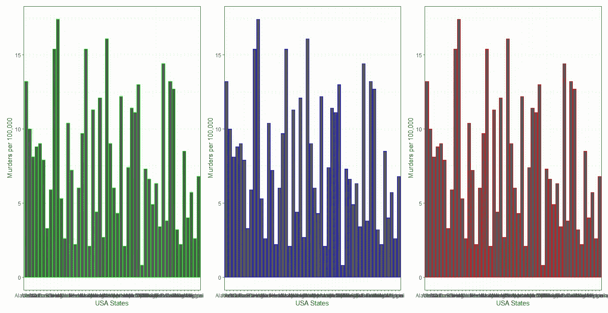
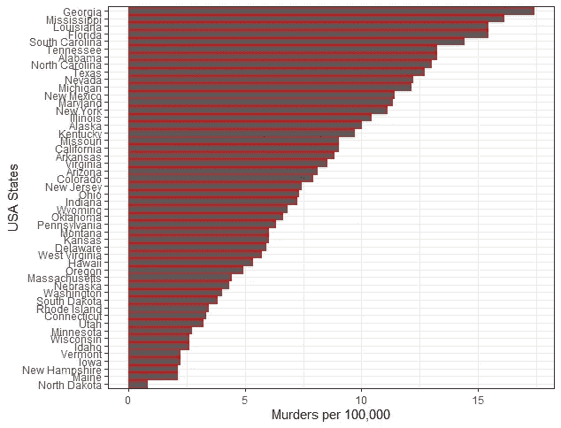

# 使用 ggplot2 的数据可视化:值得了解的 5 个特性

> 原文：<https://towardsdatascience.com/data-visualization-using-ggplot2-5-features-worth-knowing-c0447a760335?source=collection_archive---------30----------------------->

## 使用 ggplot2 包提高 dataviz 效率的技巧


马文·迈耶在 [Unsplash](https://unsplash.com?utm_source=medium&utm_medium=referral) 上的照片

W 无论你是在做你的学校项目、学期论文、硕士论文还是商业报告，如果数据以一种有意义且美观的方式呈现，那么数据的质量会很好地传递给观众。虽然从数据中得出一个有影响力的数字很有挑战性，也很耗时，但是一些小技巧如果实施得当，可以使工作流程更简单，从长远来看可以节省很多时间。

在这篇文章中，我将讨论 5 个我认为有用的技巧或特性，并在使用 ggplot2 包时定期实现。也许你们中的一些人已经知道他们，对一些人来说，这将是新的东西。

给大家一点关于 ggplot2 的背景，它是基于图形的语法开发的，简称 *gg* 。该情节由三个基本部分组成，即:

1.*数据*:由数据帧组成

2.*美学*:定义 x 和 y 变量，并详细说明数据点的颜色、大小和形状

3.*几何图形*:定义图形的类型，如条形图、折线图、散点图、直方图等。

所以，让我们来看看我想与你分享的对我非常有用的 5 个特性/技巧。出于演示的目的，我将使用内置的 R 数据存储库中的 USArrests 数据集。

**提示#1:在给变量分配 ggplot 函数时使用括号**

ggplot2 包中很酷的一点是圆括号的使用。一般来说，当使用 ggplot 函数绘图时，如果我们将它赋给一个变量，那么为了绘图，该变量将在下一行执行。所以，这是一个两步走的过程。通过在赋值时将 ggplot 函数放在括号中，有助于直接绘制图形，而无需再次执行变量。

```
# two step way to plot
plot <- USArrests %>% ggplot(aes(States, Murder)) + 
  geom_bar(stat = "identity")
plot# one step way to plot using parentheses
(plot <- USArrests %>% ggplot(aes(States, Murder)) + 
  geom_bar(stat = "identity"))
```

**提示#2:通过切换数据最小化重复的 ggplot 函数**

在 EDA 阶段，当我尝试绘制不同的变量集来理解它们之间的关系时，这个命令非常有用。比起一次又一次地编写 ggplot 命令，我更喜欢使用 tidyverse 包中的%+%。通过使用%+%我们可以用新数据覆盖当前数据。

```
# lets define a temporary variable
temp <- USArrests[,c(1,3)] %>% rename(Murder = Assault)# switching the current data with the temp variable using %+% operator
plot2 <- plot %+% temp# plotting the new graph
plot2 + ylab("Assaults per 100,000")
```



作者图片

*警告:要使%+%起作用，请确保新数据的列名与被替换的数据集的列名相匹配。*

**小贴士#3:在美学中自由使用色彩**

ggplot2 软件包的美观性允许在颜色/色彩/色彩之间自由选择，以将色彩分配给绘图。所以，不管你用英式英语还是美式英语，都被 ggplot 覆盖了。

```
# plotting the same data using col/color/colour in aesthetics using green/blue/red colors to distinguishplot3 <- USArrests %>% ggplot(aes(States, Murder)) + 
  geom_bar(stat = "identity", col = "green") +
    theme(axis.text.x = element_text(angle = 90, hjust = 1)) +
    ylab("Murders per 100,000") +
    xlab("USA States") +
    #scale_y_discrete(limits=c(0:10)) +
    theme_bw()plot4 <- USArrests %>% ggplot(aes(States, Murder)) + 
    geom_bar(stat = "identity", color = "blue") +
    theme(axis.text.x = element_text(angle = 90, hjust = 1)) +
    ylab("Murders per 100,000") +
    xlab("USA States") +
    #scale_y_discrete(limits=c(0:10)) +
    theme_bw()plot5 <- USArrests %>% ggplot(aes(States, Murder)) + 
    geom_bar(stat = "identity", colour = "red") +
    theme(axis.text.x = element_text(angle = 90, hjust = 1)) +
    ylab("Murders per 100,000") +
    xlab("USA States") +
    #scale_y_discrete(limits=c(0:10)) +
    theme_bw()plot3 + plot4 + plot5 + plot_layout(ncol = 3)
```



作者图片

**提示#4:使用 fct_reorder()** 对数据进行重新排序

为了做出美观的图，一般来说，我们大多数人使用 group_by()、summarize()和 arrange()函数来排列数据。这是一个很长的步骤，可以用 forcats 包中一个名为 fct_order()的函数来代替。

```
plot6 <- USArrests %>% ggplot(aes(x = fct_reorder(States, Murder, .desc = FALSE), y = Murder)) + 
    geom_bar(stat = "identity", colour = "red") +
    theme(axis.text.x = element_text(angle = 90, hjust = 1)) +
    ylab("Murders per 100,000") +
    xlab("USA States") +
    theme_bw() +
    coord_flip()
```



作者图片

**提示 5: ggsave()用于保存地块**

ggsave()函数为希望为出版物、演示或打印保存高分辨率图像的用户提供了灵活性。ggsave 功能具有调整图像大小、定义分辨率和调整图像背景透明与否的功能，并且可以灵活选择不同的文件扩展名。

```
ggsave(
  filename = "trial.png",
  device = png(),
  path = NULL,
  scale = 1,
  width = 5,
  height = 5,
  units = "in",
  dpi = 600,
  limitsize = TRUE,
  bg = "transparent"
)
```

这是我在用 ggplot2 包绘图时经常使用的 5 个特性。

1.  将 ggplot 函数赋给变量时使用括号
2.  通过切换数据最小化重复的 ggplot 函数
3.  在美学中使用色彩的自由
4.  使用 fct_reorder()对数据重新排序
5.  ggsave()用于保存图

实现以上 5 个特征的最好方法是坚持练习，这就是我所做的。你尝试的不同场景越多，你就会发现越多的潜力。在那之前，祝你编码愉快。

你们觉得这些功能/技巧有趣吗？其中有你不熟悉的吗？请在评论中分享你的想法，以及这里没有提到的任何关于绘图的技巧/窍门。

链接到[代码](https://github.com/amalasi2418/Blog-post/tree/master/ggplot-features%20tips%20tricks)。

你可以在 [LinkedIn](https://www.linkedin.com/in/abhinav-malasi/) 上联系我。