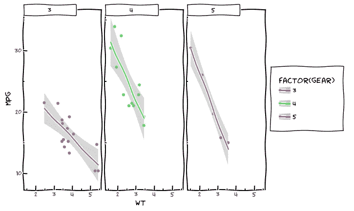
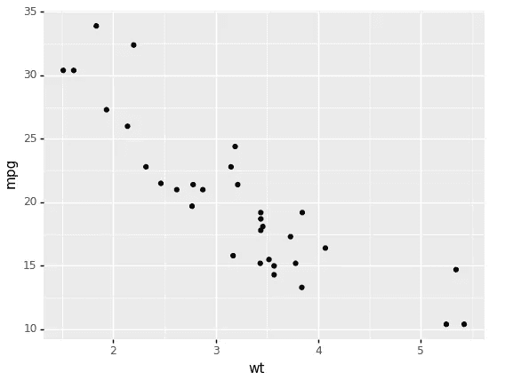
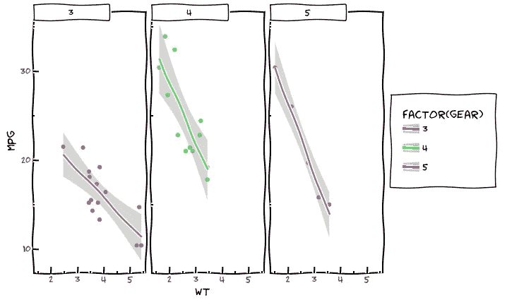
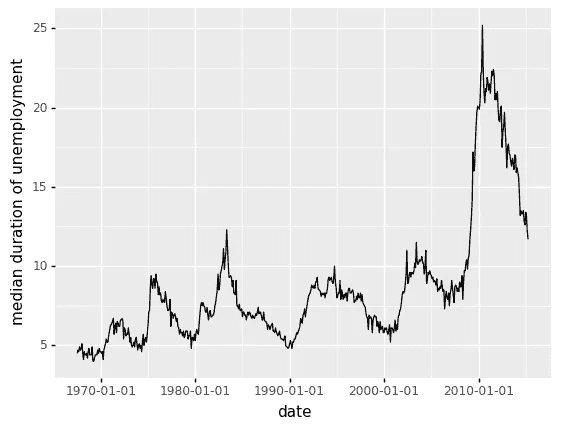
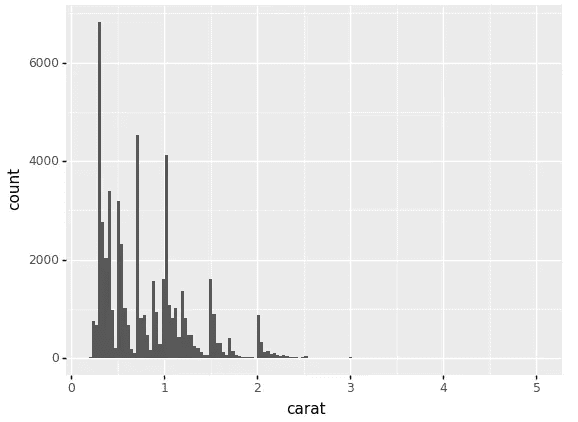
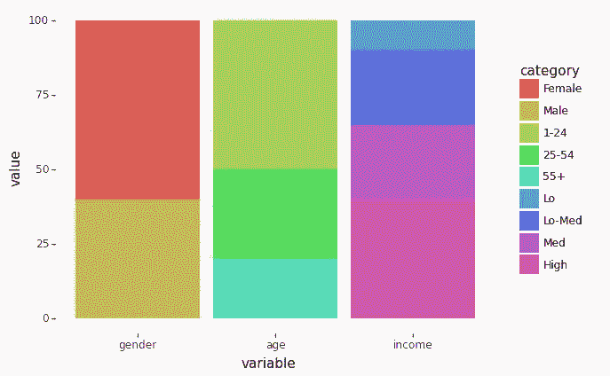

# 使用语法图形的数据可视化

> 原文：<https://towardsdatascience.com/data-visualization-using-grammar-graphics-a600379d0d22?source=collection_archive---------31----------------------->

## 使用 Plotnine 进行数据可视化



(来源:[作者](https://www.linkedin.com/in/himanshusharmads/))

**数据可视化**是可视化地表示数据，以便找出某些模式或异常值。它有助于发现数据集不同属性之间的关系。它是数据的图形表示。

[Plotnine](https://github.com/has2k1/plotnine) 是一个基于 ggplot2 的开源库，是图形文法的一个实现。使用 plotnine 使用语法创建图很容易，因为它使自定义图变得容易，并且还可以创建简单的图。

在本文中，我们将了解如何使用 plotnine 创建不同的条形图和图表。

让我们开始吧…

# 安装所需的库

我们将从使用 pip 安装 Plotnine 开始。下面给出的命令可以做到这一点。

```
pip install plotnine
```

# 导入所需的库

在这一步中，我们将导入所需的库和函数来创建图。

```
from plotnine import *
from plotnine.data import *
```

# 创建地块

现在我们将开始一个接一个地创建情节，看看如何创建它们

1.  **散点图**

```
(ggplot(mtcars, aes('wt', 'mpg'))
 + geom_point())
```



散点图(来源:[作者](https://www.linkedin.com/in/himanshusharmads/))

```
#Scatter Plot with differnt theme
(ggplot(mtcars, aes('wt', 'mpg', color='factor(gear)'))
 + geom_point()
 + stat_smooth(method='lm')
 + facet_wrap('~gear')
 + theme_xkcd())
```



散点图(来源:[作者](https://www.linkedin.com/in/himanshusharmads/)

2.**线条图**

```
(
    ggplot(economics, aes(x='date', y='uempmed')) 
    + geom_line() # line plot
    + labs(x='date', y='median duration of unemployment')
)
```



线条图(来源:[作者](https://www.linkedin.com/in/himanshusharmads/))

3.**直方图**

```
(
    ggplot(diamonds, aes(x='carat')) 
    + geom_histogram()
)
```



直方图(来源:[作者](https://www.linkedin.com/in/himanshusharmads/)

4.**堆叠** **条形图**

```
import pandas as pd
df = pd.DataFrame({
    'variable': ['gender', 'gender', 'age', 'age', 'age', 'income', 'income', 'income', 'income'],
    'category': ['Female', 'Male', '1-24', '25-54', '55+', 'Lo', 'Lo-Med', 'Med', 'High'],
    'value': [60, 40, 50, 30, 20, 10, 25, 25, 40],
})
df['variable'] = pd.Categorical(df['variable'], categories=['gender', 'age', 'income'])
df['category'] = pd.Categorical(df['category'], categories=df['category'])#Plotting Data

(ggplot(df, aes(x='variable', y='value', fill='category'))
 + geom_col()
)
```



条形图(来源:[作者](https://www.linkedin.com/in/himanshusharmads/))

这就是我们如何使用 plotnine 创建不同的条形图和曲线图。继续尝试不同的数据集，并让我知道您在回复部分的评论。

本文是与[皮尤什·英格尔](https://medium.com/u/40808d551f5a?source=post_page-----a600379d0d22--------------------------------)合作完成的。

# 在你走之前

***感谢*** *的阅读！如果你想与我取得联系，请随时通过 hmix13@gmail.com 联系我或我的* [***LinkedIn 个人资料***](http://www.linkedin.com/in/himanshusharmads) *。可以查看我的*[***Github***](https://github.com/hmix13)**简介针对不同的数据科学项目和包教程。还有，随意探索* [***我的简介***](https://medium.com/@hmix13) *，阅读我写过的与数据科学相关的不同文章。**