# 使用 Matplotlib 和 Seaborn 实现数据可视化

> 原文：<https://towardsdatascience.com/data-visualization-using-matplotlib-seaborn-97f788f18084?source=collection_archive---------13----------------------->

## 数据可视化

## 着眼于增强可视化的定制选项，并检查一些鲜为人知的绘图功能

数据可视化通过地图或图形提供了一个可视化的环境。在这样做的时候，它将数据转换成一种更自然的形式，以便人类大脑理解并挑选出感兴趣的模式或点。一个好的可视化有助于信息的传递或作为数据展示(讲故事)的一部分的行动号召。

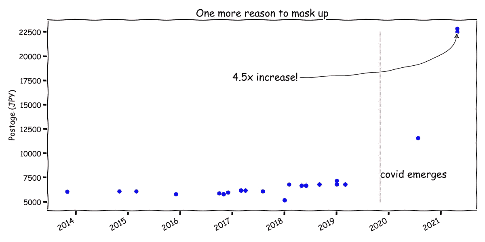

作者图片|用于搞笑，用于专业演示时风险自担。

这个潜在项目的想法部分是在几年前维护 iaito 订单记录时受到启发的。我选择这个数据，因为我觉得这可能是一种将数据科学(可视化和分析)与传统艺术(Iaido)联系起来的方式，也是一种可视化实践。该数据集是关于 2013 年至 2021 年 iaito 订单详情以及 iaito 规格和成本(JPY)的数据。出于隐私原因，敏感信息，如送货地址、姓名等。从一开始就没有记录在数据中。

> Iaito 是练习用的仿武士刀。Koshirae 指的是 iaito 上的配件— (Fuchi，Kashira，Kojiri)。剑条指的是剑卫。长度的测量系统基于日本单位(即长度测量用的日本单位)；为了便于解释，这些单位随后被转换成公制单位。从初学者到高级的模型是 Shoden-Chuden-Okuden。

## 内容

*   图书馆
*   Matplotlib 和 Seaborn 方法
*   带代码的可视化示例
*   最后的想法

## 图书馆

Matplotlib 和 seaborn 是 Python 中可视化数据的常用工具。在本文中，使用这两个库生成了一些可视化效果，并简要介绍了绘图功能。

## Matplotlib 和 Seaborn 方法

使用 matplotlib 时，有两种方法:函数接口和面向对象接口。作为初学者，我们通常会看到更多的前一种情况。随着人们对使用这个库绘图越来越熟悉，后一种方法开始发挥作用，用于可伸缩性和更复杂的定制。

```
# Example
x = smthg
y = smthg# plt interface
plt.figure(figsize=(9,7)
plt.plot(x,y)# object-oriented interface
fig, ax = plt.subplots()  
ax.plot(x, y)
```

对于 seaborn 来说，也有两种方法。它们是轴级函数和图形级函数。轴级函数采用一个显式的 *ax* 参数，并返回一个 *Axes* 对象。对于图形级别的函数，这些函数需要对绘制的图形进行整体控制。因此，需要传入一个“数字级别”的参数。一个例子是通过*高度*和*长宽比*值定制图形尺寸。

```
# Typical object-oriented style (seaborn)
f, (ax1, ax2) = plt.subplots(2) 
sns.regplot(x, y, ax=ax1) 
sns.kdeplot(x, ax=ax2)# Figure-level
sns.catplot(data=df, x='x_variable', y='y_variable',  hue='hue', height=8, aspect=12)
```

> 没有意识到一个特定的 seaborn 情节是哪一级功能可能会在很多时候出错(我当然是其中之一)。如果卡住，检查绘图类型。

各个功能的曲线图示例:

*   “轴级”功能:regplot、boxplot、kdeplot。
*   “图形级”功能:relplot、catplot、displot、pairplot、jointplot。

## 带代码的可视化示例

这些示例展示了创建地块以及特定自定义的各种方法。最初，我采取的是“如果有效，那就好”的心态。为了可维护性和在试验新概念时的一致性，我对代码进行了几次重构。例如，标题、轴、刻度标签和图例的一致代码结构通常适用于所有地块。此外，我还考虑了潜在的受众，以及让可视化流行起来的方法。其中一些方法包括使用配色方案和形状。在颜色方面，有三种主要的调色板可供选择:

*   定性的
*   连续的
*   分歧

为了便于生成配色方案，我使用了来自[数据颜色选择器](https://learnui.design/tools/data-color-picker.html#palette)的工具。为了重复使用，还创建了字体大小的通用占位符。

```
# create placeholder for fontsizing
# x & y label fontsize
xls = 14
yls = 14# x & y tick fontsize
xts = 13
yts = 13# title fontsize
ts = 15# legend fontsize
ls = 13
```

用 pyplot 接口绘制相对简单。对于下面的折线图示例，fig.autofmt_date()提供了定制轴刻度标签的替代方法。旋转刻度标签的常见原因要么是单位名称太长(可以通过选择缩写的表示单位来缓解)，要么是因为日期。正如函数名所暗示的，它执行日期刻度标签的自动旋转和对齐(将 y 刻度标签更改为“ydate”)。

```
# Establish the size of the figure.
fig = plt.figure(figsize=(16, 6))plt.plot(df_fedex['postage'], linewidth=2,color='blue')# Customize
plt.title('Postage over time',fontsize=ts)
plt.ylabel('Price (JPY)', fontsize=yls)
plt.yticks(size=yts)
plt.xticks(size=12)# Rotate and align the tick labels so they look better.
fig.autofmt_xdate()
plt.show()
```

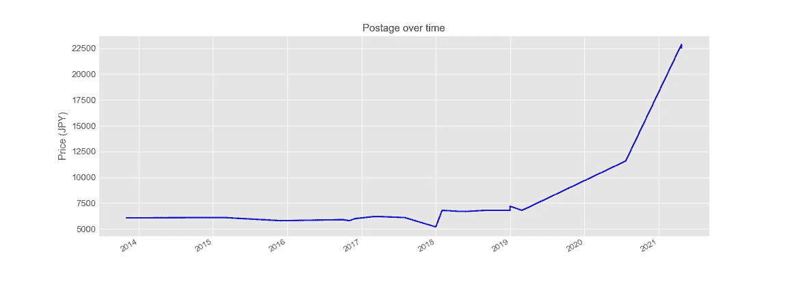

作者图片

饼图通常被过度使用，可能会扭曲所呈现的信息(即没有刻度)。

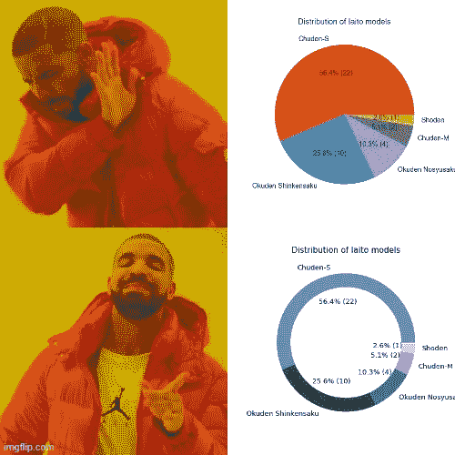

图片由作者提供|是的，为这些图表的上下文信息添加了比例。|工具:imgflip.com

尽管如此，它在可视化中还是有一席之地的——用于呈现一些类别及其数量/百分比。谨慎使用，利用注释、配色方案和形状，它仍然可以产生影响。对于下面的饼图，我采用了可重复使用的颜色方案，并在图表注释中添加了百分比和绝对订单数量。添加一个圆形将饼图转换成一个环形图，以增强视觉效果。

```
# Create figure
fig, ax = plt.subplots(figsize=(6,6), subplot_kw=dict(aspect="equal"))# Standarizing color scheme for the Iaito models
palette = ['#6d91ad','#004c6d','#416e8c','#99b6ce','#c6ddf1' ]def make_autopct(count):
    def my_autopct(pct):
        total = sum(count)
        val = int(round(pct*total/100.0))
        return f'{pct:.1f}% ({val:d})'
    return my_autopctax = df_pie['count'].plot(kind='pie',fontsize=ls,autopct=make_autopct(count),pctdistance=0.6, colors=palette)ax.set_ylabel("")
ax.set_title("Distribution of Iaito models",fontsize=ts)# Add a white circle to center of pie chart
centre_circle = plt.Circle((0,0),0.80,fc='white')
fig = plt.gcf()
fig.gca().add_artist(centre_circle)plt.show()
```

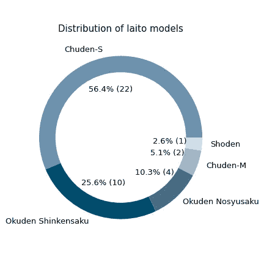

作者图片

继续使用面向对象的绘图方法，下面的箱线图结合了这种方法和前面提到的配色方案概念。默认的箱形图是垂直的，但是可以通过交换 x 和 y 输入来重新排列。

```
# boxplot, models are organised in ascending order
palette_box = ['#c6ddf1','#99b6ce','#6d91ad','#416e8c','#004c6d']fig, (ax1,ax2) = plt.subplots(2,1,figsize=(14,8), sharey=True)
sns.boxplot(data=df2, y='model', x='model_price',ax=ax1, palette=palette_box)
sns.boxplot(data=df2, y='model', x='iaito_total_price',ax=ax2, palette=palette_box)ax1.set_ylabel('')
ax2.set_ylabel('')
ax1.set_xlabel('')
ax2.set_xlabel('price (JPY)',fontsize = yls)
ax1.set_title('Base price by model', fontsize = ts)
ax2.set_title('Overall price by model', fontsize = ts)
ax1.tick_params(axis='x', labelsize='large')
ax1.tick_params(axis='y', labelsize='large')
ax2.tick_params(axis='x', labelsize='large')
ax2.tick_params(axis='y', labelsize='large')plt.tight_layout
plt.show()
```

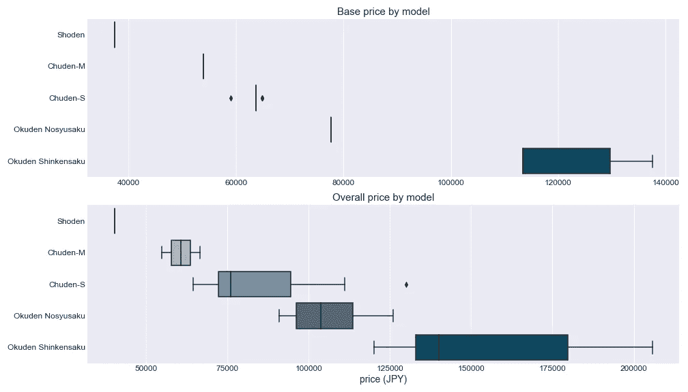

作者图片

该配色方案也可用于替代 seaborn 地块中的色调。在下面的示例中，lmplot(图形级函数)配色方案(通过分类类&*PLT . use . style(gg plot)*的*色调*的组合调用)可以通过为 seaborn 设置调色板来覆盖，如下所示:

```
# Set your custom color palette
palette = ['#6d91ad','#004c6d','#416e8c','#99b6ce','#c6ddf1' ]
sns.set_palette(sns.color_palette(palette))# Consistent grey background
plt.style.use('seaborn-darkgrid')# Lmplot is a figure-level function plot
ax = sns.lmplot(x='model_price', y='iaito_total_price',data=df,
           fit_reg=False, #no regression line
           hue='model',height=7, aspect=1.2, legend=False,legend_out=False)
plt.title('Iaito model price vs total price', fontsize=ts)
plt.ylim(30000,None)
plt.yticks(np.arange(35000, 210000, step=10000), fontsize=yts)
plt.ylabel('Iaito total price (JPY)',fontsize=yls)
plt.xticks(rotation=45, fontsize=xts)
plt.xlabel('Iaito model base price (JPY)',fontsize=xls)
plt.legend(fontsize=ls)plt.show()
```

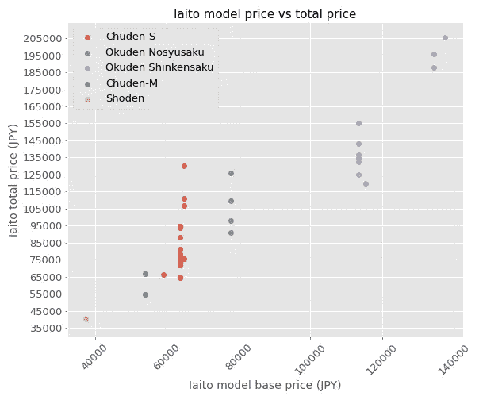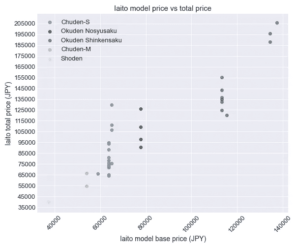

作者提供的图片

Violin 图可用于表示不同 iaito 模型中不同“类别”(如本例中的 Kojiri 和 No kojiri)的变量分布(或样本分布)的比较。

```
ax= sns.catplot(x="model", y="custom_design(cost)", data=df_ko, hue="kojiri", 
                kind="violin", split=True, inner="stick", palette="mako", linewidth=1,
                height=4,aspect=2.5)
ax.fig.suptitle('Kojiri & associated additional costs across models', fontsize=ts)
ax.fig.subplots_adjust(left=0.1, top=0.9)
ax.set_xlabels('')
ax.set_ylabels('price (JPY)', fontsize=yls)
ax.set_xticklabels(fontsize=xts)
ax.set_yticklabels(fontsize=yts)
ax._legend.set_title('Kojiri')plt.show()
```

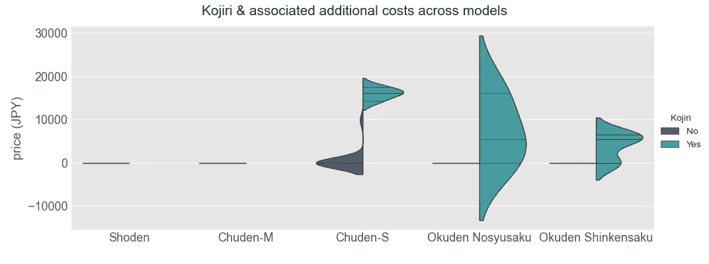

作者图片

matplotlib 和 seaborn 的通用性相互支持。分组条形图可从 plt.bar 或 plt.bar()或 seaborn(如 catplot)绘制。在 matplotlib 的情况下，这可以通过将轴索引偏移指定的条形宽度来实现。

```
# seaborn catplot (horizontal grouped bar chart)
ax = sns.catplot(y="kojiri", data=df_ko,
                 kind="count", hue="model", 
                 palette=palette_box, edgecolor=".6",
                 height=5, aspect=2,legend=False)
ax.fig.suptitle('Iaito with & without kojiri (by model count)', fontsize=ts)
ax.fig.subplots_adjust(left=0.15, top=0.9)label = np.arange(0,20)ax.set_xlabels('')
ax.set_xticklabels(fontsize=xts)
ax.set_ylabels('Kojiri', fontsize=yls)
ax.set_yticklabels(fontsize=yts)
ax.add_legend(fontsize=ls)
plt.show()
```

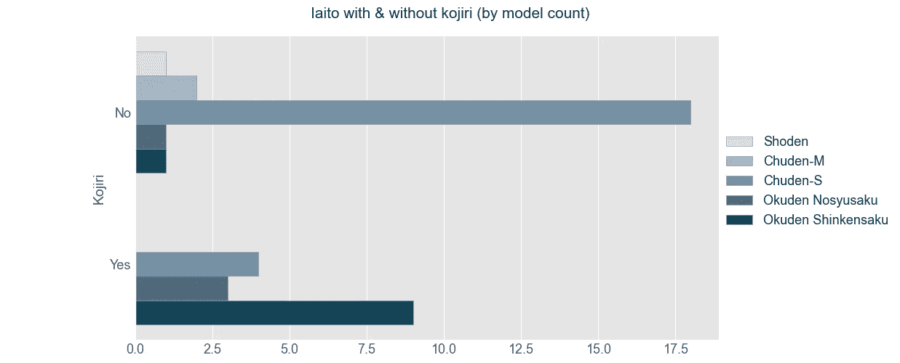

作者图片

```
# Setting the data
years = [2013,2014,2015,2016,2017,2018,2019,2020,2021]
Sho = [0,0,0,0,0,0,1,1,1]
Chu_M = [0,0,0,0,1,2,2,2,2]
Chu_S = [1,2,4,7,8,18,18,20,22]
Oku_Nosyu = [0,0,0,1,1,3,4,4,4]
Oku_Shin = [0,0,0,0,3,4,8,10,10]# set bar width
width=0.15# axis index
years_index = np.arange(len(years))# clear reset plt style
plt.style.use('default')
plt.style.use(['ggplot'])
plt.figure(figsize=(8,5))# plt interface approach for bar charts
plt.bar(years_index-2*width, Sho, color='#c6ddf1', label='Sho', width=width, linewidth=0.4,edgecolor='darkgrey')plt.bar(years_index-width, Chu_M, color='#99b6ce', label='Chu_M', width=width)plt.bar(years_index, Chu_S, color='#6d91ad', label='Chu_S', width=width)plt.bar(years_index+width, Oku_Nosyu, color='#416e8c', label='Oku_Nosyu', width=width)plt.bar(years_index+2*width, Oku_Shin, color='#004c6d', label='Oku_Shin', width=width)plt.legend()plt.title('Iaito model ownership',fontsize=ts)
plt.xlabel('Year',fontsize=xls)
plt.xticks(ticks=years_index, labels=years)
plt.ylabel('Count',fontsize=yls)
plt.yticks(list(np.arange(df_cumsum['count'].max()+1)))plt.show()
```

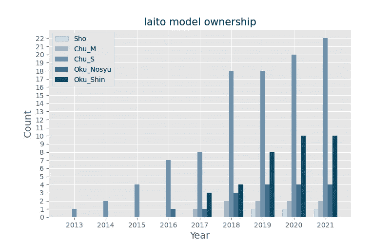

作者图片

根据数据传达的信息、数据的特征和目标受众，某些情节可能更适合。例如，下面的 catplot 可能会传达五种型号的 saya 设计数量及其额外成本。但是随着数据点数量的增加，这可能是不可扩展的。最好将消息拆分，例如，根据 saya 设计价格的数量和分布来划分 saya 设计的受欢迎程度。这就是我对后一个方向的径向图所做的。代码片段在 catplot 之后。

```
ax = sns.catplot(x="model", y="saya(cost)", data=df_saya1,
                 hue="saya", palette= 'tab20b', kind="swarm", s=10,
                 height=4.5, aspect=2.5)
ax.fig.suptitle('Saya across models',fontsize=ts)
ax.fig.subplots_adjust(left=0.1, top=0.9)
ax.set_xlabels('')
ax.set_ylabels('price (JPY)', fontsize=yls)
ax.set_xticklabels(fontsize=xts)
ax.set_yticklabels(fontsize=yts)
ax._legend.set_title('Saya')plt.show()
```

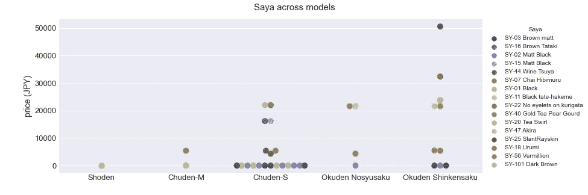

作者图片|随着数据点的增加，可扩展性成为一个问题

```
# replicating saya color is impractical from experience. Use a sequential color scheme
palette_saya = ['#7eedff','#6dd7ed','#5dc2dc','#4dadc9','#3e99b7','#3085a5','#217192','#125e7f','#004c6d',
               'slateblue','rebeccapurple','purple','indigo']# initialize the figure
plt.figure(figsize=(10,10))
ax = plt.subplot(111, polar=True);
plt.axis('off')
plt.title('Saya ranked by price (JPY)',y=.9,fontsize=ts)# set coordinate limits
upperlimit = 100
lowerlimit = 30# compute max and min of dataset
max_ = df_saya2['saya(cost)'].max()
min_ = df_saya2['saya(cost)'].min()# compute heights (conversion of saya_charge into new coordinates)
# 0 will be converted to lower limit (30)
# max_ converted to upper limit (100)
slope = (max_ - lowerlimit)/max_
heights = slope * df_saya2['saya(cost)'] + lowerlimit# width of each bar
width = 2*np.pi / len(df_saya2.index)# compute angle each bar is centered on
indexes = list(range(1, len(df_saya2.index)+1))
angles = [element * width for element in indexes]# draw
bars = ax.bar(x=angles, height=heights, width=width, bottom=lowerlimit,
              linewidth=1,edgecolor="white",color=palette_saya)# padding between bar and label
labelPadding = 1000# label
for bar, angle, height, label in zip(bars,angles,heights,df_saya2['saya_']):
    # specify rotation in degrees
    rotation = np.rad2deg(angle)

    #flip some labels upside down for readability
    alignment = ""
    if angle >= np.pi/2 and angle < 3*np.pi/2:
        alignment = "right"
        rotation += 180
    else:
        alignment = "left"

    # add label
    ax.text(x=angle, y=lowerlimit + bar.get_height() + labelPadding,
            s=label, ha=alignment, va='center', rotation=rotation, rotation_mode="anchor",size=12)plt.show()
```

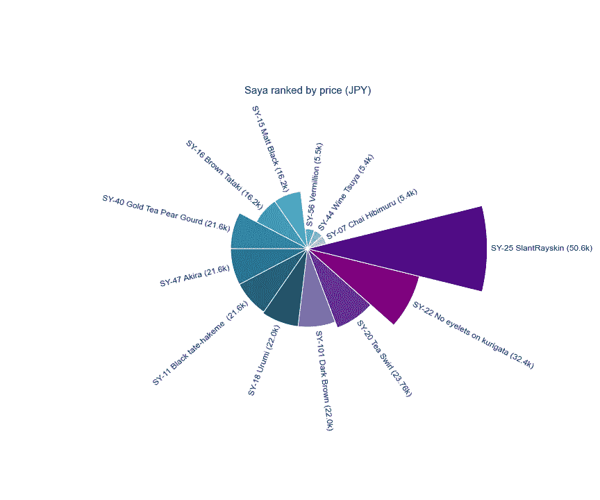

作者图片|非常规，但在这种情况下有效

最后但同样重要的是，xkcd 风格。xkdc 的情节以其幽默、科学术语和视角的平衡在许多人的脑海中占据了特殊的位置。这种绘图风格可以通过 *plt.xkcd()* 从 matplotlib 中调用，就像这样。输出是本文的第一幅图像。令人惊讶的是，xkcd 风格的简单图形需要大量的计划和思考，尤其是注释位置和箭头位置。

```
# create a dataframe for 2019-11-01 date
# anchoring annotations and like laterdata = {'date': ['2019-11-01','2017-01-01'], 
        'value': [22600,17500]}
df_dt = pd.DataFrame(data, columns = ['date', 'value'])
df_dt['date'] = pd.to_datetime(df_dt['date'])# Create the postage chart in xkcd style
plt.style.use('default')
plt.xkcd()# create yticks for labeling
yticks = np.arange(5000,25000,2500)# Establish the size of the figure.
fig, ax = plt.subplots(figsize=(12, 6))
plt.plot()
# Scatter plot
ax.scatter(df_fedex['date'],df_fedex['postage'], s=40,color='blue')
# vertical line
ax.vlines(df_dt['date'][0],5000,df_dt['value'][0],linestyle='-.',linewidth=1,color='r')# annotate
ax.text(df_dt['date'][0],7500,'covid emerges',fontsize=18)
ax.annotate('4.5x increase!', fontsize=18,
            xy=(df_fedex['date'][df_fedex.index[-1]],22516), 
            xytext=(df_dt['date'][1],17500),
            arrowprops=dict(arrowstyle='-|>',
                           connectionstyle='angle3,angleA=0,angleB=-90')
           )# Title & labels
ax.set_title('One more reason to mask up',fontsize=18)
ax.set_ylabel('Postage (JPY)', fontsize=yls)
ax.set_yticks(ticks=yticks)
ax.set_yticklabels(labels=yticks,size=yts)
plt.xticks(size=14)# Rotate and align the tick labels so they look better.
fig.autofmt_xdate()
plt.tight_layout()

plt.show()
```

## 最后的想法

通过这个项目，我发现情节的结构是高度情境化的——目标受众、数据的性质和颜色等方面都发挥了作用。贯穿探索性数据分析和博客的情节组织也可能遵循非常不同的思路。总而言之，整个项目是一个数据发现、处理数据清理、分析、代码重构和实验的迭代过程。该流程还发现了数据采集上游的几个问题。为了提高数据质量，需要进行更多的日语翻译，并对项目代码(例如，tsuba 代码)进行标记，这一工作已经完成(见后注)。进一步的项目扩展可能是对与刀剑相关的主题进行分析。尽管这些例子和方法并不详尽，但希望您能够获得一些见解，从而在定制 pyplot & seaborn 可视化时减少潜在的障碍。

感谢阅读！

*后注:2021 年 5 月 22 日——关于剑条家具的细节。数据集和代码可以在* [*这里*](https://github.com/AngShengJun/petProj/tree/master/proj_nanato) 访问