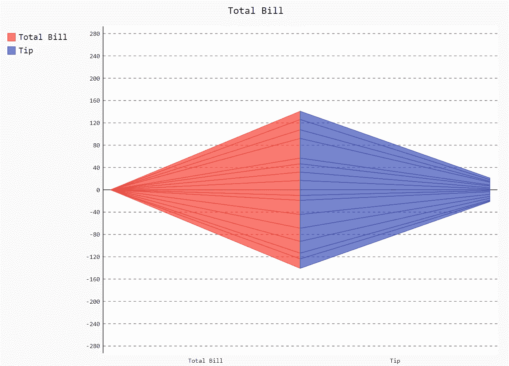
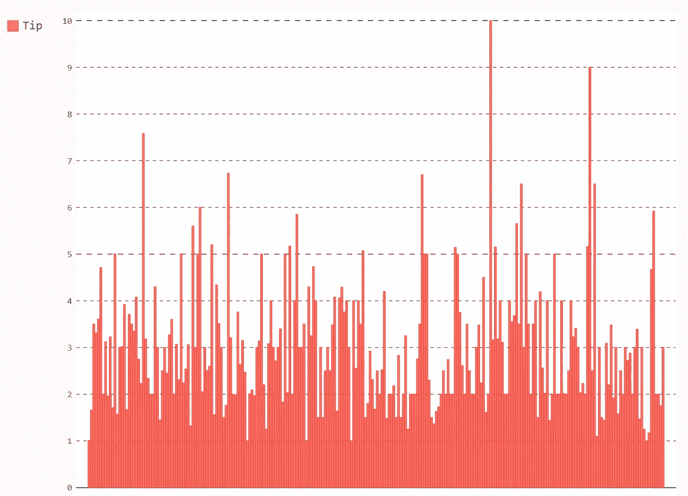
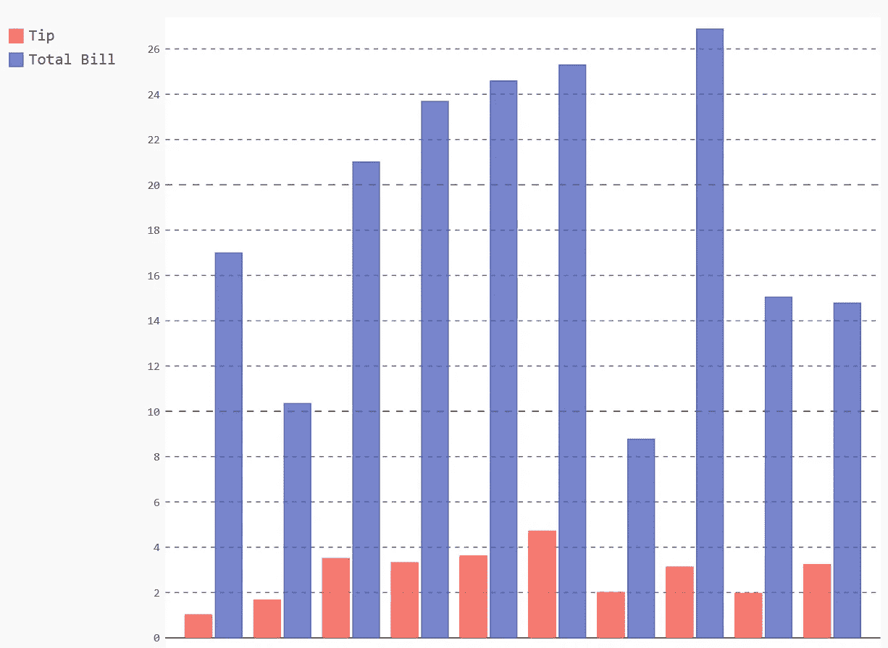
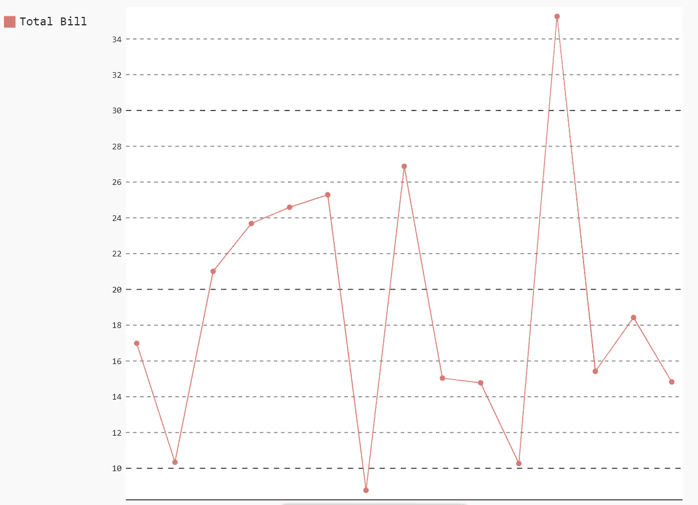
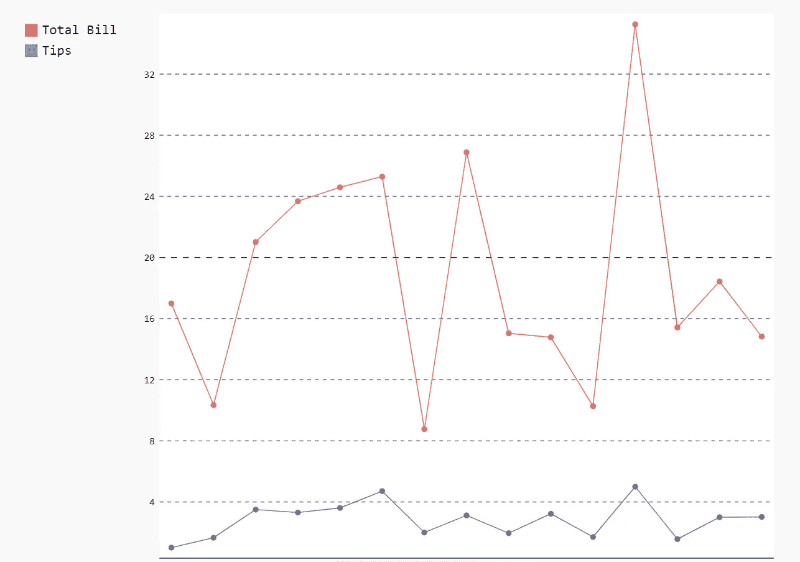
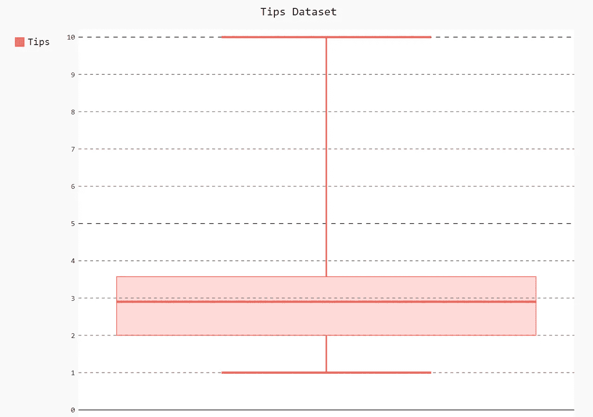

# 使用 PyGal 实现数据可视化

> 原文：<https://towardsdatascience.com/data-visualization-using-pygal-ebd26869d6bf?source=collection_archive---------26----------------------->

## 使用 PyGal 在 Python 中使用可伸缩可视化



(来源:作者)

数据可视化有助于理解隐藏的数据模式和分析数据想要表达的内容。通过创建不同类型的图表和绘图，我们可以了解不同数据集与目标变量之间的关联和共线性。

Python 提供了大量像 Seaborn、Matplotlib 等数据可视化库。这些库的问题是我们创建的可视化是不可扩展的，这意味着它只能以 PNG 和 JPEG 格式使用。有时，由于它们的局限性，使用这些可视化变得很有挑战性。

PyGal 是一个开源 Python 库，用于创建数据可视化，可以下载并在各种应用程序中使用。使用 PyGal 的主要优势之一是创建的可视化可以以 SVG 格式下载。

在本文中，我们将探索 PyGal 并使用它创建一些可视化效果。

让我们开始吧…

# 安装所需的库

我们将从使用 pip 安装来安装 PyGal 开始。下面给出的命令将使用 pip 安装 PyGal。

```
pip install pygal
```

# 导入所需的库

在这一步中，我们将导入创建数据可视化所需的所有库。

```
import pygal
import seaborn as sns
```

# 正在加载数据集

在本文中，我们将使用 seaborn 著名的 Tips 数据集。

```
df = sns.load_dataset('tips')
```

# 创建可视化

现在我们将从使用 PyGal 创建一些基本的可视化开始。我们还将创建想要可视化的数据集。

1.  **简单条形图**

```
bar_chart = pygal.Bar()  
bar_chart.add('Tip', df['tip'])  
bar_chart.render_to_file('bar_chart1.svg')
```



条形图(来源:作者)

**2。双条形图**

```
bar_chart.add('Tip', df['tip'][:10])
bar_chart.add('Total Bill', df['total_bill'][:10])
bar_chart.render_to_file('bar_chart2.svg')
```



双条形图(来源:作者)

**3。折线图**

```
line_chart = pygal.Line()
line_chart.add('Total Bill', df['total_bill'][:15])
line_chart.render_to_file('line1.svg')
```



折线图(来源:作者)

**4。双线图**

```
line_chart.add('Total Bill', df['total_bill'][:15])
line_chart.add('Tips', df['tip'][:15])
line_chart.render_to_file('line2.svg')
```



来源:作者

**5。箱形图**

```
box_plot = pygal.Box()
box_plot.title = 'Tips Dataset'
box_plot.add('Tips', df['tip'])
box_plot.render_to_file('box1.svg')
```



方框图(来源:作者)

**6。漏斗图**

```
funnel_chart = pygal.Funnel()
funnel_chart.title = 'Total Bill'
funnel_chart.add('Total Bill', df['total_bill'][:15])
funnel_chart.add('Tip', df['tip'][:15])
funnel_chart.render_to_file('funnel1.svg')
```


漏斗图(来源:作者)

在这里，您可以清楚地看到我们使用 PyGal 创建的不同图表和绘图。继续尝试不同的数据集，创建不同的可视化效果，并让我知道您在回复部分的评论。

本文是与 [Piyush Ingale](https://medium.com/u/40808d551f5a?source=post_page-----ebd26869d6bf--------------------------------) 合作完成的。

# 在你走之前

***感谢*** *的阅读！如果你想与我取得联系，请随时通过 hmix13@gmail.com 联系我或我的* [***LinkedIn 个人资料***](http://www.linkedin.com/in/himanshusharmads) *。可以查看我的*[***Github***](https://github.com/hmix13)**简介针对不同的数据科学项目和包教程。还有，随意探索* [***我的简介***](https://medium.com/@hmix13) *，阅读我写过的与数据科学相关的不同文章。**