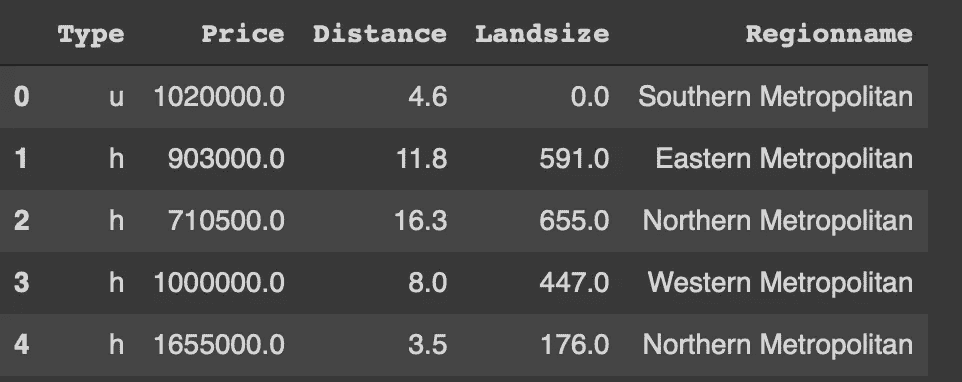
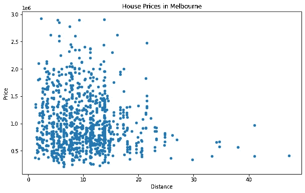
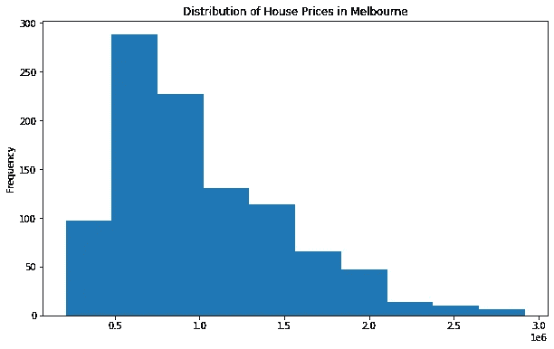
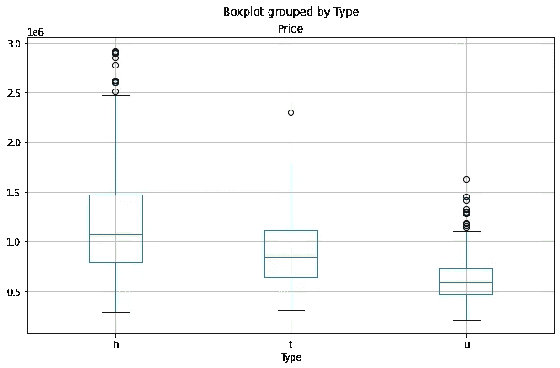
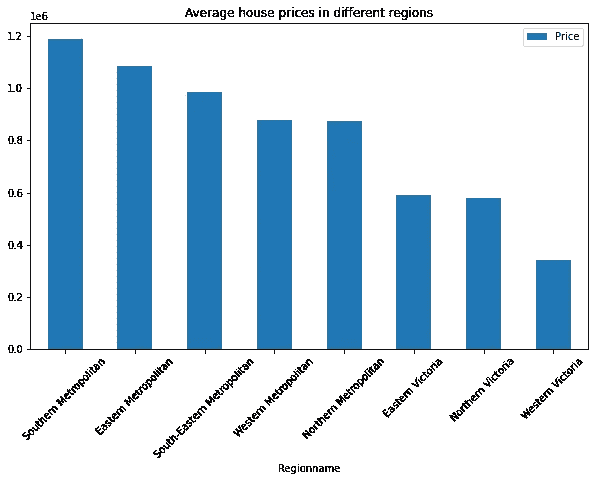

# 熊猫的数据可视化

> 原文：<https://towardsdatascience.com/data-visualization-with-pandas-1571bbc541c8?source=collection_archive---------14----------------------->

这不仅仅是简单的数字


马库斯·温克勒在 [Unsplash](https://unsplash.com/s/photos/graphs?utm_source=unsplash&utm_medium=referral&utm_content=creditCopyText) 上的照片

Pandas 可以说是最流行的数据分析和操作库。它使得处理表格形式的数据变得极其容易。Pandas 的各种功能构成了一个强大而通用的数据分析工具。

数据可视化是探索性数据分析的重要组成部分。在提供数据的概述或总结方面，它比简单的数字更有效。数据可视化有助于我们理解数据集中的底层结构或探索变量之间的关系。

Pandas 不是一个数据可视化库，但它能够创建基本的绘图。如果您只是创建用于探索性数据分析的地块，Pandas 可能非常有用和实用。对于此类任务，您不必使用额外的数据可视化库。

在本文中，我们将仅使用熊猫创建几个地块。我们的目标是探索 Kaggle 上可用的墨尔本房产[数据集](https://www.kaggle.com/dansbecker/melbourne-housing-snapshot)。

让我们从导入库和将数据集读入数据帧开始。

```
import numpy as np
import pandas as pddf = pd.read_csv("/content/melb_data.csv", usecols = ['Price', 'Landsize','Distance','Type','Regionname'])df = df[df.Price < 3_000_000].sample(n=1000).reset_index(drop=True)df.head()
```



(图片由作者提供)

我只看过原始[数据集](https://www.kaggle.com/dansbecker/melbourne-housing-snapshot)的一小部分。read_csv 函数的 usecols 参数允许只读取 csv 文件的给定列。我还过滤掉了价格方面的异常值。最后，使用 sample 函数选择 1000 个观察值(即行)的随机样本。

我们可以从创建价格和距离列的散点图开始。散点图主要用于检查两个连续变量之间的相关性。

我们可以使用熊猫的绘图功能来创建许多不同类型的可视化。绘图类型由 kind 参数指定。

```
df.plot(x='Distance', y='Price', kind='scatter',
        figsize=(10,6),
        title='House Prices in Melbourne')
```



(图片由作者提供)

我们没有观察到价格和距离之间有很强的相关性。但是，对于价格较低的房子，有轻微的负相关性。

探索性数据分析中另一种常用的绘图类型是直方图。它将连续变量的值域划分为离散的箱，并计算每个箱中的观察值(即行数)。因此，我们得到了一个变量分布的结构化概览。

下面的代码生成 price 列的直方图。

```
df['Price'].plot(kind='hist', figsize=(10,6), title='Distribution of House Prices in Melbourne')
```



(图片由作者提供)

大多数房子的价格在 50 万到 100 万英镑之间。正如您所注意到的，我们将 plot 函数应用于一个系列(df['Price'])。根据绘图类型，我们可以对数据帧或系列使用 plot 函数。

箱线图可以展示变量的分布。它们显示了值是如何通过四分位数和异常值分布的。我们可以如下使用熊猫的 boxplot 函数。

```
df.boxplot(column='Price', by='Type', figsize=(10,6))
```



(图片由作者提供)

这个箱线图代表了房价的分布。“by”参数根据给定的列对数据点进行分组。我们将 type 列传递给 by 参数，这样我们可以分别看到每种类型的分布。

“h”型的房子一般比其他的要贵。异常值(即极值)用圆点表示。方框的高度与数值的分布成正比。因此，较高的方框表示更多的差异。

使用 Pandas 创建可视化的一个优点是，我们可以将数据分析功能和绘图功能链接起来。这在某种程度上简化了任务。例如，groupby 和 plot.bar 函数可用于创建不同地区平均房价的条形图。

我们首先按地区名称对价格进行分组，然后计算平均值。然后，对结果应用 plot.bar 函数。

```
df[['Regionname','Price']].groupby('Regionname').mean().sort_values(by='Price', ascending=False).plot.bar(figsize=(10,6), rot=45, title='Average house prices in different regions')
```



(图片由作者提供)

sort_values 函数可用于按升序或降序对结果进行排序，以使绘图看起来更好。最昂贵的房子位于南部大都市地区。

## 结论

我们已经看到熊猫如何被用作数据可视化工具。它远远超出了 Seaborn 和 Matplotlib 等专用的数据可视化库。然而，Pandas 提供了一种在探索性数据分析过程中创建基本地块的更实用的方法。

您可以随时一起使用 Pandas 和数据可视化库。这没什么坏处。但是，在某些情况下，你可以用熊猫更容易更快地完成工作。

感谢您的阅读。如果您有任何反馈，请告诉我。