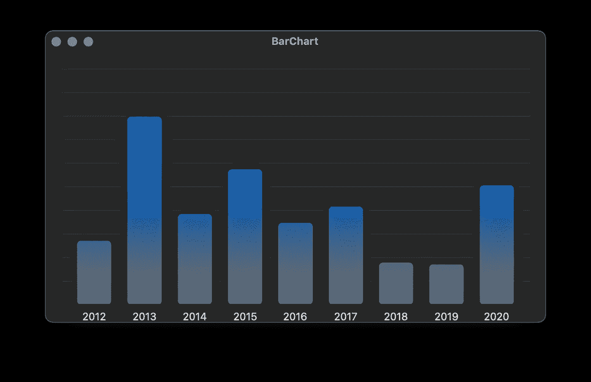

# 使用 SwiftUI 的数据可视化:条形图

> 原文：<https://towardsdatascience.com/data-visualization-with-swiftui-bar-charts-599de6c0d79c?source=collection_archive---------29----------------------->

## 在 SwiftUI 应用中构建漂亮的图表

照片由[卢卡斯·布拉塞克](https://unsplash.com/@goumbik?utm_source=medium&utm_medium=referral)在 [Unsplash](https://unsplash.com?utm_source=medium&utm_medium=referral) 上拍摄

苹果在 2019 年推出了 SwiftUI，作为一种轻量级和易于使用的方式来创建用户界面。本文是探索 SwiftUI 框架如何帮助我们构建干净、简单和令人惊叹的数据可视化工具的系列文章的第二篇。今天，焦点落在了一个老古董——条形图上。

# 什么是条形图？

> 条形图是一种处理分类数据的可视化数据。该图表为所有变量呈现一个矩形条，每个变量的高度与它们所代表的值成比例。

上面的文字听起来不错，但是在普通人的语言中它是什么意思呢？

分类变量只是一个允许我们根据一组标签对其进行分类的变量。标签不需要内部排序，并且可以与零个、一个或多个数据点相关联。例如，我们可以根据出具收据的商店对收据进行分类。商店没有内部排序，这意味着我们不能说一个比另一个小或大(至少在没有定义另一个指标进行比较的情况下)。

条形图的想法是可视化一些与我们的标签相关的顺序变量。我们可以选择表示从每个商店收到的收据数量或在那里消费的总金额。由于这些度量符合顺序度量尺度，我们可以将它们相互比较。在我们的条形图中，我们为更大的指标绘制了一个更高的条形图。

我们在本文中构建的条形图的一个例子。

这种类型的可视化可能适用于以下情况:

*   比较贵公司的年度利润。
*   创建一个你在衣服、鞋子、食物等上面花了多少钱的概览。
*   想象你一年中每月的工作时间。

# 我们需要什么？

就像在[雷达图文章](https://medium.com/better-programming/data-visualization-with-swiftui-radar-charts-64124aa2ac0b)中一样，我们需要对`Paths`和`Shapes`有一个扎实的理解。我们还需要了解一点关于`Stacks`的情况。由于我们在前一篇文章中介绍了`Paths`和`Shapes`，我们直接开始学习`Stacks`。

SwiftUI 提供了多种风格的`Stacks`，比如`VStack`、`HStack`和`ZStack`。这些组件是布局元素，它们唯一的任务是以一种整洁的、堆栈式的方式一个接一个地布局它们的子元素。`HStack`水平放置孩子，`VStack`垂直放置，而`ZStacks`沿着 Z 轴堆叠他们的孩子(所以，一个在另一个上面)。当我们想要呈现多个相邻的条时，或者当我们想要在这些条后面放置一个网格时，这些属性就很方便了。

# 我们怎么给这东西编码？

让我们从图表的基础开始，即`BarChart`视图。

这个坏小子包含了很多定制点。让我们从头到尾看一遍，弄清楚这一切。

`body`首先将图表及其附带的类别封装在一个垂直堆栈中，确保标签呈现在条形下方。图表区由一个可选的`BarChartGrid`、一个`BarStack`和一些包含在`ZStack`中的`BarChartAxes`组成，将它们放置在彼此之上。

在 body 上方定义了两个计算属性(`minimum`和`maximum`)。这些计算我们的数据的最小值和最大值。他们还为这些值添加了一点缓冲，这样最小的数据点就不会呈现一个不可见的条。

让我们也来看看`BarChartGrid`和`BarChartAxes`:

这个`Shapes`够直截了当的。`BarChartGrid`在图表区域中呈现设定数量的水平线。`BarChartAxes`为我们绘制一个 X 轴和一个 Y 轴。

# 绘制数据

我们正在进入正题。该画实际数据了！看看`BarStack`的代码:

这里发生了很多事情，所以让我们来分析一下。

主体创建了一个`HStack`来将我们的栏排列成一个漂亮的行。它使用一个`ForEach`组件为每个数据点创建一个线性梯度。由于线性渐变占用了所有可用的空间，我们使用一个 BarPath 形状将其裁剪到合适的大小。从下面的代码中可以看出，`BarPath`只是一个包装了`RoundedRectangle`的花哨包装。最后但同样重要的是，我们撒上一些阴影和填充。

最后，让我们快速看一下`LabelStack`:

与`BarStack`非常相似，`LabelStack`使用`HStack`将所有标签排成一行。由于我们使用相同的方法，这些将与条形很好地对齐(假设我们在传递数据点时使用相同数量的类别)。

# 把所有的放在一起

本文中开发的条形图应该可以使用了。只需插入您的数据，进行任何您想要的定制，然后点击运行！

你有兴趣学习更多关于软件开发的知识吗？
**关注我，在我发布新文章时获得通知。**

在下一次之前，您可以阅读本系列的第一篇文章:

 [## SwiftUI 数据可视化:雷达图

### 在 SwiftUI 应用中构建漂亮的图表

medium.com](https://medium.com/better-programming/data-visualization-with-swiftui-radar-charts-64124aa2ac0b) 

你可以回顾一些如何解决复杂问题的指导方针:

 [## 在没有头绪的情况下如何编码

### 分解复杂任务并使其正确的指南。

medium.com](https://medium.com/swlh/how-to-code-when-you-dont-have-a-clue-daa842cfd6ea) 

或者你可能想得到一些在家工作时如何保持理智的建议:

 [## 如何作为远程开发者保持理智

### 作为远程开发人员的第一年，我学到了 5 个最重要的经验。

medium.com](https://medium.com/swlh/how-to-stay-sane-as-a-remote-developer-48377bae99d3)