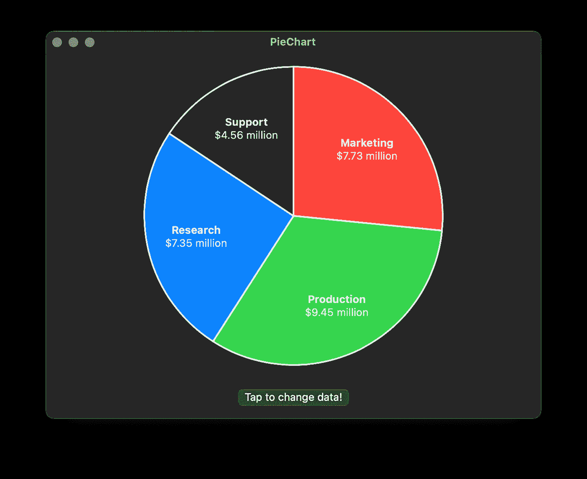

# SwiftUI 数据可视化:饼图

> 原文：<https://towardsdatascience.com/data-visualization-with-swiftui-pie-charts-bcad1903c5d2?source=collection_archive---------17----------------------->

## 在 SwiftUI 应用中构建漂亮的图表

照片由 [Tran Mau Tri Tam](https://unsplash.com/@tranmautritam?utm_source=medium&utm_medium=referral) 在 [Unsplash](https://unsplash.com?utm_source=medium&utm_medium=referral) 上拍摄

苹果在 2019 年推出了 SwiftUI，作为一种轻量级和易于使用的方式来创建用户界面。本文是探索 SwiftUI 框架如何帮助我们构建干净、简单和令人惊叹的数据可视化工具的系列文章的第三篇。这次，我们来看看如何制作饼状图！

# 什么是饼图？

饼图，也称为圆形图，是一种数据可视化，将每个数据值表示为圆形的一个按比例大小的切片。像条形图一样，它们处理分类数据，如果不同类别之间的比率对于传达是必不可少的，那么它们是一个很好的工具。

我们在本文中构建的饼图的一个例子。

这种类型的可视化可能适用于以下情况:

*   想象一下公司每个部门的年度预算是多少。
*   试着了解一下你的月薪是如何在支付房租、食物和购买涵盖 SwiftUI 的教育书籍之间分配的。
*   在你所在的城市的不同区域，列出出租公寓和共管公寓的比例。

# 我们需要什么？

为了制作一个饼图，我们需要 SwiftUI 的`Path`、`Shape`和`ZStack`类型。因为我们在本系列的前几篇文章中已经讨论了所有这些，所以我们直接进入实现。我们走吧！

# 我们怎么给这东西编码？

让我们从主要组件开始，即 PieChart 结构。

这个结构包含了相当多的帮助函数，其中一些做了一些乍一看可能很吓人的数学运算，但是我们将对其进行详细介绍。

因为我们将数据表示为扇形，所以我们需要计算它们的开始和结束角度。我们使用`startAngle(for:)`和`endAngle(for:)`方法来完成这些任务，它们以弧度返回它们的值。

方法`textOffset(for:in:)`方法看起来更复杂。然而，在现实中，它与角度方法非常相似。它的任务是在我们的圆上计算一个点，在这个点上我们可以放置标签来描述不同的圆扇区所代表的内容。这些计算有两个值得一提的性质:

1.  他们把标签放在圆心和圆周之间的三分之二处。
2.  他们将标签放置在位于其相关扇形中心的一个角度上。

现在，让我们看看`body`属性，看看它是如何构造的。层次结构从将我们所有的内容包装在一个`GeometryReader`中开始。该组件提供了对包含矩形的信息的访问，我们需要它来正确放置标签。

在`GeometryReader`的内部是一个`ZStack`，它允许我们将几个组件放置在彼此的顶部。`ZStack`拥有一个`ForEach`视图，它依次为我们所有的数据点创建`PieSlice`组件和`PieSliceText`。注意，`ForEach`每次运行都会实例化两个`PieSlice`对象。在撰写本文时，SwiftUI 没有提供一种好的方法来描边和填充单个`Shape`，迫使我们创建两个对象——一个用于填充，一个用作轮廓。

最后要注意的是，我们指定了`PieSliceText`的 Z 索引，以确保它们呈现在任何其他组件之上。

# 绘制数据

`PieChart`视图在计算所有封闭组件的角度和位置方面做了大量繁重的工作。得益于此，实现`PieSlice` `Shape`和`PieSliceText`标签是一件轻而易举的事情。看一下`PieSlice`的代码。

`PieSlice`实例化时以开始角度和结束角度作为参数。在三角学的帮助下，它画出了一个在这些角之间的扇形。这里没有什么新奇的东西——只是普通的古老的直角三角形数学。

最后要检查的是`PieSliceText`组件。它唯一的工作就是将两个文本标签叠放在一起——这项任务它可以精确无误地完成。

# 把所有的放在一起

我们在本文中整理的`PieChart`视图可以按原样使用。您所要做的就是将文件复制到项目中，并实例化一个新对象。请随意试验这些组件，添加新组件，并赋予图表您自己的个人风格。我迫不及待地想看看你用这个创造了什么！

您有兴趣了解更多关于软件开发和数据科学的知识吗？
**关注我，当我发布新文章时会收到通知。**

直到下一次，您可以阅读本系列的第一篇和第二篇文章:

 [## SwiftUI 数据可视化:雷达图

### 在 SwiftUI 应用中构建漂亮的图表

medium.com](https://medium.com/better-programming/data-visualization-with-swiftui-radar-charts-64124aa2ac0b)  [## 使用 SwiftUI 的数据可视化:条形图

### 在 SwiftUI 应用中构建漂亮的图表

towardsdatascience.com](/data-visualization-with-swiftui-bar-charts-599de6c0d79c) 

或者你可以回顾一下如何解决复杂问题的一些指导方针:

 [## 在没有头绪的情况下如何编码

### 分解复杂任务并使其正确的指南。

medium.com](https://medium.com/swlh/how-to-code-when-you-dont-have-a-clue-daa842cfd6ea)