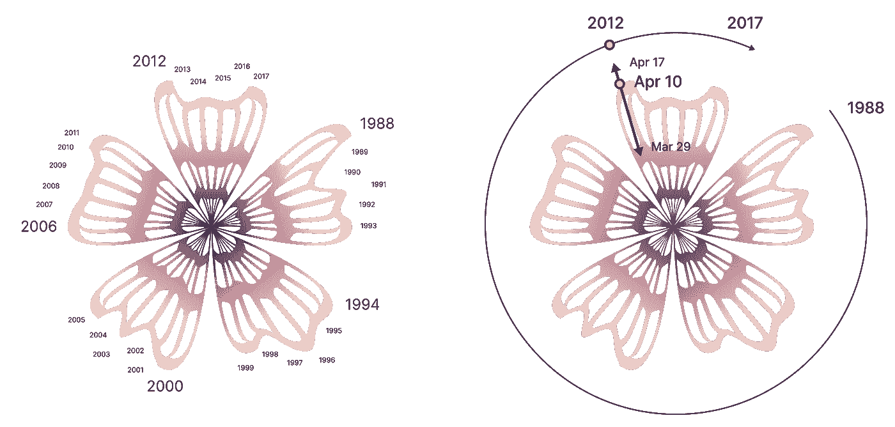

# 数据即遭遇死亡

> 原文：<https://towardsdatascience.com/data-viz-meets-death-a481498f7a58?source=collection_archive---------22----------------------->

## [变更数据](https://towardsdatascience.com/tagged/data-for-change)

## 通过数据可视化探索生者和死者之间的互动

图 1:通过转换个人数据和开花数据的组合制作的 2D 和樱花的 3D 形式。*记忆开花*是生者和死者一生记忆的集合，在日本文化中代表着对春天的庆祝。

数据可视化能帮助我们更好地理解和应对我们的死亡率吗？有没有超越圆形或时间线的一维表示的方式来想象死亡？我们能利用大规模数据集讲述个人的、亲密的故事吗？这些都是我在制作 [*记忆开花*](https://www.kieichikawa.com/memory-blossoms/)*一个数据可视化对象，同时也作为对死者的纪念对象时问自己的问题。使用数据人文主义和生成设计方法，*Memory flowers*旨在通过将围绕我们死亡率的个人数据与自然和地球周期的大规模数据联系起来，引发对死亡的对话和思考。本文将探索*记忆开花背后的设计过程，*它被设计在其中的日本文化背景，我希望，将展示数据可视化如何帮助处理像死亡这样重大而可怕的主题，并将其转化为人们可以更舒适地保留空间的东西。*

# *初步研究:探索数据人文主义*

*由于研究死亡的私密性和易受伤害性，我受到启发，通过设计师 Giorgia Lupi 和斯蒂芬妮·波萨维克在*亲爱的数据*中提出的*数据人文主义*的视角，开始了我的数据可视化研究。从本质上讲，数据人文主义是基于数据不仅仅是数字这一事实。数据与人类的故事紧密相连，通过创造性的可视化，可以传达同理心、不完美和其他人类品质。*

*我通过记录和绘制我自己的数据集来开始这个过程，主题包括我与人互动的次数或我读过的书的数量。我用小学美术用品在 5" x 7 "的卡片上制作手绘数据可视化。这些最初的研究揭示了一个重要的模式，这个模式对这个项目的后续发展至关重要:可视化都是以循环的形式进行的，我意识到这对于我们如何研究死亡有着更大的影响。*

**

*图 2:手工制作的数据草图。(左)我和人交往过多少次？(对)过去 13 年我读过的书的数量。*

# *核心洞察力:复合循环形状作为一种形式来可视化死亡率*

*循环形状意义重大，因为它们被用来表示时间，而死亡率和死亡与时间的本质密切相关。人类的寿命通常由一维的圆或线来概念化，就像显示一个时钟或历史时间线。但是通过我构建的循环的、多变量的数据可视化，我意识到我想拓展数据可视化显示时间的边界。在这个项目中，*Memory flowers*将时间视为平行的多个圆圈，试图展示我们的寿命如何与我们祖先的寿命以及我们周围自然的生命周期相互关联。*

**

*图 3:我认识到我们的寿命被包裹在几代人的寿命中，就像一个复合圆中的一个圆。*

# *概念发展:樱花作为一个造型隐喻*

*我建立了循环视觉化时间的概念，通过一个圆形的组合，将它与日本春天的象征花:樱花联系起来。作为日本人，我从小就把樱花和日本的复兴联系在一起。这种花与日本人的记忆紧密相连，因为全国各地的毕业典礼在三月底举行，入学典礼在四月初举行，正好是樱花盛开的时候。樱花也是对死亡的一种反映，因为樱花的美丽在于它的季节只有很短的一段时间，而花期只有一周。有了这个比喻，我看到了一个机会，可以用大规模的自然数据集，特别是樱花数据集，讲述一个关于死亡的新故事。*

**

*图 4:用 D3.js 构建的 2D 数据可视化樱花*

# *数据可视化:年龄和盛花期创造出曲线花瓣形状*

*该过程的下一步是找到相关的数据集。*

*关于樱花的生命周期，一组科学家 Yasuyuki Aono、Keiko Kazui 和 Shizuka Saito 收集了从公元 800 年到 2021 年日本京都樱花开花的[物候数据系列。下面是根据他们收集的数据绘制的樱花盛开日期的散点图，我用这些数据制作了樱花的形状。](http://atmenv.envi.osakafu-u.ac.jp/aono/kyophenotemp4/)*

**

*图 5:公元 800 年至 2021 年京都樱花盛花期散点图。*

**

*图 6:公元 800 年至 2021 年京都樱花盛花期的放射线图。*

*樱花于是成了雷达图的诗意版本。绕着开花径向图的外圈移动，我们会发现不同的年份，比如我母亲的，我祖母的，以及我自己的寿命。当我们从圆心向外移动时，我们会找到樱花盛开的日期。最后，花上花瓣的数量与这个人的寿命有关。年轻的人花瓣少，年长的人花瓣多。例如，下面的樱花放射状图表布局是 3 月 29 日至 4 月 17 日期间开花高峰期的可视化，跨越了 1988 年至 2017 年的生命周期。虽然这个原型使用了日本京都的盛花期日期，但我可以根据每个人的位置对他们应用不同的数据集。*

**

*图 7:樱花放射状图表布局和易读性键。*

# *生成设计:构建数字形式*

*Grasshopper 3D 和 Rhinoceros 3D 等生成式设计工具可以使用日本多个地点的数据创建各种樱花，每个地点都有自己的开花日期。*

**

*图 8:三维数据可视化樱花。(中上)我的樱花。(左下)我妈的樱花。(右下)我奶奶的樱花。*

**

*图 9:樱花正面示意图。*

*这一点很重要，因为樱花通常首先在日本南部地区开放，那里的气温上升更早，开花向北推进，如图 9 所示。*

*虽然*Memory flowers*是一个通过日本樱花自然生命周期的镜头反映人类寿命的原型，但使用生成设计工具，可以将它应用于其他环境。例如，对于与美国风景有关的人，可能有一个版本基于玫瑰或其他植物类型的开花周期，与特定人的故事有关。*

# *你的花朵:创造你自己的*

*总之，*记忆开花，*通过数据生成，让生者以更舒适的方式与逝者互动。这也引发了生者的反思。它不断提醒我们，由于我们的死亡，我们的生命是多么的美丽和脆弱。最终，它提醒我们使用个性化数据的生成设计的意图之一，可以是通过挑衅的形式来可视化我们自己的版本。*

**

*图 10:用 D3.js 构建的内存开花生成器。*

*我用 D3.js Observable 构建了一个*内存开花生成器*。你可以用你喜欢的调色板和时间段来创造你自己的记忆之花。*

*它可以是给家人、朋友和你心目中的任何人的礼物。请访问我的[可观察笔记本](https://observablehq.com/@kieich/memory-blossoms-create-your-own)并下载您的个性化版本。*

**没有亚历山大·伦吉佛和我在设计学院一起学习的同事们的支持，我不可能写出这篇文章。**