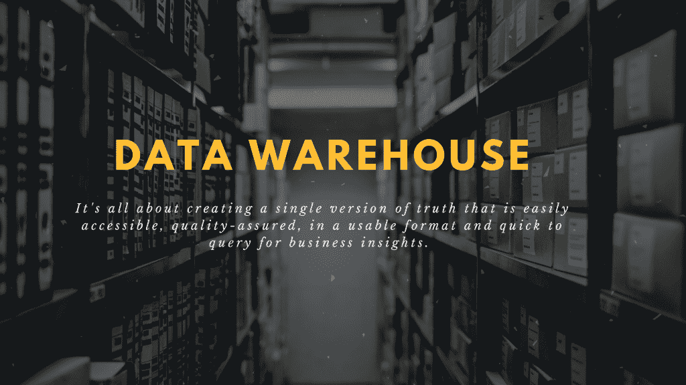
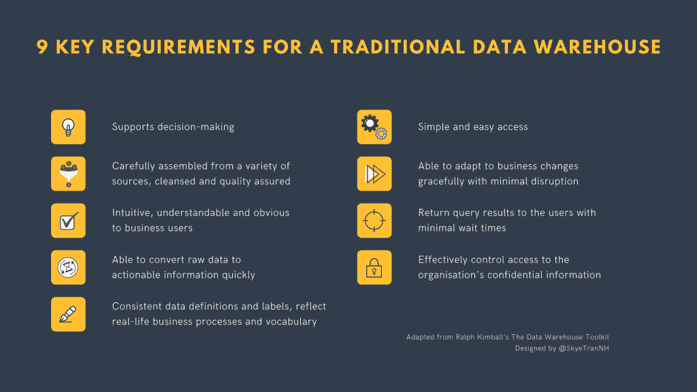
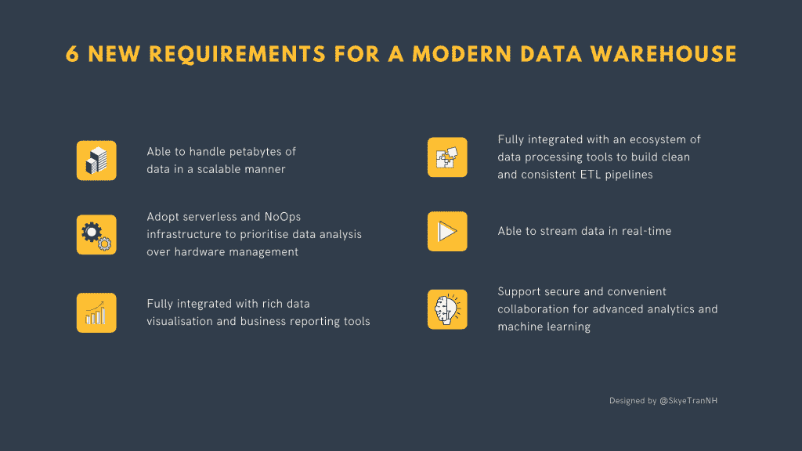

# 数据仓库:2021 年你需要知道的基本概念

> 原文：<https://towardsdatascience.com/data-warehouse-basic-concepts-you-need-to-know-in-2021-b07e7e46a209?source=collection_archive---------26----------------------->

## [理解大数据](https://towardsdatascience.com/tagged/making-sense-of-big-data)

## 当你手头只有分散在各处的未经处理的原始数据时，你如何获得商业洞察力？

作者图片

80 年代出生，40 岁左右还在算。这就是数据仓库，它需要大量的投资，可能需要几年的时间来构建。然而，失败的可能性极高。快进到 2021 年，数据仓库一直在与时俱进，并将继续成为世界各地组织的业务洞察力的支柱。那是什么呢？为什么我们首先需要数据仓库？作为一名数据专家，您至少需要了解数据仓库的哪些知识？

**在这篇文章中，你将学到:**

1.  大图:业务中对数据的两种不同需求
2.  传统与现代数据仓库
3.  EL vs ELT vs ETL vs 变更数据捕获:如何将数据放入数据仓库

# 大图:业务中对数据的两种不同需求

如果没有关于组织对数据的需求如何围绕两个主要目的发展的简短叙述，数据仓库的定义将是不完整的。

## 数据捕捉

**在企业数据开始的时候，它的唯一目标是为运营记录捕获交易数据。**考虑所有客户的联系方式、销售订单、发票、工资单等等。创建该数据库有两个目的。

*   以数字方式快速记录和跟踪业务活动(这样我们就不必处理到处乱飞和永远丢失的文件)
*   帮助业务用户更有效地完成他们的日常任务(例如，订单是否已经发货或我们有多少库存)

简而言之，**关注当下，确保业务交易尽可能顺利进行**这就是我们过去的数据世界。

## 数据分析

然而，企业很快意识到活在当下还不够好。新的问题出现了。与上个月相比，我们的表现如何？为什么上两个季度收入下降了？自年初以来，我们的客户经常抱怨什么？获取所有运营记录的需求仍然是不可或缺的，但现在有了另一个同样重要的目标:分析历史数据以用于决策。

不幸的是，曾经为捕获交易数据而构建的数据库不适合为管理层提供足够的事实和历史信息来做出明智的决策。由于捕获当前记录和跨各种数据源存储历史数据以进行分析之间的巨大差异，我们需要另一种工具。因此，数据仓库诞生了，剩下的就是历史了。

## 十秒钟外卖

***数据仓库的诞生是为了服务于业务需求，即存储来自多个数据源的历史数据，用于业务洞察和决策。***

# 传统与现代数据仓库

## 传统的数据仓库

数据仓库就是为来自各种来源的历史数据创建一个单一的真实版本，并使其易于访问，以一种可用的格式快速查询业务洞察力。通过这种方式，**商业分析师和管理层可以迅速发现有关商业表现的趋势、模式或异常情况，并决定怎么做最好。**

基于这一点，以下是传统数据仓库的 9 个关键需求，摘自 Ralph Kimball 的书《数据仓库工具包》。

作者图片

# 现代数据仓库

信不信由你，数据仓库的体系结构最早是在 20 世纪 80 年代开发的。进入 2021 年，三个主要趋势无疑改变了企业对待数据资产的方式，并塑造了新一代数据仓库。

1.  **大数据**导致**需要在单个数据仓库**中处理数 Pb 的数据，以获得业务洞察。
2.  **云计算**创造了**接近无限的低成本存储，具有可扩展的计算能力，以现收现付的方式分析数据**。
3.  **数据科学和机器学习的兴起**要求**在数据仓库、ETL 和数据处理工具以及数据可视化工具之间进行更紧密的集成**以实现用于决策的近实时分析。

毫不奇怪，数据仓库的概念也必须发展以适应新的现实。因此，除了上述要求之外，现代数据仓库还应满足以下要求。

作者图片

## 数据仓库 vs 数据湖 vs 数据库

我个人认为，如果没有快速触及数据仓库、数据湖和数据库之间的区别，这篇文章是不完整的。所以让我们把事情放在一个角度来看。

虽然这三种解决方案都存储数据，但它们的用途非常不同。

*   数据库**记录企业进行的日常交易**，例如在线销售交易、订阅时事通讯的新客户、赊销的商品、通过在线预订系统预订的酒店房间等。它是为处理日常操作而不是分析洞察力而构建的。
*   一个数据湖存储所有来自不同来源的原始的、未加工的数据。因此，数据可能是结构化的、非结构化的或半结构化的，**可能无法使用，而分析方法尚未确定**。
*   数据仓库在一个位置存储处于可用状态的经过处理的数据，以便业务用户可以方便地访问、查询这些数据，从而快速了解情况并做出决策。

## 十秒钟外卖

***为了继续为高级分析和机器学习提供商业洞察力，现代数据仓库必须能够处理数 Pb 的批量和流式数据，并与基于云的环境中的大数据生态系统的其他组件紧密集成。***

# EL vs ELT vs ETL vs 变更数据捕获:如何将数据放入数据仓库

正如我们所希望的那样，来自各种来源的数据不会神奇地将自己转换成清晰可用的格式，然后整合到一个单一的集中位置。为了在数据仓库中拥有好的数据，我们说数据需要一步一步地转换。将来自多个数据源的原始数据加工成数据仓库中有用信息的一系列步骤称为数据管道。

***重要提示:数据管道总是被建模为有向无环图(DAG ),它从一个阶段流向另一个阶段，但从不循环回前一个节点或自身。***

我们将探讨数据仓库管道中的 4 种常见模式，如下所示。

## 提取和加载(EL)

EL 可能是最简单的数据管道，因为**不涉及数据转换**。只有满足以下两个标准时，这种类型的数据管道才是合适的。

*   数据源和数据仓库的模式是相同的。
*   数据是绝对干净的，并且可以以有用的格式随时用于特别查询。

实际上，除了批量加载历史数据之外，很少将数据以原样格式导入数据仓库。因为原始数据不太可能是干净的和现成的，所以我们需要转换原始数据，这就带来了 ELT 和 ETL。

## 提取、加载和转换(ELT)

在 ELT 过程中，来自多个数据源的原始数据被立即加载到数据仓库中，而不进行任何转换。**然后，用户将利用数据仓库本身进行转换操作**，以执行基本的数据质量检查和描述性统计。在以下情况下，ELT 是一个很好的选择。

*   将数据加工成可用格式所需的所有转换都非常简单，可以通过基本的 SQL 操作来处理。
*   业务用户更喜欢立即访问原始或未整合的数据，以便在决定需要如何进行转换之前，先进行试验来检查质量或探索数据集。

## 提取、转换和加载(ETL)

对于 ETL 管道，**数据在被存储到数据仓库**之前，在管道中被转换(也称为在数据仓库之外的临时区域中)。每个转换步骤都可以用 Python、Java 或脚本编写，或者通过更直观的拖放式用户界面进行配置。与 EL 和 ELT 相比，ETL 无疑更为复杂，在应对以下挑战时应该用到它。

*   数据需要复杂的转换，如分组、展平、分区、计算或繁重的清理步骤来解决数据质量问题。
*   出于法规遵从性或安全性目的，在将敏感信息加载到数据仓库之前，需要将其删除。

因为复杂的转换发生在加载到数据仓库之前，所以数据量越大，业务用户在访问数据之前需要等待的时间就越长。与 ELT 相比，这可能是 ETL 最大的缺点之一。

## 变更数据捕获(CDC)

CDC 方法与 EL、ELT 和 ETL 非常不同。传统上，数据通常是从各种来源成批提取的。在某些情况下，一个数据库不能同时支持企业应用程序(支持日常业务事务)和对数据仓库的批量提取。

那么，只在非工作时间或者生产不会受到严重影响的任何时候复制数据库怎么样？不幸的是，只在规定的时间内更新分析数据意味着数据会在最需要新鲜见解的工作时间内迅速过时。这在我们这个永远在线的世界中越来越不可接受，因为数据将失去其价值。那怎么做呢？

另一种方法是将源系统中的增量数据变更捕获到数据仓库中。换句话说，**不是复制数据库中的每一行，而是只将行更改(如插入、更新、删除以及元数据更改)加载到数据仓库**。CDC 方法带来了两个主要好处。

*   能够捕获一段时间内的所有变化，而不仅仅是数据提取时数据源的状态，而不会中断业务运营
*   支持在数据仓库(或其他流分析应用程序)中捕获最新数据，以便在业务需要时更快地做出接近实时的战术决策

如果你有兴趣了解更多关于 CDC 方法的信息，请查阅[这篇文章](https://www.stitchdata.com/resources/change-data-capture/)或丹·波特等人的名为“[流变化数据捕获](https://learning.oreilly.com/library/view/streaming-change-data/9781492032526/)”的书。艾尔。

## 十秒钟外卖

***将数据加载到数据仓库的方法取决于所需的转换量，以及持续捕获增量数据变化是否比基于固定时间表复制整个数据源更好。***

# 包扎

原来如此！诚然，任何基本的东西可能都不会特别令人兴奋，尤其是考虑到所有花哨的技术和先进的数据处理技术。然而，通过介绍数据仓库的基本概念，我想让你对数据处理有一个稍微大一点的看法:**在直接进入任何高级分析和机器学习之前，我们需要将分散在各处的所有相关数据收集到一个单一版本的真理中，然后使其易于访问，质量有保证，格式可用，并能快速查询。数据仓库可能只是达到目的的一种手段，但是正确使用它将决定您的见解是否对业务有任何价值。**

感谢您的阅读。如果你觉得这篇文章有用，可以看看我在[thedigitalskye.com](https://thedigitalskye.com/)的博客，或者在 [LinkedIn](https://www.linkedin.com/in/skyetran/) 和 [Twitter](https://twitter.com/SkyeTranNH) 上关注我，了解我关于数据、商业以及这两者之间任何事情的激动人心的故事。下次见！

# 参考

1.  [Keith d . Foote 的《数据仓库简史》](https://www.dataversity.net/brief-history-data-warehouse/)
2.  [拉尔夫·金博尔的数据仓库工具包](https://www.kimballgroup.com/data-warehouse-business-intelligence-resources/books/data-warehouse-dw-toolkit/)

*原载于 2021 年 2 月 3 日*[*http://thedigitalskye.com*](http://thedigitalskye.com/2021/02/04/data-warehouse-basic-concepts-you-need-to-know-in-2021/)T22。