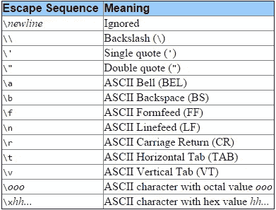
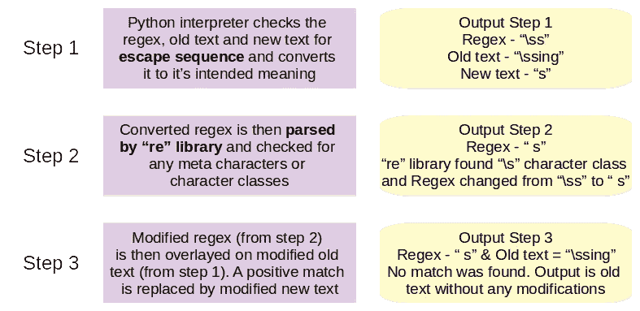
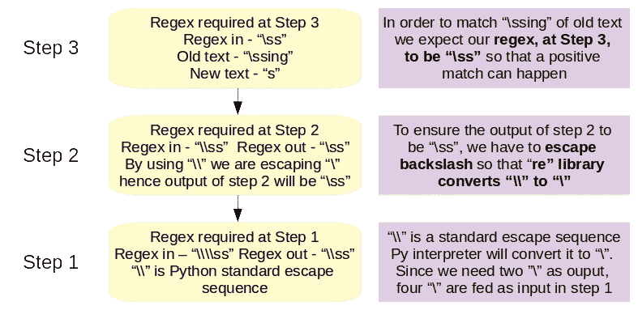
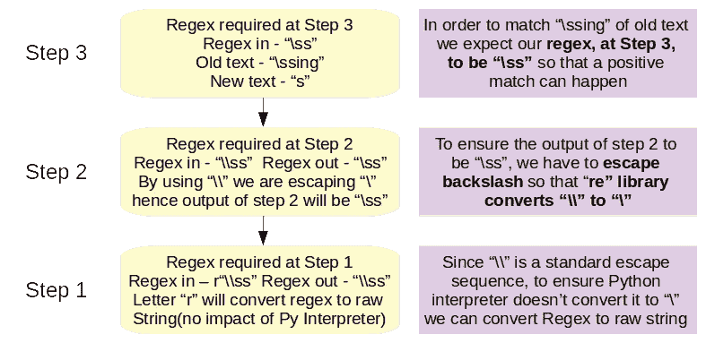

# 数据争论基础——为什么 Python 中的 Regex 前面有字母 r？

> 原文：<https://towardsdatascience.com/data-wrangling-basics-why-regex-in-python-preceded-by-the-letter-r-a9fa93ab7dad?source=collection_archive---------35----------------------->

## 解释 Python 中正则表达式的工作原理


克里斯·迪诺托在 [Unsplash](https://unsplash.com?utm_source=medium&utm_medium=referral) 上拍摄的照片

用 Python 语言写正则表达式(regex)时，我们总是以 ***字母 r*** 开头。在本教程中，我们将通过回答以下问题来理解使用它的原因:

1.  转义序列是什么？
2.  Python 解释器如何解释有或没有 ***字母 r*** 的转义序列？
3.  Python 语言中的正则表达式是如何工作的？
4.  正则表达式中使用 ***字母 r*** 的重要性

# 1.转义序列是什么？

转义序列是在文本定义中使用时不代表自身的字符集。它被翻译成一些其他字符或字符集，否则很难在编程语言中呈现。例如，在 Python 语言中，**字符集\n 表示新行，而\t 表示制表符**。字符集\n 和\t 都是转义序列。

Python 解释器理解的标准转义序列列表及其相关含义如下:



# 2.Python 解释器如何解释有或没有字母 r 的转义序列？

为了理解它对转义序列的影响，让我们看一下下面的例子:

```
**#### Sample Text Definition**
text_1 = "My name is Ujjwal Dalmia.\nI love learning and teaching the Python language"
print(text_1)**#### Sample Output**
My name is Ujjwal Dalmia.
I love learning and teaching the Python language**#### Sample Text Definition**
text_2 = "My name is Ujjwal Dalmia.\sI love learning and teaching the Python language"
print(text_2)**#### Sample Output**
My name is Ujjwal Dalmia.\sI love learning and teaching the Python language
```

在上面的 **text_1** 中，示例使用了 ***\n*** 字符集，而 **text_2** 使用了 ***\s*** 。从第一节分享的转义序列表中，我们可以看到 ***\n*** 是 Python 语言中标准转义序列集的一部分，而 ***\s*** 不是。因此，当我们打印这两个变量时，转义序列 ***\n*** 被 Python 解释器解释为新的行字符，而 ***\s*** 保持原样。请注意，text_1 和 text_2 的**定义不包括字母 r 。**

让我们更进一步，**在文本定义中包含了字母 r***。*

```
***#### Sample Text Definition (with letter "r")**
text_1 = r"My name is Ujjwal Dalmia.\nI love learning and teaching the Python language"
print(text_1)**#### Sample Output**
My name is Ujjwal Dalmia.\nI love learning and teaching the Python language**#### Sample Text Definition (with letter "r")**
text_2 = r"My name is Ujjwal Dalmia.\sI love learning and teaching the Python language"
print(text_2)**#### Sample Output**
My name is Ujjwal Dalmia.\sI love learning and teaching the Python language*
```

> *包含字母 r **对 text_2** 没有影响，因为 ***\s*** 不是 Python 语言中标准转义序列集的一部分。令人惊讶的是，对于 **text_1** *，***Python 解释器并没有将 *\n* 转换成新的行字符**。这是因为**字母 r** 的出现将文本转换成了一个**原始字符串。简单来说，字母 r 指示 Python 解释器保持转义序列不变**。*

# *3.)正则表达式在 Python 语言中是如何工作的？*

*为了理解正则表达式在 Python 语言中是如何工作的，我们将使用 ***sub()* 函数( *re* Python 包)，该函数基于正则表达式**驱动的模式匹配**，用**新文本**替换旧文本**的一部分。让我们用一个例子来理解这一点:*

```
***#### Importing the re package**
import re**#### Using the sub function**
re.sub("\ts","s", "\tsing")**#### Sample Output**
'sing'*
```

*在本例中，我们试图用独立的 ***字母 s*** 替换前面带有制表符的*字母 s* 。从输出中可以看出，文本***\青*** 转换为 ***唱*** 。让我们参考下面的流程图来理解***sub()******函数*** 如何产生想要的结果。在流程图中，我们将 ***到*** 称为 ***正则表达式*，*字母 s*** 称为**新文本，**和***\青*** 称为**旧文本。***

**

*使用标准转义序列的替换(图片由用户提供)*

## *说明*

*在前面的例子中，我们使用了字符集 ***\t，*** ，这是 Python 语言中标准转义列表的一部分。因此，在第一步中，Python 解释器在**正则表达式文本**和**旧文本**中都用 ***标签*** 替换了转义序列。由于正则表达式模式与上一步中的输入文本相匹配，所以发生了替换。*

*在下一个例子中，我们将使用一个不同的字符集， **\s，**，它不是 Python 语言中标准转义列表的一部分。*

```
***#### Importing the re package**
import re**#### Using the sub function(this time with a non-standard escape sequence)**
re.sub("\ss","s", "\ssing")**#### Sample Output**
"\ssing"*
```

*在本例中，我们试图用独立的*字母 s* 来替换前面带有\s 的*字母 s* 的任何实例。显然，**输入文本没有变化，**输出仍然与旧文本相同。同样，在流程图中，我们将 ***\ss*** 称为**正则表达式， *s*** 称为**新文本，**和***\ ss***称为**旧文本。让我们从下面的流程图中理解这种行为背后的原因:***

**

*使用非标准转义序列替换(图片由作者提供)*

## *说明*

*在步骤 1 中，由于\s 是**而不是标准的转义序列**，Python 解释器既没有修改正则表达式也没有修改旧文本，而是让它们保持原样。在第 2 步中，由于\s 是一个代表空格的**元字符**，它得到从\ss 转换为 ***空格* s** 的**。因为在旧文本中， ***空格* s** 不存在，没有正匹配，因此旧文本保持不变。***

*从这一部分我们可以得出两个结论:*

> ***旧文本和新文本的转义序列评估仅由 Python 解释器完成。对于 Python 和 regex 解释器的正则表达式**。因此，对于新旧文本，步骤 1 的结果是它们的最终版本，对于 regex，是步骤 2。*
> 
> ***在文本和正则表达式模式只包含标准转义序列(Python 语言的一部分)的场景中，我们得到了想要的结果。然而，当有额外的元字符时，结果可能不符合预期**。*

# *4.)在正则表达式中使用字母 r 的重要性*

*从上一节的第二个例子中，我们看到正则表达式没有产生预期的结果。为了找到正确的解决办法，让我们倒推。*

**

*自下而上的解决方案(图片由作者提供)*

## *说明*

> *为了用 ***字母 s* ，**替换旧文本中的 **\ss** ，我们希望步骤 3 中的正则表达式模式匹配我们想要替换的文本。*
> 
> *为了实现这一点，我们需要正则表达式模式在第二步结束时变成 **\\ss** 。当正则表达式解释器遇到这种模式时，它会将元字符**双反斜杠**转换为**单反斜杠**，步骤 2 的输出将是 **\ss。***
> 
> *最后，为了确保步骤 2 中的正则表达式是 **\\ss** ，我们在步骤 1 中传递 **\\\\ss** 。这是因为**双反斜杠**是 Python 语言的标准转义序列，根据第 1 节**、**中的表格，Python 解释器会将**双反斜杠转换为单反斜杠**。为了获得作为步骤 1 的输出的 **\\ss** ，我们提供 **\\\\ss** 作为我们的第一个正则表达式。Python 解释器将把 **\\\\ss** 文本模式转换成 **\\ss** 。*

*因此，上述问题的解决方案代码如下:*

```
***#### Importing the re package**
import re**#### Using the sub function with the modified regex**
re.sub("\\\\ss","s", "\ssing")**#### Sample output**
'sing'*
```

*我们现在有了问题的解决方案，但是剩下的问题是，**我们在哪里使用了字母 r** ？前面讨论中得出的正则表达式是一个候选解决方案。在简单的正则表达式需求中，可以使用上述方法，但是**考虑一个场景，其中正则表达式规定使用多个元字符和** **标准转义序列**。这需要我们:*

*   *首先区分标准和非标准转义序列*
*   *然后，每当我们遇到转义序列或元字符时，适当地放置正确数量的**反斜杠**。*

*在这种麻烦的情况下，采用以下方法会有所帮助:*

**

*用字母 r 替换多个转义字符(图片由作者提供)*

*我们在这里所做的唯一更改是将**四个反斜杠**替换为**两个**前面的****字母 r*** 。这将确保在步骤 1 中，Python 解释器将正则表达式视为原始字符串，并保持不变。将正则表达式转换为原始字符串将确保:**

*   **我们不用担心记住 Python 标准转义序列的列表。**
*   **对于标准转义序列或任何元字符的存在，我们不必担心反斜线的正确数量。**

**综上所述，我们最终最合适的解决方案如下:**

```
****#### Importing the re package**
import re**#### Using the sub function with the modified regex**
re.sub(**r**"\\ss","s", "\ssing")**#### Sample Output**
'sing'**
```

# **结束语**

**每当编写下一个正则表达式时，请注意这个 ***字母 r*** 。我希望这篇教程能让你更好地理解正则表达式的工作原理。**

**快乐学习！！！！**