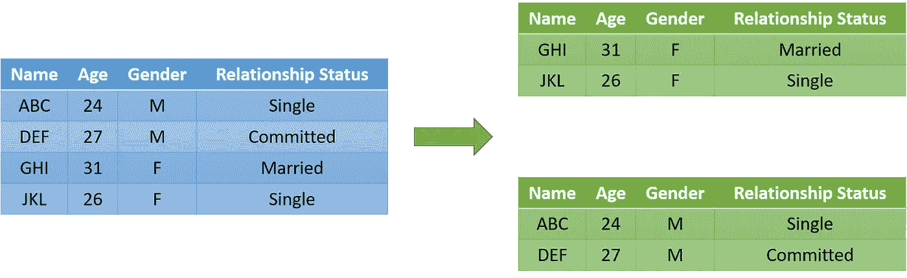
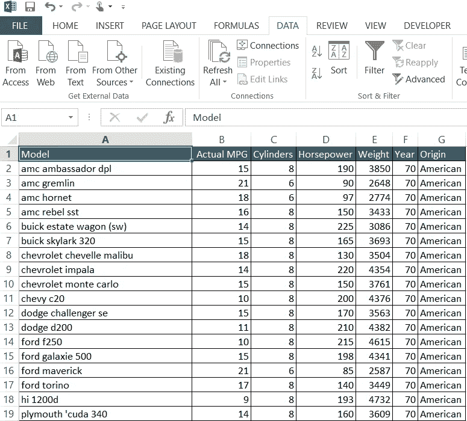
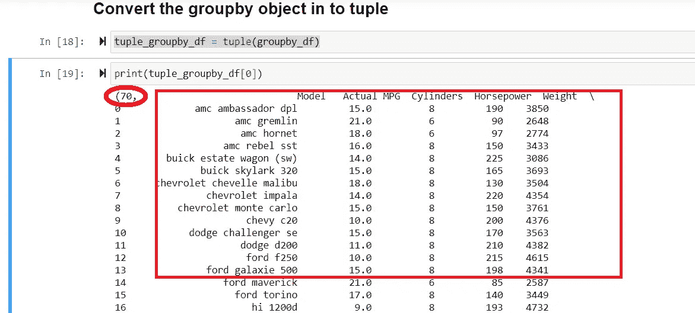

# 数据争论解决方案—切片数据帧时动态创建变量

> 原文：<https://towardsdatascience.com/data-wrangling-solutions-dynamically-creating-variables-when-slicing-dataframes-fc5613c46831?source=collection_archive---------34----------------------->

## 让 Python 变得简单


布莱克·韦兰在 [Unsplash](https://unsplash.com?utm_source=medium&utm_medium=referral) 上拍摄的照片

在从事数据科学项目时，我们花了 70%以上的时间来调整数据以满足我们的需求。在管理数据时，我们会遇到许多在像 pandas 这样的标准库中没有现成解决方案的情况。

一个这样的场景是当我们不得不从一个数据帧中**创建多个数据帧。当我们有一个分类变量时，我们会遇到这种情况，我们希望根据这个变量的不同值来分割数据帧。这种情况的直观表示如下:**



示例场景(图片由作者提供)

鉴于上述情况，可以建议手动分割数据帧。是的，这是一个可能的解决方案，但是只有当变量中的类别数量很少时。当分类值的数量达到数十或数百时，问题变得具有挑战性。在 Python 中，**我们没有任何现成的函数**来解决这个问题。因此，我们将**提供一个使用 Python 字典**的变通解决方案。该字典中的**键将是变量**的不同类别。字典**的**值组件**将是数据帧切片本身**。

实施此解决方案的逐步方法详述如下:

# 假设和建议

动手是掌握编程的关键。我们建议您在完成教程的过程中继续实现这些代码。**样本数据**和**关联的木星笔记本**在[的文件夹**场景 _1 中**这个 GitHub 链接**的**](https://github.com/dalmiaujjwal/Data_Wrangling_Tips_Tricks)中。

如果你是 GitHub 新手，从 [**这个教程**](/must-know-tools-for-data-scientists-114d0b52b0a9) 学习它的基础知识。此外，要在您的系统上设置 Python 环境并学习 Anaconda 发行版的基础知识，请参考本教程[](/getting-started-guide-anaconda-80a4d30d3486)**。**

****本教程假设**读者至少具备使用 Python 和相关包(如 Pandas 和 Numpy)的中级知识。以下是本教程中使用的 Python 概念和 pandas 函数/方法的列表:**

## **熊猫功能**

*   **阅读 _csv**
*   **分组依据**

## **Python 概念**

*   **元组**
*   **字典**

# **解决办法**

## **步骤 1 —准备好数据**

**在本教程中，我们将使用*著名的 *cars.csv* 数据集。数据集包含大约 400 种车型的里程、马力、重量等细节。我们的目标是根据变量 *year* 将这个数据帧分割成多个数据帧。这个数据集和样本数据快照的字典如下:***

*   ***型号—汽车型号的名称***
*   ***实际 MPG——汽车型号的里程***
*   ***气缸——汽车模型中气缸的数量***
*   ***马力——汽车模型的功率***
*   ***重量——汽车模型的重量***
*   ***年份—制造年份***
*   ***原产地——制造国***

******

***样本数据快照(图片由作者提供)***

## ***步骤 2——在 Python 中导入 pandas 包和数据集***

***一旦有了可用的数据，下一步就是将其导入到 Python 环境中。***

```
***#### Sample Code
#### Importing Pandas** import pandas as pd**#### Importing Data File - Change the Windows Folder Location** imp_data = pd.read_csv("C:\\Ujjwal\\Analytics\\Git\\Data_Wrangling_Tips_Tricks\\Scenario_2\\cars.csv")*
```

***我们使用 Pandas 的 read_csv 函数来读取 Python 中的数据。***

## ***步骤 3——创建 *groupby* 对象***

***一旦我们读取了数据，将 *groupby* 方法应用于数据帧。使用与要用于分割数据帧的参数相同的列。***

```
***#### Create a groupby object**
groupby_df = imp_data.groupby("Year")*
```

***默认情况下，Pandas 中的 groupby 对象有**两个主要组件:*****

*   *****组名—** 这些是用于分组的分类变量的唯一值***
*   *****分组数据—** 这是对应于每个组名的数据帧本身的切片***

## ***步骤 4 —将 groupby 对象转换为元组***

***通过将 groupby 对象转换成一个元组，我们打算将分类值和它们相关的数据帧结合起来。为此，将 groupby 对象作为参数传递给 Python 函数 *tuple* 。***

```
***#### Sample Code**
tuple_groupby_df = tuple(groupby_df)**#### Checking the values of a tuple object created above** print(tuple_groupby_df[0])*
```

******

***样本元组输出(图片由作者提供)***

***注意 tuple 对象的两个组件。第一个值 70 是制造年份，第二个值是切片数据帧本身。***

## ***步骤 5—将元组转换成字典对象***

***最后，我们将使用 python 函数 *dict* 将 tuple 对象转换成一个字典。***

```
***#### Converting the tuple object to a dictionary** dictionary_tuple_groupby_df = dict(tuple_groupby_df)*
```

***上一步中创建的字典是我们在教程中提到的变通解决方案。该解决方案与手动创建实际变量**的唯一区别在于变量名。为了使用切片数据，而不是使用变量名，我们可以使用带有正确键值的字典。让我们了解如何:*****

```
***#### Manual creation of variables (slicing cars data for year 70)**
cars_70 = imp_data[imp_data["year"] == 70]**#### Checking the shape of the sliced variable**
cars_70.shape**#### Output** (29, 7)**#### Checking the shape using the dictionary we have created**
dictionary_tuple_groupby_df[70].shape**#### Output**
(29, 7)*
```

***在上面的代码中，当使用 shape 属性时，我们使用了 dictionary 对象，而不是使用特定的变量名。***

# ***结束语***

***您是否知道，通过掌握数据争论技巧，您可以将模型构建生命周期缩短 20%以上？我希望上面介绍的解决方案是有帮助的。***

***敬请关注未来教程中更多的**数据争论解决方案**。***

***快乐学习！！！！***