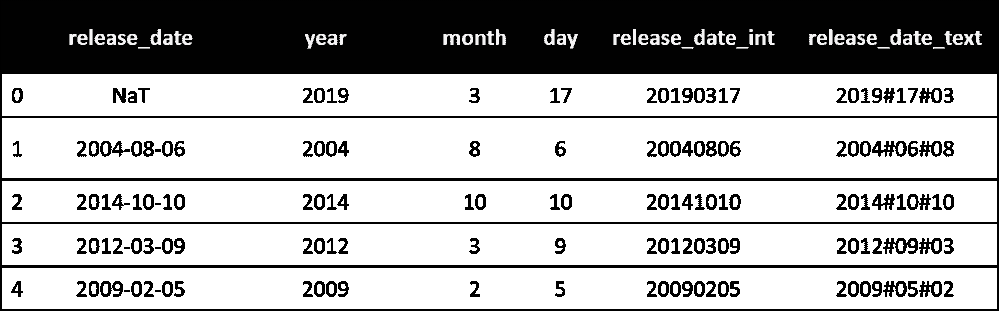

# 数据争论解决方案—处理日期—第 1 部分

> 原文：<https://towardsdatascience.com/data-wrangling-solutions-working-with-dates-part-1-1cb2c33b2ef5?source=collection_archive---------19----------------------->

## 读取包含日期列的文件。


Elena Mozhvilo 在 [Unsplash](https://unsplash.com?utm_source=medium&utm_medium=referral) 上的照片

这里讨论的主题是每个有抱负的数据科学家/分析师在开始数据科学之旅时都会遇到的挑战。这个问题的挑战在于，你会在这样或那样的场景中不断遇到它，而每次你这样做的时候，你都会搜索以找到解决方案。在本教程和接下来的几个教程中，我们将学习**如何使用日期数据类型**。

# 假设和建议

动手是掌握编程的关键。我们建议您在完成教程的过程中继续实现这些代码。**样本数据**和**关联的木星笔记本**在**场景 _5 文件夹**的[这个 GitHub 链接](https://github.com/dalmiaujjwal/Data_Wrangling_Tips_Tricks) 中。

如果你是 GitHub 新手，想学习它，请通过 [***这篇***](/must-know-tools-for-data-scientists-114d0b52b0a9) 教程。要在您的系统上设置一个新的 Python 环境，请阅读本 教程中的 [***。***](/getting-started-guide-anaconda-80a4d30d3486)

以下是本教程中使用的 Python 概念和 pandas 函数/方法的列表:

## 熊猫功能

*   阅读 _csv

# 挑战和解决方案

下面列出了读取日期列的各种挑战及其相关解决方案。但是，在开始之前，让我们了解一下我们用于此目的的数据集。

## 了解数据集

我们创建了一个虚拟数据集，它包含一个数据字段的多个版本， ***release_date*** 。这个虚拟数据集的数据字典如下:

*   **发布日期** —删除了第一个日期值**的实际日期栏。**
*   **release_date_int** —包含日期信息但**为整数格式**的另一列，例如，日期**2020–02–12 以 YYYYMMDD 格式表示为 20200212。**
*   **release_date_text** —包含文本格式的**日期的列，**和 ***#* 作为分隔符**。格式代码为 **YYYY#DD#MM** 。
*   **年** —仅包含日期数据的**年值**的列。
*   **月** —仅包含日期数据的**月值**的列。
*   **日** —包含**日**信息的列

数据集的快照共享如下:



样本数据快照(图片由作者提供)

## 挑战 1— **读取包含日期列的 Excel/CSV 文件**

在这个场景中，我们试图读取数据集，其中**焦点在 *release_date* 列**上。下面的示例代码演示了 ***read_csv*** 如何以普通形式读取日期列。

```
**#### Sample Code
#### Importing Pandas** import pandas as pd**#### Importing Data File - Change the Windows Folder Location** imp_data = pd.read_csv("C:\\Ujjwal\\Analytics\\Git\\Scenario_5\\Date_Dataset.csv")**#### Checking the dataset information** imp_data.info()**#### Sample output**<class 'pandas.core.frame.DataFrame'>
RangeIndex: 3000 entries, 0 to 2999
Data columns (total 6 columns):
 #   Column             Non-Null Count  Dtype 
---  ------             --------------  ----- 
 0   release_date       2999 non-null   object
 1   release_date_int   3000 non-null   int64 
 2   release_date_text  3000 non-null   object
 3   year               3000 non-null   int64 
 4   month              3000 non-null   int64 
 5   day                3000 non-null   int64 
dtypes: int64(4), object(2)
memory usage: 140.8+ KB
```

观察 ***info*** 方法的输出。熊猫将 ***release_date*** 列读取为**对象数据类型**。为了**将其作为日期对象**读取， ***read_csv*** 函数提供了使用**附加参数**的选项。有关解决方案，请参考下面修改后的代码

```
**#### Sample Code
#### Importing Pandas** import pandas as pd**#### Importing Data File - Change the Windows Folder Location** imp_data = pd.read_csv("C:\\Ujjwal\\Analytics\\Git\\Scenario_5\\Date_Dataset.csv", **parse_dates = ["release_date"]**)**#### Checking the dataset information** imp_data.info()**#### Sample output**<class 'pandas.core.frame.DataFrame'>
RangeIndex: 3000 entries, 0 to 2999
Data columns (total 6 columns):
 #   Column             Non-Null Count  Dtype         
---  ------             --------------  -----         
 **0   release_date       2999 non-null   datetime64[ns]**
 1   release_date_int   3000 non-null   int64         
 2   release_date_text  3000 non-null   object        
 3   year               3000 non-null   int64         
 4   month              3000 non-null   int64         
 5   day                3000 non-null   int64         
dtypes: datetime64[ns](1), int64(4), object(1)
memory usage: 140.8+ KB
```

## 说明

*   *release_date* 列现在作为**日期-时间对象**可用。
*   **parse_dates** —该参数希望我们将所有日期列名作为一个列表传递。如果这些列中的日期值正确，它会将这些列解析为日期-时间数据类型。

## 挑战 2—读取包含年、月和日列的 Excel/CSV 文件

在这个场景中，我们将尝试将年、月和日这三个单独的列读入一个日期列。从 *read_csv* 函数的普通用法中，我们知道 *read_csv* 将**三列作为整数**读取。在下面修改过的代码中，我们再次使用了 ***parse_dates*** 参数来获得想要的结果。

```
**#### Sample Code
#### Importing Pandas** import pandas as pd**#### Importing Data File - Combining 3 columns into a single date field** imp_data = pd.read_csv("C:\\Ujjwal\\Analytics\\Git\\Scenario_5\\Date_Dataset.csv", **parse_dates = ["release_date", ["year","month","day"]]**)**#### Checking the dataset information** imp_data.info()**#### Sample output**<class 'pandas.core.frame.DataFrame'>
RangeIndex: 3000 entries, 0 to 2999
Data columns (total 4 columns):
 #   Column             Non-Null Count  Dtype         
---  ------             --------------  -----         
 0   year_month_day     3000 non-null   datetime64[ns]
 1   release_date       2999 non-null   datetime64[ns]
 2   release_date_int   3000 non-null   int64         
 3   release_date_text  3000 non-null   object        
dtypes: datetime64[ns](2), int64(1), object(1)
memory usage: 93.9+ KB
```

## 说明

*   注意新的*datetime 64【ns】*列***year _ month _ day***的创建。该函数将 release_date 列作为日期-时间对象读取。
*   **parse_dates** —在上面分享的代码中，除了传递 *release_date* 列之外，我们还传递了另一列*年*、*月*和*日*列名(日期数据的单个组件)。函数 ***parse_dates*** 已将该列表转换为日期列。

> **要点**—除了传递列名，我们还可以使用列号传递给 parse_dates 参数。我们可以使用所有三个日期组件(年、月和日)，也可以只使用两个组件(年和月)。它不接受任何其他参数组合。列名可以是任何名称，不必是日期组件的名称。最后，列表中列的顺序应该是年、月&日期，否则列将作为对象数据类型可用。

## 挑战 3—读取包含年、月和日列的 Excel/CSV 文件并添加自定义列名

在上一个挑战中，我们成功地将年、月和日列解析为一个日期列，但无法自定义其名称。对上面的代码稍加修改就可以帮助我们实现这一点。

```
**#### Sample Code
#### Importing Pandas** import pandas as pd**#### Importing Data File - Combining 3 columns into a single date field** imp_data = pd.read_csv("C:\\Ujjwal\\Analytics\\Git\\Scenario_5\\Date_Dataset.csv", **parse_dates = {"combined_date":["year","month","day"]}**)**#### Checking the dataset information** imp_data.info()**#### Sample output**<class 'pandas.core.frame.DataFrame'>
RangeIndex: 3000 entries, 0 to 2999
Data columns (total 4 columns):
 #   Column             Non-Null Count  Dtype         
---  ------             --------------  -----         
 0   combined_date      3000 non-null   datetime64[ns]
 1   release_date       2999 non-null   object        
 2   release_date_int   3000 non-null   int64         
 3   release_date_text  3000 non-null   object        
dtypes: datetime64[ns](1), int64(1), object(2)
memory usage: 93.9+ KB
```

## 说明

*   注意新的*datetime 64【ns】*列***combined _ date***的创建。
*   **parse_dates** —这一次，我们没有将年、月和日这三列作为列表的列表来传递，而是将这些列的列表作为一个**字典**。字典的关键字是新的列名，值组件是要组合的列的列表。

# 结束语

挑战三的解决方案的输出中，少了一小块。确定它及其相关解决方案，并在下方进行评论。答案就在通过 [GitHub 资源库](https://github.com/dalmiaujjwal/Data_Wrangling_Tips_Tricks)分享的 Jupyter 笔记本里。

在本教程中，我们学习了如何读取包含日期信息的列。在下一个教程中，我们将学习如何将非日期时间格式的日期数据转换为日期时间格式。

快乐学习！！！！