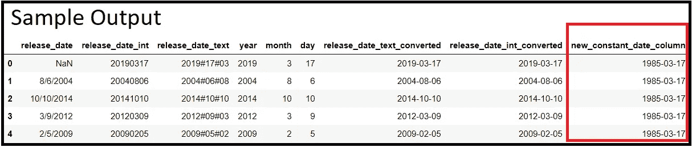

# 数据争论解决方案—处理日期—第 2 部分

> 原文：<https://towardsdatascience.com/data-wrangling-solutions-working-with-dates-part-2-58a4393c8218?source=collection_archive---------26----------------------->

## 将列从非日期数据类型转换为日期数据类型


斯坦纳·恩格兰在 [Unsplash](https://unsplash.com?utm_source=medium&utm_medium=referral) 上拍摄的照片

在 [**上一期教程**](/data-wrangling-solutions-working-with-dates-part-1-1cb2c33b2ef5?sk=ec87904999d5726211d9361028f35651) 中，我们看了读取包含日期时间变量的数据文件的各种方法。在本教程中，我们将讨论如何**处理现有数据帧** **的列，该数据帧包含日期-时间数据，但仍被 Python 作为对象数据类型**读取。

# 假设和建议

动手是掌握编程的关键。我们建议您在完成教程的过程中继续实现这些代码。**样本数据**和**关联的木星笔记本**在[的文件夹**Scenario _ 6**this GitHub link****](https://github.com/dalmiaujjwal/Data_Wrangling_Tips_Tricks)中。

如果你是 GitHub 新手，想学习它，请通过 [***这篇***](/must-know-tools-for-data-scientists-114d0b52b0a9) 教程。要在您的系统上建立一个新的 Python 环境，请阅读本教程。

以下是本教程中使用的 Python 概念和 pandas 函数/方法的列表:

## 熊猫功能

*   阅读 _csv
*   截止日期时间

# 挑战和解决方案

## 了解数据集

正如上一篇教程中所解释的，我们已经创建了一个虚拟数据集，它包含一个数据字段的多个版本， ***release_date*** 。这个虚拟数据集的数据字典如下:

*   **发布日期** —删除了第一个日期值**的实际日期栏。**
*   **release_date_int** —包含日期信息但**为整数格式**的另一列，例如，日期**2020–02–12 以 YYYYMMDD 格式表示为 20200212。**
*   **release_date_text** —包含文本格式的**日期的列，**和 ***#* 作为分隔符**。格式代码为 **YYYY#DD#MM** 。
*   **年** —仅包含日期数据的**年值**的列。
*   **月** —仅包含日期数据的**月值**的列。
*   **日** —包含**日**信息的列

数据集的快照共享如下:


样本数据快照(图片由作者提供)

在下面解释的所有场景中，我们假设这个虚拟数据文件是使用普通的 ***read_csv*** 实现在 Python 中读取的。读取伪数据和每列信息的代码如下:

```
**#### Sample Code
#### Importing Pandas** import pandas as pd**#### Importing Data File - Change the Windows Folder Location** imp_data = pd.read_csv("C:\\Ujjwal\\Analytics\\Git\\Scenario_6\\Date_Dataset.csv")**#### Checking the dataset information** imp_data.info()**#### Sample output**<class 'pandas.core.frame.DataFrame'>
RangeIndex: 3000 entries, 0 to 2999
Data columns (total 6 columns):
 #   Column             Non-Null Count  Dtype 
---  ------             --------------  ----- 
 0   release_date       2999 non-null   object
 1   release_date_int   3000 non-null   int64 
 2   release_date_text  3000 non-null   object
 3   year               3000 non-null   int64 
 4   month              3000 non-null   int64 
 5   day                3000 non-null   int64 
dtypes: int64(4), object(2)
memory usage: 140.8+ KB
```

## 挑战 1 — **将包含文本格式的日期时间数据的列转换为日期时间对象**

在这个场景中，我们试图将***release _ date _ text***列从对象数据类型转换为日期-时间数据类型。演示这一点的示例代码如下:

```
**#### Sample Code
#### Datatype Conversion (Assuming the data is already read into a dataframe)** imp_data["release_date_text_converted"] = **pd.to_datetime(imp_data["release_date_text"], format="%Y#%d#%m")****#### Checking the dataset information** imp_data.info()**#### Sample output**<class 'pandas.core.frame.DataFrame'>
RangeIndex: 3000 entries, 0 to 2999
Data columns (total 7 columns):
 #   Column                       Non-Null Count  Dtype         
---  ------                       --------------  -----         
 0   release_date                 2999 non-null   object        
 1   release_date_int             3000 non-null   int64         
 2   release_date_text            3000 non-null   object        
 3   year                         3000 non-null   int64         
 4   month                        3000 non-null   int64         
 5   day                          3000 non-null   int64         
 **6   release_date_text_converted  3000 non-null   datetime64[ns]**
dtypes: datetime64[ns](1), int64(4), object(2)
memory usage: 164.2+ KB
```

## 说明

*   新列***release _ date _ text _ converted***现在可以作为**日期-时间对象**使用。
*   **to_datetime** —该函数期望**第一个参数是我们要将**转换为日期-时间对象的列(熊猫系列)**。作为**的第二个参数**，我们必须向**提供数据当前存在的格式**。**

> 在我们的例子中，数据的格式是***【YYYY # DD # MM***。在这种格式中，我们将**年成分**表示为 ***%Y*** *，*月成分表示为 ***%m*** *，*，日期成分表示为 ***%d*** 。

## 挑战 2 — **将包含整数形式的日期的列转换为日期时间对象**

这个场景与前一个略有不同。这里，源列不是文本格式的，而是整数格式的。实现该解决方案的代码如下:

```
**#### Sample Code
#### Datatype Conversion (Assuming the data is already read into a dataframe)** imp_data["release_date_int_converted"] = **pd.to_datetime(imp_data["release_date_int"], format="%Y%m%d")****#### Checking the dataset information** imp_data.info()**#### Sample output**<class 'pandas.core.frame.DataFrame'>
RangeIndex: 3000 entries, 0 to 2999
Data columns (total 8 columns):
 #   Column                       Non-Null Count  Dtype         
---  ------                       --------------  -----         
 0   release_date                 2999 non-null   object        
 1   release_date_int             3000 non-null   int64         
 2   release_date_text            3000 non-null   object        
 3   year                         3000 non-null   int64         
 4   month                        3000 non-null   int64         
 5   day                          3000 non-null   int64         
 6   release_date_text_converted  3000 non-null   datetime64[ns]
 **7   release_date_int_converted   3000 non-null   datetime64[ns]**
dtypes: datetime64[ns](2), int64(4), object(2)
memory usage: 187.6+ KB
```

## 说明

*   新列***release _ date _ int _ converted****现在可以作为**日期时间对象**使用。*
*   ***to_datetime** —除了对**格式**参数的输入之外，本解决方案中的代码保持不变。由于日期部分之间没有分隔符，我们使用的修订格式是 ***%Y%m%d*** 。*

## *挑战 3 — **手动向数据帧添加一个具有固定日期值的新列***

*有时，情况需要我们创建一个新的日期列，其中包含一些固定值。对上面的代码稍加修改就可以帮助我们实现这一点。*

```
***#### Sample Code
#### Datatype Conversion (Assuming the data is already read into a dataframe)** imp_data["new_constant_date_column"] = **pd.to_datetime("1985-17-03", format="%Y-%d-%m")****#### Checking the dataset information** imp_data.info()**#### Sample output**<class 'pandas.core.frame.DataFrame'>
RangeIndex: 3000 entries, 0 to 2999
Data columns (total 9 columns):
 #   Column                       Non-Null Count  Dtype         
---  ------                       --------------  -----         
 0   release_date                 2999 non-null   object        
 1   release_date_int             3000 non-null   int64         
 2   release_date_text            3000 non-null   object        
 3   year                         3000 non-null   int64         
 4   month                        3000 non-null   int64         
 5   day                          3000 non-null   int64         
 6   release_date_text_converted  3000 non-null   datetime64[ns]
 7   release_date_int_converted   3000 non-null   datetime64[ns]
 **8   new_constant_date_column     3000 non-null   datetime64[ns]**
dtypes: datetime64[ns](3), int64(4), object(2)
memory usage: 211.1+ KB*
```

**

*示例输出(图片由作者提供)*

## *说明*

*   *观察包含常量日期值的新列***new _ constant _ date _ column***。*
*   ***to_datetime** —这一次，我们没有传递包含日期-时间对象的列，而是向函数传递了一个常量日期值。格式参数也相应调整。*

# *结束语*

*根据我们在本教程中采用的方法，**您能想出一个将三个日期列:年、月和日转换成一个日期列的解决方案吗**？参考通过 [GitHub 库](https://github.com/dalmiaujjwal/Data_Wrangling_Tips_Tricks)共享的 Jupyter 笔记本，了解解决方案。*

*在本教程中，我们学习了如何将 dataframe 列从任何数据类型转换为日期时间对象。在下一个教程中，我们将讨论与日期-时间列相关的各种数据争论活动。*

*快乐学习！！！！*