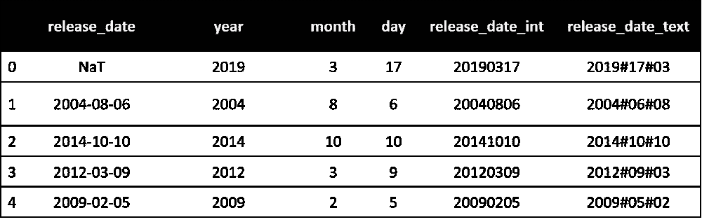

# 数据争论解决方案—处理日期—第 3 部分

> 原文：<https://towardsdatascience.com/data-wrangling-solutions-working-with-dates-part-3-b8b5caccc4ed?source=collection_archive---------33----------------------->

## 从包含日期时间数据的列中提取信息。


在 [Unsplash](https://unsplash.com?utm_source=medium&utm_medium=referral) 上由 [Waldemar Brandt](https://unsplash.com/@waldemarbrandt67w?utm_source=medium&utm_medium=referral) 拍照

在上两个教程中，我们从 [**导入包含日期列的数据**](/data-wrangling-solutions-working-with-dates-part-1-1cb2c33b2ef5) 到 [**将它们**](/data-wrangling-solutions-working-with-dates-part-2-58a4393c8218) 从非日期时间数据类型转换为日期时间数据类型。在本教程中，我们将介绍一些在处理日期时间列时遇到的数据争论场景及其解决方案。

# 假设和建议

如果您想在遵循教程的同时实现代码，请使用**示例数据**和**关联的 Jupiter 笔记本**，它们位于 [**的 **Scenario_7 文件夹**这个 GitHub 链接**](https://github.com/dalmiaujjwal/Data_Wrangling_Tips_Tricks) 中。

要了解 GitHub，请通过 [***这篇***](/must-know-tools-for-data-scientists-114d0b52b0a9) 教程。 [***这个***](/getting-started-guide-anaconda-80a4d30d3486) 教程将帮助你建立一个新的 Python 环境，如果它还没有建立的话。

以下是本教程中使用的 Python 概念和 pandas 函数/方法的列表:

## 熊猫功能

*   阅读 _csv
*   截止日期时间
*   日期偏移
*   日期存取器

# 挑战和解决方案

## 了解数据集

正如上一篇教程中所解释的，我们已经创建了一个虚拟数据集，它包含一个数据字段的多个版本， ***release_date*** 。这个虚拟数据集的数据字典如下:

*   **发布日期** —删除了第一个日期值**的实际日期栏。**
*   **release_date_int** —包含日期信息但**为整数格式**的另一列，例如，日期**2020–02–12 以 YYYYMMDD 格式表示为 20200212。**
*   **release_date_text** —包含文本格式的**日期的列，**和 ***#* 作为分隔符**。格式代码为 **YYYY#DD#MM** 。
*   **年** —仅包含日期数据的**年值**的列。
*   **月** —仅包含日期数据的**月值**的列。
*   **日** —包含**日**信息的列

原始数据集的快照共享如下:



样本数据快照(图片由作者提供)

在下面解释的所有场景中，我们都假设这个虚拟数据在 Python 环境中被成功读取或转换为 DateTime 变量。读取数据的示例视图如下:


Python 中读取的示例数据(图片由作者提供)

## 挑战 1 — **创建一个比现有列提前 n 天/月/年的新列。**

这是我们在处理数据集时经常遇到的情况之一。为了实现这个目标，我们将使用 Pandas 的内置函数， ***DateOffset*** 。在下面的示例代码中，我们使用现有的日期列创建一个新列，其中的日期值提前 7 天:

```
**#### Sample Code
#### A view to existing columns** imp_data["release_date_text"].head()**#### Output** 0   2019-03-17
1   2004-08-06
2   2014-10-10
3   2012-03-09
4   2009-02-05**#### New column 7 days ahead** imp_data["release_date_text_7daysplus"] = **imp_data["release_date_text"] + pd.DateOffset(days=7)**
```


示例输出—提前日期(图片由作者提供)

## 说明

*   新列***release _ date _ text _ 7 days plus****是使用 ***DateOffset*** 函数创建的。*
*   ***日期偏移** —该函数将日期值偏移 ***n 个周期*** 。 **n 的值可以是任意整数，**和**周期可以是年、月、周、日和小时等等**。根据偏移周期类型，我们应该使用相关的关键字作为参数(在我们的示例中，它是 days)。完整的关键词列表，参考这个 [**链接**](https://pandas.pydata.org/pandas-docs/stable/reference/api/pandas.tseries.offsets.DateOffset.html) 。*

## *挑战 2 — **提取日期列的各种组件***

*其中一个理想的场景是从日期中提取像工作日、星期几这样的信息。我们可以在 Pandas 中使用由 ***dt*** 表示的**日期访问器**来实现这一点。下面的示例代码将演示我们如何使用其中一个日期列提取工作日。*

```
***#### Sample Code
#### A view to existing columns** imp_data["release_date_text"].head()**#### Output** 0   2019-03-17
1   2004-08-06
2   2014-10-10
3   2012-03-09
4   2009-02-05**#### Extracting Weekdays** 
imp_data["Weekdays"] = **imp_data["release_date_int"].dt.dayofweek**
imp_data["Weekdays"].head(3)**#### Ouput**
0    6
1    4
2    4
Name: Weekdays, dtype: int64**#### Extracting year** 
imp_data["year"] = imp_data["release_date_int"].dt.year
imp_data["year"].head(3)**#### Ouput**
0    2019
1    2004
2    2014
Name: year, dtype: int64*
```

## *说明*

*   *观察包含**工作日**和**年份**信息的新列。*
*   ***日期访问器** —日期访问器(表示为 dt)提供了现成的方法，用户可以使用这些方法从日期时间对象中提取特定的组成部分。请注意，我们只能将日期时间访问器应用于 dataframe 系列(单列)。有关这些组件的完整列表，请参考此 [**链接**](https://pandas.pydata.org/pandas-docs/version/1.0.1/user_guide/timeseries.html#time-date-components) **。***

## *挑战 3—寻找日期差异或对两个不同的日期列使用**逻辑运算***

*对于熊猫来说，这个任务就像增加或减少 2 列一样简单。让我们直接看下面的例子来理解:*

```
***#### Sample Code
#### Finding difference between 2 dates**
imp_data["days_difference"] = **imp_data["release_date_text_7daysplus"] - imp_data["release_date_text"]**
imp_data["days_difference"].head()**#### Sample Ouptut** 0   7 days
1   7 days
2   7 days
3   7 days
4   7 days
Name: days_difference, dtype: timedelta64[ns]**#### Comparing Dates**
imp_data["Is_bigger"] = **imp_data["release_date_text_7daysplus"] > imp_data["release_date_text"]**
imp_data["Is_bigger"].head()**#### Sample Output** 0    True
1    True
2    True
3    True
4    True
Name: Is_bigger, dtype: bool*
```

*请注意，在上述所有场景中，操作的输出是一个 series 对象，如果我们想进一步使用它，我们应该将它作为一个新列存储在 dataframe 中。*

## *结束语*

*我们现在以一个示例问题结束本教程。**利用我们在过去三个日期时间教程中学到的知识，您能想出一个解决方案来手动更正数据帧单元格中出现的错误日期吗？**答案参考通过 [GitHub 资源库](https://github.com/dalmiaujjwal/Data_Wrangling_Tips_Tricks)分享的 Jupyter 笔记本。*

*快乐学习！！！！*