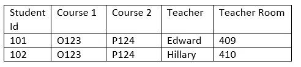
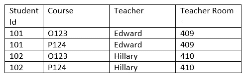
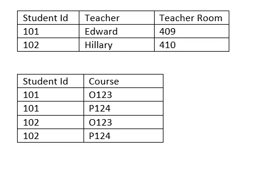
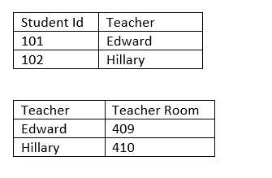

# 数据库规范化

> 原文：<https://towardsdatascience.com/database-normalization-8bba077d12db?source=collection_archive---------12----------------------->

## 规范化技术的概念性描述。

托拜厄斯·菲舍尔在 [Unsplash](https://unsplash.com?utm_source=medium&utm_medium=referral) 上的照片

“DATA”是每个软件应用的核心。因此，任何软件的成功和可用性都高度依赖于数据的组织方式。根据软件所处理的业务用例的类型，可以有多种方法来组织数据。例如，大多数事务性应用程序或 OLTP 应用程序使用 ***【规范化】*** 数据结构来存储数据。在讨论规范化的细节之前，让我们先了解一下 OLTP 的概念。

## 联机事务处理

OLTP 或在线事务处理是指对“事务”的支持和处理。想象你去网上书店购物。你选择这本书，把它放入你的购物车，结账，用你的信用卡或借记卡付款。你收到一张发票。这本书会以 PDF 格式发送到您的电子邮件中。这些行为被称为“交易”。应用程序的顺利运行取决于数据库存储是如何设计或建模来处理事务数据的。OLTP 应用无处不在。诸如网上银行、购物、销售点终端、机票预订等日常应用都涉及到在线交易处理。交易的主要特征如下:

1.  交易频繁。例如，在网上购物商店的例子中，可能有多个客户订购多种产品，导致许多支付交易，其中许多交易同时发生。因此，数据变化非常频繁。有许多插入、更新、删除操作需要快速、频繁地执行
2.  数据更改由多个用户执行

这种 OLTP 应用程序的数据库设计应该考虑事务的上述特征。这就是正常化概念的由来。这些概念最适合于以行和列的表格形式存储数据的关系数据库系统。

## 正常化

规范化是以一种高效的方式处理事务的方式来组织数据库中的数据的过程。有规则才能实现常态化。每个规则被称为“范式”。

为了理解不同的范式，让我们以一个学生数据为例。我们有几个学生注册了由一个或多个老师教授的一门或多门课程。此类数据的原始形式如下所示:

作者图片

**第一范式(1NF):** 以第一范式存储数据的基本原则是-

1.  消除每个表格中重复的数据组。
2.  为每组相关数据创建一个单独的表
3.  标识表中的主键

在上面的例子中，我们不应该让课程在同一个表中重复。应该为学生和课程创建单独的表。

作者图片

**第二范式(2NF):** 表中的属性在功能上应该依赖于主键。不应该有冗余。在上面的例子中，每个学生都有多个课程值。从功能上讲，课程不依赖于学生，因此应如下所示:

作者图片

**第三范式(3NF):** 表中的属性应该“只”依赖于主键。不应该有相互依赖。在上面的例子中，教师房间依赖于教师，但不直接依赖于学生 Id。因此，应该有一个单独的表将这种依赖关系移出。

作者图片

标准化的总结可以表述为-

> 表的属性应该依赖于主键，依赖于整个键，除了键什么都不是。

请参考下面的文章，深入了解数据建模概念:

 [## 数据建模:概述

### 本文概述了软件应用程序中的数据建模。它描述了常用术语并解释了…

towardsdatascience.com](/data-modeling-an-overview-ed6165a27309)