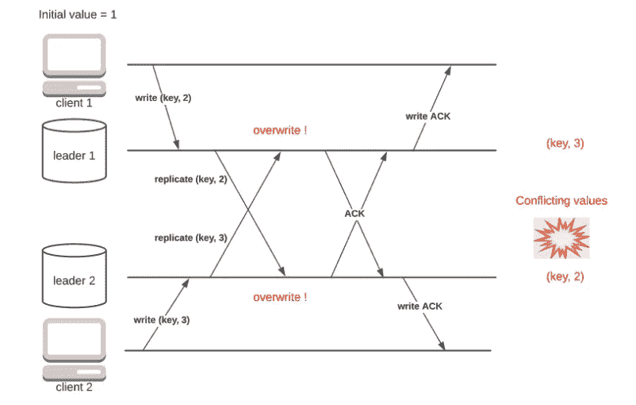
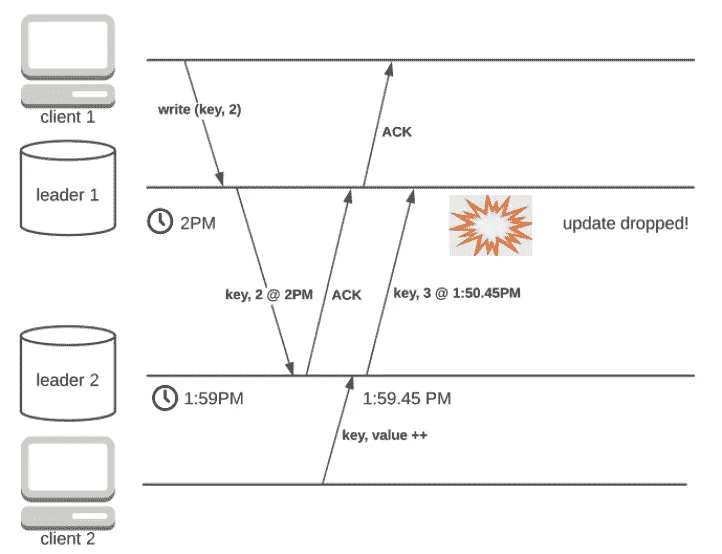
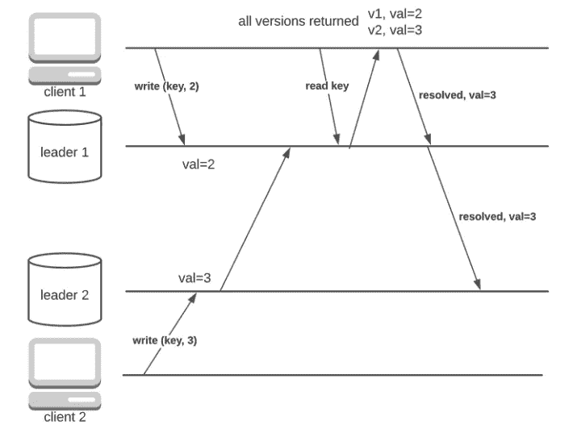
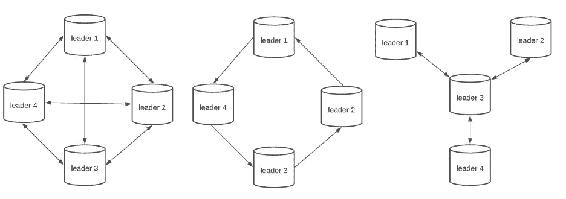

# 数据库复制说明 2

> 原文：<https://towardsdatascience.com/database-replication-explained-10ff929bdf8a?source=collection_archive---------7----------------------->

## 第 2 部分—多领导者复制

# 介绍

在现代互联网时代，数据复制无处不在。从银行账户到脸书个人资料，再到你心爱的 Instagram 图片，人们认为重要的所有数据几乎肯定会在多台机器上复制，以确保数据的可用性和持久性。在本文中，我们将探讨一种最常见的复制策略，称为多领导者复制。

多主复制是一种基于单主策略的方法，用于提高数据库的可伸缩性和可用性。单个领导者方法的一个问题是，所有写入必须通过同一领导者(对于同一分区)。对于像 YouTube 这样的大规模服务，单一领导者意味着来自遥远地区(例如，印度和美国)的喜欢点击同一视频的客户必须与同一领导者交谈。为了避免长距离通信带来的延迟以及由此带来的不良用户体验，可以使用多领导者复制作为替代方案。

# 理论

下图描述了多主复制的数据流。为了解决上面提到的问题，将多个节点放在不同的数据中心，每个节点响应相邻的客户端。当接收到写请求时，处理领导者将同步或异步地将该请求转发给其他领导者。

图 1 —多领导者复制，按作者分类

与单领导者设置相比，多领导者复制提供了更好的可扩展性和容错能力。然而，人们已经发现了使用多领导复制的其他有趣的方法。例如，具有与远程服务器同步的本地数据库的应用程序可以被视为多领导者复制的极端场景，其中如果客户端离线进行更改，同步可能需要几天时间。

## 深潜

**冲突解决**
多领导者复制最突出的问题是冲突解决。虽然在单个领导者设置中也会出现冲突，但这种情况很少发生，因为裂脑和故障转移是可以检测和修复的。在多领导者设置中，会发生冲突，因为客户端可以向多个领导者发送并发写入请求。考虑以下情况:

图 2 —按并发性划分的冲突，按作者划分的数字

在这个场景中，有两个并发更新被发送到数据库。我们称它们为并发，因为两者都不知道对方，而且没有明确的顺序。系统无法知道哪个值实际上是最新的(假设时间是通用的。抱歉爱因斯坦！)因为没有两台电脑的时钟是完全同步的。我们能做的最好的事情是避免图 2 中灾难性的、永久的不一致状态。以下是一些有用的想法:

**最后一次写入成功及其变体:**
正如我提到的，对于并发写入，没有明确的顺序。如果我们可以人为地引入排序呢？例如，每次写入都有时间戳，系统会保留最新的时间戳。另一种方法是不使用时间戳，而是使用随机生成的 ID。系统通过选择具有较大 ID 的写入来解决冲突。

这个想法非常简单，乍一看，您可能会开始寻找极限情况。你是对的；即使是因果相关的请求，最后一次写入成功也会导致数据丢失。如果我们依赖服务器的本地时钟，一切都会失控，如图 2 所示。

图 3-LLW，按作者分类

图 3 显示，如果服务器的时钟有偏差，LLW 可以丢弃后续更新。有 NTP 等校准服务器时钟的方法，但任何通过互联网的校准都不是 100%准确的(也许有一天我们可以用量子纠缠解决这个问题，只是抛出一个想法)。

**固定路由:**
这是思考为什么单领导者复制没有排序问题的好时机。它是精确的，因为所有的更新都是由同一个领导者处理的，他隐式地给请求分配了顺序。也许同样的哲学可以用在这里。如果同一个记录上的所有写入都由同一个领导者使用粘性路由来处理，会怎么样？

图 4-固定路由，按作者分类

固定路由非常接近于单个领导者复制，因为来自不同区域的客户端必须与同一个领导者对话。但是，与单个领导者相比，它确实提供了更好的可用性，因为其他领导者可以在节点出现故障时介入(例如，使用一致散列来重新分配请求)。

**自定义算法:**
尽管我们在服务器端尽了最大努力，但如果不牺牲一些东西，冲突解决就无法完美解决。也许现在是我们扭转局面，请客户解决冲突的时候了。
想法很简单；服务器不会尝试解决冲突。当接收到并发写入时，服务器会保留这两个值。在读取时，所有冲突的值都被返回给客户端，读取器负责找出该做什么。

图 5 —带有冲突切换的自定义算法，由作者提供

图 5 描述了一种被称为读取修复的方法。冲突的值都返回给客户机，客户机更了解数据语义。一旦制定了决议，最终值将广播给所有领导。

# 拓扑

到目前为止，我们已经讨论了多领导复制的注意事项。还有另一个需要考虑的重要问题—复制拓扑。当收到一个请求时，它是如何传递给其他领导的？

图 6 —拓扑，按作者分类

最直观的方法是广播，也称为全连接拓扑—收到写请求的领导者向所有其他领导者发布命令。你可以想象，这会导致网络上成吨的聊天者，当你有越来越多的领导者时，情况只会变得更糟。消息的总数是 O(N)，其中 N 是领导者的数量。此外，如果两个领导者之间的链路变得拥塞，它会妨碍整体性能。

另一种替代方法称为环形拓扑。每个领导者只向另一个领导者发送消息，如图 5 所示。消息总数为 O(N)，比完全连接少得多。然而，如果任何节点发生故障，整个通信链路都会被切断，这使得它不那么健壮。

最后，星型拓扑。乍一看，您可能会注意到中间的节点—单点故障。你是对的。这个瓶颈使得拓扑变得脆弱(也可以配置故障转移，但是它增加了额外的复杂性)。然而，星型拓扑也不是一无是处。两个节点之间的任何通信最多只需两跳，比环形拓扑快得多。

# 摘要

像许多工程设计一样，选择正确的复制策略需要权衡利弊。使用多引线架构时，您应该仔细评估以下问题，以得出最佳配置:

1.  使用什么冲突解决方案？在这种情况下，你无法解决冲突。有一些算法，如最后写入获胜或智能路由，可以通过牺牲数据持久性或可用性来自动解决冲突。此外，自定义冲突解决方案可用于处理客户的艰难选择。在做出任何决定之前，您应该仔细评估系统的 SLA。
2.  领导之间用什么沟通拓扑？如果领导的数量很少，也许你更适合全连接拓扑。否则，星形和环形拓扑会在复杂性和可靠性之间进行权衡。