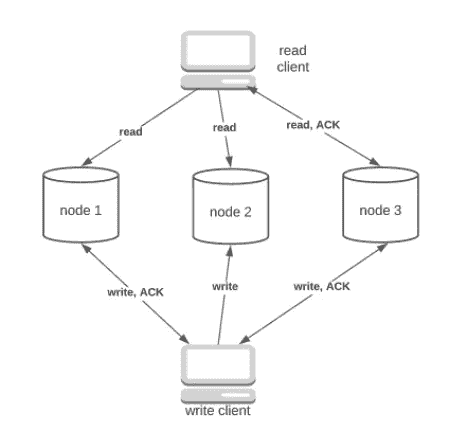
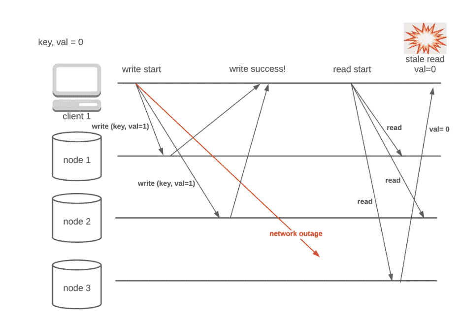
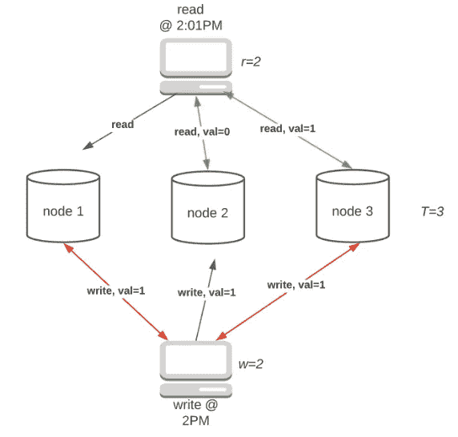
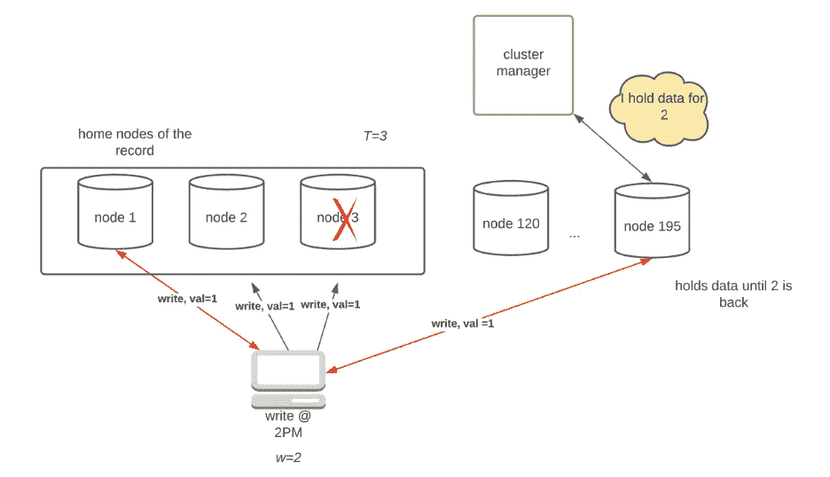
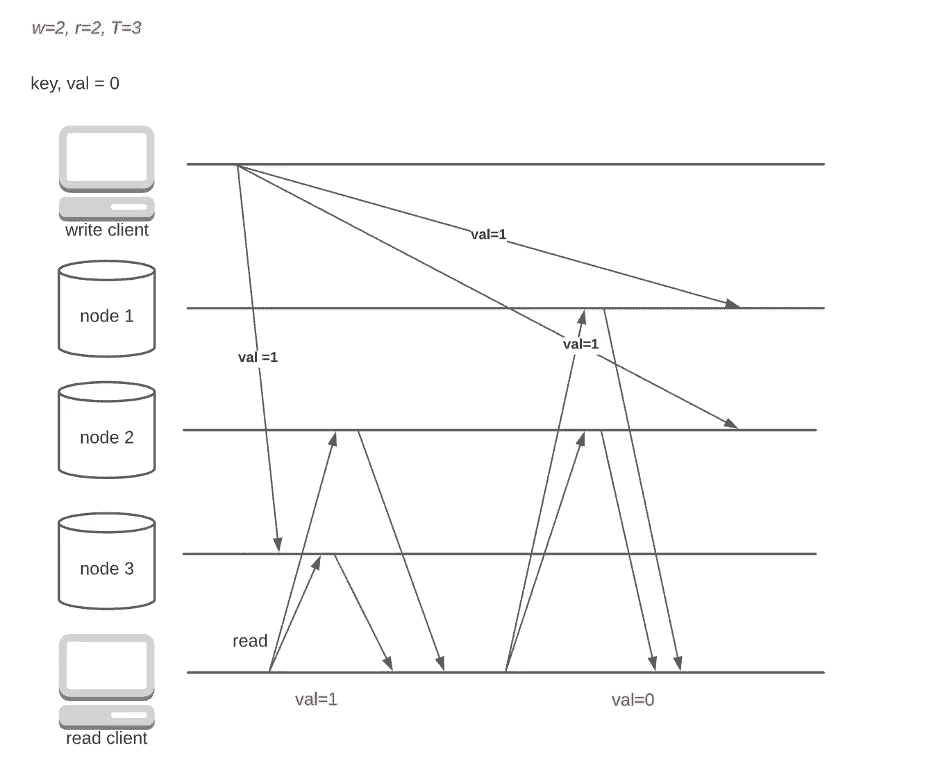
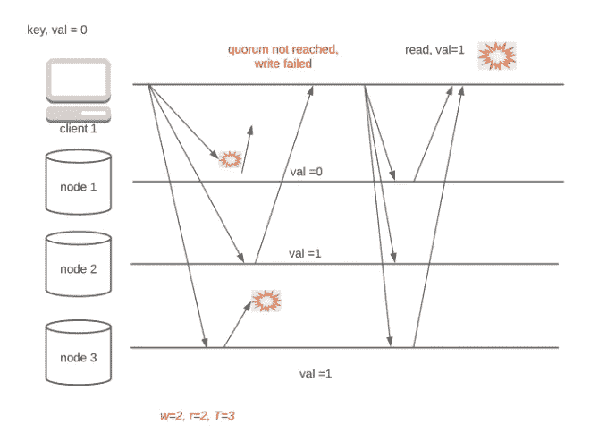

# 数据库复制说明 3

> 原文：<https://towardsdatascience.com/database-replication-explained-3-32d6deceeca7?source=collection_archive---------7----------------------->

## [提示和技巧](https://towardsdatascience.com/tagged/tips-and-tricks)

## 第 3 部分-无领导复制

在现代互联网时代，数据复制无处不在。从银行账户到脸书个人资料，再到你心爱的 Instagram 图片，人们认为重要的所有数据几乎肯定会在多台机器上复制，以确保数据的可用性和持久性。之前我谈到过[单领导复制](/database-replication-explained-5c76a200d8f3)和[多领导复制](/database-replication-explained-10ff929bdf8a)。在本文中，我们将探讨一种最常见的复制策略，称为无领导复制。

无领导复制采用与基于领导的复制相反的理念。无领导设置中的节点被视为对等节点，它们都接受来自客户端的写入和读取。没有处理所有写请求的领导者，无领导者复制提供了更好的可用性。

# **理论**

图 1 展示了无领导复制的基本数据流。在写入时，客户端将请求广播到所有副本，而不是特定节点(领导者)，并等待一定数量的 ack。读取时，客户端会联系所有副本，并等待一定数量的响应。因为客户端等待许多响应，所以这种方法也称为仲裁。正如我们将在后面看到的，我们如何配置 quorum 是至关重要的，因为它决定了我们数据库的一致性。

图一。法定人数，按作者分列

图 1 中的写请求完成了向客户端发送 ACK 的三个副本中的两个。当三个副本中的一个返回最新值时，读取请求完成。到现在为止，您可能已经注意到，读写数字完全是由应用程序选择的超参数。自然的问题是我们如何确定读/写数。

# **深潜**

首先，我想为简明的讨论定义一些参数。将读取数表示为 *r* ，写入数表示为 *w* ，总副本数表示为*T*例如，图 1 中的法定数为 *r=1，w=2，T=3* 。

图 1 中使用的法定配置存在严重缺陷，因为它可能会返回过时的值。考虑以下情况:

图二。弱一致性法定人数，按作者列出的数字

如您所见，即使在成功更新后，选择不当的 r 和 w 也会导致过时读取。那么，我们如何配置定额来实现更好的一致性呢？

**严格法定人数**

如果有人将三个苹果放入五个桶中，每个桶的容量为一个苹果，我需要检查多少个桶才能得到一个苹果？最好的情况是，如果我幸运的话。在最坏的情况下，我需要检查不超过三个桶。现在将上下文更改为数据库。如果我成功更新了 *T=5* 中的 *w=3* 个副本，我需要联系多少个节点( *r* )来获取更新后的值？答案是 *r=3* 。

严格法定人数是一种需要 *w + r > T* 的配置类型。严格的法定人数意味着，由于具有更新值的节点和返回读取请求的节点之间的重叠，读取一致性几乎可以得到保证(不是 100%，我将在后面解释)(图 3)。

图三。严格法定人数，按作者分列

无领导复制高度可用，因为所有节点都接受读/写。通过严格的定额，当 *min(T-w，T-r)* 节点关闭时，系统仍然工作。例如，图 3 中的配置可以容忍*min(3–2，3–2)= 1*节点中断。

**草率的法定人数和暗示的移交**

虽然严格 quorum 提供了高可用性和低延迟(只等待速度最快的几个节点)，但是在网络分区期间，客户端肯定有可能与许多节点断开连接，从而无法到达 quorum。对于对停机时间容忍度更低的系统，松散的仲裁可能是一个不错的选择。

图 4，提示切换，按作者分类

在一个大型系统中，有许多节点( *N* )服务于数据库的不同分区，每行数据在 T 个节点上复制。如果太多的主节点停机，导致法定人数不足，那么剩余的( *N-T* )节点中的其他节点将临时介入以接受写请求，直到主节点重新联机(切换)。

在图 4 中，当节点 2 和 3 不可达时，节点 195 接受写请求。一旦它们重新加入集群，集群管理器将要求节点 195 将所有写入转移到主节点。

需要注意的是，对于读取请求，有两种选择。我们可以实施严格的仲裁(从主节点只读)，这提供了更好的一致性。如果需要更高的可用性，也可以为读取启用松散的仲裁(例如，Riak 就是这样做的)。然而，这种权衡导致潜在的过时读取，因为 *W + R > T* 不能保证写入和读取之间的重叠。

## **W 和 R 如何影响可用性**

w 和 R 是两个需要调整的有趣参数。当 W/R 较大时，系统需要更长时间来完成请求，因为它必须等待来自更多节点的 ACK。对于在线聊天应用程序等读写比率均衡的系统，将 W 和 R 设置为 *T/2 + 1* 以获得良好的性能是明智的。但是，对于读取量大的系统，我们可以选择小 R 大 w。

## **冲突处理**

像多领导者复制一样，冲突是由无领导者体系结构固有的缺乏请求排序引起的。我在上一篇关于多领导复制的文章中解释了一些冲突解决技术——读取修复、反熵和自定义算法(版本矢量、兄弟)。等等)

## **无领导复制的警告**

**强烈一致性的错觉**

图 5。强烈一致性的图像，由作者绘制

严格的法定人数可能会给人留下一种错觉，以为这是强一致性(线性化)的保证。虽然严格的法定人数确实可以确保更新读取，但在网络延迟的情况下，它也会表现得很奇怪。考虑以下情况:

强一致性(线性化)要求不允许版本翻转(读取两次，首先获取新值，然后获取旧值)。即使有严格的法定人数，当网络不稳定时，系统也不能保证线性化。

**棘手的故障处理**

无领导复制的另一个复杂因素是故障处理。考虑这样一种情况，所有节点都接收到一个写请求，但是一些 ACK 被延迟(图 6)。写请求被认为是失败的，但是客户端可能仍然能够看到脏值。这个问题是无领导架构所固有的，因为单个节点没有关于请求状态的全局信息。对于节点 2，失败的请求与任何其他请求没有什么不同。

图六。故障处理，由作者绘制

实现事务是解决这个问题的有效技术。然而，事务会多次放大节点间的抖动，并显著增加系统延迟。

# **总结**

像许多工程设计一样，选择正确的复制策略就是要权衡利弊。使用多重引线架构时，应仔细评估以下问题，以得出最佳配置:

1.  使用什么冲突解决方案？在这种情况下，你无法解决冲突。有一些算法，如最后写入获胜或智能路由，可以通过牺牲数据持久性或可用性来自动解决冲突。此外，自定义冲突解决方案可用于处理客户的艰难选择。在做出任何决定之前，您应该仔细评估系统的 SLA。
2.  可用性有多重要？如果可用性对您的系统至关重要，请考虑使用无领导复制，甚至使用带有提示切换的松散仲裁。
3.  一致性有多重要？严格的法定人数不能保证线性化。您可以部署同步读取修复之类的策略来确保强一致性，但这会降低系统的整体可用性。