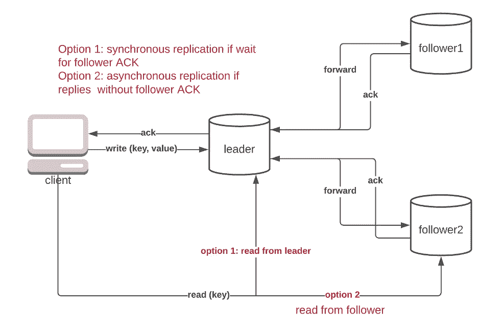
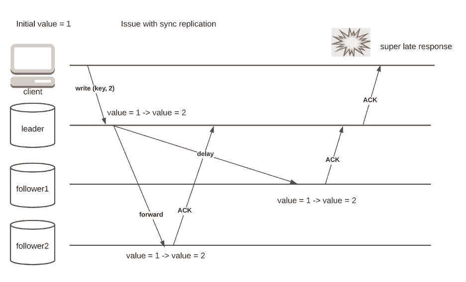
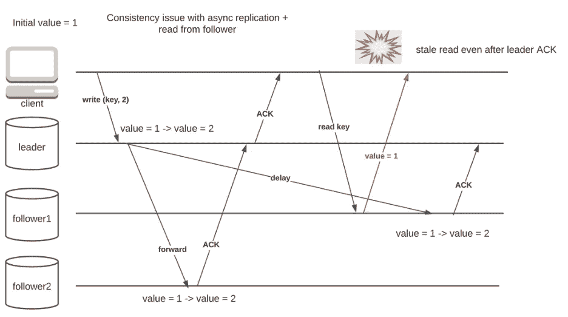
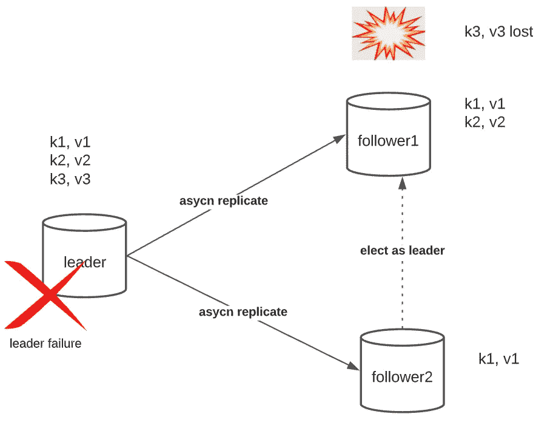
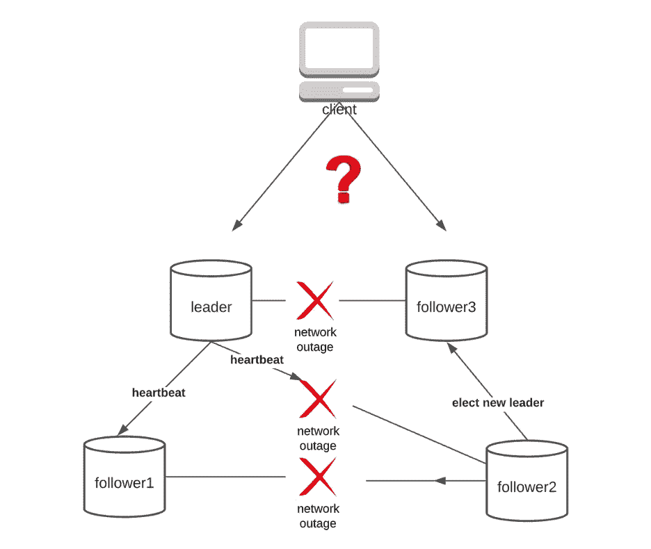

# 数据库复制说明

> 原文：<https://towardsdatascience.com/database-replication-explained-5c76a200d8f3?source=collection_archive---------11----------------------->

## 第 1 部分—单领导者复制

# 介绍

在现代大数据时代，数据复制无处不在。从银行账户到脸书个人资料，再到你心爱的 Instagram 图片，人们认为重要的所有数据几乎肯定会在多台机器上复制，以确保数据的可用性和持久性。在本文中，我们将探讨一种最常见的复制策略，称为单领导者复制。

单主复制，也称为主-辅备份，是一种提高数据可用性和持久性的简单方法。假设你让一个大学生设计一个复制策略。在这种情况下，她可能会提出类似的东西——单个节点(领导者)处理所有流量，并主动广播给其他节点(追随者)。

# 理论

下图描述了单主导复制的数据流。这个想法很简单——客户端将所有的**写**请求发送给领导者(我们稍后会详细讨论读)。然后，领导者向所有追随者广播该请求。一旦跟随器处理了写操作，ACK 就被发送回客户端。

图 1 —单个领导者复制，按作者分类的图像

## **深潜**

单领导者复制是一个简单的想法，但它并不像看起来那么简单。在选择单主导复制之前，工程师应该了解大量的考虑因素。我在最后一段中忽略了一些细节，我们将仔细检查它们。

**同步还是异步，这是个问题。**

首先，我们什么时候向客户端发送 ACK？领导者是否等待所有追随者处理请求(同步复制)？这种策略对某些应用很有效，但是它固有地降低了系统的可用性。如果领导者和追随者之间的网络中断，领导者可能需要等待很长时间，这在公共网络基础设施中经常发生(图 2)。更糟糕的是，想象一下如果一个追随者在同步复制设置中死亡会发生什么。领导者不能处理任何请求，仅仅是因为它从死跟随者那里得不到 ACK。

图 2 —响应时间长的同步复制，按作者排序的图像

谁开始营业了？

我们知道所有的写请求都发送给了领导者，但是读请求呢？这里有两种选择，要么让领导者也提供阅读，要么将追随者暴露给客户端。将所有压力都放在领导者身上对于读负载的应用程序来说不是一个好主意(如果模式主要是写，那么没有太大的区别)。但是，如果允许追随者服务于读请求，就会对一致性造成损害，如下图所示。

图 3——关注者提供的阅读信息损害了一致性，图片由作者提供

图 3 揭示了可用性和一致性之间的基本权衡，如 CAP 定理所规定的。由于异步复制引入的领导者和跟随者之间不可避免的复制滞后，问题就出现了。然而，我们仍然有一些技巧来实现更强的一致性保证。

技巧 1:使用时间戳实现写后读一致性。

在许多应用程序中，我们希望确保编写器永远不会看到过时的值(例如，如果您单击 like 按钮并刷新，您肯定不希望看到它被撤消)。这种保证可以通过强制客户端记住上次写入时间戳来实现。数据库只返回比该时间戳更早的值。

技巧 2:用于单调读取一致性的粘性路由。

通过简单的实现，客户端可以从任何副本中读取值。这有时会产生问题，因为不同的副本有不同的数据版本。客户端可能会在连续读取中获得不同版本的数据:从客户端 A 获得版本 2，然后从客户端 B 获得版本 1，然后再次从客户端 A 获得版本 2。为了解决这个问题，可以使用粘性路由负载平衡器来确保每个客户端只能从一个跟随者读取(如果它死了，当然是从另一个跟随者读取)

谁是被选中的人？

第三，领导者失败怎么办？当前的设计完全依赖于领导者节点的健康。在大型数据中心中，服务器停机经常发生。如果主节点停止工作，则会发生故障转移，因为为了可用性，必须提升从节点来处理写请求。

就数据持久性而言，同步复制设置中的故障转移不是大问题。但是，在完全异步的设置中，主节点故障可能会导致数据丢失，因为从节点没有最新的写入。对于客户来说，他们的作品就像凭空消失了一样。更糟糕的是，想想如果老领导重新加入这个团体会发生什么。它很可能与新领导发生写冲突，新领导已经处理了额外的请求

图 4 —异步复制可能导致数据丢失，按作者排列的图像

另一个有趣的事情是人们所说的裂脑，这是一种由于网络中断而导致两个节点成为领导者的情况。这确实是一种危险的情况，因为多个领导者总是会导致相互冲突的写作。没有适当的冲突解决代码，系统将永远不会达成任何共识，从而破坏数据。

图 5-当网络被分割时，分裂的大脑，图片由作者提供

没有简单的方法可以自动避免裂脑。最常见的解决方案是通过拔掉旧 leader 的电源线进行手动故障转移。不过，如果你是那些喜欢算法的人，有几个工具可以试试。

招数:定额和击剑。

如果一个网络被划分为两个子集，则具有大多数节点的子集保持活动，同时通过向电源控制器发送特殊信号来拍摄少数子集(这不是我编的，这种方法字面上称为 STONITH，拍摄另一个节点的头部)。

**总结**

像许多工程设计一样，选择正确的复制策略就是要权衡利弊。使用单引线架构时，您应该仔细评估以下问题，以得出最佳配置:

1.  一致性与可用性？为关注者提供阅读服务是一把双刃剑。如果您选择它，应用程序代码必须仔细设计，以处理陈旧读取和其他一致性问题。
2.  可用性与耐用性？异步复制速度很快，但当主设备出现故障时，可能会导致数据丢失。同步复制以时间换取持久性，但对于某些应用程序来说，这可能并不划算。有些人决定留在中间——拥有一个同步副本和一堆异步副本。
3.  人工 vs .自动化？处理主节点故障一点也不好玩。工程师不想在凌晨 3 点工作。然而，自动故障转移是一个永远存在的兔子洞。裂脑、写操作冲突、数据丢失，应有尽有。