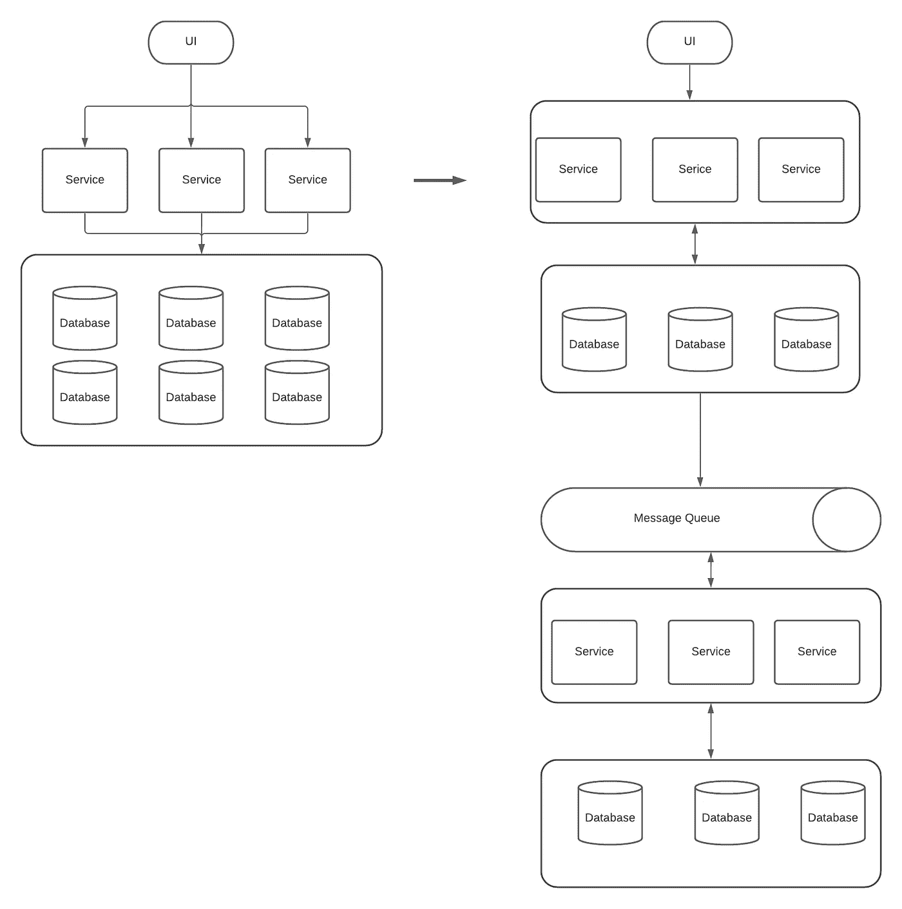

# 数据库与流处理——这对数据管理的未来意味着什么

> 原文：<https://towardsdatascience.com/database-vs-stream-processing-what-it-means-for-the-future-of-data-management-63042d047ae1?source=collection_archive---------27----------------------->

## 公司如何从数据库转移到事件流，为什么事件流本身对您的应用程序来说是不够的

由作者提供

当我们想到数据时，我们通常认为数据给人类提供了做出更好决策的洞察力。因此，存在诸如数据库的应用程序来与 UI 应用程序交互，以了解当前状态。

然而，数据可以帮助我们做出更好的决定，并帮助其他软件做出更好的决定，从而将人类从系统的关键路径中移除。

想想网飞——他们的业务是从出租 DVD 服务开始的，你去网飞租 DVD，他们会通过邮政服务寄送 DVD。2021 年，网飞已经成为一个纯软件平台，用户只需点击一个按钮就可以观看任何电影。

Airbnb 最初是像 Craiglist 这样的网站，没有支付提供商——你通过网站与主机连接，然后你实际支付主机。2021 年，Airbnb 已经成为一个纯软件平台，用户只需点击一个按钮，就可以租到任何房子并体验。

业务变得越来越自动化——业务流程变得更像自动驾驶仪。

我们也开始看到许多应用程序，其中用户界面是整个软件包中较小的一部分。我们看到公司创建软件来服务我们的最终用户，人类，并开发系统来与另一个系统对话。

当我们考虑数据管理系统时，有两样东西:流处理和数据库。了解两者的区别可以帮助我们知道如何为自己创造更好更高效的系统。

# 主动和被动数据

数据库和流处理是相似的，因为它们都是存储数据的容器。但是，它们的数据移动方式不同。

如果你想用数据库积累的内存来存储大量的数据，你可以使用 Cassandra。如果要存储包含实体间关系的数据，可以使用 Neo4J 这样的图形数据库；如果想拥有主动查询功能，可以使用弹性搜索。

这个数据库为我们关于数据的问题提供了答案。它们被构建为与包含 UI 的用户进行交互。因此，存储在这个数据库中的数据是被动的——它等待您对它们进行一些处理，而我们对它们进行的查询是主动的。如果我们——人类，在特定时间停止与数据库的交互，它不会做任何事情。

另一方面，流处理是异步的。他们最终用户不是我们——人类——而是其他软件。它们也像数据库一样存储数据，但是数据是活动的。通常触发的操作基于信息本身。它们帮助我们在系统内实现流程自动化。换句话说，查询(动作)被动地等待被触发。

# 你去过的地方和你现在的地方

数据库帮助我们回答关于我们在应用程序的当前状态的问题。数据库表表示单个时间点的当前状态。你不知道之前发生了什么。一个英语语法的类比将是一个数据库表更像一个名词。它有助于告诉你你现在在哪里。

另一方面，事件流更像一个动词。事件流回答了状态发生的历史。它记录了你手机里的移动，鼠标的悬停，或者订单的进度。它将每一个动作记录成一个事件，可以及时回放。你会得到更多关于发生了什么的信息。如果是棋局，可以知道对方的棋是不是聪明棋。

# 可变性与不可变性

我们可以认为流处理和数据库表的作用是一样的，但性质不同。事件流是一种特殊的表，它是不可变的——你不能改变它。数据库表通常是可变的，它使我们能够插入、删除和更新它的元素。

事件流中的每个事件就像一个事实。如果你订购了一个项目，你想取消它。系统会在订单状态的顶部添加取消状态—您可以倒回历史来查看您所做的事情。它就像一本账本。仅追加的好处之一是，我们与之交互的数据移动速度很快。当您想要更新当前状态时，另一个服务已经使用了它并执行了一些操作。因此，它需要创建一个补偿事件链来将所有这些操作传播给它的订阅者。

另一方面，数据库会将状态从订单更新为取消。您可以编辑数据移动到的行。它为系统提供了应用程序当前状态的真实来源。

数据库和事件流服务于具有不同受众的不同用途的应用程序。对于数据库来说，我们人类是它的最终用户。因此，将数据库设计为同步、被动的数据并将其标记为单个真实源是有意义的。对于事件流，最终用户不是人，而是软件。如果最终用户不是人类，我们可以利用异步来优化我们的资源。这些数据成为触发其他软件执行特定操作的数据。

尽管事件流和数据库在不同的用例中表现不同，但是团队不需要采用其中之一。更多的应用程序需要流和数据库来更好地了解其内部系统。这意味着我们在需要处理同步和异步的现代应用程序中会看到更多。因此，更多的企业应用程序使用面向流的数据库的混合方法。有几个活动数据库，如 MongoDB、CouchbaseDB 和 RethinkDB。也有可以充当数据库表的流处理器，比如 Flink 和 Hazelcast Jet。无论您的应用程序使用哪种混合方法，了解其中的差异都有助于我们理解采用哪种系统架构意味着什么。

# 资源

*   超越数据库，超越流处理器:数据管理的下一步是什么？
*   [视频版](https://www.youtube.com/watch?v=wTI6zj9Xbn4)

【https://edward-huang.com】最初发表于**。**