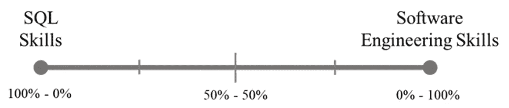

# 对 Databricks 笔记本爱恨交加

> 原文：<https://towardsdatascience.com/databricks-notebooks-a-love-hate-relationship-8f73e5b291fb?source=collection_archive---------3----------------------->

## 在这篇文章中，我给出了我对这个工具的看法，以及根据你的团队的技能和成熟度，你可以使用它来交付解决方案的各种方法。

自从两年前我开始使用 Databricks 以来，我一直对笔记本有一种奇怪的又爱又恨的关系。你们中有些人可能也有同感。

凯利·西克玛在 [Unsplash](https://unsplash.com?utm_source=medium&utm_medium=referral) 上的照片

# **笔记本正在使“大数据”民主化**

笔记本电脑将留在数据领域。从经典的 Jupyter 笔记本电脑到 Databricks 和 Azure Synapse Analytics 等其他 SaaS 解决方案推动的“在生产中运行”方法。

我曾经认为笔记本是一个超级强大的工具，它可以让没有或很少编程知识的开发人员构建复杂的数据集和 ML 模型。

看到它们在一些云提供商(如 Azure)中与 Data Factory 等工具集成得如此之好，让 ETL 编排变得超级简单、可视化和直观，这真是太棒了。特别提及笔记本参数和输出，它们确实有助于模块化数据管道。

Databricks 笔记本很容易成为大多数非高级数据用户在云上运行数据处理代码的事实方式。事实是，Databricks 消除了让代码在云上运行的大部分摩擦和复杂性，因为使用 Databricks 的用户已经在使用它了。因此，没有更多的“但它在我的笔记本电脑上工作”这样的借口。

总之，多亏了笔记本电脑，用户可以非常快速地传递价值，而不会遇到工程瓶颈。不幸的是，所有这些好的特性都是有代价的。

# **易用性是一把双刃剑**

为了能够在笔记本电脑上运行代码，您需要一个集群来进行计算。因此，即使用户只想使用 Pandas 编写一些简单的数据处理代码，您也必须为集群虚拟机和 dtu 付费。如果团队中的任何人都有权创建集群，那么也很容易以过大的集群而告终，并毫无理由地增加成本。

> “这个数据集非常大，大约有 4GB 但是不要担心，我已经用 3 个工人创建了这个群集，所以我认为这足以启动，但是如果需要，我们可以在以后添加更多。顺便说一下，我用熊猫是因为我不想学习 PySpark :D”

我们必须记住，Databricks 主要是作为一个托管平台构建的，用于在云上运行 Spark，而不是在单个节点上运行代码。直到一年前，甚至没有一个单节点集群选项可用(只有将 workers 设置为 0 的变通方法)。

另一方面，当你需要做的不仅仅是 SQL 查询或一些简单的脚本时，你开始感觉到使用笔记本的痛苦。

试图将良好的编程实践应用到笔记本中是相当困难和令人沮丧的。没有办法用基本的“import”命令导入你自己的类，你被迫使用官方的 hacky 变通办法，如“%run”从其他笔记本加载代码。调试封装的代码简直是一场噩梦，因为没有调试器，唯一的方法就是使用 print 语句(欢迎来到 80 年代)。关于单元测试，嗯……你需要非常有创造力！

这时，你会开始考虑跳到一个合适的 IDE，比如 PyCharm 或者 VS Code(在 Python 的情况下)，重新开始编写健壮的软件。可能是个好决定。不幸的是，一旦您执行了这一步，设置的复杂性就会增加，结果，您可能会失去一些人。不是每个人都有处理这种复杂性所需的软件工程技能。

# **找到最佳点**

选择何种方式编写代码将取决于开发团队的成熟度和技能。越是成熟和先进，他们就越有能力应对复杂性。从评估开始，以衡量当前的团队技能。大多数团队成员主要是具有多年关系数据库工作经验的 SQL 开发人员，但很少或根本没有编程技能吗？还是大部分团队成员都非常精通软件工程和 CI/CD 实践？或许介于两者之间？

作者图片

如果你想建立一个面向未来的项目，找到适合所有团队成员大部分能力的中庸工作方式是必须的。否则事情会出错。这并不是第一次因为创建项目的人离开了公司，而团队中没有其他人有能力让项目继续下去而导致项目中断。

# **选择适合您团队的方法**

在与不同技能的人一起参与不同的项目并分析了不同的可能性之后，我想到了下面一套方法，你可以根据你的团队能够处理的复杂程度来应用这些方法。

## **选项 1:仅笔记本电脑**

Databricks 中开箱即用的代码开发体验。只需在单元格中编写代码，必要时结合语言。

提供一套笔记本模板对加快解决方案的开发非常有帮助。此外，它将有助于建立一个标准的代码组织，有助于保持代码的有序性和易读性。

*   **优点:**对所有数据开发人员来说简单明了。
*   **缺点:**没有 IDE 开发，没有代码重用，只有试错调试，没有单元测试，代码会很快变得乱七八糟。

## **选项 2:笔记本+作为笔记本的一套实用功能**

与前一个选项相同，增加了一组捆绑在笔记本中的实用程序功能，可以从其他笔记本导入(%run)。这些功能可以包括从 SQL 数据库或增量表中读取或写入数据的功能…任何可以轻松重用的功能。

与以前几乎相同的复杂性，一切都保留在 Databricks 工作区内，实用程序功能对所有开发人员完全透明，如果需要，可以在现场轻松更改。

在这种情况下，为一些笔记本提供关于如何使用该实用程序功能的示例是非常有帮助的，或者更好的是，将它们合并到笔记本模板中。

*   **优点:**对所有数据开发人员来说简单明了，对效用函数代码重用，效用函数透明，易于现场更改。
*   **缺点:**没有 IDE 开发，只有试错调试，没有单元测试，运行笔记本导入代码感觉不对。

## **方案三:笔记本+一套实用功能代码包**

与前面的方法相比，主要的区别是捆绑效用函数的方式。在这种情况下，开发一个可以使用“import”语句导入的自定义代码包。

在这种情况下，复杂性增加得更多，因为解决方案的代码不仅存在于 Databricks 工作区中。代码包需要在本地机器上开发，这为使用 IDE、合适的调试引擎甚至包括单元测试提供了可能性。这也意味着，将代码提交到 Git 存储库，并包含一个 CI/CD 管道来发布包，以便可以从 Databricks 笔记本中使用它。

至于其余的开发人员，他们只需要相信这些实用功能完成了他们的工作，并专注于其余的逻辑。同样，提供一些使用示例将对代码包的采用非常有帮助。

*   **优点:**通过 IDE 开发、适当的调试和单元测试对实用函数进行代码重用，使用“import”语句导入代码。
*   **缺点:**代码包需要通过 CI/CD 构建和发布，代码变得不那么透明，用户只需信任它的功能。

## **选项 4:笔记本作为“主”功能+转换&实用功能作为代码包**

在这种情况下，我们在复杂性上更进一步。数据转换的逻辑现在也可以成为代码包的一部分。使用笔记本作为编排函数运行和注入参数的“主要”代码。

这种方法带来了充分的测试可能性，因为所有的代码都可以在本地机器上开发。另一方面，缺乏软件工程技能的数据开发人员被排除在开发之外。但是，它们仍然可以提供 SQL 查询作为参数传递给 *spark.sql()。*

这种设置的另一个缺点是在本地机器上工作时失去了与 Hive Metastore 的连接。因此，如果你的组织大量使用它，这可能是一个大问题。变通办法是使用 Databricks Connect 将您的代码发布到 Databricks 集群(如果您可以忍受[已知的限制](https://docs.databricks.com/dev-tools/databricks-connect.html#limitations))，或者，在您的本地机器中存储数据集的样本，也可以用样本模拟 Hive Metastore。

*   **优点:**代码可重用性、IDE 开发、正确的调试，以及对所有代码的单元测试，将笔记本电脑作为可用于编排的“主要”设备。
*   **缺点:**代码包需要通过 CI/CD 构建和发布，不适合没有软件工程技能的人，无法从本地机器访问 Databricks Hive Metastore。

## **选项 5:仅代码包**

这是硬核的方式。在本地机器上将所有逻辑编写在一个代码包中。你还记得火花峰会的命令吗？在 Hadoop 时代，它总是有效的，所以你为什么要改变它呢？

在这种情况下，前面方法的所有问题也适用。同样的代码应该可以应用于任何 Spark 集群，不管它是托管在 Databricks、Kubernetes 还是其他什么地方。

*   **优点:**代码可重用性、IDE 开发、正确的调试和所有代码的单元测试，相同的代码可以在任何 Spark 集群中运行(无论它托管在哪里)。
*   **缺点:**代码包需要通过 CI/CD 构建和发布，不适合没有软件工程技能的人，无法从本地机器访问 Databricks Hive Metastore。

# **向前移动**

我希望你能把前面的方法作为灵感的来源，而不是唯一的选择。我相信你能想出更好的方案来满足你团队的需求。

当然，选择其中一个选项并不意味着你必须永远坚持下去。只要团队在成长，技能组合就会扩大，团队就越有可能转移到更复杂、更健壮的设置。

在我看来，我会推荐从选项 2 开始，因为这是一种非常直接的方式来编写具有一定可重用性的代码，同时还涉及到 SQL 开发人员。复杂性的降低有助于更快地交付 MVP。这将满足涉众，他们将给出反馈并要求新的需求。稍后，您可以在“工业化”阶段将重点放在代码的健壮性上，转移到选项 3 和 4，同时团队继续扩展和开发处理更多复杂性所需的技能。

# 结论

笔记本时尚将会持续下去，不仅是 Databricks，其他 SaaS 的替代产品，如 Azure Synapse Analytics，都在推动将笔记本部署到生产中。它们扩展了数据开发人员的视野，允许没有编程技能的数据管理员利用“大数据”技术的可能性。

如果你有一个良好的软件工程基础，你会很快发现笔记本电脑的局限性，你可能迟早会想摆脱它们。幸运的是，有一些折中的解决方案可以帮助在不落下任何人的情况下两全其美，并且您可以根据您的团队技能进行微调。

感谢您的阅读，我希望您发现这是有帮助的！