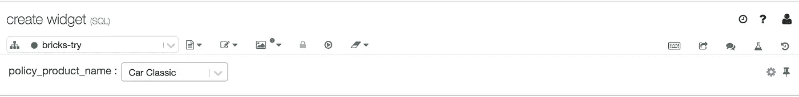
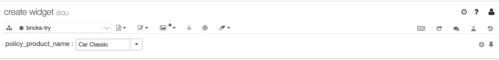
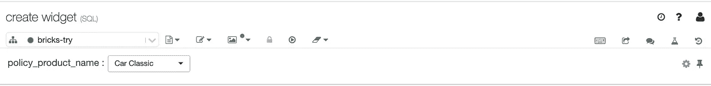
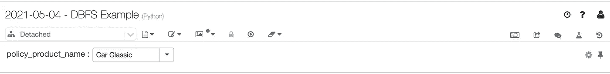
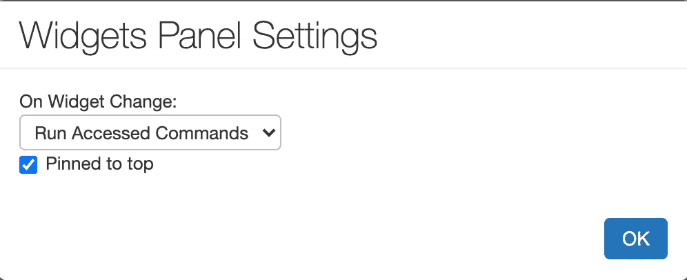

# 数据块部件

> 原文：<https://towardsdatascience.com/databricks-widgets-20483229e84e?source=collection_archive---------10----------------------->

## 如何使用 DataBricks 小部件和中间的其他东西


图片来自 [Unsplash](https://unsplash.com/photos/ANod8Sxse6g)

# 介绍

在过去的两个月里，我开始更频繁地使用 DataBricks，对此我有过许多情绪波动。前一分钟我还超级感动，后一分钟我又厌恶它。公平地说，许多关于它的负面情绪都与它需要一些时间来适应这一事实有关，我发现自己缺乏这样做的时间。

> 但是什么是数据块呢？

简而言之，DataBrick 就像 Jupyter 笔记本，但更多的是类固醇。它在以下方面胜过 Jupyter 笔记本

*   能够在一台笔记本上运行 spark SQL、scala、r 和 python 代码，只需使用%符号后跟语言名称，例如`%sql`、`%python`等。
*   它具有出色的文件组织，有利于团队笔记本访问和知识转移，即如果您的团队使用 DataBricks，您可以通过 DataBricks 中每个人的电子邮件地址工作区访问他们的笔记本。
*   用户可以通过集群调整计算能力。

> 什么是 DataBricks 小部件？

把一个小部件想象成一个过滤器。比如 SQL 中的`where`子句或者 Tableau 中的 filter 部分。

在数据块中，有三种主要类型的小部件

*   文本小部件——它在你的笔记本顶部创建一个文本框，用户(也就是你)可以在你的栏或数据中键入你只想看到的类别。
*   下拉单选小部件—在笔记本顶部创建一个下拉框，在您的列中显示预定义的默认字段。这种类型的小部件也有两种风格:下拉列表和组合框。
*   下拉多选小部件—这也类似于下拉单选小部件。唯一的区别是，您可以一次单击多个字段，而不是一个。

# 如何在 SQL 中创建小部件

在 DataBrick 中创建任何类型的小部件都有一个典型的代码模式，可以分为四个部分。

*   从`CREATE WIDGET`条款开始
*   后跟小部件的类型
*   然后指定一个小部件名称来标识小部件变量。
*   最后，一个`DEFAULT`命令和默认的选择词。默认单词是将作为默认单词出现在小部件图标中的单词。

小部件 SQL 查询如下所示

```
CREATE WIDGET <widget type> <widget variable name> DEFAULT <Default category word>
```

*注意:确保* ***默认类别词*** *在双/单引号内*

因为**下拉小部件类型**需要指定一个选择列来反映正确的类别，所以在默认单词之后添加了一个`select`语句。

这个 select 语句看起来像这样

```
SELECT DISTINCT <<column name>> 
FROM <<tablename>>
```

下面是所有四个小部件及其视觉效果的示例代码

**为文本小工具**

```
CREATE WIDGET TEXT Policy_product_name DEFAULT 'Car Classic'
```


**为下拉菜单**

```
CREATE WIDGET DROPDOWN policy_product_name DEFAULT 'Car Classic' CHOICES 
SELECT DISTINCT product_name 
FROM train_csv
```



**用于组合框**

```
CREATE WIDGET COMBOBOX policy_product_name DEFAULT 'Car Classic' CHOICES 
SELECT DISTINCT product_name 
FROM train_csv
```



**用于多选**

```
CREATE WIDGET MULTISELECT policy_product_name DEFAULT 'Car Classic' CHOICES 
SELECT DISTINCT product_name 
FROM train_csv
```



*注意，在上面的示例代码中，我们假设要查询的表名为 train_csv，要动态过滤的列名为 product_name。根据您的使用情况进行定制。*

*注意:小部件下拉框和文本框出现在笔记本工具栏的正下方。*



图片来自作者

# **如何利用小工具**

创建小部件是利用小部件的一个步骤。第二步是将微件链接到数据/表以控制过滤器动态

下面是一个链接小部件的示例查询

```
SELECT * 
FROM <table name> 
WHERE <column name> = getArgument(<widget name>)
```

*注意:* ***小工具名称*** *应该用双/单引号*

*   在这种情况下，where 子句指定了要作为筛选依据的列或字段。
*   where 子句还有一个名为`getArgument()`的附加函数，它将小部件的名称作为输入。

*注意:创建的小部件过滤器中的选项/列应该对应于 where 子句中的列*

**总之，**使用小工具分为两步

**步骤 1:** 创建小部件

**第二步:**将创建的小部件链接到您想要查询的表格

# **移除小工具**

要删除一个小部件，只需输入以下查询

```
REMOVE WIDGET <name>
```

其中<name>是您要删除的小工具的变量名</name>

上面的代码适用于所有的小部件类型，但是如果有许多小部件需要删除，您需要多次运行它并调整小部件的名称。

要一次删除所有小部件，您可以键入以下查询

```
%pythondbutils.widgets.removeAll()
```

在这种情况下，您需要通过在代码前使用`%python`命令来切换到 python。

# **使用数据砖块小部件的技巧**

1.  默认情况下，widget 设置通常是在**模式下运行笔记本**。这意味着每次您更改过滤器类别时，无论是下拉选项还是书面文本，它都会自动运行笔记本中的每个单元格。这有时会很烦人。您可以通过单击左上角的设置图标来调整小部件设置，该图标仅在创建小部件时出现。点击之后，你会看到一个弹出的窗口小部件面板设置对话框。有三种模式可供选择。这是界面的样子



图片来自作者

您可以根据需要调整设置

2.虽然您可以同时使用所有三种小部件类型(如果出现用例)，但请记住按名称区分它们，因为默认情况下，您的笔记本会在每次更改小部件选项时运行。如果两个不同的小部件类型存在一个名称，则最后运行的查询将覆盖之前的查询。

# **我的两分钱**

*   我个人不使用文本小部件或多选小部件，因为我还没有它的用例。我的定位窗口小部件类型是下拉列表或组合框。
*   Dropdown 和 Combobox 之间也没有明显的区别。区别主要在于小部件接口。
*   如果您想做一个快速的可视化演示，您可以使用一个小部件和 DataBricks 中的仪表板功能。