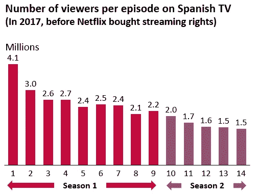

# 数据化和个性化

> 原文：<https://towardsdatascience.com/datafication-and-personalization-the-netflix-way-to-extend-value-creation-for-customers-70948ad2239f?source=collection_archive---------31----------------------->

## 为客户拓展价值创造的网飞方式

20 多年前，网飞以 DVD 租赁公司起家。以个性化为核心，网飞向顾客推荐和邮寄 DVD。当时，它的个性化算法只有很少的数据点——过去的租赁历史，DVD 持有的时间长度，也许还有一些额外的人口统计信息。

快进到网飞推出流媒体服务的时候，它陷入了用户行为的数据化，捕捉客户的浏览历史，客户按下前进、后退或暂停的点，添加到愿望清单的标题，等等。网飞已经把它的顾客分成了几千个微群，这些微群本质上是味觉社区，每个人都可能是多个味觉社区的一部分。现代流媒体和互联网世界中的这种数据化帮助网飞更好地了解其客户，以提供更个性化的体验——为每个客户定制主页，以及超个性化的“推荐给你”和“因为你观看了 ABC 标题”。

# La Casa de Papel 又名金钱抢劫

图片来自 Unsplash

犯罪惊悚片《La Casa de Papel》于 2017 年在西班牙制作并播出，这为其在黄金时段的强势开局奠定了基础。然而，在第一个两季的运行中，收视率持续下降，该节目在西班牙被总结为失败。

*来源:*[*T4 法院*](https://web.archive.org/web/20180427032300/http://www.formulatv.com/series/la-casa-de-papel/audiencias/)

2017 年 12 月，网飞为 La Casa de Papel 购买了国际流媒体版权，将其翻译成英语，重命名为 Money Heist，并将其放入其他众多外语节目的目录中。在没有任何推广的情况下，Money Heist 在网飞启动，只是受到算法的摆布，可能有正确的标签和分类。就在这里，像我这样对犯罪惊悚片情有独钟的人，把《金钱大劫案》加入了网飞推荐名单。

与此同时，在 2018 年初，该剧的演员开始在他们的 Instagram 个人资料上观察到一个不寻常的现象——他们的粉丝只是在攀升，演员不再是匿名的了。在全球推出的四个月内，该节目成为网飞最受关注的外语系列节目，该节目于 2018 年 4 月续签了两季，预算大幅增加。不用说，接下来的两季受到了粉丝们的极大欢迎，在开播的第一周就有 3400 万人观看。

## 如何发生——推荐系统的科学

这里发生的是纯数据科学和机器学习。网飞用“电视惊悚片、悬疑片、刺激片”等标签发布了这个节目其他一些具有类似标签的节目包括《越狱》、《缉毒警》、《绝命毒师》。在其微聚类中，网飞可以识别出喜欢电视惊悚片和《金钱大劫案》的顾客，并开始出现在他们的推荐名单上。随着越来越多的人观看该节目，并提供了很好的评论，该节目增加了推荐。通过网飞对其客户进行的所有数据化、分类和聚类，该节目被推荐给正确的客户群。稍后我会写一篇关于推荐系统的详细文章。

# 未来—跨公司的数据集成

如果在一个假设的情况下，网飞和 Instagram 走到一起，利用彼此的数据化成果，两者都可以为各自的客户创造额外的价值。Instagram 了解网飞的聚类，可以提出新的连接，向一个聚类中的客户显示类似的广告，等等。

网飞可以识别客户在 Instagram 上喜欢/关注的演员，然后将这些受欢迎的演员的照片作为不同标题的缩略图，为每个客户定制一张照片，以获得快速关注。如果我在 Instagram 上关注了[Á·阿尔瓦罗·莫特](https://www.instagram.com/alvaromorte/)(金钱大劫案的教授)，那么他的照片就会出现在 [Mirage](https://en.wikipedia.org/wiki/Mirage_(2018_film)) 上，成为我的网飞推荐的缩略图。

现在，如果网飞要创作一部新的惊悚片，就像它最近在创作自己的内容一样，它会通过 Instagram 在其目标观众群中找出受欢迎的惊悚片类型演员。答对了。网飞有了下一部作品的演员阵容。

# 摘要

数据是新的石油！更多的数据、更好的算法和更好的产品带来更多的数据创造——飞轮继续支持商业模式创新和为客户创造价值。公司不得不开始数据化之旅，从业务中自然进行的活动和交易中系统地提取数据，建立数据管道，以高速处理大量数据，同时捕捉足够多的变化。像谷歌和亚马逊这样的公司已经达到了他们目前的地位，不仅是通过世界级的产品，而且是通过对客户的深入了解。