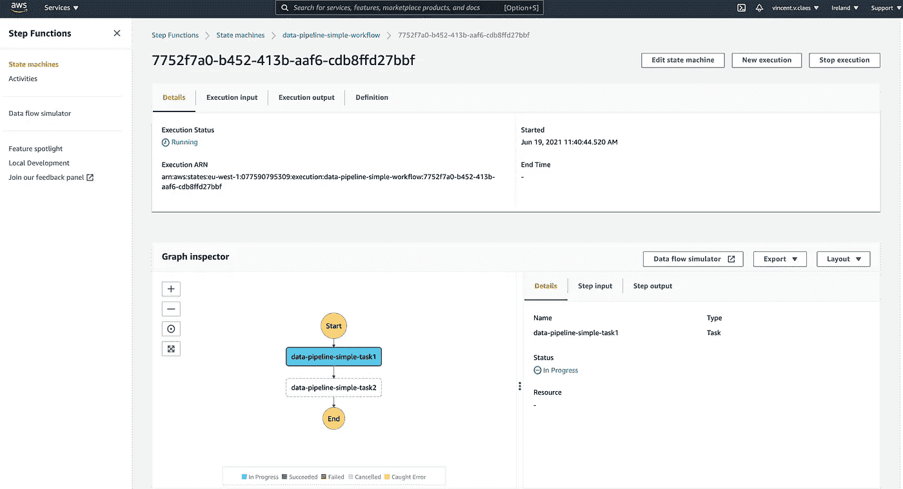

# DataJob 简介—在 AWS 上构建和部署无服务器数据管道

> 原文：<https://towardsdatascience.com/datajob-build-and-deploy-a-serverless-data-pipeline-on-aws-18bcaddb6676?source=collection_archive---------17----------------------->

## 用几行代码将您的代码部署为一组 Glue/Sagemaker 作业，并用 Step 函数编排它们


[https://unsplash.com/photos/Q1p7bh3SHj8](https://unsplash.com/photos/Q1p7bh3SHj8)

# 动机

数据工程师的核心活动之一是构建、部署、运行和监控数据管道。当我在数据和 ML 工程领域工作时，我缺少一个工具来简化在 AWS 服务上部署我的数据管道的过程，如 [Glue](https://docs.aws.amazon.com/glue/latest/dg/add-job.html) 和 [Sagemaker](https://aws.amazon.com/sagemaker/) ，以及如何用[步骤函数](https://aws.amazon.com/step-functions)轻松编排我的数据管道的步骤。这让我开发了 [DataJob](https://github.com/vincentclaes/datajob) ！🚀

在本文中，我将向您展示如何安装 DataJob，引导您完成一个简单的示例，并展示 DataJob 的几个特性。

> 为了继续我的开发，我希望**从社区中获得一些反馈**,要么继续并添加额外的服务(lambda、ecs fargate、aws batch 等)，要么改变方向，要么放弃这个开源项目。
> 
> 请回复我！🙏

<https://github.com/vincentclaes/datajob>  

# 数据作业安装

您可以从 [PyPI](https://pypi.org/project/datajob/) 安装 DataJob。DataJob 使用 [AWS CDK](https://github.com/aws/aws-cdk) 来提供 AWS 服务，所以请确保也安装它。如果您想学习这个例子，您当然需要一个 AWS 帐户🙂

```
**pip install --upgrade pip
pip install datajob**# take latest of v1, there is no support for v2 yet
**npm install -g aws-cdk@**[**1.134.0**](https://www.npmjs.com/package/aws-cdk/v/1.134.0)
```

# 简单的例子

我们有一个简单的数据管道，由两个打印“Hello World”的任务组成，这些任务需要按顺序编排。任务被部署到 Glue，并由 Step 函数进行编排。

我们将上述代码添加到项目根目录下名为`datajob_stack.py`的文件中。该文件包含配置 AWS 服务、部署代码和运行数据管道所需的一切。

要继续，请复制该存储库并导航至示例。

```
**git clone** [**https://github.com/vincentclaes/datajob.git**](https://github.com/vincentclaes/datajob.git) **cd datajob/examples/data_pipeline_simple**
```

## 配置 CDK

要配置 CDK，您需要 AWS 凭据。如果您不知道如何配置您的 AWS 凭证，请遵循这里的步骤。

```
**export AWS_PROFILE=default**# use the aws cli to get your account number
**export AWS_ACCOUNT=$(aws sts get-caller-identity --query Account --output text --profile $AWS_PROFILE)****export AWS_DEFAULT_REGION=eu-west-1**# bootstrap aws account for your region
**cdk bootstrap aws://$AWS_ACCOUNT/$AWS_DEFAULT_REGION** ⏳  Bootstrapping environment aws://01234567890/eu-west-1...
    CDKToolkit: creating CloudFormation changeset...
    ✅  Environment aws://01234567890/eu-west-1 bootstrapped.
```

## 部署

使用包含您的代码的粘合作业和将编排粘合作业的 Step Functions 状态机创建 DataJob 堆栈。

```
**cdk deploy --app  "python datajob_stack.py" --require-approval never**data-pipeline-simple:deploying... [0%] start: Publishing     
     [50%] success: Published 
     [100%] success: Published  data-pipeline-simple: creating CloudFormation changeset...
     ✅  data-pipeline-simple
```

当`cdk deploy`成功完成时，服务被配置并准备好执行。

## 执行

触发将编排数据管道的步骤函数状态机。

```
**datajob execute --state-machine data-pipeline-simple-workflow** executing: data-pipeline-simple-workflow
    status: RUNNING
    view the execution on the AWS console: *<here will be a link to see the step functions workflow>*
```

终端将显示一个到 step functions 网页的链接，以跟进您的管道运行。如果您单击该链接，您应该会看到如下内容:



## 破坏

一旦您的数据管道完成，将其从 AWS 中移除。这将为您留下一个干净的 AWS 帐户。

```
**cdk destroy --app  "python datajob_stack.py"** data-pipeline-simple: destroying...
    ✅  data-pipeline-simple: destroyed
```

# 数据作业的一些功能

## **1。使用 Glue Pyspark 作业处理大数据**

在[示例](https://github.com/vincentclaes/datajob/blob/main/examples/data_pipeline_pyspark)中找到更多信息。

## 2.部署隔离管道

在 CDK 中将阶段指定为上下文参数，以部署隔离管道。典型的例子有`dev`、`prod`、...

```
cdk deploy --app "python datajob_stack.py" --context stage=dev
```

## 3.并行编排步骤功能任务

为了加速数据管道，您可能希望并行运行任务。这可以通过 DataJob 实现！我借用了气流的概念，您可以使用操作符`>>`来协调不同的任务。

```
with StepfunctionsWorkflow(datajob_stack=datajob_stack, name="workflow") as sfn:
    task1 >> task2
    task3 >> task4
    task2 >> task5
    task4 >> task5
```

DataJob 指出哪些任务可以并行运行，以加快执行速度。


一旦我们部署并触发，您将在步骤功能执行中看到并行任务。

在[示例](https://github.com/vincentclaes/datajob/blob/main/examples/data_pipeline_parallel)中找到更多信息。

## 4.出错/成功时通知

在一个`StepfunctionsWorkflow`对象的构造函数中为参数`notification`提供一个电子邮件地址。这将创建一个 SNS 主题，该主题将在失败或成功的情况下触发。该电子邮件将在其收件箱中收到通知。

```
with StepfunctionsWorkflow(datajob_stack=datajob_stack,
                           name="workflow",
                           notification="email@domain.com") as sfn:
    task1 >> task2
```

## 5.将您的项目打包成一个轮子，并将其发送到 AWS

传送您的项目及其所有要粘附的依赖项。通过在 DataJobStack 的构造函数中指定`project_root`，DataJob 会寻找一个轮子(。whl 文件)放在 project_root 的`dist/`文件夹中。

```
current_dir = str(pathlib.Path(__file__).parent.absolute())with DataJobStack(
    scope=app, id="data-pipeline-pkg", project_root=current_dir
) as datajob_stack:
```

在[示例](https://github.com/vincentclaes/datajob/blob/main/examples/data_pipeline_with_packaged_project)中找到更多信息

## 6.添加 Sagemaker 以创建 ML 管道

使用 Glue、Sagemaker 和 Step 函数查看 GitHub repo 上的[端到端机器学习管道](https://github.com/vincentclaes/datajob/tree/main/examples/ml_pipeline_end_to_end)的新示例。

**⚠️ *给我一个回复，告诉我你喜欢什么，不喜欢什么，以及你希望在 DataJob 中看到的其他服务！* ⚠️**

<https://github.com/vincentclaes/datajob>  

# 文森特·克拉斯

👋如果您想了解更多关于 ML 工程和 ML 管道的信息，请关注我的 [Medium](https://medium.com/@vincentclaes_43752) 、 [Linkedin](https://www.linkedin.com/in/vincent-claes-0b346337/) 和 [Twitter](https://twitter.com/VincentClaes1) 。