# Datameer —简单转换

> 原文：<https://towardsdatascience.com/datameer-simple-transformations-8773709d7e42?source=collection_archive---------18----------------------->


苏珊·d·威廉姆斯在 [Unsplash](https://unsplash.com?utm_source=medium&utm_medium=referral) 上的照片

我的一个数据工程团队成员正在处理一项新的业务需求。他碰巧遇到了一个相对较新的 SaaS 工具，来自一个已经建立的数据播放器“ [Datameer](https://www.datameer.com/blog/datameer-offers-innovative-new-saas-data-transformation-solution/?utm_campaign=Transform%20Data%20in%20Snowflake&utm_source=SnoCo&utm_medium=Organic&utm_term=Post&utm_content=Simple-transformations) ”。

该工具相当新，支持“拖放”功能。

不管怎样，我们开始吧。首先，让我向您展示一些我今天正在处理的样本数据。在我的雪花数据库帐户中，我有两个表，一个维度和一个事实。

**D_Tracks** :

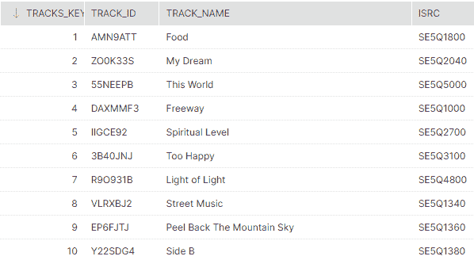

作者图片

**F_Streams** :

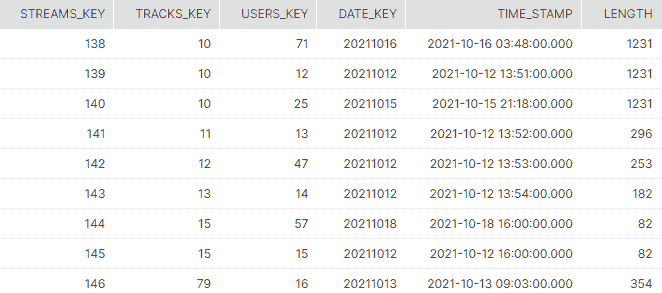

作者图片

今天的目标是简单地找出一首歌每天播放了多少次。从技术上讲，我们只需要三列，即日期、曲目名称和计数。此外，我们只想要那些每天播放不止一次的歌曲——我们感兴趣的是一首歌的受欢迎程度。

假设您已经用 Datameer SaaS 配置了雪花，让我们看看代表/实现上述需求的解决方案有多容易:

**步骤 1** :将数据集导入 Datameer SaaS 工具


作者图片

**第二步**:点击“新建转换”按钮，选择“公式”

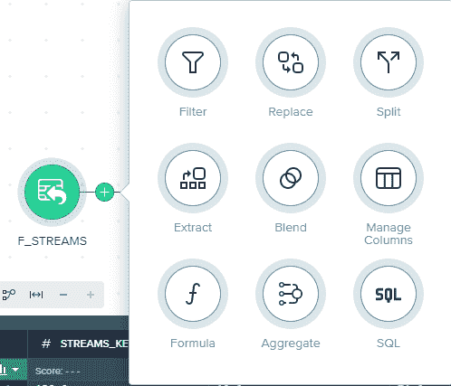

作者图片

**第三步**:将 Time_Stamp 转换成日期


作者图片

出现提示时，选择“Time_Stamp”列并输入以下公式:

TO_DATE(来源。时间戳)

**步骤 4** :用“F_STREAMS_WITH_DATES”重新命名新“配方”

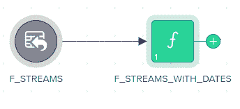

作者图片

**第五步**:点击“F_STREAMS_WITH_DATES”后的新建转换按钮，这次选择“Blend”


作者图片

请注意，我们正在尝试在“Tracks_Key”列的“F_STREAMS_WITH_DATES”和“D_TRACKS”之间执行内部连接。

为此，请执行以下操作:

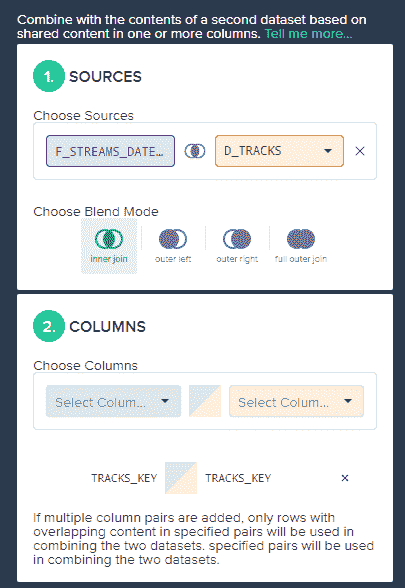

作者图片

这将帮助我们创建一个新的“配方”，如下一个流程图所示。

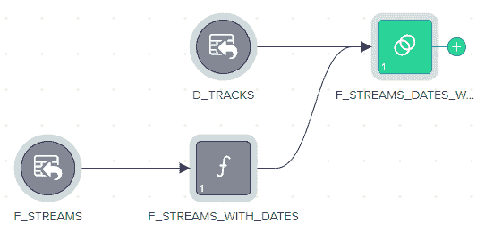

作者图片

**步骤 6** :现在添加一个新的聚合转换


作者图片

这个想法是根据日期和曲目名称对唱片进行分组。此外，我们将创建一个计数列，这将有助于我们过滤掉播放次数少于两次的记录。

为了实现上述目标，只需浏览下图:

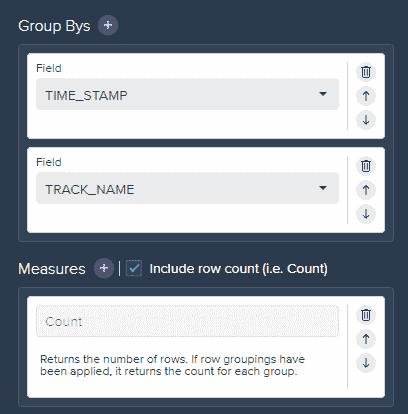

作者图片

需要注意的是，数据现在看起来如下:

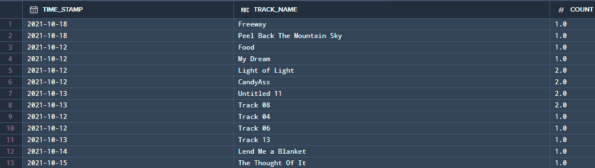

作者图片

**第 7 步**:删除计数≤ 1 的数据

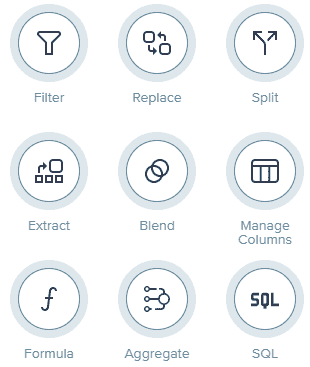

作者图片

这次一定要选择“过滤器”转换。

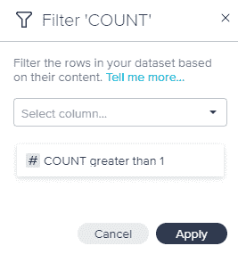

作者图片

非常简单，向数据集添加一个新的过滤器，只返回计数大于 1 的记录。

**第八步**:根据日期对记录进行排序


作者图片

最后，我们需要选择“SQL”转换，在我们的食谱上编写标准的 ANSI SQL，并返回按日期升序排序的结果。

我们的流程目前看起来如下:

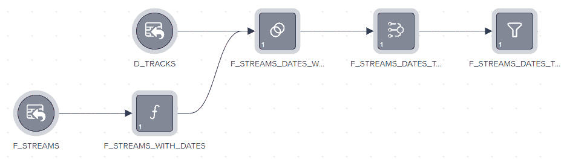

作者图片

这是按如下方式完成的:

```
select * from F_STREAMS_DATES_TRACKS_AGG_G1 AS FG1
ORDER BY FG1.TIME_STAMP;
```

32 条记录的最终数据集如下所示:

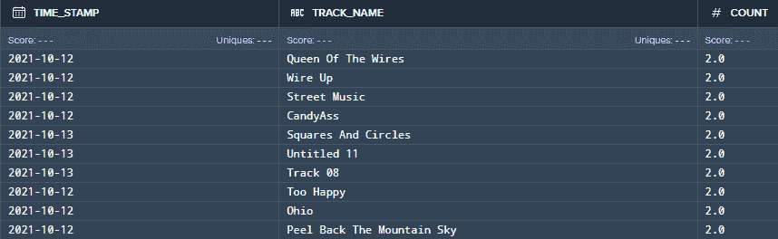

作者图片

现在，如果我们想要编写完整的 SQL 代码，我们可以在同一个工具的 SQL 输入选项中执行以下操作:

```
SELECT TO_DATE(FS.Time_Stamp) as Stream_Date, DT.Track_Name, COUNT(FS.Streams_Key)
FROM EDW.FACTS.F_STREAMS as FS
INNER JOIN EDW.DIMS.D_Tracks DT ON FS.Tracks_Key = DT.Tracks_Key
GROUP BY TO_DATE(FS.Time_Stamp), DT.Track_Name
HAVING COUNT(FS.Streams_Key) > 1;
```

我们对 data meer——简单转换——的讨论到此结束。如果你有任何问题，请随时联系我。

[](https://www.datameer.com/blog/datameer-offers-innovative-new-saas-data-transformation-solution/?utm_campaign=Transform%20Data%20in%20Snowflake&utm_source=SnoCo&utm_medium=Organic&utm_term=Post&utm_content=Simple-transformations) [## Datameer 提供创新的新 SaaS 数据转换解决方案

### 我们在 Datameer 的团队自豪地宣布，我们正在提供创新的新 SaaS 数据转换解决方案…

www.datameer.com](https://www.datameer.com/blog/datameer-offers-innovative-new-saas-data-transformation-solution/?utm_campaign=Transform%20Data%20in%20Snowflake&utm_source=SnoCo&utm_medium=Organic&utm_term=Post&utm_content=Simple-transformations)