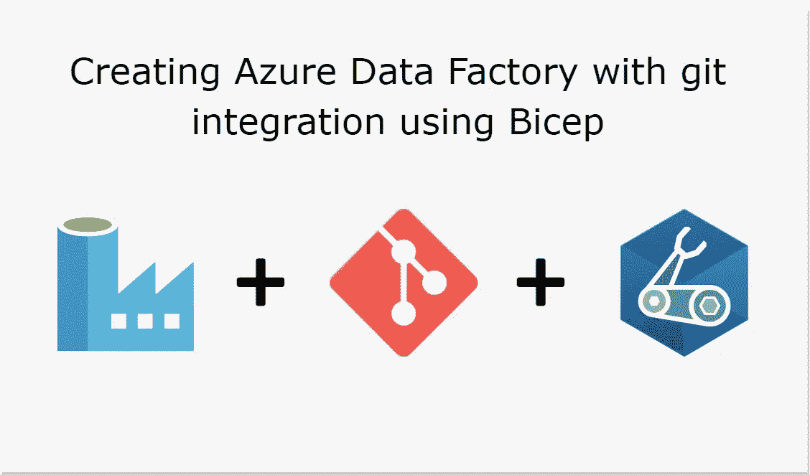
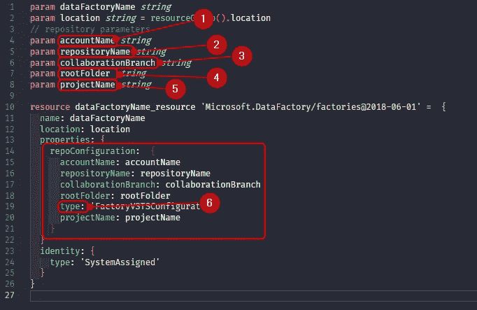
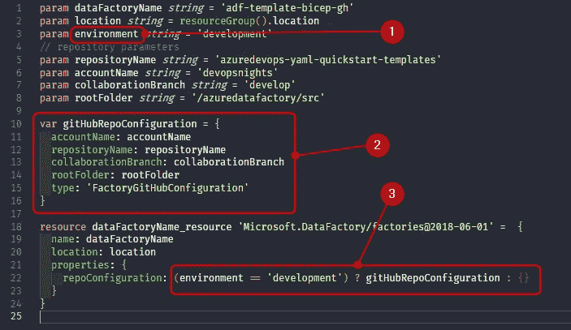
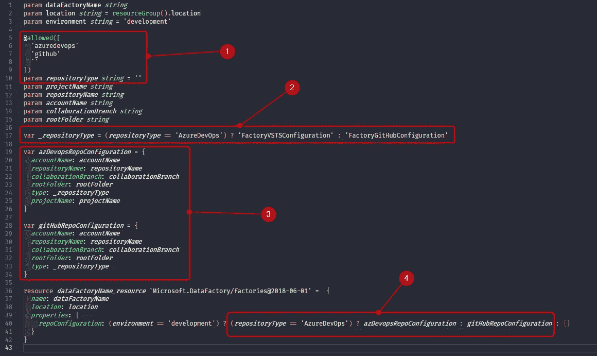

# DataOps 自动化——使用 Bicep 创建与 git 集成的 Azure 数据工厂

> 原文：<https://towardsdatascience.com/dataops-automation-creating-azure-data-factory-with-git-integration-using-bicep-376fd3b5bc81?source=collection_archive---------10----------------------->

Azure Data Factory 的一个重要特性是 git 集成，它允许我们将 Azure Data Factory 工件置于源代码控制之下。这是在以后实现持续集成和交付的必要步骤，那么为什么不用 Bicep 以完全自动化的方式将基础设施作为代码来配置呢？



作者准备的图像

在微软官方文档中有一个很好的主题，解释了如何通过 Azure 门户将 Azure 数据工厂与 git 集成。在这篇文章中，我将解释如何使用 Bicep(Azure 的新 IaC 语言)来实现这一点，以便将这一步包含到您的 CI/CD 流程中，以及如何只在需要的环境中部署。

# Azure 数据工厂 Git 集成

好的，但是为什么我需要在 ADF 上使用 git 呢？为了解释这一点，我将列出 git 集成提供的一些优势，摘自[微软的文档](https://docs.microsoft.com/en-us/azure/data-factory/source-control#advantages-of-git-integration):

## **源码控制**

随着您的数据工厂工作负载变得至关重要，您可能希望将您的工厂与 Git 集成，以利用如下几个源代码控制优势:

*   跟踪/审计变更的能力。
*   能够恢复引入错误的更改。

## **部分保存**

针对数据工厂服务进行创作时，不能将更改保存为草稿，所有发布都必须通过数据工厂验证。无论您的管道没有完成，或者您只是不想在计算机崩溃时丢失更改，git 集成都允许数据工厂资源的增量更改，而不管它们处于什么状态。配置 git 存储库允许您保存更改，仅当您测试了您满意的更改后才发布。

## 协作和控制

如果您有多个团队成员为同一个工厂工作，您可能希望让您的团队成员通过代码审查过程相互协作。您还可以设置您的工厂，这样不是每个贡献者都有相同的权限。一些团队成员可能只被允许通过 Git 进行更改，只有团队中的某些人被允许将更改发布到工厂。

## 更好的 CI/CD

如果您正在使用[连续交付流程](https://docs.microsoft.com/en-us/azure/data-factory/continuous-integration-deployment)部署到多个环境中，git 集成使得某些操作变得更加容易。这些行动包括:

*   将您的发布管道配置为在您的“开发”工厂发生任何更改时自动触发。
*   定制工厂中可作为资源管理器模板中的参数的属性。只保留所需的一组属性作为参数，并对其他所有内容进行硬编码是非常有用的。

## 更好的性能

一个集成 git 的普通工厂的加载速度比一个针对数据工厂服务的创作快 10 倍。这种性能改进是因为资源是通过 Git 下载的。

# Git 集成仅适用于开发环境

微软推荐了两个流程来在 ADF 上执行 CI/CD，(你可以在[这篇文章](/azure-data-factory-ci-cd-made-simple-building-and-deploying-your-arm-templates-with-azure-devops-30c30595afa5)上查看)，在这两种情况下，开发仅发生在开发数据工厂工作区中，并且工件通过 CI/CD 部署来提升。这意味着我们不应该为非开发环境(如 UAT 或生产环境)创建这种集成。我还将介绍如何识别环境并为您的开发环境创建集成:)

# 逐步为 Azure 数据工厂创建 Bicep 模板

为了使解释简单，我将展示二头肌文件的每个阶段。每个阶段都是一个可部署的文件，您可以使用命令单独执行

```
*az deployment group create -f <your file>.bicep -g <your resource group>*
```

最后，我们将有完整的文件可供使用。

## 创建数据工厂工作空间

在第一阶段，我们只创建具有最基本配置的工作区。您可以看到，对于位置，我们使用的是执行此部署的资源组的位置。

## 链接 GitHub 和 Azure 数据工厂

在这个阶段，我们实现了这篇文章的第一个目标:创建 **git 集成。**我包含了与 GitHub repo 连接所需的参数，然后是“属性”部分。现在让我们检查参数:

1.  **帐户名** - 这是你的 GitHub/Azure DevOps 帐户名。
2.  **repositoryName** -你的存储库的名称，注意开头不需要你的帐户名。
3.  **collaborationBranc** -将用于集成您的特性分支的分支。这将取决于你的分支策略。对于 git 流应该是开发分支，对于 GitHub 流应该是主/主。
4.  **root folder**——您的 repo 中的文件夹，databricks 工件将在其中进行版本控制。
5.  **projectName** -该参数仅用于 Azure DevOps。这是您的 repo 的团队项目名称。
6.  **类型**——这个参数定义你的回购是托管在 GitHub 还是 Azure DevOps 上。对于 GitHub，该值必须为:

```
FactoryGitHubConfiguration
```

对于 Azure Devops，该值为:

```
FactoryVSTSConfiguration
```



作者准备的图像

## 检查环境

如上所述，我们必须只在开发环境中创建 git 集成。如果你只使用 GitHub 或者 Azure DevOps，这个阶段对你的场景应该足够了。要检查这一点，我们需要以下步骤:

1.  一个环境参数。
2.  将 **repoConfiguration** 的内容提取到外部变量。
3.  使用三元 if 来检查提供的环境是否是开发。如果是，则使用该变量，如果不是，则使用空组。



作者准备的图像

这个阶段的二头肌锉刀:

## 将 GitHub 或 Azure DevOps 链接到 Azure 数据工厂

如果在你的场景中你既有 Azure DevOps 又有 GitHub，你可以准备你的模板来支持它。这个模板更加灵活，可以用在更多的场合。让我们检查一下与上一个的不同之处:

1.  包括一个“用户友好的”参数来指示回购的类型。
2.  检查类型参数并创建一个具有预期值的变量。
3.  创建两个配置，一个用于 GitHub，一个用于 Azure DevOps。
4.  如果嵌套在第一个三元组中，则包含另一个三元组



作者准备的图像

下面你可以查看最终的二头肌模板:

# 现实生活中的例子

为了在更现实的情况下检查这些例子，我一直在 GitHub 的一个存储库中工作，使用管道配置和工作的例子。你可以在 DevOps Nights GitHub 这里查看:【github.com】DevOps Nights/azuredevops-YAML-quick start-templates

在[这篇文章](/azure-data-factory-ci-cd-made-simple-building-and-deploying-your-arm-templates-with-azure-devops-30c30595afa5)中，我展示了如何将这个二头肌模板用于 Azure DevOps 管道。

我希望这篇文章能帮助你以更自动化的方式创建你的 ADF，下一篇文章再见！

## 参考

[源代码管理— Azure 数据工厂|微软文档](https://docs.microsoft.com/en-us/azure/data-factory/source-control#advantages-of-git-integration)

[工厂—配置工厂回购— REST API (Azure 数据工厂)|微软文档](https://docs.microsoft.com/en-us/rest/api/datafactory/factories/configure-factory-repo#factoryvstsconfiguration)

[Microsoft.DataFactory/factories 2018–06–01—ARM 模板参考|微软文档](https://docs.microsoft.com/en-us/azure/templates/microsoft.datafactory/factories?tabs=json)