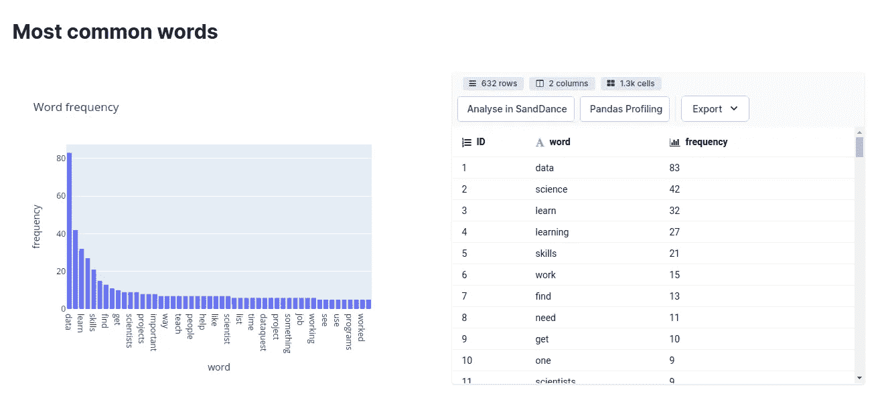
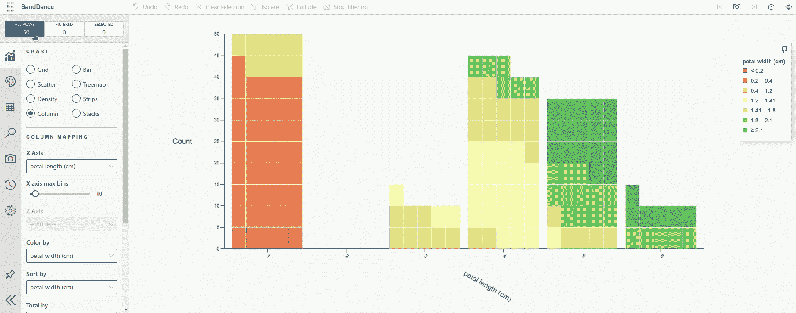
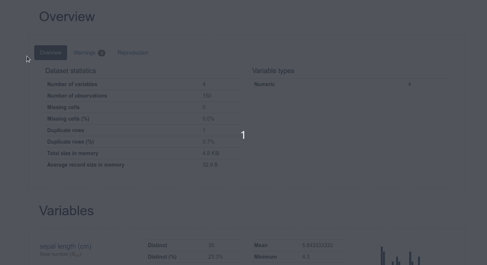

# Datapane 的新特性:用几行代码用 Python 创建一个漂亮的仪表板

> 原文：<https://towardsdatascience.com/datapanes-new-features-create-a-beautiful-dashboard-in-python-in-a-few-lines-of-code-a3c44523292b?source=collection_archive---------18----------------------->

## Datapane 现在支持 Pandas Profiling、代码、图像、定制布局等等！



作者图片

# 动机

在清理数据、创建漂亮的可视化效果并获得一些有用的见解后，您希望与您的社交网络、朋友或经理分享您的发现，但发现使用 Jupyter Notebook 很难做到这一点。

你可以使用 [Binder](https://mybinder.org/) 或 [GitHub](https://github.com/) 来分享你的笔记本，但是它们不是交互式的，而且你需要时间来做这件事。

有没有一种方法可以使用 Python 用几行代码为您的发现创建如下所示的报告？

由作者创建

这时 Datapane 就派上用场了。

# 什么是 Datapane？

[Datapane](https://datapane.com/) 是一个 API **，面向用 Python 分析数据的人，他们需要一种方式来分享他们的结果**。我在[上一篇文章](/introduction-to-datapane-a-python-library-to-build-interactive-reports-4593fd3cb9c8)中解释了 Datapane 的一些基本组件，例如:

*   [熊猫数据帧](https://pandas.pydata.org/)
*   来自 Python 可视化库的绘图，如 [Plotly](https://plotly.com/python/) 、 [Bokeh](https://bokeh.org/) 、 [Altai](https://altair-viz.github.io/) r 和[fo 叶](https://python-visualization.github.io/folium/quickstart.html)
*   降价

但是自从我的上一篇文章以来，Datapane 已经引入了更多的组件，包括:

*   数据表
*   代码、HTML 和文件
*   布局、页面和选择

要安装 Datapane，请键入

```
pip install -U datapane
```

在 D [atapane](https://datapane.com/) 上注册以获得您自己的令牌，并使用该令牌登录 Datapane:

```
import datapane as dp dp.login('YOUR_TOKEN')
```

# 数据表

DataTable 块将 pandas 数据帧呈现为报表中的交互式表格，以及高级分析选项，如 [SandDance](https://www.microsoft.com/en-us/research/project/sanddance/) 和 [Pandas Profiling](https://pandas-profiling.github.io/pandas-profiling/) 。

让我们使用数据表块为[虹膜数据集](https://scikit-learn.org/stable/modules/generated/sklearn.datasets.load_iris.html)创建一个报告。使用`dp.DataTable`创建一个表格。使用`dp.Report(table).publish()`为您的报告创建一个网站。

输出:

点击[https://datapane.com/u/khuyentran1401/reports/iris/](https://datapane.com/u/khuyentran1401/reports/iris/)查看报告。单击该链接时，您应该会看到类似如下所示的内容:

点击“在 SandDance 中分析”,如下图所示。



作者 GIF

点击“熊猫概况”从熊猫数据框架生成概况报告。您应该会看到如下所示的内容。



作者 GIF

通过使用 DataTable，你不仅在网站上有一个漂亮的表格，还可以使用 SandDance 或 Pandas Profiling **分析数据，而无需添加任何代码**！

# 文件和代码

## 图像

您可以使用`datapane.File`在报告中呈现图像或文件:

## 密码

有时，您可能不仅想显示输出，还想显示用于创建该输出的代码片段。要在报告中呈现代码，只需将`datapane.Code`放在代码周围。

您的报告中将会呈现如下美丽的代码！

# 布局、页面和选择

Datapane 报告的默认视图很好，但是如果您想进一步定制它，您可以使用 Group、Page 和 Select 等组件。

## 选项卡和选择

如果您想在报告中的多个块之间交互切换，比如在输出和源代码之间切换，您可以使用`dp.Select`。

上面的文字云图是分析[这篇链接文章](https://www.dataquest.io/blog/learn-data-science/)的结果。

现在你可以点击“WordCloud”标签查看图片，点击“源代码”标签查看源代码！

## 组

如果您想让两个或三个组件并排，您可以使用`dp.Group`

现在你的表和图应该像下面这样并排放置！

## 页

与 Select 和 Group 相比，Page 是更高级别的组件。页面允许您在一个报告中有多个页面。

和

通过运行上面的代码，您的报告应该有 2 页，如 WordCloud 和 Iris，如下所示！

# 奖励:使用 Datapane 的端到端项目

就是这样！如果您想使用 Datapane 的组件查看一个完整的项目，我创建了一个端到端的项目，它可以生成一个报告，总结一篇文章，查找关键词，并获取这篇文章中最常见的单词。

以下是该项目的报告。在这里随意玩[的源代码](https://medium.com/r?url=https%3A%2F%2Fgithub.com%2Fkhuyentran1401%2FData-science%2Fblob%2Fmaster%2Fdata_science_tools%2FDatapane_new_features%2Fanalyzing_articles.ipynb)。

[](https://datapane.com/u/khuyentran1401/reports/analyze-article/) [## 登录

### 登录

日志 Indatapane.com](https://datapane.com/u/khuyentran1401/reports/analyze-article/) 

# 结论

恭喜你！您刚刚学习了如何使用 Datapane 的新特性在 Python 中创建漂亮的报告。现在，您可以创建一个报告来展示您的分析结果，并与您的队友、利益相关者或您的社交网络共享，而不是共享枯燥的代码！

我喜欢写一些基本的数据科学概念，并尝试不同的数据科学工具。你可以在 [LinkedIn](https://www.linkedin.com/in/khuyen-tran-1401/) 和 [Twitter](https://twitter.com/KhuyenTran16) 上和我联系。

如果你想查看我写的所有文章的代码，请点击这里。在 Medium 上关注我，了解我的最新数据科学文章，例如:

[](/top-6-python-libraries-for-visualization-which-one-to-use-fe43381cd658) [## 可视化的 6 大 Python 库:使用哪一个？

### 对使用哪种可视化工具感到困惑？我为你分析了每个图书馆的利弊

towardsdatascience.com](/top-6-python-libraries-for-visualization-which-one-to-use-fe43381cd658) [](/introduction-to-datapane-a-python-library-to-build-interactive-reports-4593fd3cb9c8) [## Datapane 简介:构建交互式报表的 Python 库

### 创建精美报告并与您的团队分享分析结果的简单框架

towardsdatascience.com](/introduction-to-datapane-a-python-library-to-build-interactive-reports-4593fd3cb9c8) [](/introduction-to-yellowbrick-a-python-library-to-explain-the-prediction-of-your-machine-learning-d63ecee10ecc) [## Yellowbrick 简介:可视化机器学习预测的 Python 库…

### 您将 f1 分数提高到了 98%！但这是否意味着你的模型表现更好呢？

towardsdatascience.com](/introduction-to-yellowbrick-a-python-library-to-explain-the-prediction-of-your-machine-learning-d63ecee10ecc) [](/find-common-words-in-article-with-python-module-newspaper-and-nltk-8c7d6c75733) [## 用 Python 模块 Newspaper 和 NLTK 查找文章中的常用词

### 使用 newspaper3k 和 NLTK 从报纸中提取信息和发现见解的分步指南

towardsdatascience.com](/find-common-words-in-article-with-python-module-newspaper-and-nltk-8c7d6c75733)