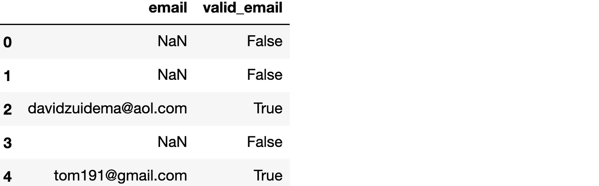

# 数据准备。清理:加速数据清理

> 原文：<https://towardsdatascience.com/dataprep-clean-accelerate-your-data-cleaning-83406b4645bf?source=collection_archive---------27----------------------->

## 清理数据的更好方法


[摄](https://unsplash.com/@thecreative_exchange?utm_source=medium&utm_medium=referral) [Unsplash](https://unsplash.com?utm_source=medium&utm_medium=referral) 上的创意交流

***作者:*** [*布兰登洛哈特*](https://www.linkedin.com/in/brandon-lockhart-6172a8159/) *和* [*爱丽丝林*](https://www.linkedin.com/in/atol/)

DataPrep 是一个旨在提供用 Python 准备数据的最简单方法的库。为了解决数据准备中繁重的数据清理步骤，DataPrep 开发了一个新组件: [DataPrep。清洁](https://docs.dataprep.ai/user_guide/clean/introduction.html)。

数据准备。Clean 包含简单有效的函数，用于清理、标准化和验证数据帧中的数据。这些函数使用统一的界面来执行各种类型数据所需的通用数据清理操作。

本文演示了如何使用 DataPrep。清理以简化和加速数据清理任务。

不正确或不一致的数据会导致错误的结论。因此，数据科学家必须清理他们的数据，以确保结果的准确性。然而，数据清理消耗了数据科学家很大一部分工作时间——根据最近的一项调查显示占 26%——并且通常被认为是单调乏味的工作。

数据清理任务通常涉及编写正则表达式以确保值遵循允许的模式，以及编写脚本来转换和标准化值，这可能很困难且容易出错。此外，这些任务通常是特定于数据或领域的，并且需要针对每个数据集重新执行。

# 为什么是 DataPrep。干净？

DataPrep 有三个原因。Clean 是 Python 中数据清理的理想工具:

1.  **统一的 API:** 每个函数遵循简单的命名约定，`clean_*type*()`和`validate_*type*()`，其中 *type* 是感兴趣的语义数据类型。
2.  **效率:**使用并行计算库 Dask 处理数据，实现快速性能。
3.  **透明度:**执行清洗功能后，会生成一份报告，描述对数据所做的更改。

让我们从 DataPrep.Clean 开始。

# 装置

您可以使用以下命令安装带有`pip`的 DataPrep:

```
pip install -U dataprep==0.3.0a0
```

这是一个 alpha 版本，DataPrep 版即将发布。

# 加载数据集并开始使用

我们将使用来自 DataPrep 内部数据集存储库的数据集`waste_hauler`。让我们从加载 DataPrep 开始。将函数和数据集清理到 pandas 数据框架中:

```
from dataprep.clean import *
from dataprep.datasets import load_dataset
df = load_dataset('waste_hauler')
```

让我们来看看数据集:

```
df.head()
```


请注意，列标题中的单词是大写的，并用空格分隔。然而，使用 *snake case* 样式的标题更容易，因为在输入标题时不需要按住 shift 键，并且可以将每一列作为 DataFrame 的属性直接访问(例如，`df.local_address`)。要转换标题，我们可以使用函数`clean_headers()`,该函数将数据帧作为输入，并以所需的样式返回带有标题的数据帧:

```
df = clean_headers(df)
df.columns
```


`clean_headers()`默认情况下将标题转换成*蛇盒*，然而，也支持许多其他样式。查看[用户指南](https://docs.dataprep.ai/user_guide/clean/clean_headers.html)了解更多信息。

# 数据标准化

数据准备。Clean 提供了解析、重新格式化和标准化列中的值的简单函数。这些函数遵循命名约定`clean_*type*()`，其中 *type* 是要清理的列的数据类型(比如电话号码或电子邮件地址)。DataFrame 和列名作为输入传递，DataFrame 返回一个包含指定列的清除值的新列。数据也可以通过指定参数`inplace=True`就地清除*。*

让我们看看如何使用 DataPrep.Clean 标准化电话号码和街道地址。

## **电话号码**

我们来看看专栏`phone`:

```
df.phone.head()
```


正如我们所见，电话号码有不同的格式。为了标准化它们的格式，我们可以使用函数`clean_phone()`，默认情况下，该函数会将所有电话号码转换为 NPA-NXX-XXXX 格式。`clean_phone()`接受一个 DataFrame 和要清理的列的名称作为输入，它返回原始 DataFrame，并添加了一个包含标准化电话号码的新列`phone_clean`。

```
df = clean_phone(df, 'phone')
df[['phone', 'phone_clean']].head()
```


此外，在调用`clean_phone()`之后，会打印一份摘要报告，描述为清理列而对数据进行的更改以及结果列中数据的质量:


要以(NPA) NXX-XXXX 格式输出电话号码，我们可以将`output_format`参数设置为`national`:

```
df = clean_phone(df, 'phone', output_format='national')
df[['phone', 'phone_clean']].head()
```


有关`clean_phone()`的更多信息，请查阅[用户指南](https://docs.dataprep.ai/user_guide/clean/clean_phone.html)。

## **街道地址**

接下来，我们来看看`local_address`栏目:

```
df.local_address.head()
```


这些地址表示中有几处不一致。例如，用“AVE .”(索引 0)和“AVENUE”(索引 1)表示“大道”，或者用“EAST”(索引 3)和“E”(索引 4)表示“东”。为了标准化这些不一致，我们可以使用函数`clean_address()`:

```
df = clean_address(df, 'local_address')
df[['local_address', 'local_address_clean']].head()
```


现在列`local_address_clean`中的每个地址都有相同的、一致的格式。

我们可能还想从地址中提取成分，比如城市和州。我们可以通过将参数`split`设置为`True`来实现这一点，这将在数据帧中为每个地址组件创建一个新列。让我们用`split=True`调用`clean_address()`，看看新的列:

```
df = clean_address(df, 'local_address', split=True)
```


这些单独的组件使用户可以轻松地根据需要设置地址格式，或者对城市和州执行汇总分析。

有关`clean_address()`的更多信息，请查看[用户指南](https://docs.dataprep.ai/user_guide/clean/clean_address.html)。

# 数据有效性

数据验证是指确保数据是正确的和正确表示的过程。数据准备。Clean 提供了验证各种数据类型的函数。数据验证函数遵循命名约定`validate_*type*()`，其中*类型*是要验证的语义数据类型的名称。

每个验证函数都将一个数据序列作为输入，并返回一个布尔序列，指示每个值是否属于指定的数据类型。例如，让我们在系列`df['email']`上使用函数`validate_email()`:

```
df['valid_email'] = validate_email(df['email'])
df[['email', 'valid_email']].head()
```



正如我们所看到的，`email`列中的一些值是有效的电子邮件地址，其他的不是，并且`validate_email()`适当地返回 True 和 False。此外，我们可以过滤数据集，以识别电子邮件地址不正确的记录:

```
df[~validate_email(df['email'])].dropna()
```


正如我们所见，`email`列的这些行错误地包含了文本和日期。因此，`validate_email()`支持快速识别这些值，以便数据科学家可以根据需要删除或更正无效的电子邮件地址。

# 数据类型检测

接下来，我们将看到 DataPrep。Clean 可用于语义数据类型检测。虽然数据集经常伴随着指示各自列中数据类型的信息性列名，但有时并非如此，标识每一列的数据类型会很有用。或者，您可能有大量的列或多个数据集，并且希望标识具有特定数据类型的列，这可能很困难并且很耗时。

下面是一个识别每一列的数据类型的函数，专门检查电话号码、电子邮件地址、街道地址和日期。

```
def detect_data_types(df, thresh):
    ls = []
    for col in df.columns:
        n = len(df[col].dropna())
        if validate_phone(df[col].dropna()).sum() / n > thresh:
            ls.append((col, "phone"))
        elif validate_email(df[col].dropna()).sum() / n > thresh:
            ls.append((col, "email"))
        elif validate_address(df[col].dropna()).sum() / n > thresh:
            ls.append((col, "address"))
        elif validate_date(df[col].dropna()).sum() / n > thresh:
            ls.append((col, "date"))
    return pd.DataFrame(ls, columns=["Column Name", "Data Type"])
```

`detect_data_types()`将数据帧`df`和阈值`thresh`作为输入。对于`df`中的每一列，`validate_*type*()`函数用于确定该列中有多少值满足每种数据类型。如果满足该类型的值的比例大于`thresh`，则该列被确定为该类型。

让我们调用阈值为 0.8 的`detect_data_types()`:

```
df_types = detect_data_types(df, thresh=0.8)
df_types
```


正如我们所看到的，地址、电话和电子邮件数据类型被正确识别。此外，列`created`被标识为包含日期，这对于从列名中推断是很重要的。

# 结论

随着许多领域的数据收集呈指数级增长，不同技能水平的用户需要从数据中获得洞察力。为了避免*垃圾入，垃圾出*的老生常谈，需要执行数据清理，这可能是困难的、耗时的和乏味的。

数据准备。Clean 通过其简单的 API 有可能将数据清理从每个数据科学家存在的祸根变成一个快速而简单的过程。

数据准备。Clean 目前包含以下功能:

*   列标题
*   国家名称
*   日期和时间
*   电子邮件地址
*   地理坐标
*   IP 地址
*   电话号码
*   资源定位符
*   美国街道地址

并且目前正在开发更多的功能。

了解更多关于 [DataPrep 的信息。清洁](https://github.com/sfu-db/dataprep#clean)，查看[用户指南](https://docs.dataprep.ai/user_guide/clean/introduction.html)和 [API 参考](https://docs.dataprep.ai/api_reference/dataprep.clean.html)。