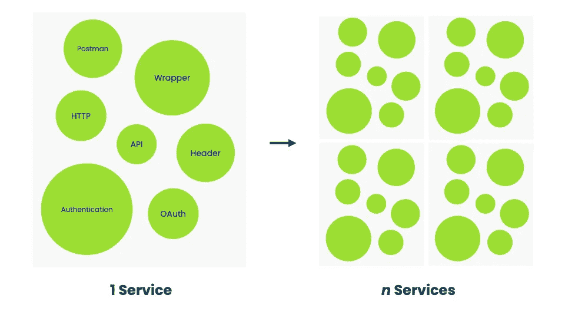
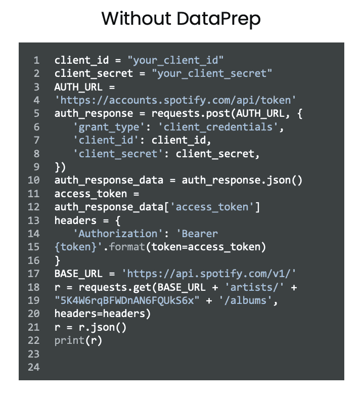
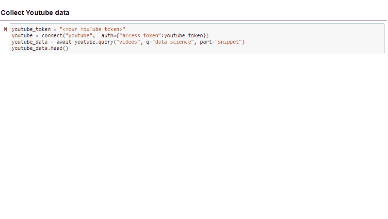
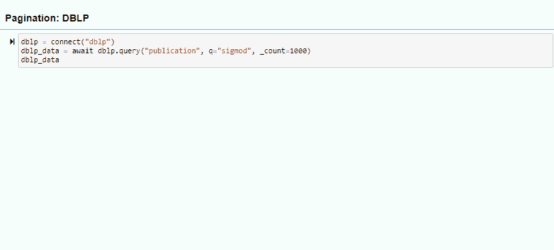
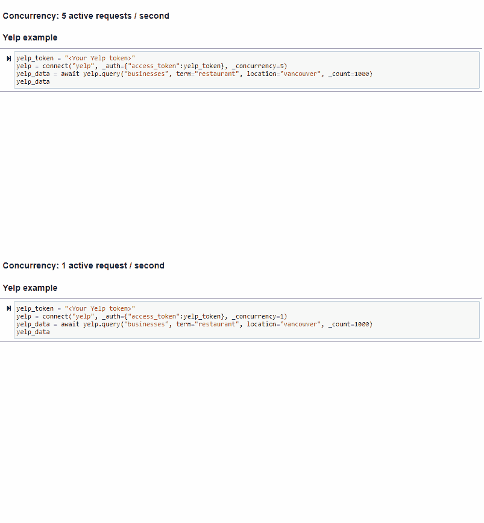
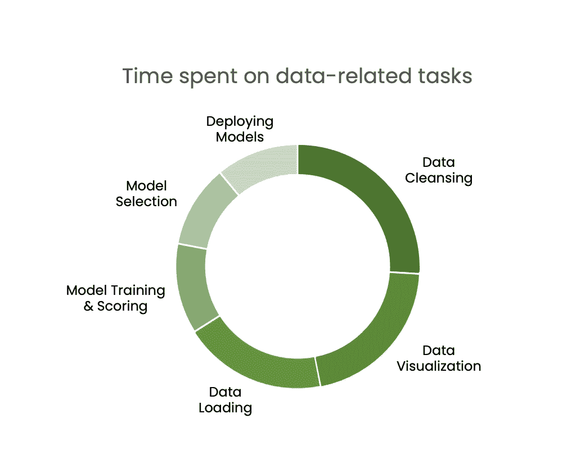

# 数据准备。连接器:从 API 检索数据的最简单方法

> 原文：<https://towardsdatascience.com/dataprep-connector-the-easiest-way-to-retrieve-data-from-apis-ea50422268a1?source=collection_archive---------23----------------------->

## 数据准备。连接器使得从流行的 API 获取数据变得轻而易举。如果不支持某个 API，只需几个简单的步骤就可以自己添加了！


迪米特里·卡拉斯泰列夫在 [Unsplash](https://unsplash.com?utm_source=medium&utm_medium=referral) 上的照片

***摘要:*** 数据准备。Connector 是 Python 的 DataPrep 库的一个组件，可以加速数据加载。该工具减少了在项目中设置数据加载所需的开销。它功能强大且高效，允许开发人员以快速、熟悉且可重复的方式加载数据。

**数据加载瓶颈**

数据科学家 19%的工作时间花在加载数据上[1]。收集数据的开销占用了不必要的时间，并且是重复性的。从数据库或通过 API 检索数据所需的代码几乎总是相同的。数据收集很耗时，但也不尽然。数据准备。Connector 是一个易于使用的、开源的、轻量级的库，可以帮助您快速地从 web 资源中获取数据。

**介绍 DataPrep。连接器**

数据准备。连接器(或连接器)通过对开发人员隐藏实现细节来加速数据加载。从 web API 加载典型的数据需要设置身份验证和授权，发出 HTTP 请求，并牢牢掌握 API 文档。让这些任务的开销适应不同的 API 会很快失控。



图 1:在没有连接器的情况下，将多个服务合并到您的项目中所产生的组合爆炸

Connector 是一个工具，它包装 web 数据源，并使它们在一个直观、快速且可重复的工作流中工作。将数据加载到项目中需要更少的时间和代码。

让我们来看看连接器的运行情况。假设我们想从 Spotify 中检索 Kanye West 的所有专辑。有三个简单的步骤。

***第一步:创建开发者账户***

登录 [Spotify 开发者仪表盘](https://developer.spotify.com/dashboard/login)，向他们注册一个项目。这将允许您获得调用 API 所需的授权。获得正确的 auth 是 Connector 不能为您做的一件事，并且您将需要它用于大多数 API。

***第二步:安装 DataPrep***

您终端中的一个简单的 pip 命令将为您解决这个问题。

```
pip install dataprep
```

***第三步:运行代码！***

```
from dataprep.connector import Connectorclient_id = “your_client_id”client_secret = “your_client_secret”spotify = Connector(“spotify”, _auth={“client_id”:client_id, “client_secret”:client_secret})kanye = await spotify.query(“album”, _q=”kanye west”)display(kanye)
```

将这个简单的代码与不使用图 2 中的连接器时需要的代码进行比较。



图 2:使用和不使用连接器的相同任务所需的代码(图片由作者提供)

**连接器功能强大**

连接器不仅仅是一个包装器。您所熟悉的包装器，如 [Spotipy](https://spotipy.readthedocs.io/en/2.17.1/) 和 [Tweepy](https://www.tweepy.org/) 在减少与数据加载相关的开销和重复方面做得很好。但是连接器做得更多。它是统一的，可以更快地获取结果。

***统一***

连接器是一个统一的包装器。与特定 API 的特定包装器(例如专门为 Spotify API 工作的 Spotify)不同，Connector 可以包装任何 web API。这是可能的，因为连接器是开源的。任何人都可以[向项目贡献配置文件](https://github.com/sfu-db/APIConnectors)来支持新的 API(关于配置文件的更多内容将在本文后面介绍)。这意味着 Connector 将在未来不断增加对更多 API 的支持，并将所有 API 调用统一到一个简单的工作流中。



图 3:使用多个 API 的连接器。最大的区别在于 _auth 参数(图片由作者提供)

***分页***

Web APIs 通常对一次调用可以检索的结果数量有限制。这要求用户了解这些限制，并在结果数量高于限制时处理案例。连接器为用户提供了一个计数参数，该参数允许连接器在后台处理这项工作。为您想要检索的结果数量指定一个值，Connector 将处理其余的结果。



图 4:这些片段显示了 count 参数用于返回结果的精确数量(图片由作者提供)

***并发***

一些为 count 指定了较大值的请求可能需要很长时间。比方说，如果结果限制是 50，而您的项目需要 250 个结果。当指定计数为 250 时，连接器将一个接一个地调用 API 5 次。这可能需要一段时间。连接器允许您通过 concurrency 参数指定您希望在*并行*中发出的请求数量。这允许更快地获取结果，因为现在调用不必等待上一个调用完成。



图 5:正在使用的并发参数。请注意检索相同数量的结果所用的时间差异(图片由作者提供)

**连接器是怎么做到的**

连接器是开源的，这就是为什么它可以支持任何 API。连接器从配置文件库中提取。每个 API 都有自己的配置文件，每个文件都由贡献者编写。如果连接器不支持用户想要访问的 API，他们可以很容易地创建配置文件并将其添加到存储库中。然后，连接器将支持该 API，所有开发人员都可以使用它。如果您有兴趣做出贡献，请查看我们的 [APIConnectors](https://github.com/sfu-db/APIConnectors) 资源库。

**连接器的未来**

目前，连接器只从 web APIs 加载数据。DataPrep 团队目前正在研究更多访问数据源的方法，比如数据库。用户提供的配置文件也将有助于连接器的发展，我们正在通过直观的 GUI 使添加配置文件变得更加容易。我们在 [PyData 2020](https://global.pydata.org/talks/340) 上讨论了连接器和其中的一些变化(点击这里查看我们的讨论[！](https://www.youtube.com/watch?v=56qu-0Ka-dA&ab_channel=PyData))。连接器是 DataPrep 的一个组件，这个库使得准备数据变得轻而易举。还有 DataPrep 的其他组件，比如 DataPrep。EDA 和 DataPrep.Clean。



图 DataPrep 如何处理部分数据准备周期(图片由作者提供)

DataPrep 正在开发更多的特性和组件，以进一步改进数据准备。随着 DataPrep 的增长，Connector 也将增长，加载数据将比以往更加容易。在我们的[网站](https://dataprep.ai/)上了解更多关于我们的信息，并关注我们即将发布的版本！

***参考文献***

[1] Anaconda，[2020 年数据科学状况](https://www.anaconda.com/state-of-data-science-2020) (2020)，2020 年数据科学状况报告