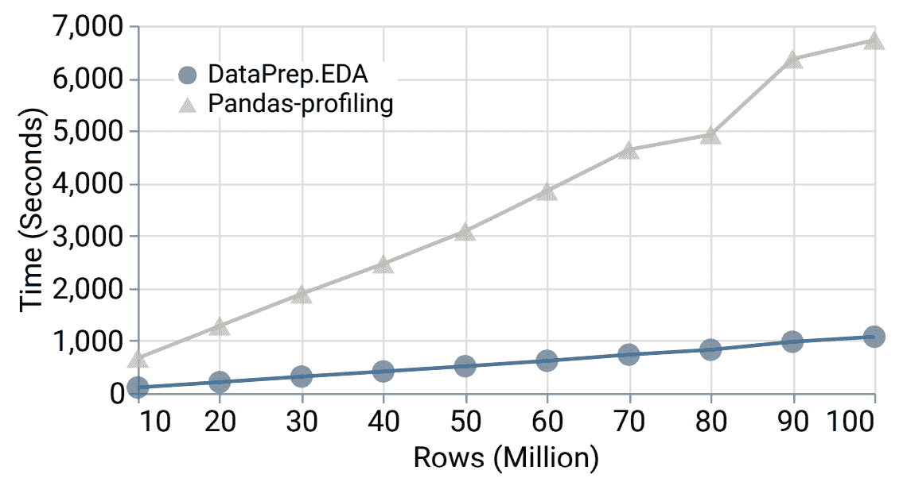
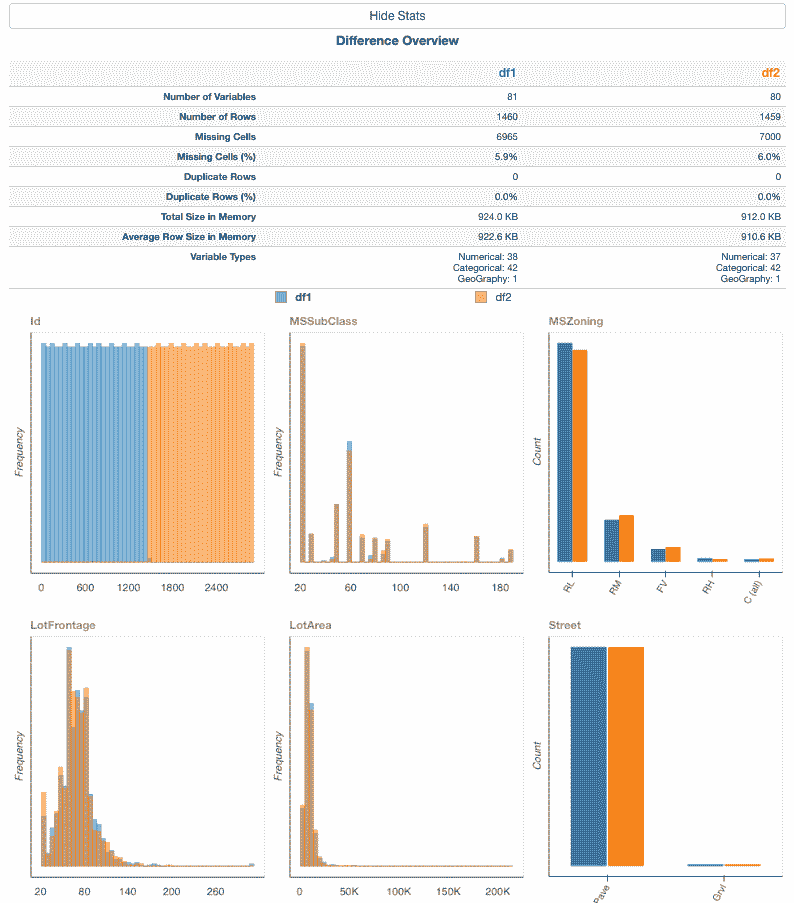
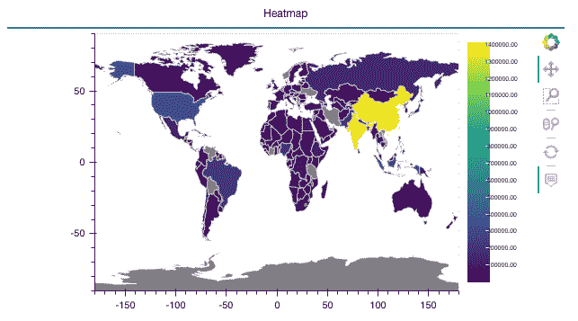
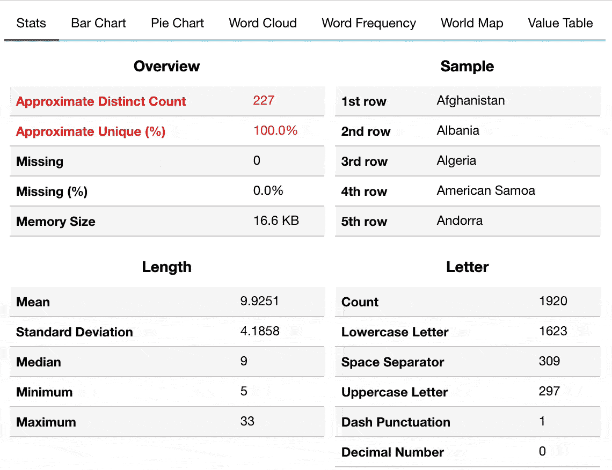
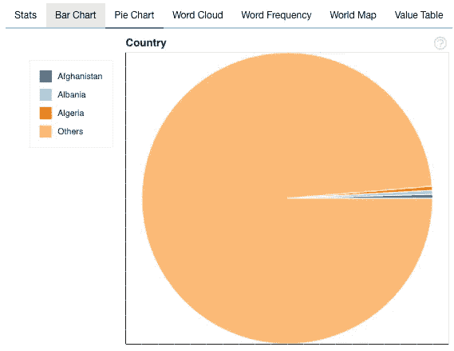
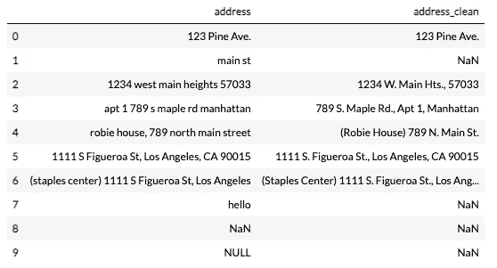
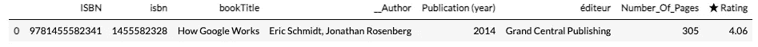
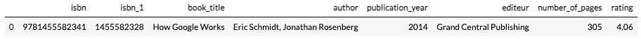
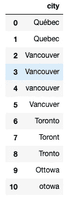
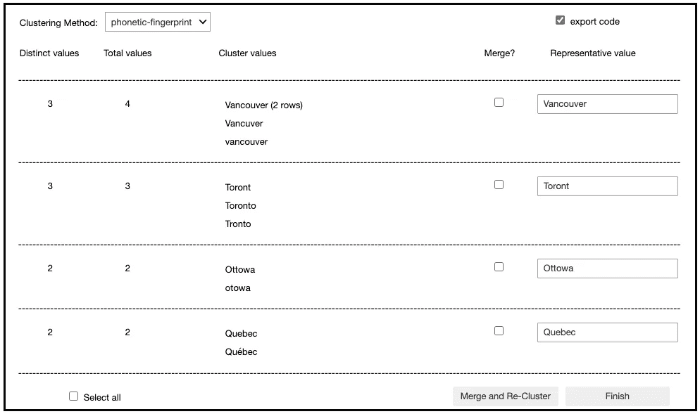

# DataPrep v0.3.0 已经发布

> 原文：<https://towardsdatascience.com/dataprep-v0-3-0-has-been-released-be49b1be0e72?source=collection_archive---------20----------------------->


由[米卡·鲍梅斯特](https://unsplash.com/@mbaumi?utm_source=medium&utm_medium=referral)在 [Unsplash](https://unsplash.com?utm_source=medium&utm_medium=referral) 拍摄的照片

DataPrep v0.3.0 上线了！

[DataPrep](https://dataprep.ai/) 是一个针对 Python 的开源数据准备库。这是准备数据最简单的方法。DataPrep 为您带来了一套工具，用于数据准备过程的每一步——从收集、清理到可视化，DataPrep 完成了所有工作。在 0.3.0 版本中，它做得更多！

**安装**

您终端中的一个简单的 pip 命令将为您安装 DataPrep。

`pip install dataprep`

**发布详情**

DataPrep 的这个版本为您带来了更多的交互式方法来可视化和比较数据，支持清理更多类型的数据，甚至在获取数据时提供了更好的可用性。

让我们看看 DataPrep 的每个组件在这个版本中都带来了什么。

**EDA**

数据准备。EDA 是 DataPrep 的探索性数据分析组件。它允许您绘制和可视化数据，并从可视化中收集见解。

EDA 在这个版本中经历了一些大的和显著的变化。现在，您可以比较数据集、可视化地理数据，并更好地控制查看数据的方式。数据准备。EDA 也经历了性能改进。



比较 DataPrep 的 create_report(df)的运行时间。EDA 和 Pandas——通过改变数据大小进行分析([图片由 Weiyuan Wu 拍摄](https://arxiv.org/abs/2104.00841)

*新功能*

*   plot_diff():这个新函数允许您比较两个独立的数据集

```
train = load_dataset(“house_prices_train”)
test = load_dataset(“house_prices_test”)
plot_diff([train, test], progress=False)
```



plot_diff()的一些输出的快照(图片由作者提供)

*   plot()现在支持地理数据的热图！

```
df = pd.read_csv(“data.csv”)
plot(df, “country”, “Population in thousands (2017)”)
```



带有地理数据的 plot()输出(图片由作者提供)

*可用性*

*   EDA 团队已经改变了参数定制的方式。它们现在位于配置字典中。这是为了让我们更容易推出新的特性和参数，而不改变整个 API 的构成。让我们看看这是如何工作的:

```
from dataprep.eda import plot 
from dataprep.datasets import load_dataset 
df = load_dataset("countries") 
plot(df, "Country")
```

上面的代码产生了下面的图。让我们看一下饼图，看看有哪些参数可供我们配置。这里，我们将选择生成的饼图扇区的数量。然后，我们修改我们的原始代码以包含这种重新配置，如下所示。



从 plot()的输出中检索饼图切片数的参数(图片由作者提供)

```
from dataprep.eda import plot 
from dataprep.datasets import load_dataset 
df = load_dataset("countries") 
plot(df, "Country", config = {'pie.slices': 3})
```

更改配置的结果如下所示。



将饼图切片数更改为 3 后的结果(图片由作者提供)

**清洁**

数据准备。Clean 是 DataPrep 的数据清理工具，允许您清理和标准化不一致或不完整数据集中的多种形式的数据。

Clean 增加了对更多数据类型的支持，使得这个版本的库更加全面。这些功能中的许多已经开发了一段时间，现在 Clean 比以往任何时候都更加全面！

*新支持的数据类型*

*   [*clean_address()*](https://docs.dataprep.ai/user_guide/clean/clean_address.html) :清理并规范美国街道地址！除了其他功能之外，还支持选择您的首选输出格式以及对地址必须包含的内容的限制。

```
from dataprep.clean import clean_address
clean_address(df, “address”)
```



clean_address 的输出(图片由作者提供)

*   [*clean_headers()*](https://docs.dataprep.ai/user_guide/clean/clean_headers.html) :清理并标准化列标题。你可以选择你的大小写，替换标题，处理空标题等等

```
from dataprep.clean import clean_headers
clean_headers(df)
```



未清理的邮件头(作者图片)



clean_headers()对上一张图片的头的输出(图片由作者提供)

*   *clean_duplication()* :创建一个用户界面，用一组支持的聚类方法清除重复或不一致的数据



具有一些看似重复的值的数据帧

下面的代码生成一个界面，供用户选择如何检测重复项

```
from clean_duplication import clean_duplication
clean_duplication(df, “city”)
```



选择语音-指纹聚类方法生成的界面和结果

*   *clean_date()* :清除并标准化日期
*   *clean_df():* 对数据帧数据执行清理和标准化操作的集成解决方案
*   *要了解更多关于 Clean 的最新功能，请点击* 查看布兰登和爱丽丝的文章</dataprep-clean-accelerate-your-data-cleaning-83406b4645bf>

**可用性**

*   *我们做了一些优化和改进，以保持 Clean 运行顺畅。优化后，所有功能的运行速度比初始实现快 600%到 5000%。*
*   *[文档](https://docs.dataprep.ai/index.html)已经更新，去看看吧*

**即将到来的变化**

*   *清理团队正在开发清理整个数据帧的功能。敬请期待！*

***连接器***

*数据准备。连接器是 DataPrep 的数据收集组件。通过 DataPrep，您能够以最小的开销轻松地从多个 API 中检索数据。*

*在这个版本中，Connector 做了一些可用性更新，为即将推出的新功能做准备。*

**可用性更新**

*   *我们添加了大量的配置文件来支持更多的 API！我们现在总共支持 **30** 个常用 API，如果没有我们了不起的贡献者的帮助，我们不可能添加这些 API！*如果你想贡献我们支持的 API，请查看我们的* [*GitHub*](https://github.com/sfu-db/APIConnectors) *。**
*   *我们还将配置文件 repo 的名称从 DataConnectorConfigs 更新为 APIConnectors，使其更加直观*
*   *我们网站上的[文档](https://docs.dataprep.ai/index.html)已经更新！*

**即将到来的变化**

*   *连接器团队目前正致力于通过添加[连接器 X](https://github.com/sfu-db/connector-x) 来扩展连接器。ConnectorX 使用户能够以最快和最节省内存的方式将数据从数据库加载到 Python 中。请留意这方面的更多新闻！(我们正在开发一个实验工具，从数据库中收集数据，更多信息请见下文)*

*感谢您阅读我们对 DataPrep 的最新更新。一如既往，查看我们的[网站](https://dataprep.ai/)获取最新消息。*