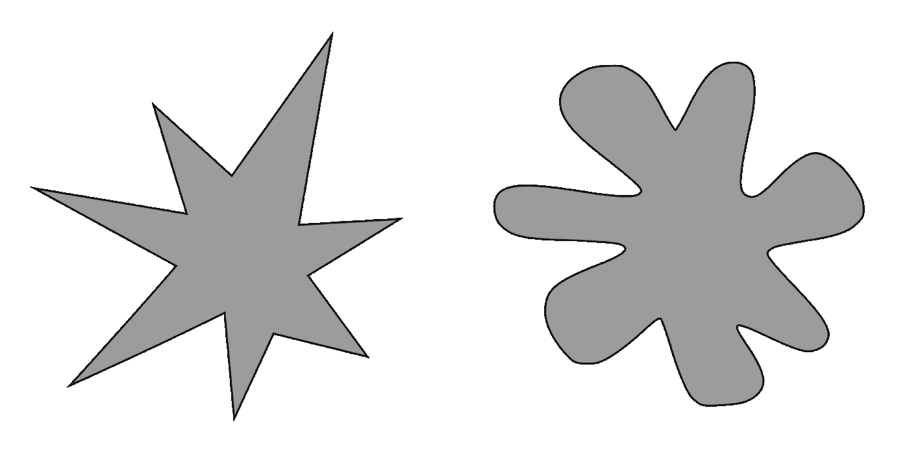

# 数据的巨大影响

> 原文：<https://towardsdatascience.com/datas-big-whiff-72ed84302752?source=collection_archive---------35----------------------->

## [行业笔记](https://towardsdatascience.com/tagged/notes-from-industry)

## 如何逃离我们的仪表盘老鼠赛跑，从数据中学习，并再次热爱这份工作。

[西格蒙德](https://unsplash.com/@sigmund?utm_source=medium&utm_medium=referral)在 [Unsplash](https://unsplash.com?utm_source=medium&utm_medium=referral) 上拍照

愚弄我一次，你真可耻。愚弄我两次，我感到羞耻。愚弄我一千次，我可能是一名数据科学家，回答我一个月前回答的同样的特别问题，想知道为什么我仍然没有从事更有趣的项目，尽管我建造了比福特工厂更多的仪表板，编写了足够的文档来[在月球上着陆一辆高尔夫球车](https://www.hq.nasa.gov/alsj/alsj-LRVdocs.html)。

对于许多数据团队来说，这是*土拨鼠日*:我们建立仪表板和自助工具，让我们从回答世俗问题中解脱出来，并承诺一旦我们支付了运营费用，就着手制定战略计划。但那一天永远不会到来。不管我们建了多少，永远都不够。我们一直在“为未来投资”，但我们却被困在了现在，被重复的临时问题所占据，我们回答问题的速度和忘记问题的速度一样快。

我们注定要永远进行这种无休止的斗争吗？不，但是我们在错误的地方寻找解决方案。

# 野生动物在哪里

分析团队可以将他们的工作分成两个粗略的部分。第一个，包括制作仪表板，是关于建立让人们回答问题的系统。它包括为“业务用户”(甚至是狂热的用户)维护商业智能工具，为管理人员创建仪表板，以及在组织中支持一些自助分析的概念。

当我们创造这些工具时，我们试图系统化地去做。我们为我们的工具定义了可读取的治理数据模型；我们监控这些模型的管道，这样我们就可以可靠地检测异常情况；我们策划发现平台，帮助人们找到相关的数据和仪表板。我们甚至创建了一个角色——分析工程师[——来拥有和维护这个系统。](https://jasnonaz.medium.com/analytics-engineering-everywhere-d56f363da625)

虽然我们不一定擅长这个桶里的所有东西，而且很多 T2 人现在对它的实际价值有争议，但 T4 肯定觉得它很有价值。一个很大的原因是，一句话，营销:商业智能及其相关应用程序是作为平台销售的。它们是基础设施，在此基础上可以建造更多的东西。建立这个系统就是投资于组织你的数据，回报是一个更有生产力和数据驱动的未来。

这对我们自己和那些给我们预算的人来说都是一个简单的推销。我们可以主张扩展系统，而不必为构建仪表板或报告进行辩护。我们不是在建造单个的房子；不，我们正在铺设道路和管道，使未合并的土地成为城市；我们在教化未开化的人。对我们所有人来说——尤其是渴望控制的高管——这很有情感吸引力。所以我们扩张；我们建造；我们“投资”

我们的另一半工作是直接做分析。这项工作通常被称为[特别分析](https://www.datafold.com/blog/dream-stack-for-analytics/#analysis)，[1]尽管有些人称之为高级分析，或者决策科学，或者仅仅是“回答问题”这大概是我们想要做的，而不是建造我们抱怨的仪表盘；我们建立自助工具，我们说，这样我们就可以专注于这种类型的工作。Looker [直接推销这一承诺](https://info.looker.com/looker-201/looker-a-modern-data-science-workflow):“Looker 有助于简化流程，节省宝贵的时间，解放数据科学家，让他们专注于工作中更有价值的方面。”

我们更喜欢这项工作，部分是因为[比在仪表板上添加第 1000 个过滤器](/dashboards-are-dead-b9f12eeb2ad2)要简单，部分是因为*这是真正重要的工作。*临时分析旨在支持临时决策。几乎可以说，这些决策是公司做出的最重要的决策——它们是你只能做一次的决策。杰夫·贝索斯著名的[单向门](https://www.inc.com/jason-aten/how-amazons-departing-ceo-jeff-bezos-prioritizes-his-time-according-to-one-way-door-rule.html)是特别分析的东西，而不是 BI 报告或自助仪表板。

然而，没有官方认可的系统来存储这些结论或查找以前做过的事情。它很少存在于我们投入大量时间构建的自助系统的文明围墙之内。是的，它有时建立在支撑 BI 工具的基础元素之上，比如治理 dbt 模型。但它的最终产品——包含分析及其相关建议的材料——通常分散在分析师的电脑中，埋藏在电子邮件和松散的帖子中，建立在不受控制的查询和 Python 笔记本之上，将开发工作与最终建议融为一体。[2]

说得更直白一点，最有价值——也最有趣！—我们作为分析师创造的东西生活在荒野中，而我们精心策划系统来支持[垃圾板](https://twitter.com/sethrosen/status/1407019976469397514)，它们的建造者讨厌建造，它们的用户不使用。

结果是毁灭性的，它超越了[炸毁](https://www.hashpath.com/2020/12/an-analytics-engineer-is-really-just-a-pissed-off-data-analyst) [数据科学家](/why-so-many-data-scientists-are-leaving-their-jobs-a1f0329d7ea4)。仪表板和 BI 报告是用于立即做出决策的操作工具。它们的用处转瞬即逝；它们不能提供持久的价值。我们需要汽车仪表板来驾驶，但我们今天并不是更好的司机，因为我们昨天使用了我们的仪表板。我们从他们身上学到的东西没有一样是持久的。

这是一个令人沮丧的讽刺。我们构建的 BI 系统不会产生价值。特别分析——我们学到的东西，实际上使我们变得更聪明的东西，比如对我们可以采取的行动进行分析，以改善我们的驾驶——确实如此，但我们没有捕捉它的系统。我们投资于转瞬即逝的事物，而抛弃了永恒。

对于一群自以为是科学家的人来说，我们可能不应该忽视科学中最令人厌倦的陈词滥调。[3]但是我们有，因为我们不能站在我们记不起也找不到的东西上。

# 更好的仪表板，更好的躺椅

我不是唯一一个对此感到沮丧的人，有时候，其他人也很生气。但到目前为止，大多数专注于仪表板和 BI 的解决方案都是不完整的改进。无论我们在系统中做什么——无论我们给予仪表板什么样的新形式，或者我们在它们之上添加多少观察和治理——我们仍然在解决一个无关紧要的问题。真正的问题发生在*系统之外*:临时性的工作是必不可少的，本质上是不受管制的。再多的“重新想象躺椅”也无法让我们的泰坦尼克号继续航行。

为了逃离我们的仪表板老鼠赛跑——更重要的是，为了帮助我们的组织实际学习和建立持久的知识——我们应该从组织我们的特别分析开始。

不幸的是，对于如何最好地做到这一点，还没有任何明确的答案。充其量，我们已经产生了一系列间接的解决方案。像 [Airbnb 的 Knowledge Repo](https://airbnb.io/projects/knowledge-repo/) 这样的旧框架，尽管对大多数组织来说可能过于笨重和以研究为导向，但可以作为更容易获得的方法的起点。像 [Select Star](https://selectstar.com/) 和 [Workstream](https://www.workstream.io/) 这样的监管工具并不能很好地管理临时工作，尽管它们可以组织它。我们可以从其他学科吸取经验教训，包括支持团队用来构建知识库的[流程](https://www.hubspot.com/knowledge-base)和为 Reddit 等社交平台提供动力的[机制。](https://blog.getdbt.com/are-dashboards-dead/)

对此我有一些其他的想法，我会留到以后的文章中。与此同时，我建议开展一个更简单——甚至可能更有影响力——的活动作为起点:我们不再称特别分析为特别分析。

# 文字成就工作

1929 年，在加那利群岛进行实验时，德国心理学家 Wolfgang k hler[发现他可以向人们展示无意义的形状和单词](https://en.wikipedia.org/wiki/Bouba/kiki_effect)，人们会一致地将相同的形状和相同的单词配对。

来源:[维基百科](https://commons.wikimedia.org/wiki/File:Booba-Kiki.svg)。

亚当·奥尔特[引用了 2103 年《纽约客》一篇关于名字力量的文章](https://www.newyorker.com/tech/annals-of-technology/the-power-of-names)中的研究，提出了语言学上的[海森堡原则](https://en.wikipedia.org/wiki/Uncertainty_principle):“一旦你给一个概念贴上标签，你就改变了人们对它的看法。”这个想法超越了通常的说法[,即给事物命名会使其具体化](https://www.psychologytoday.com/us/blog/more-light/201802/the-power-naming);这表明名字可以改变事物本身。

从这个角度来看，即席分析被低估并经常被抛弃也就不足为奇了— *它的名字告诉我们要这样做。*

对于作为公司最重要决策背后的智力支持的一类工作来说,“临时”一词有很多不好的含义。这表明这种工作是暂时的，就像草图一样，意在勾勒出一个想法，然后为了更永久的东西而被丢弃。如果你没有沉浸在分析师的语言中，不知道我们的代码，你看不到投资特别分析及其保留的必要性是可以原谅的。想象一下，一个工程师说他们想优先考虑特定的项目，或者一个营销人员正在进行特定的活动。这些事情感觉像是分支，与主要目标无关。难怪我们总是找不到时间去做这件事。

情况变得更糟。“临时”一词不仅削弱了它的价值，而且——按照科勒的说法——它改变了作品本身。通过把它命名为临时的，我们使它成为临时的。把它称为存在于系统之外的东西，我们就把它置于系统之外。我们原谅我们缺乏组织，因为它是由它的无序定义的。

这些影响相互促进。因为临时工作被认为是一次性的，我们没有投资让它持久。因为我们没有投资让它耐用，它被认为是一次性的。为了打破这种循环，我们需要重塑品牌。

一个新名字应该实现三个目标。首先，我们需要强调这项工作的重要性。例如，“战略分析”表明这不是一个次要的项目，而是我们工作中最重要的部分。

第二，我们需要将这项工作放在系统内部，而不是外部。一个组织了一些结果而失去了另一些结果的系统是不组织的；任何地方不受治理的工作都会破坏任何地方的治理。“核心分析”不能成为附属品。

最后，我们需要证明这种类型的工作不是要被丢弃，而是应该被积累。经过一年发现新的结果，我们应该在组织上更聪明，更有见识。[4]“分析研究”不是要被抛弃，而是要被编目、组织和扩展。

我个人不爱这些名字中的任何一个(我不是营销人员；我是一个[廉价增长黑客](https://benn.substack.com/p/twitter-profile-pictures)。但是，我们当然可以比特别分析做得更好。我们提出了大数据；我们提出了数据科学；我们提出了决策科学、数据网格和深度学习。作为一个领域，我们不害怕用含糊不清、难以理解的时髦吹捧来装扮 20 年前的技术，这更适合《星际迷航》的场景，而不是公司的单口相声。[5]但在最重要的时候，我们退缩了，选择了低调的拉丁法律术语。

因此，无论如何，让我们停止构建仪表板。但是首先，为了让每个人——包括我们自己——相信我们应该建造的东西的价值，让我们想出一些更好的技术术语。

[1] Gleb 将分析工作流分为三类:自助分析、仪表盘和即席分析。我认为前两类没有太大区别。

[2]是的，在《风尚》中。

[3]我们是一名不关心伤害的医生。我们是一名民权律师，拒绝根据人们的性格来评判他们。我们是一个牧师，对别人做的事从来不会考虑我们希望别人怎么对我们。

[4]这指出了我们目前如何管理特别分析的一个最致命的问题。由于您已经完成的分析，您的组织变聪明了多少？有多少未来的决策会因为你过去做的分析而变得更好？分析应该努力不只是回答一个问题，而是给我们一个下一个问题的开端。

[5]“我们扫描了数据网，舰长。读数发现了与新生命形式一致的异常，星际舰队的决策科学计算机说可以安全调查。但是深度学习扫描，先生——他们没有发现新的东西。事实上，神经网络和十年前的扫描是一样的。先生，我想——我想我们以前来过这里。”