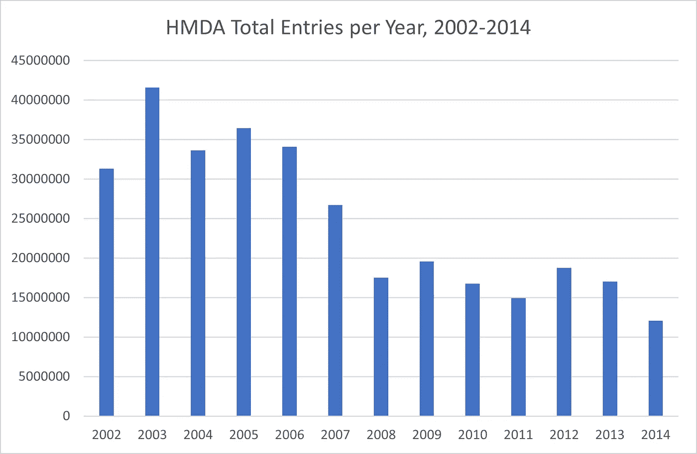

# 数据集偏见:制度化的歧视还是足够的透明度？

> 原文：<https://towardsdatascience.com/dataset-biases-institutionalized-discrimination-or-adequate-transparency-ae4119e2a65c?source=collection_archive---------32----------------------->

## 对美国抵押贷款披露法案所做努力的回顾


由[谢恩](https://www.pexels.com/@shanek?utm_content=attributionCopyText&utm_medium=referral&utm_source=pexels)和[宾亚明·梅利西](https://www.pexels.com/@binyaminmellish?utm_content=attributionCopyText&utm_medium=referral&utm_source=pexels)从[派克斯](https://www.pexels.com/photo/house-lights-turned-on-106399/?utm_content=attributionCopyText&utm_medium=referral&utm_source=pexels)拍摄的照片合成的图像。

> [……]我们为什么需要这样一部法律？在国会于 1975 年颁布 HMDA 法案之前，公众对一些城市居民区(通常是少数民族居民区)的抵押贷款——或者更重要的是，缺乏抵押贷款——表示了相当大的担忧。某些地区似乎在衰落，部分原因是这些地区的居民无法获得房屋抵押贷款。( [ClevelandFed](https://www.clevelandfed.org/en/newsroom-and-events/publications/a-look-behind-the-numbers/albtn-20181128-hmda-summary/about.aspx) )

这是 20 世纪 70 年代某些美国人口中心的悲惨现实之一。获得资本仍然困难，高风险社区的社会流动性几乎不存在。一些人认为银行系统中的制度化种族主义加剧了这一困难。“国会认为，一些金融机构未能以合理的条款和条件向合格的申请人提供足够的住房融资，导致了一些地区的衰落。”( [*百科*](https://en.wikipedia.org/wiki/Home_Mortgage_Disclosure_Act) )

因此，一项动议被提交给国会，以支持所有贷款业务的透明度。他们通过了 1975 年的住房抵押贷款披露法案，强制报告所有贷款申请，然后通过了 1977 年的社区再投资法案，鼓励金融机构帮助满足当地社区的信贷需求。

正如 [Investopedia](https://www.investopedia.com/terms/h/home-mortgage-disclosure-act-hmda.asp) 所解释的那样，HMDA 的使命非常明确:

> 总的来说,《住房抵押贷款披露法》和《条例 C》的主要目的是监测抵押贷款人的地理目标，为任何掠夺性贷款行为提供识别机制，并向政府提供抵押贷款市场的报告统计数据。
> 
> HMDA 帮助支持政府方案发起的社区投资倡议，HMDA 通过统计报告帮助监督这些倡议。HMDA 还帮助政府官员识别任何可能影响抵押贷款发放的掠夺性贷款行为。
> 
> HMDA 提交的资料还提供了一种分析政府资源分配的方法，并确保资源被适当分配以资助社区活动。

因此，金融机构必须报告他们的贷款实践，不仅要报告发放的所有贷款，还要报告**每一笔贷款申请以及申请人的相关元数据，如种族、性别和社区，以及贷款是被批准还是被拒绝**。

从监管的角度来看，现在有了一个镜头，通过这个镜头可以跟踪违反社会平等的行为并实施处罚。这也意味着数据中存在一种*有意的偏见*——银行业中制度化的种族主义及其所有表现形式。

# 探索数据

让我们从美国档案馆的[房屋抵押贷款披露数据文件(1981 年至 2014 年)中了解一下报道了什么，以及为什么。](https://catalog.archives.gov/id/2456161)

*(如果你想在家里研究这个数据集，你还需要几个数据集，比如相关的人口普查数据。幸运的是，美国档案馆的超级图书管理员团队为我们将所有东西打包在一个* [*单页*](https://www.archives.gov/research/electronic-records/housing) *中。感谢你当地的图书管理员。)*

## 1981–1990

通过研究这些数据，我们发现 1981-1990 年期间主要关注的是追踪退伍军人，他们中的许多人是从越南回来的。更多的问题和数据与退伍军人事务部的申请人有关，如果他们申请贷款时要求财政支持。

编码格式非常简单，只需要一点映射:

```
[{'NAME': 'respondentName', 'START': 0, 'STOP': 28, 'LENGTH': 28},
 {'NAME': 'respondentID', 'START': 28, 'STOP': 36, 'LENGTH': 8},
 {'NAME': 'reportMSA', 'START': 36, 'STOP': 40, 'LENGTH': 4},
 {'NAME': 'censusTract', 'START': 40, 'STOP': 46, 'LENGTH': 6},
 {'NAME': 'state', 'START': 46, 'STOP': 48, 'LENGTH': 2},
 {'NAME': 'county', 'START': 48, 'STOP': 51, 'LENGTH': 3},
 {'NAME': 'supervisoryAgencyCode', 'START': 51, 'STOP': 52, 'LENGTH': 1},
 {'NAME': 'censusValidityFlag', 'START': 52, 'STOP': 54, 'LENGTH': 2},
 {'NAME': 'VA_FHA', 'START': 54, 'STOP': 55, 'LENGTH': 1},
 {'NAME': 'vaNumLoans', 'START': 55, 'STOP': 59, 'LENGTH': 4},
 {'NAME': 'vaTotalLoans', 'START': 59, 'STOP': 68, 'LENGTH': 8},
 {'NAME': 'convLoansFlag', 'START': 68, 'STOP': 69, 'LENGTH': 1},
 {'NAME': 'convNumLoans', 'START': 69, 'STOP': 73, 'LENGTH': 4},
 {'NAME': 'convTotalLoans', 'START': 73, 'STOP': 82, 'LENGTH': 9},
 {'NAME': 'hiFlag', 'START': 82, 'STOP': 83, 'LENGTH': 1},
 {'NAME': 'hiNumLoans', 'START': 83, 'STOP': 87, 'LENGTH': 4},
 {'NAME': 'hiTotalLoans', 'START': 87, 'STOP': 96, 'LENGTH': 9},
 {'NAME': 'multiFlag', 'START': 96, 'STOP': 97, 'LENGTH': 1},
 {'NAME': 'multiNumLoans', 'START': 97, 'STOP': 101, 'LENGTH': 4},
 {'NAME': 'multiTotalLoans', 'START': 101, 'STOP': 110, 'LENGTH': 9},
 {'NAME': 'nonFlag', 'START': 110, 'STOP': 111, 'LENGTH': 1},
 {'NAME': 'nonNumLoans', 'START': 111, 'STOP': 115, 'LENGTH': 4},
 {'NAME': 'nonTotalLoans', 'START': 115, 'STOP': 124, 'LENGTH': 9},
 {'NAME': 'recordQuality', 'START': 124, 'STOP': 125, 'LENGTH': 1}]
```

总的来说，很多 VA 的考虑。

## 1990–2014

1989 年，跟踪优先级发生了重大变化。从[到 FFIEC](https://www.ffiec.gov/hmda/history2.htm) :

“[……]1989 年，美联储委员会修订了条例 C，纳入了《金融机构改革、恢复和执行法》中的修正案。《金融改革法》修正案实现了以下目标:扩大了 HMDA 的覆盖范围，将与存款机构或控股公司无关的抵押贷款人包括在内；除了有关贷款发放和购买的数据之外，还要求报告有关抵押贷款和住房改善贷款申请处理情况的数据；并要求大多数贷款人确认贷款申请人和借款人的种族、性别和收入

正如预期的那样，文件映射发生了显著变化，bt 现在遵循一种可使用到 2014 年的模式:

```
[{'NAME': 'ASOF_DATE', 'START': 0, 'STOP': 4, 'LENGTH': 4},
 {'NAME': 'RESP_ID', 'START': 4, 'STOP': 14, 'LENGTH': 10},
 {'NAME': 'AGENCY_CODE', 'START': 14, 'STOP': 15, 'LENGTH': 1},
 {'NAME': 'LOAN_TYPE', 'START': 15, 'STOP': 16, 'LENGTH': 1},
 {'NAME': 'LOAN_PURPOSE', 'START': 16, 'STOP': 17, 'LENGTH': 1},
 {'NAME': 'OCCUPANCY', 'START': 17, 'STOP': 18, 'LENGTH': 1},
 {'NAME': 'LOAN_AMOUNT', 'START': 18, 'STOP': 23, 'LENGTH': 5},
 {'NAME': 'ACTION_TYPE', 'START': 23, 'STOP': 24, 'LENGTH': 1},
 {'NAME': 'PROPERTY_MSA', 'START': 24, 'STOP': 28, 'LENGTH': 4},
 {'NAME': 'STATE_CODE', 'START': 28, 'STOP': 30, 'LENGTH': 2},
 {'NAME': 'COUNTY_CODE', 'START': 30, 'STOP': 33, 'LENGTH': 3},
 {'NAME': 'CENSUS_TRACT_NUMBER', 'START': 33, 'STOP': 40, 'LENGTH': 7},
 {'NAME': 'RACE_APPLICANT', 'START': 40, 'STOP': 41, 'LENGTH': 1},
 {'NAME': 'RACE_COAPPLICANT', 'START': 41, 'STOP': 42, 'LENGTH': 1},
 {'NAME': 'SEX_APPLICANT', 'START': 42, 'STOP': 43, 'LENGTH': 1},
 {'NAME': 'SEX_COAPPLICANT', 'START': 43, 'STOP': 44, 'LENGTH': 1},
 {'NAME': 'APPLICANT_INCOME', 'START': 44, 'STOP': 48, 'LENGTH': 4},
 {'NAME': 'PURCHASER_TYPE', 'START': 48, 'STOP': 49, 'LENGTH': 1},
 {'NAME': 'DENIAL_REASON_1', 'START': 49, 'STOP': 50, 'LENGTH': 1},
 {'NAME': 'DENIAL_REASON_2', 'START': 50, 'STOP': 51, 'LENGTH': 1},
 {'NAME': 'DENIAL_REASON_3', 'START': 51, 'STOP': 52, 'LENGTH': 1},
 {'NAME': 'EDIT_STATUS', 'START': 52, 'STOP': 53, 'LENGTH': 1},
 {'NAME': 'SEQUENCE_NUMBER', 'START': 53, 'STOP': 60, 'LENGTH': 7}]
```

这意味着，对于每种应用，我们现在都可以知道:

*   申请人的种族和性别；
*   共同申请人的种族和性别；
*   他们所在的街区；
*   贷款的目的(房屋或维修)；
*   贷款可能被拒绝的原因列表；
*   需要提交的表格总数；和
*   申请过程中的每一天。

贷款申请是故意拖延的吗？本应被批准的家庭维修被否决了吗？同性共同申请人呢？全部可见。

(*注意:我们还没有公布我们处理过的数据，因为我们仍在处理和调查它。有许多报告错误，如州缩写而不是州代码，错误的人口普查轨道，以及许多其他问题，仍然需要大量的数据预处理，才能理解几十年来社会规范的变化。在这个时候得出任何结论都是不明智的。*)

多年来，大多数银行都越来越坚持该计划。席卷美国的数字化浪潮年复一年地得到验证。越来越少的抵押贷款申请也出现了明显的下降趋势，这很可能是由次贷危机引起的:



2008 年前后，抵押贷款申请的总数有了明显的变化。

到目前为止很棒，不是吗？现在，这个数据是一把双刃剑:

**如果数据科学家不理解他们正在使用的数据，那么可以用来保护公民免受掠夺性银行做法侵害的相同数据可能会被用作针对他们的歧视性武器。**

为什么这个数据集现在包含了所有偏见、优惠待遇以及错误或恶意拒绝的贷款申请。每一个可能的歧视事件都被永久记录下来。这种数据没有消毒的可能。

HMDA 数据集是有偏见的——绝对有。

> 应该由数据科学家来理解什么是该问的问题，更重要的是，什么是不该问的问题。

# 这些数据应该存在吗？

无论用什么标准来衡量，这个数据集都可以被认为是具有侵犯性和歧视性的。加拿大，通常被认为是一个(稍微)更宽容的国家，有一种不同的方法来追踪种族和种族主义。如[对话](https://theconversation.com/census-2021-canadians-are-talking-about-race-but-the-census-hasnt-caught-up-158343)中所述:

> 加拿大的[反种族主义战略](https://www.canada.ca/en/canadian-heritage/campaigns/anti-racism-engagement/anti-racism-strategy.html)，借鉴了几十年的研究成果，声明种族是一种社会建构。根据种族对人进行分类是没有依据的，但是种族偏见和歧视有非常真实的影响。问题是:我们如何从人口普查和其他调查中获得系统性种族主义影响的相关数据？
> 
> 加拿大统计局试图在不直接询问种族的情况下收集这些信息。加拿大统计局的多样性专家 Jean-Pierre Corbeil 说，需要基于种族的数据。但他怀疑这是否真的需要在人口普查中提及种族。
> 
> 从历史上看，政府一直不愿意直接询问种族问题，这导致缺乏分类数据。第二次世界大战后，人口普查使用间接方法，通过语言或民族文化渊源等种族替代物来估计非白人、非土著人口。

*(注:对作为公民社会支柱的加拿大多元文化主义的主要抱怨之一是，它允许人们在自我分配的许可结构的面纱下，根据种族或国籍对他人进行分类，但这是以后的话题。)*

因此，这意味着一些国家拒绝跟踪银行贷款申请人的种族和性别，因为衡量种族主义从根本上放大了将人们分类的分裂性。所以，回头看看 HMDA 的数据，可以问的问题是，“这些数据应该存在吗？”

我相信答案是肯定的。该法案为公众提供了巨大的保护，尤其是在 2005 年的一次重大调查中。来自[布法罗新闻](https://buffalonews.com/news/spitzer-to-probe-mortgage-lending-targets-8-major-lenders-including-hsbc-bank/article_0eca2c10-99cf-5f62-9941-44801177eb1f.html):

> 纽约司法部长埃利奥特·斯皮策(Eliot Spitzer)发起了最新一轮攻势，对该州八大银行的抵押贷款行为展开初步调查，其中包括汇丰银行美国分行。[…]
> 
> 调查人员正试图确定银行如何为贷款定价，费用和利率是否公平，或者是否存在种族歧视。[…]
> 
> 花旗集团在 2002 年已经同意支付 2 . 15 亿美元来解决美国联邦贸易委员会指控的 Associates First Capital corp——花旗集团在 2000 年收购了该公司——从事掠夺性贷款。2002 年，Associates 的竞争对手 Household International(于 2003 年被汇丰控股有限公司收购)支付了 4 . 84 亿美元，解决了所有 50 个州的类似指控，这是有史以来最大的消费者和解。

然而，尽管这些数据已经取得了成功，但数据科学家应该明白什么是该问的问题，更重要的是什么是不该问的问题。例如，试图从这些数据中建立一个抵押贷款审批管道是一个可怕的想法——你现在有一个种族主义者，仇视同性恋的机器人。然而，如果你希望通过调查离群值来调查制度化歧视的本质，那么你有一个巨大的武器供你使用。

如何使用这种武器取决于你自己。

**补充阅读**

*   [重访 CRA:社区再投资法案](https://www.frbsf.org/community-development/files/revisiting_cra.pdf)的前景，波士顿和旧金山美联储银行的联合出版物，2009 年 2 月。
*   [住房抵押贷款披露法案数据存储系统隐私影响评估](https://www.federalreserve.gov/files/pia_hmda.pdf)，美国美联储理事会，2020 年 11 月。
*   我写了一部被彭博归咎于金融危机的法律。他错了。，罗伯特·库特纳(Robert Kuttner)，2020 年 2 月 15 日《华盛顿邮报》专栏版。
*   [HMDA 的历史](https://www.ffiec.gov/hmda/history2.htm)，联邦金融机构考试委员会，2018 年 1 月。

咨询愉快！

马特。

*如果您对本文或我们的 AI 咨询框架有其他问题，请随时通过*[***LinkedIn***](https://www.linkedin.com/in/mnlemay/)**或通过*[***email***](mailto:matt@lemay.ai)*联系。**

# *你可能喜欢的其他文章*

*   *[AI 如何创造价值？](https://medium.com/@lsci/how-does-artificial-intelligence-create-value-bec14c785b40)*
*   *[实施企业人工智能战略](/implementing-a-corporate-ai-strategy-a64e641384c8)*
*   *[离群点感知聚类:超越 K 均值](/outlier-aware-clustering-beyond-k-means-76f7bf8b4899)*
*   *[深度学习图像分类器的罗夏测试](/rorschach-tests-for-deep-learning-image-classifiers-68c019fcc9a9)*