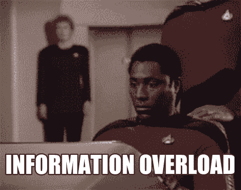
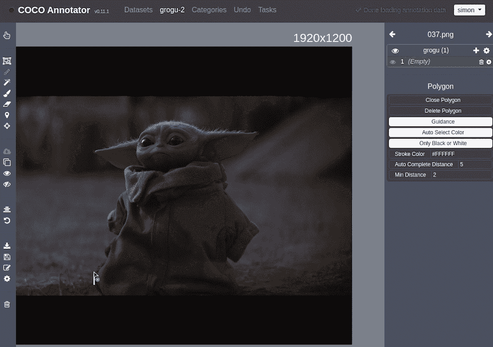
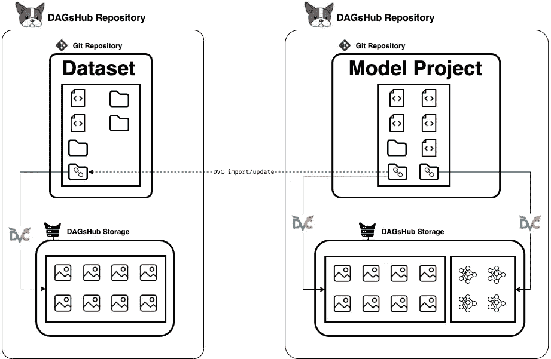
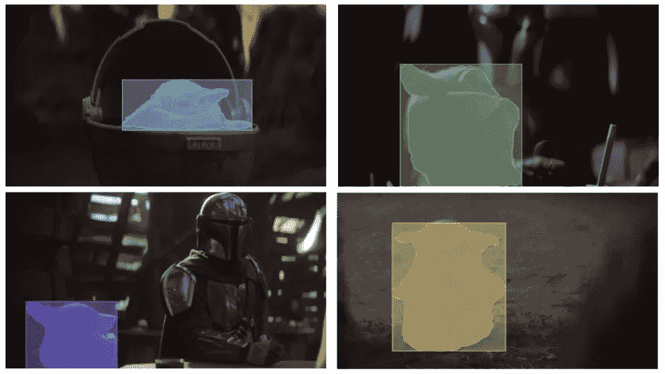

# 数据集的行为应该像 git 存储库一样

> 原文：<https://towardsdatascience.com/datasets-should-behave-like-git-repositories-9acb83a0dae5?source=collection_archive---------18----------------------->

## 创建、维护和贡献一个长期存在的数据集，该数据集将跨项目自动更新。

从数据中出现的问题在研究和行业中都很常见。那些问题是作为我们项目的一部分来处理的，但是我们通常不会费心去解决它们的根源。我们在本地修复一次数据，然后继续我们的项目。在某些情况下，这当然是一个有效的方法，但是当我们在项目之间共享数据越来越多的时候，我们发现我们自己随着时间的推移在团队之间重复相同的过程。对于许多人共享的公共数据集来训练许多机器学习模型，这个问题尤其如此。我将向您展示如何使用 git 和 DVC 作为版本控制系统，使用 DAGsHub 作为数据集的宿主，来创建、维护和贡献一个能够跨项目自动更新的长期数据集。

# 我的数据集上的迭代

# 更改数据集是一个常见的过程

我记得在我本科学习期间，我必须使用分割的叶子、黄瓜和花的自定义数据集来生成黄瓜植物部分的实例分割模型。在很早的时候，我发现我无法用最初给出的数据得到合理的结果。我决定自己给大约十几张图片加上注释。不出所料，这解决了我 80%的问题。这是一个说手工数据劳动被低估的好机会。投资几个小时修复数据是我能为这个项目做的最好的事情。然后，当然，我继续我的生活，把固定的数据集留在实验室的电脑上，但我知道最终，我的修复会消失。

自然，这个过程是渐进的。我从原始数据集开始，然后修改了一部分注释。在某个时候，我添加了全新的图片，决定重做其中的一些。随着时间的推移，我通过多次操作对数据进行迭代。我将其中的许多视为“调试试错法”，自然不会严格跟踪我的工作目录。在那些迭代过程中，我运行培训课程，同时尽最大努力详细记录我的“经历”。如果你还在读，你大概就明白我在说什么了。从那时起，世界已经发生了变化，许多数据版本化工具已经发展到可以提供帮助。这是一个很好的机会来推荐我们在 2020 年底发布的这个[数据版本控制工具](https://dagshub.com/blog/data-version-control-tools/)对比。

# 什么是数据版本化？

虽然我的项目在数据方面一塌糊涂，但是 git 很好地跟踪了它的代码。原因是我可以运行下面这些人人都知道的神奇命令:

```
git add .
git commit -m "fixed training input directory"
```

那时候，我不能对我的数据做任何这种神奇的命令。现在，随着世界上有了 [DVC](https://dvc.org/) 和 DAGsHub，情况不再是这样了。没有理由不至少建立一个简单的代码和数据版本控制系统。如果你不熟悉 DVC，我推荐你阅读[这篇基础数据版本教程](https://dagshub.com/docs/experiment-tutorial/2-data-versioning/)，但它是*而不是*理解这篇文章其余部分的先决条件。你真正需要知道的是，现在我们有了一个新的、神奇的命令:

```
dvc commit
```

这将创建被跟踪数据的快照，而不会增加您的 git 存储库。

# 介绍实时数据集

虽然数据版本化解决了在您的机器学习项目环境中管理数据的问题，但它带来了一种管理数据集的新方法。这种方法，在这里也被称为数据注册，包括创建一个完全专用于管理数据集的 git 存储库。这意味着，与研究人员、学生、kagglers 和开源机器学习贡献者经常在冻结的数据集上训练模型不同，你可以将你的项目链接到数据集(或任何文件)，并将其视为依赖关系。毕竟，数据可以也应该被视为代码，并遵循审查过程。你可以在另一篇关于[数据错误以及如何修复它们](https://dagshub.com/blog/data-bugs-how-to-fix-them/)的文章中读到更多。

警告——如果你觉得受到知识的威胁，就不要继续阅读了！



[通过 GIPHY](https://giphy.com/gifs/arielle-m-star-trek-information-overload-3o6gDSdED1B5wjC2Gc)

我是在开玩笑，当然，这根本不会是火箭科学。事实上，我将演示如何在一个类似于我大学项目的项目中使用这样一个活体数据集。

# 创建一个数据注册中心，将其作为一个动态数据集使用

为了展示这种生活数据集的新概念，我自己建立了一个，以及一个使用它作为依赖的机器学习模型。

[存储库 A](https://dagshub.com/Simon/baby-yoda-segmentation-dataset)——也就是动态数据集，将是一个简单的项目，拥有神奇的元数据文件，指向存储在专用存储中的真正的大文件。我可以将数据集文件组织到目录中，添加带有`utils`函数的代码文件来使用它，或者任何我认为合适的方式来存储和呈现我的数据集给任何想要使用它的人。

[储存库 B](https://dagshub.com/Simon/baby-yoda-segmentor)——又名机器学习项目，是我想使用存储在我的生活数据集中的文件的地方。这个存储库将使用 DVC 从存储库 A 导入一个目录，这将使该目录可管理和可更新。

要创建数据注册中心，只需创建一个 git + DVC 目录。

```
mkdir my-dataset && cd my-dataset
git init
dvc init
```

恭喜你。你的活体数据集是活的。现在我们需要给它添加一些文件。


[via GIPHY](https://giphy.com/gifs/arielle-m-star-trek-information-overload-3o6gDSdED1B5wjC2Gc)

在我的例子中，我从一个喜爱的电视节目中截取了一些截图，并使用令人敬畏的开源项目 [COCO annotator project](https://github.com/jsbroks/coco-annotator) 对其中我最喜欢的角色进行了注释。



作者(向迪士尼+致谢)

在注释了大约 40 张图片后，我知道这对于一个预先训练好的具有 ResNet50 主干的 Mask-RCNN 来说足够了，可以给出不错的结果(15 张可能也足够了，但是太有趣了，不能停下来)。我导出了一个`.json`注释文件，把它和我拍摄的截图放在我的存储库中。此时，我的工作目录如下所示:

```
.
├── annotations
│   └── grogu.json
└── images
    ├── 000.png
    ├── 001.png
    .
    .
    .
    ├── 206.png
    └── 208.png
```

然后我运行神奇的命令开始跟踪数据文件。

```
dvc add annotations
dvc add images
git add . && git commit -m "Starting to manage my dataset"
```

由于我喜欢可视化，我在[这个 python 笔记本](https://dagshub.com/Simon/baby-yoda-segmentation-dataset/src/master/Playground.ipynb)中写了一个脚本，将我的数据集的预览渲染到一个[预览目录](https://dagshub.com/Simon/baby-yoda-segmentation-dataset/src/master/preview)中，这个目录也会被 DVC 跟踪。然后，我将代码和数据推送到我的远程存储库，这样我就可以从任何地方访问它们，并与我的合作者共享。

```
git push origin master
dvc push -r origin
```

注意:我跳过了在 GitHub / DAGsHub 上打开存储库和设置远程存储的部分，[教程](https://dagshub.com/docs/experiment-tutorial/2-data-versioning/#pushing-code-data-and-models-to-dagshub)应该会涵盖这部分内容。

# 在机器学习项目中使用活体数据集

现在是时候在我的机器学习项目中使用我的数据集作为依赖项了。我将无法在学校重新创建我的黄瓜项目，因为我无法访问这些数据，所以我将用上面那个可爱的虚构人物来代替黄瓜。

我希望我的项目目录如下所示:

```
.
├── data
│   ├── preprocessed
│   └── raw
└── src
```

我想从我的数据集中导入一个目录，并将其视为`raw`文件。我可以从我的存储库内部运行:

```
mkdir -p data/rawdvc import -o data/raw/images \
https://dagshub.com/Simon/baby-yoda-segmentation-dataset \
data/imagesdvc import -o data/raw/annotations \
https://dagshub.com/Simon/baby-yoda-segmentation-dataset \
data/annotations
```

这将专门从我的数据集存储库中下载目录`images`和`annotations`，并保存关于如何继续跟踪其中所做更改的信息。关于跟踪变更的更多内容将在后面解释，但差不多就是这些了。



按作者

在上图中，你可以看到它是如何工作的。箭头指向依赖关系。每当我知道数据集发生变化时，我只需运行命令

```
dvc update
```

上面的[命令将检查存储库的被跟踪 ref 中的变化，并将它们拉到我的本地目录中。然后，我从头开始重新运行我的管道——训练我的模型，保存最好的一个，并提交我的结果。注意，如果我们想的话，我们可以使用`dvc import` + `dvc update`的方法来获得输出模型，作为另一个项目中的依赖项。](https://dvc.org/doc/command-reference/update)

# 呼吁合作

首先，我想感谢你一起阅读，我希望你喜欢它。该项目仍在进行中(但什么项目不是呢？).因此，如果你在数据集或模型中发现了错误或需要改进的地方，那就贡献出来吧！派生存储库、提取数据、推送数据和合并数据相当容易。尤其是有了[数据科学拉取请求](https://dagshub.com/blog/data-science-pull-requests/)。该过程可以很容易地适应任何分割数据集，所以也可以随意这样做。

特别感谢 [Asher](https://www.linkedin.com/in/asher-yartsev/) 和[或](https://www.linkedin.com/in/or-shemesh-4a99a7101/)，我最初分割项目的同学们给了我这个迷你项目的灵感。

这里有一些结果只是为了好玩！



作者(向迪士尼+致谢)