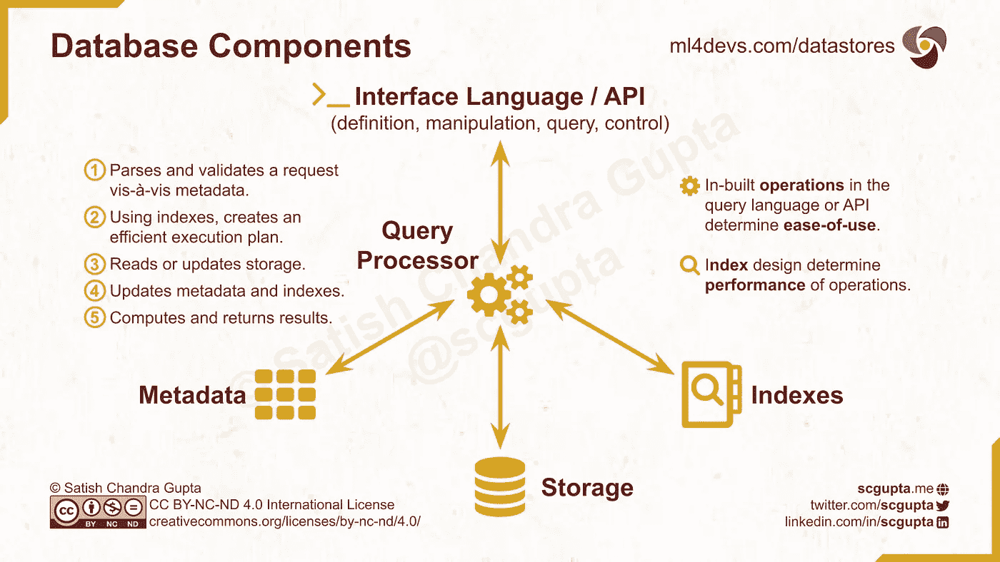
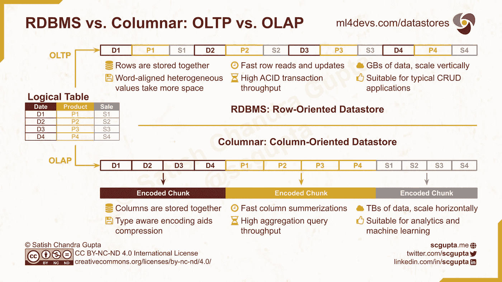
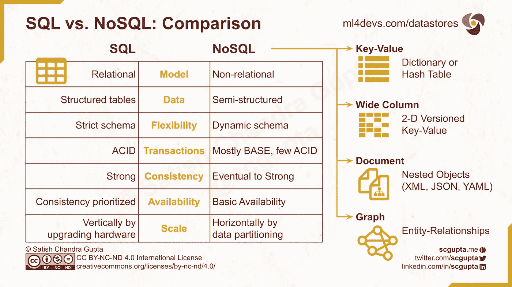
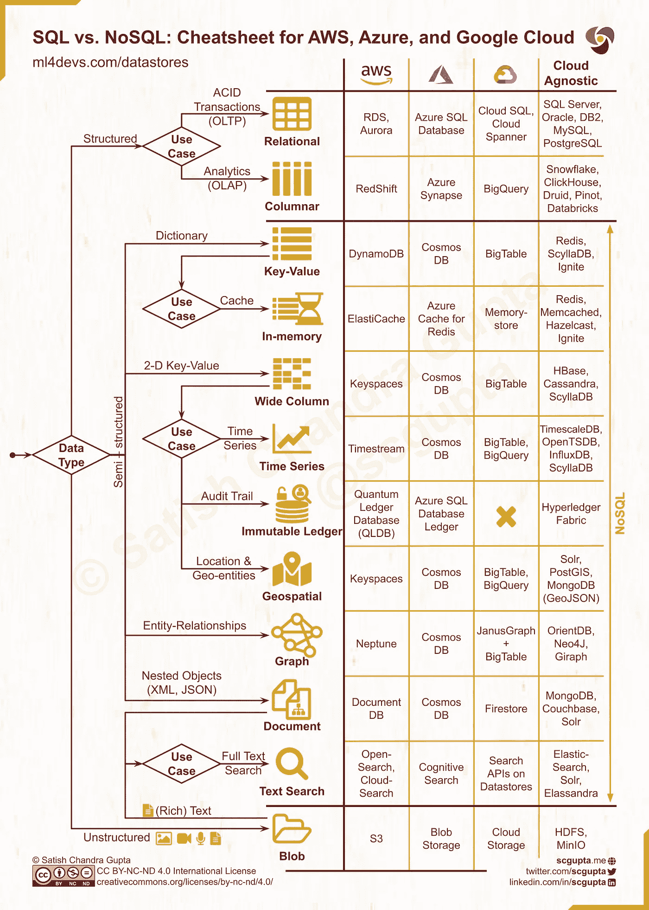

# SQL 与 NoSQL 数据库:何时使用，如何选择

> 原文：<https://towardsdatascience.com/datastore-choices-sql-vs-nosql-database-ebec24d56106?source=collection_archive---------0----------------------->

照片由[郄佳朝&阿夫松](https://unsplash.com/@jacegrandinetti)在 [Unsplash](https://unsplash.com/photos/_P6_cMSxGUw)

## 数据工程

## SQL 和 NoSQL 数据库的区别。深入研究、决策树和备忘单，从 12 种数据库类型中选择最适合您的数据类型和用例。

***免费版:****[*SQL vs NoSQL*](https://www.ml4devs.com/articles/datastore-choices-sql-vs-nosql-database/)*

*你如何选择一个数据库？也许，您评估用例是否需要关系数据库。根据不同的答案，选择您最喜欢的 SQL 或 NoSQL 数据存储，并让它工作。这是一个谨慎的策略:已知的魔鬼比未知的天使更好。*

*选择正确的数据存储可以简化您的应用程序。错误的选择会增加摩擦。本文将通过对各种数据存储的深入概述，帮助您扩大已知恶魔的列表。它包括以下内容:*

*   ***定义数据存储特征的数据库部件**。*
*   ***数据存储**按**数据类型分类**:深入了解数据库中的非结构化、结构化(表格)和半结构化(NoSQL)数据。*
*   ***差异**在 **SQL** 和 **NoSQL** 数据库之间。*
*   ***数据存储**专用于各种**用例**。*
*   ***决策备忘单**了解本地和云数据存储选择的前景。*

## ***目录:***

*   *[**数据库内**](#5ed8)*
*   *[**非结构化数据的 Blob 存储**](#2604)*
*   *<#67be> **-[OLTP:关系型或面向行的数据库](#ebbb)
    - [OLAP:列型或面向列的数据库](#f996)***
*   ***[**半结构化数据的 NoSQL 数据存储**](#35e1)
    - [键值数据存储](#88d1)
    - [宽列数据存储](#17d8)
    - [文档数据存储](#7d23)
    - [图形数据存储](#939a)***
*   ***[**SQL 与 NoSQL 数据库对比**](#3f01)
    -[SQL 与 NoSQL 的区别](#17c3)
    -[SQL 与 NoSQL 的性能和伸缩性](#e0b9)***
*   ***[**NoSQL 用例专门化**](#c86a)
    - [内存中键值数据存储](#34af)
    - [时序数据存储](#eff2)
    - [不可变分类帐数据存储](#16bb)
    - [文本搜索数据存储](#417f)***
*   ***[**SQL vs NoSQL 决策树&云备忘单**](#904d)***

# ***在数据库中***

***对数据库如何工作的高层次理解有助于评估备选方案。数据库有 5 个组件:接口、查询处理器、元数据、索引和存储:***

1.  *****接口语言或 API:** 每个数据库定义一种语言或 API 与之交互。它涵盖了数据和事务的定义、操作、查询和控制。***
2.  *****查询处理器:**数据库的“CPU”。它的工作是处理传入的请求，执行所需的操作，并返回结果。***
3.  *****存储器:**存储数据的磁盘或内存。***
4.  *****索引:**在存储中快速定位查询数据的数据结构。***
5.  *****元数据:**数据的元信息，存储。和索引(例如，目录、模式、大小)。***

*****查询处理器**对每个传入的请求执行以下步骤:***

1.  ***解析请求并根据元数据进行验证。***
2.  ***创建利用索引的高效执行计划。***
3.  ***读取或更新存储。***
4.  ***更新元数据和索引。***
5.  ***计算并返回结果。***

***要确定数据存储是否符合您的应用需求，您需要仔细检查:***

*   ***接口支持的**操作**。如果您需要的计算是内置的，您将需要编写较少的代码。***
*   ***可用的**索引**。它将决定查询运行的速度。***

***在接下来的几节中，让我们检查各种数据类型的数据存储中的操作和索引。***

******

***数据库组件:接口语言、查询处理器、存储、索引和元数据；以及由查询处理器执行的步骤。图片由作者提供，并在[Creative Commons BY-NC-ND 4.0 International](https://creativecommons.org/licenses/by-nc-nd/4.0/)许可下发布。***

# ***非结构化数据的 Blob 存储***

***文件系统是最简单和最古老的数据存储。我们每天都用它来存储各种数据。Blob 存储是文件系统的超大规模分布式版本。用于存储*非结构化数据*。***

***Blob 的 [backronym](https://en.wikipedia.org/wiki/Backronym) 是二进制大对象。你可以存储任何类型的数据。因此，blob 数据存储在解释数据方面没有任何作用:***

*   ***Blob 支持文件级的 CRUD(创建、读取、更新、删除)**操作**。***
*   ***目录或文件*路径*就是**索引**。***

***因此您可以快速找到并读取该文件。但是在一个文件中定位某些东西需要顺序扫描。文档、图像、音频和视频文件存储在 blobs 中。***

# ***结构化数据的表格数据存储***

***表格数据存储适合存储*结构化数据*。每条记录(*行*)具有相同类型的相同数量的属性(*列*)。***

***有两种应用:***

*   ***在线**事务**处理( **OLTP** ):实时捕获、存储和处理来自事务的数据。***
*   ***在线**分析**处理( **OLAP** ):分析来自 OLTP 应用程序的聚合历史数据。***

***OLTP 应用程序需要支持*低延迟*读取和写入*单个*记录的数据存储。OLAP 应用程序需要支持对大量(*只读*)记录进行*高吞吐量*读取的数据存储。***

## ***OLTP:关系或面向行的数据库***

***关系数据库管理系统是最早的数据存储之一。数据组织在表格中。表格被[规格化](https://en.wikipedia.org/wiki/Database_normalization)以减少数据冗余和更好的数据完整性。***

***表可能有主键和外键:***

*   ***[**主键**](https://en.wikipedia.org/wiki/Primary_key) 是唯一标识表中一条记录(行)的最小属性(列)集。***
*   ***[**外键**](https://en.wikipedia.org/wiki/Foreign_key) 建立表之间的关系。它是一个表中的一组属性，引用另一个表的主键。***

***使用标准查询语言(SQL)对查询和事务进行编码。***

***关系数据库针对事务操作进行了优化。事务经常更新多个表中的多条记录。索引针对 [ACID 事务](https://en.wikipedia.org/wiki/ACID)的频繁低延迟写入进行了优化:***

*   *****原子性:**任何更新多行的事务都被视为单个*单元*。一个成功的事务执行所有的更新。失败的事务不执行任何更新，即数据库保持不变。***
*   *****一致性:**每个事务都将数据库从一种有效状态带到另一种有效状态。它保证维护所有数据库不变量和约束。***
*   *****隔离:**多个事务的并发执行使数据库处于相同的状态，就好像事务是顺序执行的一样。***
*   *****持久性:**提交的事务是永久的，即使系统崩溃也不会被破坏。***

***有很多选择:***

*   ***云不可知:Oracle、Microsoft SQL Server、IBM DB2、 [PostgreSQL](https://www.postgresql.org/) 和 [MySQL](https://www.mysql.com/)***
*   ***AWS:在[关系数据库服务(RDS)](https://aws.amazon.com/rds/) 中托管 PostgreSQL 和 MySQL***
*   ***微软 Azure:托管 SQL 服务器作为 Azure SQL 数据库***
*   ***Google Cloud:在 [Cloud SQL](https://cloud.google.com/sql/) 中托管 PostgreSQL 和 MySQL，还横向扩展 [Cloud Spanner](https://cloud.google.com/spanner)***

## ***OLAP:柱状还是面向列的数据库***

***事务是在行(记录)上进行的，而分析属性是在列(属性)上计算的。OLAP 应用程序需要对表进行优化的列读取操作。***

***实现这一点的一种方法是向关系数据库添加面向列的索引。例如:***

*   ***[微软 SQL Server 中的列存储索引](https://docs.microsoft.com/en-us/sql/relational-databases/indexes/columnstore-indexes-overview?view=sql-server-ver15)***
*   ***[PostgreSQL 中的列存储索引](https://swarm64.com/post/postgresql-columnstore-index-intro/)***

***然而，主要的 RDBMS 操作是低延迟、高频率的 ACID 事务。这无法扩展到分析应用中常见的大数据规模。***

***对于大数据，存储在 blob 存储 [**数据湖**](https://en.wikipedia.org/wiki/Data_lake) 变得流行起来。部分分析汇总在 [**OLAP 立方体**](https://en.wikipedia.org/wiki/OLAP_cube) 中计算和维护。柱状存储在规模和性能方面的进步使得 OLAP 立方体被淘汰。但是这些概念仍然与设计数据管道相关。***

***现代的 [**数据仓库**](https://en.wikipedia.org/wiki/Data_warehouse) 是建立在 [**柱状**](https://en.wikipedia.org/wiki/Column-oriented_DBMS) 数据库之上的。数据按列存储，而不是按行存储。可用的选项有:***

*   ***AWS: [红移](https://aws.amazon.com/redshift/?whats-new-cards.sort-by=item.additionalFields.postDateTime&whats-new-cards.sort-order=desc)***
*   ***Azure: [突触](https://azure.microsoft.com/en-in/services/synapse-analytics/)***
*   ***谷歌云: [BigQuery](https://cloud.google.com/bigquery)***
*   ***阿帕奇:[德鲁伊](https://druid.apache.org/)，[库杜](https://kudu.apache.org/)，[比诺](https://pinot.apache.org/)***
*   ***其他:[点击屋](https://clickhouse.tech/)、[雪花](https://www.snowflake.com/)***

***[Databricks Delta Lake](https://databricks.com/product/delta-lake-on-databricks) 对存储在数据湖中的数据提供类似柱状的性能。***

******

***RDBMS 与列式:面向行的数据库用于 OLTP，面向列的数据库用于 OLAP 应用程序。图片由作者提供，并在[Creative Commons BY-NC-ND 4.0 International](https://creativecommons.org/licenses/by-nc-nd/4.0/)许可下发布。***

# ***半结构化数据的 NoSQL***

***NoSQL 数据存储支持半结构化数据类型:键值、宽列、文档(树)和图形。***

## ***键值数据存储***

***键值存储是一个[字典或散列表](https://en.wikipedia.org/wiki/Associative_array)数据库。它是为 CRUD 操作设计的，每个记录都有一个唯一的键:***

*   ***Create(key，value):向数据存储添加一个键值对***
*   ***Read(key):查找与键相关联的值***
*   ***Update(key，value):更改键的现有值***
*   ***Delete(key):从数据存储中删除(key，value)记录***

***这些值没有固定的模式，可以是从原始值到复合结构的任何值。键值存储是高度可分区的(因此可以水平扩展)。Redis 是一个受欢迎的键值存储。***

## ***宽列数据存储***

***宽列存储包含表、行和列。但是对于同一个表中的每一行，列的名称和类型可能不同。在逻辑上，它是一个版本化的稀疏矩阵，具有多维映射(行-值、列-值、时间戳)。它就像一个二维的键值存储，每个单元格的值都有一个时间戳。***

***宽列数据存储高度可分区。它有一个存储在一起的列族的概念。单元格的逻辑坐标是:(行键，列名，版本)。物理查找如下:区域字典列系列目录行关键字列系列名称列限定符版本。因此，宽列存储实际上是面向行的数据库。***

***[Apache HBase](https://hbase.apache.org/) 是第一个开源的宽列数据存储。查看 [HBase in Practice](https://www.slideshare.net/larsgeorge/hbase-in-practice) ，了解宽列数据存储的核心概念。***

## ***文档数据存储***

***文档存储用于存储和检索由嵌套对象组成的文档。像 XML、JSON 和 YAML 这样的树结构。***

***在键值存储中，值是不透明的。但是文档存储利用值的树结构来提供更丰富的操作。MongoDB 是文档存储的一个流行例子。***

## ***图形数据存储***

***图形数据库类似于文档存储，但它是为图形而不是文档树设计的。例如，图形数据库将适合于存储和查询社会联系网络。***

***Neo4J 是一个优秀的图形数据库。在宽列存储上使用 [JanusGraph](https://janusgraph.org/) 类型的索引也很常见。***

# ***SQL 与 NoSQL 数据库的比较***

***非关系型 NoSQL 数据存储受欢迎有两个原因:***

*   ***RDBMS 没有针对大数据进行水平扩展***
*   ***并非所有数据都符合严格的 RDBMS 模式***

***NoSQL 数据存储以各种 CAP 定理折衷提供水平扩展。根据[上限定理](https://en.wikipedia.org/wiki/CAP_theorem)，分布式数据存储最多可以提供以下三种保证中的两种:***

*   *****一致性:**每次读取都会收到最近的写入或错误。***
*   *****可用性:**无论节点的状态如何，每个请求都会得到一个(无错误的)响应。***
*   *****分区容错:**尽管网络在节点之间丢弃(或延迟)了任意数量的消息，集群也不会失败。***

***注意，CAP 定理和 ACID 事务中的一致性定义是不同的。ACID 一致性是关于数据完整性的(数据在每次事务处理后在关系和约束方面是一致的)。CAP 是关于所有节点的状态在任何给定时间都彼此一致。***

***只有少数 NoSQL 数据存储区是耐酸性的。大多数 NoSQL 数据存储支持[基本型号](https://dl.acm.org/doi/10.1145/1394127.1394128):***

*   *****基本可用:**数据被复制在许多存储系统上，并且大部分时间都可用。***
*   *****软态:**副本始终不一致；所以状态可能只是部分正确，因为它可能还没有收敛。***
*   *****最终一致:**数据在未来的某个时刻会变得一致，但不保证什么时候。***

## ***SQL 和 NoSQL 的区别***

***RDBMS 和 NoSQL 数据库之间的差异源于它们对以下方面的选择:***

*   *****数据模型:** RDBMS 数据库用于严格遵循关系模式的规范化结构化(表格)数据。NoSQL 数据存储用于非关系数据，例如键值、文档树、图形。***
*   *****事务保证:**所有 RDBMS 数据库都支持 ACID 事务，但大多数 NoSQL 数据存储提供基本事务。***
*   *****CAP 权衡:** RDBMS 数据库优先考虑强一致性。但是 NoSQL 数据存储通常优先考虑可用性和分区容忍度(水平扩展)，并且只提供最终一致性。***

## ***SQL 与 NoSQL 性能对比***

***RDBMS 是为在具有复杂完整性约束的表上更新多行的快速事务而设计的。SQL 查询具有表达性和声明性。可以重点关注 ***一笔交易要完成*** 什么。RDBMS 会弄清楚*怎么做。它将使用关系代数优化您的查询，并找到最佳的执行计划。****

****NoSQL 数据存储旨在高效处理比 RDBMS 多得多的数据。数据没有关系约束，甚至不需要表格。NoSQL 通常通过放弃强一致性来提供更高的性能。数据访问主要是通过 REST APIs 进行的。NoSQL 查询语言(如 GraphQL)在设计和优化方面还没有 SQL 成熟。所以你需要同时考虑*做什么*和*如何*才能高效地完成。****

******RDBMS 纵向伸缩。**您需要升级硬件(更强大的 CPU、更高的存储容量)来处理不断增加的负载。****

******NoSQL 数据存储水平扩展。** NoSQL 更擅长处理分区数据，所以你可以通过添加更多的机器来扩展。****

********

****SQL 与 NoSQL:NoSQL 和 SQL 数据库的区别。图片由作者提供，并在[Creative Commons BY-NC-ND 4.0 International](https://creativecommons.org/licenses/by-nc-nd/4.0/)许可下发布。****

# ****NoSQL 用例专门化****

****各种类型的 NoSQL 数据存储之间的界限很模糊。有时，甚至 SQL 和 NoSQL 之间的界限也很模糊( [PostgreSQL 作为键值存储](https://www.postgresql.org/docs/13/hstore.html)而 [PostgreSQL 作为 JSON 文档 DB](https://www.sisense.com/blog/postgres-vs-mongodb-for-storing-json-data/) )。****

****通过为另一种类似的数据类型添加索引和操作，可以对数据存储进行变形以服务于该数据类型。最初的柱状 OLAP 数据库是具有列存储索引的 RDBMS。支持多种数据类型的 NoSQL 商店也是如此。****

****这就是为什么最好考虑使用案例并选择适合您的应用程序的数据存储。服务于多个用例的数据存储可能有助于减少开销。****

****对于分析用例，表格列数据库通常比 NoSQL 数据库更合适。****

****具有适合该用例的内置操作的数据存储库是首选(而不是在每个应用程序中实现这些操作)。****

## ****内存中的键值数据存储****

****与键值存储相同，但数据在内存中，而不是在磁盘上。它消除了磁盘 IO 开销，并充当 fast cache。****

## ****时序数据存储****

****时间序列是一系列数据点，按时间戳进行索引和排序。时间戳是时间序列数据存储中的关键。****

****时间序列可以建模为:****

*   ******键值:**关联的时间戳和值对****
*   ******宽列:**用时间戳作为表的键****

****带有编程语言中的日期时间函数的宽列存储通常用作时间序列数据库。****

****在分析用例中，列数据库也可以用于时序数据。****

## ****不可变分类帐数据存储****

****不可变分类帐用于维护由中央可信机构拥有的不可变的和(密码地)可验证的事务日志。****

****从存储的角度来看，宽列存储就足够了。但是数据存储操作必须是**不可变的**和**可验证的**。目前很少有数据存储库(例如[亚马逊 QLDB](https://aws.amazon.com/qldb/) 、 [Azure SQL Ledger](https://docs.microsoft.com/en-us/azure/azure-sql/database/ledger-overview) 和 [Hyperledger Fabric](https://github.com/hyperledger/fabric) )满足这些要求。****

## ****地理空间数据存储****

****地理空间数据库是存储地理数据(如国家、城市等)的数据库。).它针对地理空间查询和几何操作进行了优化。****

****具有地理空间查询的宽列、键值、文档或关系数据库通常用于此目的:****

*   ****对 PostgreSQL 的扩展****
*   ****MongoDB 中的 [GeoJSON](https://docs.mongodb.com/manual/reference/geojson/) 对象****

****在分析用例中，柱状数据库可能更适合。****

## ****文本搜索数据存储****

****在非结构化(自然)或半结构化文本上的文本搜索是许多应用中的常见操作。文本可以是纯文本或富文本(例如 PDF)，可以存储在文档数据库中，也可以存储在 blob 存储中。[弹性搜索](https://www.elastic.co/what-is/elasticsearch)已经成为一种流行的解决方案。****

# ****何时使用 SQL 与 NoSQL:决策树和云备忘单****

****考虑到如此多的数据类型、用例、选择、应用考虑因素和云/本地限制，分析所有选项可能会非常耗时。下面的备忘单将帮助你快速筛选出几个候选人。****

****等待学习到做出选择所需的一切是不切实际的。这张备忘单会给你一些合理的选择。它在设计上被简化了，缺少一些细微差别和选择。它针对召回率而不是精确度进行了优化。****

********

****何时使用 SQL 与 NoSQL:在 AWS、Microsoft Azure、Google Cloud Platform 和云不可知/本地/开源上选择数据库的决策树和云备忘单。图片由作者根据[Creative Commons BY-NC-ND 4.0 International](https://creativecommons.org/licenses/by-nc-nd/4.0/)许可发布。****

# ****摘要****

****本文向您介绍了各种数据存储选择，并解释了如何根据以下因素进行选择:****

*   ****应用:交易或分析****
*   ****数据类型(SQL 与 NoSQL):结构化、半结构化、非结构化****
*   ****用例****
*   ****部署:主要云提供商、内部部署、供应商锁定注意事项****

# ****资源****

1.  ****[AWS 上的数据库服务](https://aws.amazon.com/products/databases/)****
2.  ****AWS 白皮书:[亚马逊网络服务概述——数据库](https://docs.aws.amazon.com/whitepapers/latest/aws-overview/database.html)****
3.  ****[如何选择合适的数据库— AWS 技术内容系列](https://aws.amazon.com/startups/start-building/how-to-choose-a-database/)****
4.  ****[了解 Azure 数据存储模型](https://docs.microsoft.com/en-us/azure/architecture/guide/technology-choices/data-store-overview)****
5.  ****[Azure 上的数据库类型](https://azure.microsoft.com/en-in/product-categories/databases/)****
6.  ****[谷歌云数据库服务](https://cloud.google.com/products/databases)****
7.  ****[谷歌云平台上的数据生命周期和数据库选择](https://cloud.google.com/architecture/data-lifecycle-cloud-platform)****

******如果您喜欢，请:******

************************

*****原载于*[*ML4Devs.com*](https://www.ml4devs.com/articles/datastore-choices-sql-vs-nosql-database/)。****