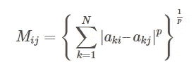

# Python 中 K-Means 聚类评估的 Davies-Bouldin 索引

> 原文：<https://towardsdatascience.com/davies-bouldin-index-for-k-means-clustering-evaluation-in-python-57f66da15cd?source=collection_archive---------37----------------------->

## 在本教程中，我们将探索 Davies-Bouldin 索引及其在 Python 中 K-Means 聚类评估中的应用。

**目录**

*   介绍
*   戴维斯-波尔丁指数
*   步骤 1:计算组内离差
*   步骤 2:计算分离度量
*   步骤 3:计算聚类之间的相似性
*   步骤 4:为每个聚类 *i* 找到最相似的聚类
*   步骤 5:计算戴维斯-波尔丁指数
*   Python 中的 Davies-Bouldin 索引示例
*   结论

# 介绍

戴维斯-波尔丁指数(DBI)是聚类算法的评价指标之一。它最常用于通过 K-Means 聚类算法对给定数量的聚类评估分割的良好性。

简言之，分数(DBI)被计算为每个聚类与最相似的聚类的平均相似性。平均相似度越低，聚类分离得越好，执行聚类的结果也越好。

在下一节中，将通过几个示例详细描述计算 DBI 的过程。

# 戴维斯-波尔丁指数

聚类分离度量的研究早在 1979 年就发表了。所提供的材料描述了作为群内分散和群间分离的函数的群间相似性的度量。

在这一部分中，我们将介绍计算的每一步，并提供有意义的示例来帮助更好地理解公式。

## 步骤 1:计算组内离差

考虑由 Davies，d .，& Bouldin，D. (1979)定义的下列方程，该方程计算集群 *i* 的分散:

其中:
i:特定识别的簇
T_i:簇*I*X _ j:*j*簇*I*A _ I:簇 *i* 的质心

基本上，为了获得类内离差，我们计算类内每个观察值与其质心之间的平均距离。

注意:通常值 *q* 被设置为 2 ( *q* = 2)，它计算聚类的质心和每个单独的聚类向量(观察)之间的欧几里德距离。

假设对某个数据集执行的 K 均值聚类生成了三个聚类。使用上面的公式，将为每个集群计算集群内离差，并且我们将得到*S1*、*S2*和*S3*的值。

## 步骤 2:计算分离度量

考虑由 Davies，d .，& Bouldin，D. (1979)定义的下列方程，该方程计算集群 *i* 和 *j* 之间的间隔:

其中:
A _ { ki }:*k*-*N*的第个分量-维质心*A _ I*
A _ { kj }:*k*-*N*的第个分量-维质心 *A_j*
N:总簇数

上述公式也可以写成:

注意:当 *p* 设置为 2 ( *p* = 2)时，上式计算的是簇 *i* 和 *j* 的质心之间的欧氏距离。

继续假设我们正在处理三个集群。使用上面的公式，我们将计算两个集群的每个可能组合的分离度量: *M_{11}* 、 *M_{12}* 、 *M_{13}* 、 *M_{21}* 、 *M_{22}* 、 *M_{23}* 、 *M_{31}* 、

当然我们还有*M _ { 12 }*=*M _ { 21 }*，*M _ { 13 }*=*M _ { 31 }*，*M _ { 23 }*=*M _ { 32 }*。

## 步骤 3:计算聚类之间的相似性

考虑由 Davies，d .，& Bouldin，D. (1979)定义的下列等式，该等式计算集群 *i* 和 *j* 之间的相似性:

其中:
S_i:簇的簇内离差 *i*
S_j:簇的簇内离差 *j*
M_{ij}:簇的质心 *i* 和 *j*

基本上，我们在这里将聚类之间的相似性计算为两个聚类内离差之和除以分离度。 *R_{ij}* 越大，相似簇 *i* 和 *j* 越多。你可能已经知道最好的情况是当这些数字尽可能低的时候。

类似于*步骤 2* 中的逻辑，继续假设我们正在处理三个集群。使用上面的公式，我们将计算两个集群的每个可能组合的相似性: *R_{11}* ， *R_{12}* ， *R_{13}* ， *R_{21}* ， *R_{22}* ， *R_{23}* ， *R_{31}*

这里，*R _ { 11 }*=*R _ { 22 }*=*R _ { 12 }*是每个簇与自身的相似度。而且我们还有*R _ { 12 }*=*R _ { 21 }*、*R _ { 13 }*=*R _ { 31 }*、*R _ { 23 }*=*R _ { 32 }*。

## 步骤 4:为每个聚类 *i* 找到最相似的聚类

戴维斯博士和波尔丁博士(1979 年)定义:

有:*I*≦*j*

对于每个集群 *i* ，我们从所有计算的 *R_{ij}* 中找到最高的比率。

例如，对于集群 *i* = 1，我们计算了 *R_{11}* 、 *R_{12}* 和 *R_{13}* 。继续 *R_{12}* 和 *R_{13}* (由于 *R_{11}* 不满足约束*I*≦*j*，将集群与自身进行比较没有意义)。

现在，有了 *R_{12}* (这是聚类 1 和 2 之间的相似性)和 *R_{13}* (这是聚类 1 和 3 之间的相似性)。从这两个度量值中，我们将选择最大的一个，并将最大度量值称为 *R_{1}* 。按照同样的逻辑，我们会发现 *R_{2}* 和 *R_{3}* 。

## 步骤 5:计算戴维斯-波尔丁指数

将戴维斯-波尔丁指数计算如下:

其简单地是每个聚类与最相似的聚类的相似性度量的平均值。

注意:聚类的最佳选择是平均相似性最小化的地方，因此较小的 *R* 条代表定义更好的聚类。

# Python 中的 Davies-Bouldin 索引示例

在这一节中，我们将通过一个例子来计算 Python 中 K-Means 聚类算法的 Davis-Bouldin 指数。

首先，导入依赖项:

您可以通过下面的代码使用任何数据。为了简单起见，我们将使用内置的虹膜数据集，特别是前两个特征:*【萼片宽度】*和*【萼片长度】*:

让我们从 3 个集群的 K 均值目标开始:

并检查上述结果的戴维斯-波尔丁指数:

您应该会看到结果分数: **0.7675522686571647** 或大约 **0.77** 。

为了更好地理解集群的外观，让我们将它们形象化:

我们应该看到以下 3 个集群:

看起来有些集群比其他集群定义得更好。

到目前为止，我们只计算了 3 个团簇的戴维斯-波尔丁指数。这种方法与肘方法类似，有助于确定最佳的聚类数。

我们可以对大于或等于 2 的任意数量的集群进行计算。让我们尝试多达 10 个集群:

想象一下:

虽然在这个例子中，度量彼此非常接近，但是我们仍然可以观察到选择 3 个聚类最小化了相似性度量。

# 结论

在本文中，我们讨论了如何使用 sklearn 库在 Python 中计算用于聚类评估的 [Davies-Bouldin 指数](https://scikit-learn.org/stable/modules/generated/sklearn.metrics.davies_bouldin_score.html)。

如果你有任何问题或者对编辑有任何建议，欢迎在下面留下评论，并查看我的更多 [Python 编程](https://pyshark.com/category/python-programming/)文章。

参考文献:
戴维斯博士，&波尔丁博士(1979)。一种聚类分离度量。IEEE 模式分析和机器智能汇刊，PAMI-1(2)，224–227。[https://doi.org/10.1109/TPAMI.1979.4766909](https://doi.org/10.1109/TPAMI.1979.4766909)

*原载于 2021 年 6 月 2 日*[*https://pyshark.com*](https://pyshark.com/davies-bouldin-index-for-k-means-clustering-evaluation-in-python/)*。*