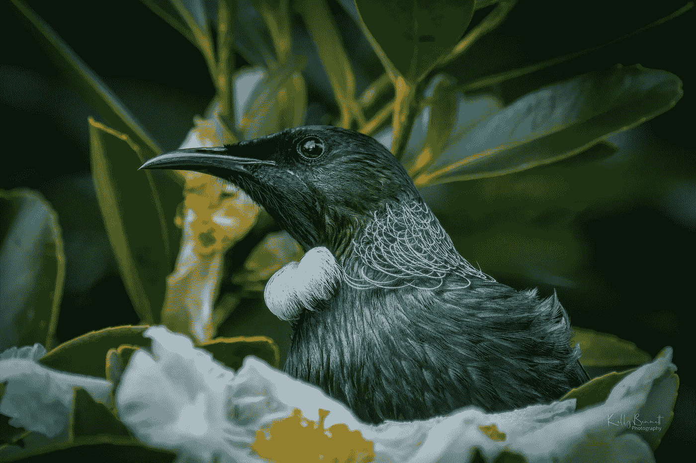
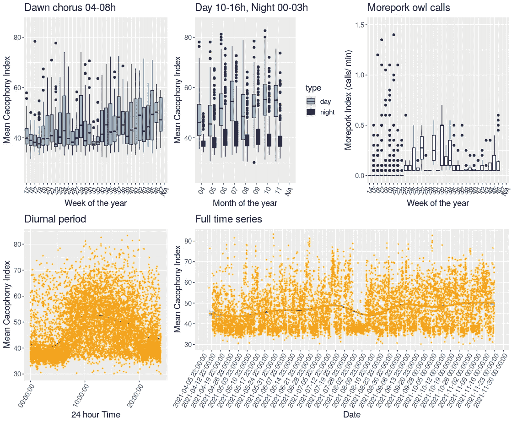

# 黎明合唱团，更多的猪肉猫头鹰，和捕食者控制

> 原文：<https://towardsdatascience.com/dawn-chorus-morepork-owls-and-predator-control-107e5ca38fd?source=collection_archive---------37----------------------->

## [变更数据](https://towardsdatascience.com/tagged/data-for-change)

## 使用鸟鸣指数新西兰自然的本地健康



*新西兰 tui*[*凯利贝内特*](https://kellybennett.photography/?fbclid=IwAR3FFAfMy35h_ZqkBiXX_uZ_nZPJo-k1ohXBbPLHVCkhFEDgCpcpldHwTGc) *。*

新西兰的自然声景回荡着鸟鸣。不幸的是，这一自然奇观目前仅限于该国的一些地区，这些地区受到保护，免受外来食肉动物的侵害。新西兰政府保护部(DOC)和社区团体已经开始实施一项雄心勃勃的计划，名为“新西兰 2050 年无捕食者”,以尽可能多地消除该国引入的破坏自然鸟类生活和静音声景的捕食者。邻里团体通过诱捕或毒杀老鼠、鼬鼠、刺猬和刷尾负鼠来将它们从花园和自然区域中移走。在许多情况下，计数被记录并公布在公共数据库上(例如，见<[http://trapdoor.omegatech.co.nz](http://trapdoor.omegatech.co.nz)>)。诱捕成功与否由 DOC 和保护组织进行评估。像新西兰鸟类地图集和新西兰花园鸟类调查这样的大规模公民科学项目对鸟类的数量进行了追踪。但是对于许多社区团体来说，除了陷阱中死亡人数的上升之外，他们的努力并没有成功的指标，而且在许多情况下也没有记录。此外，很难量化毒饵的成功，因为尸体不容易计数。

量化诱捕成功的一种方法是监测鸟鸣声水平的变化。杂音项目鸟类监测器结合了软件、手机和麦克风来监测鸟鸣。鸟鸣指数可以用来代表监测点附近的鸟类数量。迄今为止的结果是有希望的，研究记录了该设备的开发(Steer 2010 年)，更多猫头鹰叫声的物种识别(Hunt 等人 2019 年)，以及鸟类监测方法的比较(库蒂尼奥 2021 年)。更多最新信息可以在不和谐的项目博客<[https://www.2040.co.nz/blogs/news](https://www.2040.co.nz/blogs/news)>上找到。

本文的目的是展示新的开源 R 代码，以分析由不和谐的鸟监控器产生的鸟鸣声记录。该代码加载并清理数据，为绘图做准备，并创建一个有用的汇总绘图面板。这些可以用来自不和谐项目服务器的新数据更新，因为它们是从通过无线连接到互联网的鸟监控器上传的。这些图从鸟鸣数据中得到各种有用的度量。每周的箱线图总结了黎明合唱以及白天和夜晚鸟鸣的水平和变化。不和谐的项目自动识别更多的猪猫头鹰(*Ninox novese elandie*)呼叫最近得到了改善(见<https://www . 2040 . co . NZ/blogs/news/moreporks-自动识别>)并且每周指数来自识别的呼叫数量。你可以在 22 周后的莫尔波克猫头鹰图中看到识别能力提高的效果。从整个数据集绘制出周日时间序列，并通过平滑回归显示和总结按日期划分的完整时间序列。这种新的 R 代码填补了计算鸟鸣指数和识别猫头鹰叫声的不和谐项目软件与需要可以快速方便更新的数据的方便摘要的用户之间的空白。



鸟类鸣声指数每周汇总一次，以追踪更多猫头鹰黎明时的合唱和夜间的叫声。请注意 22 周后对更多猪肉呼叫的改进检测的效果。为了清楚起见，日夜通话按月汇总。日变化模式是从所有数据中推导出来的。

# 密码

导出鸟类记录数据会产生一个文本文件，这对于在 r 中使用有点不方便。第一个清理步骤是将杂音指数(鸟叫指数)字符串分离成单独的变量:

```
*### plot_cacophony_index.R
#####################################

library*(tidyverse)
*library*(lubridate)
*library*(scales)
*library*(gridExtra) *#####################################
## load and clean data
# #####################################
# load raw data* rec <- *read_csv*("../data/recordings.csv")*# make the string of cacophony index values into separate variables* tt <- *str_replace_all*(rec$`Cacophony Index`, ";", ",")*write.table*(tt, "../data/cacophony_index_only.csv", sep=",", col.names=FALSE, row.names=FALSE)
```

然后您可以使用 Linux 例程' sed '【http://www.gnu.org/software/sed/manual/sed.html><[来方便地删除引号:](http://www.gnu.org/software/sed/manual/sed.html)

```
*# remove the quotes with system command to sed
system*("pwd")
*system*("ls -al")
*system*("sed 's/\"//g' ../data/cacophony_index_only.csv > ../data/edited_cacophony_index_only.csv")
*system*("mv ../data/edited_cacophony_index_only.csv ../data/cacophony_index_only.csv")*# read the cleaned up data* rec2 <- *read_csv*("../data/cacophony_index_only.csv", col_names=*c*("index1","index2","index3"))
*system*("rm ../data/cacophony_index_only.csv")
```

需要为绘图准备数据:

```
*#####################################
## prepare data for plotting
#####################################
# convert date and time to a time index* dt <- *paste*(rec$Date, rec$Time, sep=" ")
rec$date_time <- *ymd_hms*(dt, tz = "Pacific/Auckland")
*# add the separated index variables to the data frame* rec3 <- *cbind*(rec, rec2)*# calculate mean cacophony index* x <- *c*(rec3$index1,rec3$index2,rec3$index3)
rec3$index <- *apply*(rec2, 1, mean)
rec3$index
*#subset index > 30 to remove artificially low values* rec3 <- *with*(rec3, rec3[index >=30, ])*# subset dawn chorus data (between 4AM and 7AM)* dawn <- *with*(rec3, rec3[*hour*(Time) >=4 & *hour*(Time) <= 7, ])
dawn$month <- *format*(dawn$Date, "%m")
dawn$week <- *format*(dawn$Date, "%V")*# subset day data (between 10AM and 4PM)* day <- *with*(rec3, rec3[*hour*(Time) >=10 & *hour*(Time) <= 15, ])
day$month <- *format*(day$Date, "%m")
day$week <- *format*(day$Date, "%V")
day$type <- *rep*("day", *length*(day$week))*# subset night data when morepork occur (between midnight and 3AM)* night <- *with*(rec3, rec3[*hour*(Time) >=0 & *hour*(Time) <= 2, ])
night$month <- *format*(night$Date, "%m")
night$week <- *format*(night$Date, "%V")
night$type <- *rep*("night", *length*(night$week))*# prepare morepork call index* rec3$species <- *as.factor*(rec3$"Species Classification")
rec3$morepork_calls <- *str_count*(rec3$species, pattern = "morepork")
rec3$morepork_calls <- rec3$morepork_calls/ 20 *# 3 sec listen in each minute of recording* rec3$month <- *format*(rec3$Date, "%m")
rec3$week <- *format*(rec3$Date, "%V")
```

现在，图已指定:

```
*#####################################
## create plots
#####################################
# plot dawn chorus weekly boxplot time series* Dawn_Cacophony_Index_box <- *ggplot*(dawn, *aes*(x=week, y=index)) +
*geom_boxplot*(fill = "#95B9C7")  +
*xlab*("Week of the year") +
*ylab*("Mean Cacophony Index") +
*ggtitle*("Dawn chorus 04-08h") +
*theme*(axis.text.x=*element_text*(angle=60, hjust=1)) +
*theme*(text = *element_text*(size=14)) +
*ylim*(25,85)

*# plot day and night data weekly boxplot time series on same graph* rec3_type <- *rbind*(day, night)
Day_Night_Cacophony_Index_box <- *ggplot*(rec3_type, *aes*(x=week, y=index, fill = type)) +
*geom_boxplot*()  + *scale_fill_manual*(values = *c*("#82CAFF", "#0000A0")) +
*guides*(colour = "colorbar", size = "legend", shape = "legend") +
*xlab*("Week of the year") +
*ylab*("Mean Cacophony Index") +
*ggtitle*("Day 10-16h, Night 00-03h") +
*theme*(axis.text.x=*element_text*(angle=60, hjust=1)) +
*theme*(text = *element_text*(size=14)) +
*ylim*(25,85)

*# plot morepork index weekly boxplot time series* Morepork_Index_box <- *ggplot*(rec3, *aes*(x = week, y = morepork_calls)) +
*geom_boxplot*(color = "#0000A0")  +
*xlab*("Week of the year") +
*ylab*("Morepork Index (calls/ min)") +
*ggtitle*("Morepork owl calls") +
*theme*(axis.text.x=*element_text*(angle=60, hjust=1)) +
*theme*(text = *element_text*(size=14)) +
*ylim*(0,1.5)

*# plot diurnal time series* Cacophony_Index_daily <- *ggplot*(rec3, *aes*(x=Time, y=index)) +
*geom_point*(color="orange",  size=0.5) +
*xlab*("24 hour Time") +
*ylab*("Mean Cacophony Index") +
*ggtitle*("Diurnal period") +
*theme*(axis.text.x=*element_text*(angle=60, hjust=1)) +
*theme*(text = *element_text*(size=14))Cacophony_Index_daily_trend <- Cacophony_Index_daily + *stat_smooth*(color = "red")

*# plot entire time series* Cacophony_Index_full_ts <- *ggplot*(rec3, *aes*(x=date_time, y=index)) + *geom_point*(color="orange",  size=0.5) +
*xlab*("Date") +
*ylab*("Mean Cacophony Index") +
*ggtitle*("Full time series") +
*theme*(axis.text.x=*element_text*(angle=60, hjust=1)) +
*theme*(text = *element_text*(size=14))Cacophony_Index_full_ts_trend <- Cacophony_Index_full_ts +
  *stat_smooth*(color = "red")
CacIdx_full <- Cacophony_Index_full_ts_trend +
  (*scale_x_datetime*(breaks=*date_breaks*("7 day")))
```

最后一步是从图中创建面板:

```
*# layout plots on the page* widths <- *c*(1,1,1,1,2)
*grid.arrange*(Dawn_Cacophony_Index_box, Day_Night_Cacophony_Index_box, Morepork_Index_box, Cacophony_Index_daily_trend, CacIdx_full, layout_matrix =  *rbind*(*c*(1,2,3),*c*(4,5,5)))
```

完整的 R 代码可以在这里找到【http://u.pc.cd/f0nrtalK><[。这是可能会改变的实时代码，也许会随着时间的推移而改进。](http://u.pc.cd/f0nrtalK)

# 后续步骤

下一步是获得更多的鸟类监测器，以便在 Huia (Waitakere Ranges)陷阱内的陷阱和控制区进行适当控制的科学研究。新西兰足迹<[https://trap.nz/project/1106292/info](https://trap.nz/project/1106292/info)>。在诱捕组中，我们有两个在过去 3 年中被密集诱捕的相邻房产，以及其他几个被轻度诱捕的相邻房产。有了 6 个鸟类监测器，我可以监测两个级别的高诱捕努力、两个级别的低诱捕努力和两个控制区域。或者四级高诱捕努力和两个控制区域，考虑到可变性，这可能更好。毫无疑问，鸟鸣的一些波动是由于天气的变化，可能主要是温度、风和雨。考虑到这种可变性，有必要安装一个气象站来监测当地的情况，这样，天气变量就可以在统计上与鸟类鸣声指数的可变性相关联。

# 结论

杂音项目鸟类监测器提供了一个令人兴奋的新工具，应该可以让我们评估新西兰当地鸟类丰富的邻里诱捕的有效性。我们提供了一些新的开源 R 代码，用于以信息格式绘制数据。当数据被收集并上传到互联网上不和谐的服务器时，代码可以方便地显示几个有用的指数。预计随着时间的推移，也许几年后，如果附近的诱捕和毒饵能有效地降低捕食者的密度，就有可能检测到鸟类鸣叫声的增加。一个有趣的区别可能是，如果更多的猪猫头鹰严重依赖老鼠为食，它们的叫声可能会减少。大自然充满了惊喜。

这个项目部分由生态事务爱你的邻居基金资助。

# 参考

J.Steer，新西兰鸟类的生物声学监测(2010)，Notornis 57，75–80。

T.D. Hunt、M. Nikora 和 C. Blackbourn，“使用永久定位的移动电话记录的更多猪肉发声的分析”(2019 年)，发表于 10 月 9 日至 11 日在新西兰纳尔逊举行的全国计算资格咨询委员会第 32 届年会上。

南阿尔维斯·库蒂尼奥，SCIE393 Report — WWW Document (2021)，[https://drive . Google . com/file/d/1 kskrul _ mjlg 4 LDV 1 tfjxwsko 4 daqfofh/view？USP = embed _ Facebook](https://drive.google.com/file/d/1kskRUL_MJLG4Ldv1TFJXWSkO4dAQFOFh/view?usp=embed_facebook)(6 . 23 . 21 访问)。