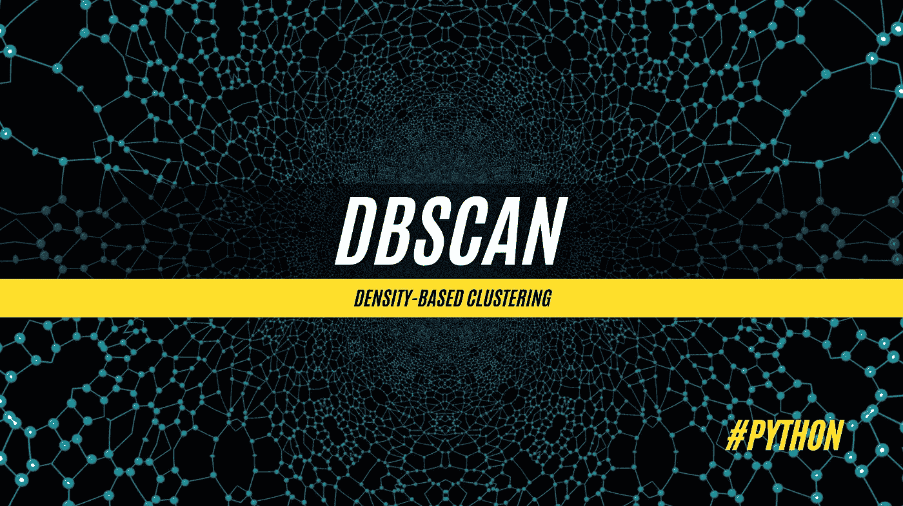
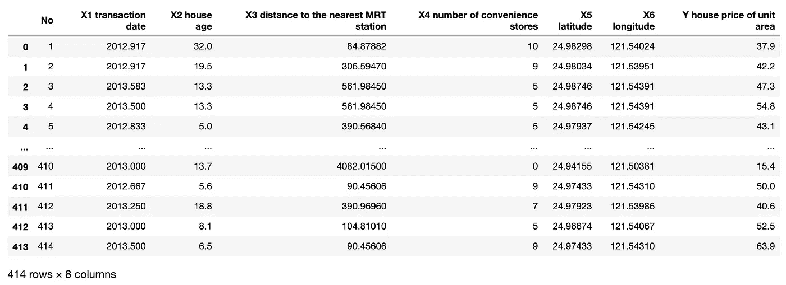
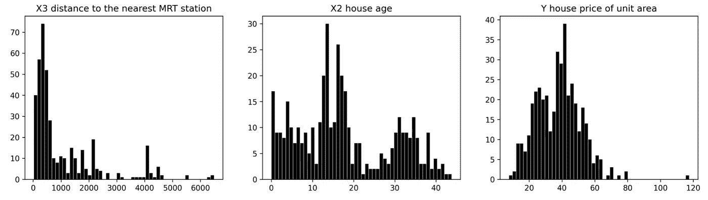
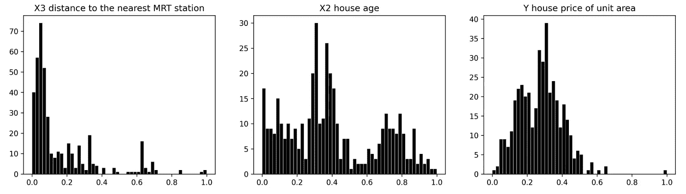
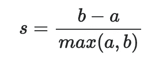
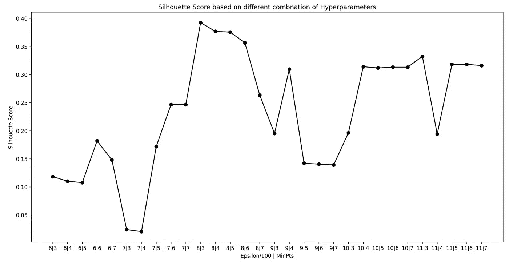
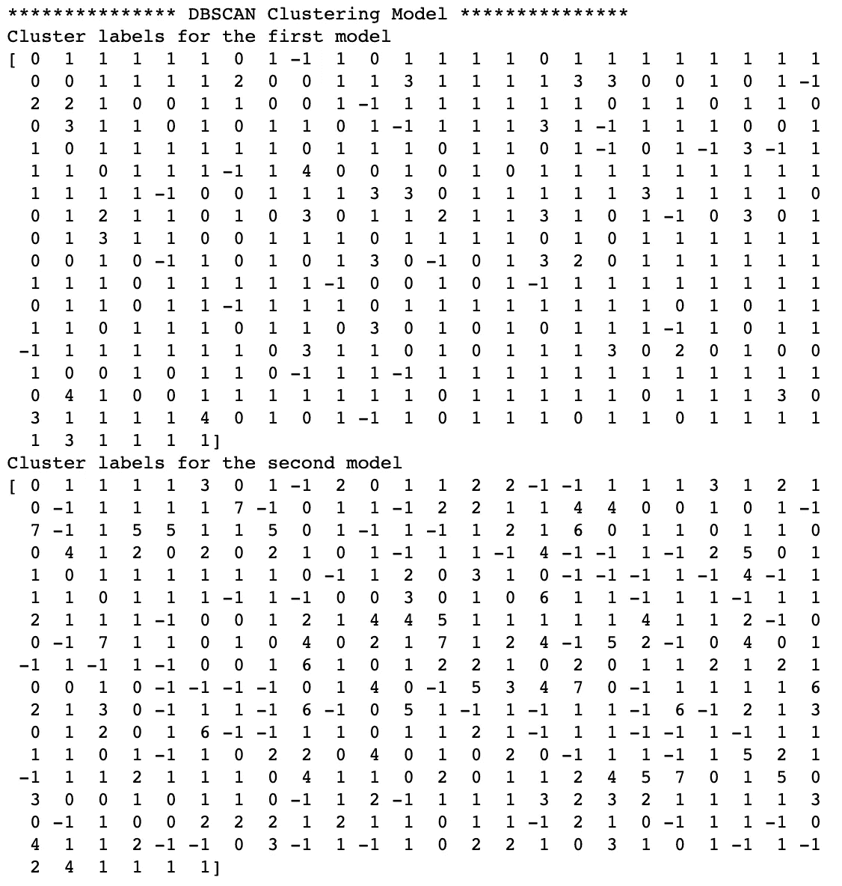
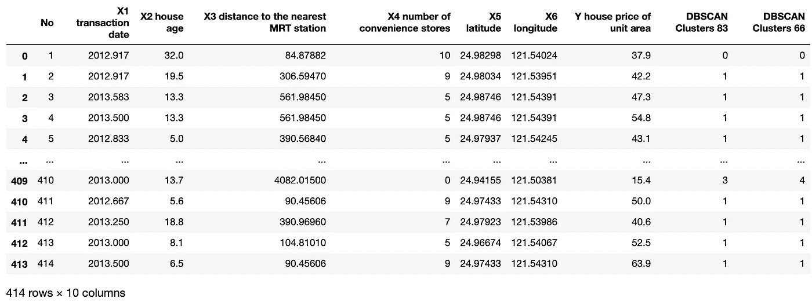

# DBSCAN 聚类算法——如何构建强大的基于密度的模型

> 原文：<https://towardsdatascience.com/dbscan-clustering-algorithm-how-to-build-powerful-density-based-models-21d9961c4cec?source=collection_archive---------7----------------------->

## 机器学习

## 对有噪声的应用程序使用基于密度的空间聚类的详细指南

DBSCAN 聚类算法。图片由[作者](https://solclover.com/)提供。

# 介绍

如果你想成为一名成功的数据科学家，你需要了解不同机器学习算法的细微差别。

这个故事是我深入研究这种算法如何工作的系列文章的一部分。这包括可视化和现实生活中的数据示例，以及完整的 Python 代码，供您在自己的数据科学项目中使用。

# 内容

*   DBSCAN 属于哪一类算法？
*   有哪些不同类型的聚类算法？
*   DBSCAN 算法是如何工作的？
*   对真实数据使用 DBSCAN 的 Python 示例。

# DBSCAN 属于哪一类算法？

随着时间的推移，机器学习算法的总数不断增长，创造了许多分析数据的方法。我尝试收集数据科学社区最常用的算法并进行分类。请务必浏览下面的**互动**旭日图👇通过点击不同类别的**显示更多**。

> 请注意，在许多情况下，相同的算法可以用于解决多种类型的问题。例如，可以使用神经网络进行分类、回归或作为强化学习的一部分。

机器学习算法分类。由[作者](https://solclover.com/)创建的交互式图表。

***如果你喜欢数据科学和机器学习*** *，请* [*订阅*](https://solclover.com/subscribe) *每当我发布一个新的故事，你都会收到一封电子邮件。*

如上图所示，顾名思义(带噪声的应用基于密度的空间聚类)，DBSCAN 是一种聚类算法，属于机器学习的**无监督**分支。

通常，人们会根据所选特征的相似性，使用聚类来识别不同的客户、对象或其他类型的数据组(也称为聚类)。

# 聚类算法的类型

并非所有的聚类算法都是一样的。不同的聚类算法对如何最好地对数据进行聚类有不同的想法。有 4 个主要类别:

*   **基于质心的** —使用欧几里德距离将每个点分配到最近的聚类中心。例:[K-表示](/k-means-clustering-a-comprehensive-guide-to-its-successful-use-in-python-c3893957667d)
*   **基于连通性的** —假设附近的对象(数据点)比远处的对象更相关。例如:[层次凝聚聚类(HAC)](/hac-hierarchical-agglomerative-clustering-is-it-better-than-k-means-4ff6f459e390) 。
*   **基于密度的** —将集群定义为由低密度区域分隔的密集空间区域。示例:带噪声的应用程序的基于密度的空间聚类(DBSCAN)。
*   **基于分布的** —假设数据中存在指定数量的分布。每个分布都有自己的均值(μ)和方差(σ ) /协方差(Cov)。例子:[高斯混合模型(GMM)](/gmm-gaussian-mixture-models-how-to-successfully-use-it-to-cluster-your-data-891dc8ac058f) 。

# DBSCAN 算法是如何工作的？

## 定义参数

如上所述，基于密度的算法通过识别由不太密集的区域分隔的空间中的密集区域(即，填充有许多数据点)来工作。为了使算法能够找到这些密集区域，我们首先需要建立我们认为足够密集的区域。我们通过指定两个超参数来做到这一点:

*   **ε**(ϵ，sk learn:EPS)——定义该点与任何其他点之间的最大距离的点周围区域的半径，其中一个点被视为另一个点的邻域。简单来说，就是你在下面的 gif 图中看到的圆的半径。
*   **最小点数** (MinPts，sk learn:Min _ samples)-邻域中形成聚类所需的最小点数。

## 例子

让我们看看下面的例子，其中 eps=2.5 单位，MinPts=4。注意，这里的迭代是指一个算法迭代通过每个点，并将其分配到一个类别(噪声、核心点、边界点)。

DBSCAN 过程。图片由[作者](https://solclover.com/)提供。

*   **迭代 0** —尚未访问任何点。接下来，该算法将随机选择一个起点，将我们带到迭代 1。
*   **迭代 1** —点 A 只有一个邻居。由于 2 个点(A+1 个邻居)小于 4(形成聚类所需的最小值，如上所述)，A 被标记为噪声。
*   **迭代 2** —点 B 在其邻域内有 5 个其他点。因为 6 个点(B + 5 个邻居)大于 4，所以识别第一个聚类的开始，其中 **B** 成为**核心点**。同时，先前被认为是噪声的点 **A 被重新标记为边界点**，因为它位于核心点 b 的邻域内
*   **迭代 3 到 6** —点 C、D、E、F 被标记为核心点，并被分配给聚类 1。
*   **迭代 7** —点 G 被标记为边界点，因为它在核心点 E 和 F 的邻域内，但没有达到被标记为核心点的最小数量 4 个点。
*   **迭代 8** —点 H 被标记为噪声(异常值)，因为在其邻域内没有其他点。
*   **迭代 9 到 12** —识别并标记新的聚类，包含 4 个核心点(I，J，K，L)。

## 与其他聚类方法相比，DBSCAN 的优缺点

*   **优点:** 1)很好地识别任意形状的簇；2)可以识别异常值，这可能是练习的主要目标。
*   **缺点**:由于 Epsilon 和 MinPts 是固定的，所以当数据中存在变化的密度时，它不能很好地工作。

# DBSCAN 集群的 Python 示例

现在我们已经了解了 DBSCAN 算法，让我们用 Python 创建一个集群模型。

## 设置

我们将使用以下数据和库:

*   【Kaggle 的房价数据
*   [sci kit-学习库](https://scikit-learn.org/stable/index.html)用于
    1)特征缩放([最小最大缩放器](https://scikit-learn.org/stable/modules/generated/sklearn.preprocessing.MinMaxScaler.html#sklearn.preprocessing.MinMaxScaler))；
    2)识别最佳超参数([轮廓得分](https://scikit-learn.org/stable/modules/generated/sklearn.metrics.silhouette_score.html?highlight=silhouette#sklearn.metrics.silhouette_score))；
    3)执行 [DBSCAN 聚类](https://scikit-learn.org/stable/modules/generated/sklearn.cluster.DBSCAN.html)
*   用于数据可视化的 [Plotly](https://plotly.com/python/) 和 [Matplotlib](https://matplotlib.org/)
*   [熊猫](https://pandas.pydata.org/docs/)进行数据操作

让我们导入所有的库:

接下来，我们下载并读入将用于构建 DBSCAN 集群模型的数据。
*(来源:*[*https://www . ka ggle . com/quant Bruce/real-estate-price-prediction？select = Real+estate . CSV*](https://www.kaggle.com/quantbruce/real-estate-price-prediction?select=Real+estate.csv)*)*

来自 [Kaggle](https://www.kaggle.com/quantbruce/real-estate-price-prediction?select=Real+estate.csv) 的房价数据。图片由[作者](https://solclover.com/)提供。

我们将使用以下 3 个特征对观察结果进行聚类:

*   “X3 距离最近的捷运站”
*   《X2 房子时代》
*   单位面积的房价。

请注意，此数据旨在用于根据可用功能预测房价。这就是为什么字段名以 X 和 Y 开头，表示什么应该是特征，什么应该是目标。然而，由于我们将它用于不同的目的(例如，集群)，我们可以忽略命名约定。

让我们在三维图上绘制观察结果。

住房数据的 3D 散点图。图表作者[作者](https://solclover.com/)。

## 数据准备—特征缩放

对于聚类，尤其是基于密度的方法，在将数据放入模型之前准备数据是至关重要的。虽然您可能希望执行多个变换，但最常见的是缩放。

当您的要素分布具有非常不同的范围时，就会进行缩放。例如，在这个例子中，离最近的 MRT 站的距离在 0 和 6，488 之间，而房屋年龄在 0 到 44 之间。因此需要对它们进行缩放，以使它们符合相同的范围。否则，为 epsilon 选择一个值就不容易了，并且一个特征可能最终单独负责聚类的结果。

让我们画出这三个特征的分布图。

三个特征的分布。图片由[作者](https://solclover.com/)提供。

现在让我们应用最小-最大缩放，并再次绘制它。

最小-最大缩放后三个特征的分布。图片由[作者](https://solclover.com/)提供。

如您所见，最小-最大缩放并没有影响要素的基本分布。相反，它缩小了范围，所以它们现在都在 0 到 1 之间。

在某些情况下，您可能还想对分布应用转换。例如，到最近的 MRT 的距离看起来类似于对数分布，这意味着大多数房屋都位于车站附近，很少有房屋离车站较远。

因此，如果您对区分靠近 MRT 的所有房屋更感兴趣，而对较远的房屋不太感兴趣，那么您可以应用对数变换来展开它们。

## DBSCAN 聚类-选择超参数值

现在我们已经准备好了我们的特性，让我们决定 epsilon 和 MinPts 的值。为此，我们将使用 sklearn 库中可用的剪影乐谱。以下是从其[文档](https://scikit-learn.org/stable/modules/clustering.html#silhouette-coefficient)中直接引用的一段话:

> 轮廓系数是为每个样本定义的，由两个分数组成:
> **a:** 一个样本与同一类中所有其他点之间的平均距离。
> **b:** 样本与下一个最近的聚类中所有其他点之间的平均距离。
> 
> 单个样品的轮廓系数 **s** 为:

> 一组样本的轮廓系数是每个样本的轮廓系数的平均值。

让我们使用 epsilon 和 MinPts 的不同组合创建多个 DBSCAN 模型，并绘制轮廓分数。

不同ε和 MinPts 的剪影分数。图片由[作者](https://solclover.com/)提供。

看上面，我们可以看到 eps=0.08 产生最高的分数。一些组合最终具有非常相似的分数，这表明这些组合的聚类输出也是相似的。

我们将选择两种不同的组合来说明超参数选择的结果如何不同。我们将对第一个模型使用 eps=0.08 和 MinPts=3，对第二个模型使用 eps=0.06 和 MinPts=6。

## DBSCAN 聚类-运行算法

让我们构建模型并打印分类标签:

DBSCAN 模型集群标签。图片由[作者](https://solclover.com/)提供。

> 注意，-1 表示模型将该点定义为异常值(噪声)。

您可以立即看到，第一个模型(eps=0.08，MinPts=3)的聚类较少，聚类 0 和 1 比其他模型大得多。同时，第二个模型(eps=0.06，MinPts=6)产生了更多的簇，这是选择更小的ε的直接结果。

为了使结果更加直观，让我们使用不同的颜色创建相同的 3D 散点图。

首先，让我们将聚类标签合并回数据框。

用 DBSCAN 簇标签存放数据。图片由[作者](https://solclover.com/)提供。

为第一个模型绘制 3D 图表(eps=0.08，MinPts=3)。

第一个 DBSCAN 模型的 3D 散点图。图表作者[作者](https://solclover.com/)。

然后我们运行相同的代码，但是用['DBSCAN Clusters 66']替换['DBSCAN Clusters 83']。

第二个 DBSCAN 模型的 3D 散点图。图表作者[作者](https://solclover.com/)。

如您所见，第二个模型进一步将两个大集群分成了几个小集群。

第一个模型中两个大集群的形成是由位于 MRT 站附近的大多数房屋驱动的(见分布图)。虽然我们提到可以使用对数变换来展开这些观察结果，但我们在第二个模型中采用了不同的方法，而是降低了ε值。

# 结论

当您具有任意形状的聚类或者您对查找数据中的异常值感兴趣时，基于密度的聚类是您应该考虑的方法。

尽管如此，本文的主要观点应该是集群没有唯一正确的答案。因此，在生成最终的聚类模型之前，考虑数据的多种预处理方法并测试一系列不同的超参数值非常重要。

我希望我的 Python 代码和详细的算法演练已经让您对 DBSCAN 有了很好的理解。此外，如果您希望继续了解这个主题，我还列出了一些可选聚类算法的链接。

干杯！👏
T3【索尔·多比拉斯】T4

***如果你已经花光了这个月的学习预算，下次请记得我。*** *我的个性化链接加入媒介是:*

 [## 通过我的推荐链接加入 Medium 索尔·多比拉斯

### 作为一个媒体会员，你的会员费的一部分会给你阅读的作家，你可以完全接触到每一个故事…

solclover.com](https://solclover.com/membership)  [## GMM:高斯混合模型——如何成功地使用它对你的数据进行聚类？

### GMM 的直观解释和有用的 Python 示例

towardsdatascience.com](/gmm-gaussian-mixture-models-how-to-successfully-use-it-to-cluster-your-data-891dc8ac058f)  [## HAC:层次凝聚聚类。比 K-Means 好吗？

### HAC 算法的详细介绍，以及 Python 代码和几个有用的图表

towardsdatascience.com](/hac-hierarchical-agglomerative-clustering-is-it-better-than-k-means-4ff6f459e390)  [## K-Means 聚类——在 Python 中成功使用的综合指南

### 用真实数据的 Python 演示解释 K-Means 算法

towardsdatascience.com](/k-means-clustering-a-comprehensive-guide-to-its-successful-use-in-python-c3893957667d)